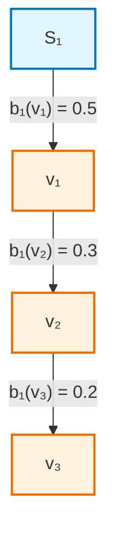
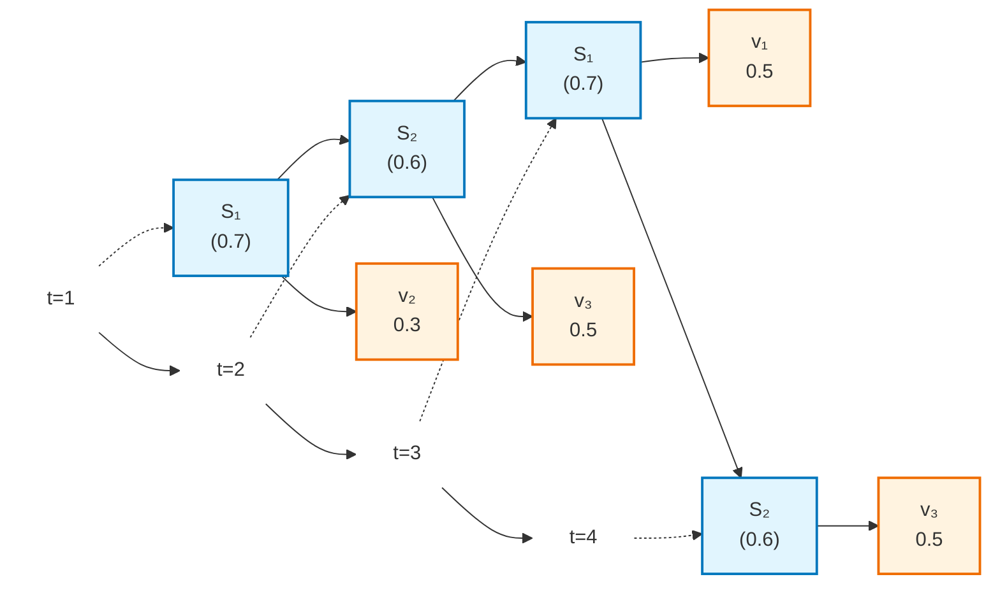
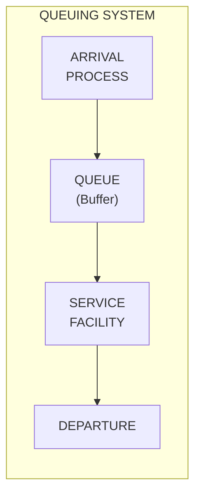
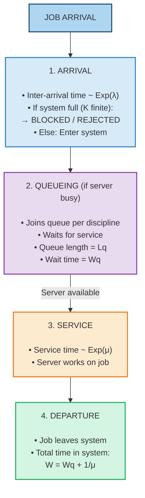

# SPPU AIDS BE SEM VII - Data Modeling & Visualization (DMV) In-Sem Exam Answers (AUG 2025)

> **Course**: Data Modeling & Visualization | **Semester**: VII | **Branch**: AIDS
> **Exam**: In-Semester Examination | **Date**: August 2025
> **Total Marks**: 50

---

## Question 1

### Q1(a) Explain in detail Positive, Negative and Zero Covariance with appropriate graphs. [5]

**Covariance** measures the **direction** of the linear relationship between two random variables $X$ and $Y$.

$$\text{Cov}(X, Y) = \mathbb{E}[(X - \mu_X)(Y - \mu_Y)] = \frac{1}{n-1} \sum_{i=1}^n (x_i - \bar{x})(y_i - \bar{y}) \quad \text{(sample)}$$

---

#### 1. Positive Covariance ($\text{Cov}(X,Y) > 0$)

**Definition**: When $X$ increases, $Y$ tends to increase. Variables move in the **same direction**.

**Graph**:
```
Y ↑
  │             ●
  │           ●
  │         ●
  │       ●
  │     ●
  │   ●
  │ ●
  └──────────────────→ X
       Positive Covariance
       (Upward trend)
```

**Example**: 
- Height vs Weight of adults
- Study hours vs Exam scores
- House size vs Price
- Temperature vs Ice cream sales

**Interpretation**: 
- $(x_i - \bar{x})$ and $(y_i - \bar{y})$ have same sign → product positive
- Sum of products > 0

---

#### 2. Negative Covariance ($\text{Cov}(X,Y) < 0$)

**Definition**: When $X$ increases, $Y$ tends to decrease. Variables move in **opposite directions**.

**Graph**:
```
Y ↑
  │ ●
  │   ●
  │     ●
  │       ●
  │         ●
  │           ●
  │             ●
  │               ●
  └──────────────────→ X
       Negative Covariance
       (Downward trend)
```

**Example**:
- Price vs Demand (law of demand)
- Exercise time vs Body fat percentage
- Speed vs Travel time (for fixed distance)
- Interest rate vs Bond prices

**Interpretation**:
- $(x_i - \bar{x})$ and $(y_i - \bar{y})$ have opposite signs → product negative
- Sum of products < 0

---

#### 3. Zero Covariance ($\text{Cov}(X,Y) = 0$)

**Definition**: No **linear** relationship. Variables vary independently (in linear sense).

**Graph**:
```
Y ↑           ●     ●
  │       ●         ●
  │   ●               ●
  │ ●                   ●
  │                       ●
  └────────────────────────→ X
       Zero Covariance
       (No linear pattern)

Y ↑     ● ● ● ● ● ● ●
  │    ●           ●
  │   ●             ●
  │  ●               ●
  │ ●                 ●
  └─────────────────────→ X
       Zero Covariance
       (Non-linear: Circle/Parabola)
```

**Example**:
- Shoe size vs IQ (no relationship)
- $X \sim \text{Uniform}(-1,1)$, $Y = X^2$ (non-linear dependence, but $\text{Cov}=0$)
- Daily temperature vs Stock market returns

**Interpretation**:
- Positive and negative products cancel out
- $\sum (x_i - \bar{x})(y_i - \bar{y}) = 0$
- **⚠️ Zero covariance ≠ Independence** (only true for jointly Gaussian variables)

---

#### Summary Table

| Covariance   | Direction              | Graph Pattern                  | Example          |
| ------------ | ---------------------- | ------------------------------ | ---------------- |
| **Positive** | Same direction         | Upward slope ↗                 | Height vs Weight |
| **Negative** | Opposite direction     | Downward slope ↘               | Price vs Demand  |
| **Zero**     | No linear relationship | Random cloud / Symmetric curve | $X$ vs $X^2$     |

---

#### Relationship with Correlation

$$\rho_{XY} = \frac{\text{Cov}(X,Y)}{\sigma_X \sigma_Y}$$

- Correlation = **Standardized Covariance** ($[-1, 1]$)
- Same sign as covariance
- Scale-invariant (covariance has units of $X \times Y$)

---

### Q1(b) Explain Central Limit Theorem with example. [5]

---

#### Central Limit Theorem (CLT)

**Statement**: Let $X_1, X_2, \dots, X_n$ be *independent and identically distributed (i.i.d.)* random variables with mean $\mu$ and finite variance $\sigma^2$. Then the **sample mean** $\bar{X}_n = \frac{1}{n}\sum_{i=1}^n X_i$ satisfies:

$$\frac{\bar{X}_n - \mu}{\sigma/\sqrt{n}} \xrightarrow{d} \mathcal{N}(0, 1) \quad \text{as } n \to \infty$$

Equivalently:
$$\bar{X}_n \approx \mathcal{N}\left(\mu, \frac{\sigma^2}{n}\right)$$

---

#### Key Points

| Aspect                | Description                                                       |
| --------------------- | ----------------------------------------------------------------- |
| **Distribution-free** | Works for **ANY** distribution with finite $\mu, \sigma^2$        |
| **Sample size**       | $n \geq 30$ typically sufficient (rule of thumb)                  |
| **Sum version**       | $\sum X_i \sim \mathcal{N}(n\mu, n\sigma^2)$                      |
| **Standardized**      | $Z = \frac{\bar{X} - \mu}{\sigma/\sqrt{n}} \sim \mathcal{N}(0,1)$ |

---

#### Why It Works (Intuition)

- Sum of many independent random effects → Gaussian (normal)
- Convolution of PDFs smooths out irregularities
- Characteristic function proof: $\phi_{\bar{X}}(t) = [\phi_X(t/n)]^n \to e^{-\sigma^2 t^2/2}$

---

#### Example: Rolling a Die

**Distribution**: Single die roll $X \sim \text{Uniform}\{1,2,3,4,5,6\}$
- $\mu = 3.5$
- $\sigma^2 = \frac{35}{12} \approx 2.917$

**Experiment**: Roll $n$ dice, compute average. Repeat many times.

| $n$ | Distribution of $\bar{X}$ | Shape |
|-----|---------------------------|-------|
| 1 | Uniform $\{1,\dots,6\}$ | Flat |
| 2 | Triangular (2-12) | ▲ |
| 5 | Bell-shaped | ∼ Normal |
| 30 | Very close to Normal | $\mathcal{N}(3.5, 2.917/30)$ |

**Simulation**:
```python
import numpy as np
import matplotlib.pyplot as plt

np.random.seed(42)
sample_sizes = [1, 2, 5, 30]
fig, axes = plt.subplots(2, 2, figsize=(10, 8))

for idx, n in enumerate(sample_sizes):
    means = [np.mean(np.random.randint(1, 7, n)) for _ in range(10000)]
    ax = axes[idx//2, idx%2]
    ax.hist(means, bins=30, density=True, alpha=0.7, label=f'n={n}')
    # Overlay normal
    x = np.linspace(1, 6, 100)
    ax.plot(x, 1/np.sqrt(2*np.pi*2.917/n) * np.exp(-(x-3.5)**2/(2*2.917/n)), 'r-', label='Normal')
    ax.set_title(f'n = {n}')
    ax.legend()
plt.tight_layout()
plt.show()
```

---

#### Practical Application: Confidence Intervals

Since $\bar{X} \approx \mathcal{N}(\mu, \sigma^2/n)$ for large $n$:

$$\text{95\% CI for } \mu: \quad \bar{x} \pm 1.96 \frac{\sigma}{\sqrt{n}}$$

If $\sigma$ unknown, use sample $s$ and $t$-distribution.

---

### Q1(c) Explain in Data Modeling Process. [5]

---

#### Data Modeling Process

**Definition**: Structured approach to creating a **conceptual representation** of data objects, their relationships, and rules for a specific domain.

---

#### Steps in Data Modeling Process

```
┌─────────────────────────────────────────────────────────────────┐
│                    DATA MODELING PROCESS                        │
└─────────────────────────────────────────────────────────────────┘
                              │
                              ▼
┌─────────────────────────────────────────────────────────────────┐
│ 1. REQUIREMENTS GATHERING                                       │
│    • Understand business domain & objectives                    │
│    • Identify stakeholders & data sources                       │
│    • Define scope & boundaries                                  │
│    • Document functional & non-functional requirements          │
└─────────────────────────────────────────────────────────────────┘
                              │
                              ▼
┌─────────────────────────────────────────────────────────────────┐
│ 2. CONCEPTUAL DATA MODEL (CDM)                                  │
│    • High-level, technology-independent                         │
│    • Entity-Relationship (ER) Diagram                           │
│    • Entities, Attributes, Relationships                        │
│    • Cardinality, Optionality                                   │
│    • No implementation details                                  │
└─────────────────────────────────────────────────────────────────┘
                              │
                              ▼
┌─────────────────────────────────────────────────────────────────┐
│ 3. LOGICAL DATA MODEL (LDM)                                     │
│    • Detailed structure (tables, columns, keys)                 │
│    • Normalization (1NF, 2NF, 3NF, BCNF)                        │
│    • Primary Keys, Foreign Keys                                 │
│    • Data types (generic), Constraints                          │
│    • Still DBMS-independent                                     │
└─────────────────────────────────────────────────────────────────┘
                              │
                              ▼
┌─────────────────────────────────────────────────────────────────┐
│ 4. PHYSICAL DATA MODEL (PDM)                                    │
│    • DBMS-specific implementation                               │
│    • Tables, Columns, Indexes, Partitions                       │
│    • Storage, Performance tuning                                │
│    • DDL scripts (CREATE TABLE, ALTER, etc.)                    │
│    • Denormalization for performance                            │
└─────────────────────────────────────────────────────────────────┘
                              │
                              ▼
┌─────────────────────────────────────────────────────────────────┐
│ 5. VALIDATION & REFINEMENT                                      │
│    • Review with stakeholders                                   │
│    • Check completeness, consistency, correctness               │
│    • Prototype & test with sample data                          │
│    • Iterate based on feedback                                  │
└─────────────────────────────────────────────────────────────────┘
                              │
                              ▼
┌─────────────────────────────────────────────────────────────────┐
│ 6. DOCUMENTATION & MAINTENANCE                                  │
│    • Data dictionary, metadata repository                       │
│    • Change management process                                  │
│    • Version control for models                                 │
│    • Ongoing governance                                         │
└─────────────────────────────────────────────────────────────────┘
```

---

#### Three Levels of Data Models (ANSI/SPARC)

| Level | Audience | Focus | Notation |
|-------|----------|-------|----------|
| **Conceptual** | Business users, Analysts | *What* data & relationships | ER Diagram, UML Class |
| **Logical** | Data Architects, Designers | *How* data structured | Relational schema, Normalized tables |
| **Physical** | DBAs, Developers | *Where/How* stored | DDL, Indexes, Partitions, Tablespaces |

---

#### Key Concepts

| Concept | Description |
|---------|-------------|
| **Entity** | Real-world object (Customer, Order, Product) |
| **Attribute** | Property of entity (Customer.Name, Order.Date) |
| **Relationship** | Association between entities (Customer *places* Order) |
| **Cardinality** | 1:1, 1:N, M:N (how many instances relate) |
| **Primary Key** | Unique identifier for entity instance |
| **Foreign Key** | Reference to PK of another table |
| **Normalization** | Eliminate redundancy, ensure integrity |

---

#### Example: E-Commerce Mini Model

**Conceptual (ER)**:
```
┌──────────┐       places        ┌─────────┐
│ Customer │ ◄─────────────────► │  Order  │
└────┬─────┘       1:N           └────┬────┘
     │                                │
     │ contains                       │ contains
     ▼                                ▼
┌──────────┐       1:N           ┌──────────┐
│  Order   │ ◄─────────────────► │ Product  │
│  Item    │       M:N           │          │
└──────────┘                     └──────────┘
```

**Logical (Normalized Tables)**:
```sql
Customer (CustomerID PK, Name, Email, Phone, Address)
Product  (ProductID PK, Name, Category, Price, Stock)
Order    (OrderID PK, CustomerID FK, Date, Status, Total)
OrderItem(OrderID FK, ProductID FK, Quantity, UnitPrice)
```

---

## Question 2

### Q2(a) Differentiate between Descriptive Statistics and Graphical Statistics. [5]

---

#### Descriptive Statistics

**Definition**: Quantitative methods for **summarizing** data using numerical measures.

**Categories & Measures**:

| Category | Measures | Formula (Sample) |
|----------|----------|------------------|
| **Central Tendency** | Mean, Median, Mode | $\bar{x} = \frac{1}{n}\sum x_i$ |
| **Dispersion** | Variance, Std Dev, Range, IQR, MAD | $s^2 = \frac{1}{n-1}\sum(x_i-\bar{x})^2$ |
| **Shape** | Skewness, Kurtosis | $\frac{1}{n}\sum(\frac{x_i-\bar{x}}{s})^3$, $\frac{1}{n}\sum(\frac{x_i-\bar{x}}{s})^4 - 3$ |
| **Relative Position** | Percentiles, Quartiles, Z-scores | $z = \frac{x-\bar{x}}{s}$ |
| **Association** | Covariance, Correlation | $r = \frac{\sum(x-\bar{x})(y-\bar{y})}{\sqrt{\sum(x-\bar{x})^2\sum(y-\bar{y})^2}}$ |

**Output**: Single numbers or small tables.

---

#### Graphical Statistics

**Definition**: Visual methods for **exploring**, **summarizing**, and **communicating** data patterns.

**Common Plot Types**:

| Plot Type            | Purpose                               | Variables                   |
| -------------------- | ------------------------------------- | --------------------------- |
| **Histogram**        | Distribution of 1 continuous variable | 1 continuous                |
| **Box Plot**         | 5-number summary, outliers            | 1 continuous (+ groups)     |
| **Scatter Plot**     | Relationship between 2 vars           | 2 continuous                |
| **Bar Chart**        | Categorical frequencies               | 1 categorical               |
| **Density Plot**     | Smoothed distribution                 | 1 continuous                |
| **Q-Q Plot**         | Normality assessment                  | 1 continuous                |
| **Heatmap**          | Correlation matrix / 2D density       | 2+ continuous / categorical |
| **Violin Plot**      | Distribution + density                | 1 continuous + groups       |
| **Pair Plot**        | All pairwise relationships            | Multiple continuous         |
| **Time Series Plot** | Trends over time                      | Time + 1 continuous         |
| **Facet Grid**       | Compare across categories             | Multiple + grouping         |

**Output**: Visual charts/plots.

---

#### Comparison Table

| Aspect | Descriptive Statistics | Graphical Statistics |
|--------|------------------------|----------------------|
| **Nature** | Numerical summaries | Visual representations |
| **Precision** | Exact values | Approximate (visual) |
| **Dimensionality** | Handles many vars easily | Limited (2-3 vars per plot) |
| **Pattern Detection** | Requires computation | Immediate visual insight |
| **Outlier Detection** | Rules-based (IQR, Z-score) | Visual (points outside whiskers) |
| **Distribution Shape** | Skewness/Kurtosis numbers | Histogram, Density, Q-Q |
| **Communication** | Precise for reports | Intuitive for presentations |
| **Automation** | Easy to compute programmatically | Requires rendering |
| **Best For** | Reporting, modeling input | Exploration, presentation |

---

#### Complementary Use

> **Best Practice**: Use **both** together
> - Graphical → Explore, discover patterns, check assumptions
> - Descriptive → Quantify, report precise values, feed models

---

### Q2(b) Explain model historical data in details. [5]

---

#### Modeling Historical Data

**Definition**: Building statistical/machine learning models using **past observations** to understand patterns, make predictions, or simulate future scenarios.

---

#### Types of Historical Data

| Type | Characteristics | Examples |
|------|-----------------|----------|
| **Time Series** | Sequential, time-indexed | Stock prices, sensor readings, sales |
| **Cross-Sectional** | Snapshot at one time | Customer demographics, survey responses |
| **Panel/Longitudinal** | Multiple entities over time | Patient health records, company financials |
| **Event/Transaction Logs** | Discrete events with timestamps | Web clicks, purchase orders, server logs |

---

#### Modeling Process for Historical Data

```
HISTORICAL DATA MODELING PIPELINE
═══════════════════════════════════

1. DATA ACQUISITION & UNDERSTANDING
   ├─ Source identification (DB, logs, APIs, files)
   ├─ Data profiling (types, ranges, missing, duplicates)
   ├─ Domain knowledge integration
   └─ Define target variable & prediction horizon

2. EXPLORATORY DATA ANALYSIS (EDA)
   ├─ Descriptive stats & visualizations
   ├─ Trend, seasonality, cycle detection (time series)
   ├─ Correlation & feature relationships
   ├─ Outlier & anomaly detection
   └─ Stationarity checks (ADF, KPSS tests)

3. DATA PREPROCESSING
   ├─ Cleaning (missing values, errors, duplicates)
   ├─ Transformation (log, sqrt, Box-Cox, differencing)
   ├─ Feature engineering (lags, rolling stats, date parts)
   ├─ Encoding (categorical → numerical)
   ├─ Scaling/Normalization
   └─ Train/Validation/Test split (temporal split for TS!)

4. MODEL SELECTION
   ├─ Problem type: Forecasting, Classification, Anomaly detection
   ├─ Baseline models (Naive, Moving Average, Linear Trend)
   ├─ Statistical models (ARIMA, ETS, SARIMA)
   ├─ ML models (RF, XGBoost, LSTM, Prophet)
   └─ Ensemble / Hybrid approaches

5. MODEL TRAINING & TUNING
   ├─ Hyperparameter optimization (Grid/Random/Bayesian search)
   ├─ Cross-validation (TimeSeriesSplit, Walk-forward)
   ├─ Regularization to prevent overfitting
   └─ Handle class imbalance (if classification)

6. MODEL EVALUATION
   ├─ Metrics: MAE, RMSE, MAPE, sMAPE (regression)
   ├─ Metrics: Accuracy, F1, AUC, Precision/Recall (classification)
   ├─ Residual analysis (autocorrelation, normality)
   ├─ Backtesting on holdout periods
   └─ Compare against baselines

7. DEPLOYMENT & MONITORING
   ├─ Model serialization (ONNX, pickle, PMML)
   ├─ API serving (REST, gRPC, batch)
   ├─ Data drift detection (PSI, KS test)
   ├─ Concept drift monitoring
   ├─ Automated retraining pipeline
   └─ A/B testing / Champion-Challenger
```

---

#### Time Series Specific Considerations

| Aspect | Approach |
|--------|----------|
| **Stationarity** | Differencing, detrending, transformations |
| **Seasonality** | Seasonal decomposition (STL), Fourier terms, SARIMA |
| **Autocorrelation** | ACF/PACF plots, Ljung-Box test |
| **Train/Test Split** | **Never random** — use temporal cutoff |
| **Validation** | Walk-forward (rolling origin) validation |
| **Features** | Lags, rolling mean/std, expanding stats, date features |
| **Exogenous Variables** | Weather, holidays, promotions (SARIMAX, Prophet) |

---

#### Common Models for Historical Data

| Category | Models | Best For |
|----------|--------|----------|
| **Classical TS** | ARIMA, SARIMA, ETS, Holt-Winters | Univariate, interpretable |
| **State Space** | Kalman Filter, Structural TS | Latent states, missing data |
| **ML Regression** | Linear, Ridge, Random Forest, XGBoost | Tabular with engineered features |
| **Deep Learning** | LSTM, GRU, TCN, Transformer, N-BEATS | Complex patterns, long sequences |
| **Probabilistic** | Prophet, DeepAR, Temporal Fusion Transformer | Uncertainty quantification |
| **Anomaly Detection** | Isolation Forest, LOF, LSTM-AE, ARIMA residuals | Outlier detection |

---

#### Challenges with Historical Data

| Challenge | Mitigation |
|-----------|------------|
| **Non-stationarity** | Differencing, regime-switching models |
| **Concept Drift** | Rolling retraining, adaptive models |
| **Missing Data** | Interpolation, imputation, state-space models |
| **Irregular Timestamps** | Resampling, continuous-time models (CT-LSTM) |
| **Long Memory** | Fractional differencing, LSTM, Transformers |
| **Structural Breaks** | Change point detection, segmented models |
| **Data Leakage** | Strict temporal splits, no future info in features |

---

### Q2(c) List discrete distributions and explain two discrete distributions. [5]

---

#### Common Discrete Distributions

| Distribution                | Support                   | Parameters        | Use Case                       |
| --------------------------- | ------------------------- | ----------------- | ------------------------------ |
| **Bernoulli**               | $\{0, 1\}$                | $p$               | Single trial (success/failure) |
| **Binomial**                | $\{0, 1, \dots, n\}$      | $n, p$            | successes in $n$ trials        |
| **Geometric**               | $\{1, 2, \dots\}$         | $p$               | Trials until 1st success       |
| **Negative Binomial**       | $\{r, r+1, \dots\}$       | $r, p$            | Trials until $r$-th success    |
| **Poisson**                 | $\{0, 1, 2, \dots\}$      | $\lambda$         | Rare events in fixed interval  |
| **Hypergeometric**          | $\{0, \dots, \min(n,K)\}$ | $N, K, n$         | Sampling without replacement   |
| **Discrete Uniform**        | $\{a, a+1, \dots, b\}$    | $a, b$            | Equally likely outcomes        |
| **Categorical/Multinomial** | $\{1, \dots, K\}$         | $p_1, \dots, p_K$ | Multiple categories            |

---

#### 1. Binomial Distribution

**Definition**: Number of **successes** in $n$ **independent** Bernoulli trials, each with success probability $p$.

**PMF**:
$$P(X = k) = \binom{n}{k} p^k (1-p)^{n-k}, \quad k = 0, 1, \dots, n$$

**CDF**:
$$P(X \leq k) = \sum_{i=0}^k \binom{n}{i} p^i (1-p)^{n-i}$$

**Properties**:

| Property     | Formula                       |
| ------------ | ----------------------------- |
| **Mean**     | $\mu = np$                    |
| **Variance** | $\sigma^2 = np(1-p)$          |
| **MGF**      | $M(t) = (1-p + pe^t)^n$       |
| **Skewness** | $\frac{1-2p}{\sqrt{np(1-p)}}$ |


**Graph** ($n=10, p=0.4$):
```
P(X=k) ↑
  0.25 ┤       █
  0.20 ┤       █
  0.15 ┤   █   █   █
  0.10 ┤   █   █   █   █
  0.05 ┤   █   █   █   █   █
  0.00 ┼───┬───┬───┬───┬───┬───→ k
       0   2   4   6   8  10
```

**Example**:
- Number of heads in 20 coin flips ($n=20, p=0.5$)
- Number of defective items in sample of 50 ($n=50, p=0.02$)
- Number of customers who buy out of 100 visitors ($n=100, p=0.15$)

---

#### 2. Poisson Distribution

**Definition**: Number of **rare events** occurring in a **fixed interval** (time, space, area) with constant average rate $\lambda$.

**PMF**:
$$P(X = k) = \frac{\lambda^k e^{-\lambda}}{k!}, \quad k = 0, 1, 2, \dots$$

**CDF**:
$$P(X \leq k) = e^{-\lambda} \sum_{i=0}^k \frac{\lambda^i}{i!}$$

**Properties**:

| Property | Formula |
|----------|---------|
| **Mean** | $\mu = \lambda$ |
| **Variance** | $\sigma^2 = \lambda$ |
| **MGF** | $M(t) = \exp(\lambda(e^t - 1))$ |
| **Additivity** | $X_1 \sim \text{Pois}(\lambda_1), X_2 \sim \text{Pois}(\lambda_2) \Rightarrow X_1+X_2 \sim \text{Pois}(\lambda_1+\lambda_2)$ |

**Graph** ($\lambda = 3$):
```
P(X=k) ↑
  0.22 ┤     █
  0.18 ┤     █     █
  0.14 ┤     █     █     █
  0.10 ┤     █     █     █     █
  0.06 ┤     █     █     █     █     █
  0.02 ┤     █     █     █     █     █     █
  0.00 ┼─────┬─────┬─────┬─────┬─────┬─────→ k
       0     1     2     3     4     5     6
```

**Example**:
- Number of calls to call center per minute ($\lambda = 5$)
- Number of typos per page ($\lambda = 0.5$)
- Number of radioactive decays per second
- Number of website visits per hour
- Number of defects per square meter of fabric

---

#### Relationship: Binomial → Poisson

When $n \to \infty$, $p \to 0$, $np = \lambda$:
$$\text{Binomial}(n, p) \approx \text{Poisson}(\lambda = np)$$

**Rule of thumb**: Good approximation when $n \geq 20$ and $p \leq 0.05$ (or $np \leq 10$)

---

## Question 3

### Q3(a) Define Poisson Process. Explain Poisson distribution with example. [5]

---

#### Poisson Process Definition

A **Poisson process** $\{N(t), t \geq 0\}$ is a **counting process** modeling the number of events occurring in time interval $[0, t]$.

**Three Axioms** (for homogeneous Poisson process with rate $\lambda$):

1. **Initial Condition**: $N(0) = 0$
2. **Independent Increments**: For $0 \leq t_1 < t_2 < \dots < t_k$, the increments $N(t_2)-N(t_1), N(t_3)-N(t_2), \dots$ are independent
3. **Stationary Increments**: $N(t+s) - N(s) \sim \text{Poisson}(\lambda t)$ for all $s, t \geq 0$

**Key Property**: Number of events in interval of length $t$:
$$P(N(t) = k) = \frac{(\lambda t)^k e^{-\lambda t}}{k!}, \quad k = 0, 1, 2, \dots$$

**Inter-arrival Times**: $T_i \stackrel{\text{i.i.d.}}{\sim} \text{Exponential}(\lambda)$

---

#### Poisson Distribution (from Poisson Process)

For a fixed interval of length $t=1$, the count $N(1) \sim \text{Poisson}(\lambda)$.

**PMF**:
$$P(X = k) = \frac{\lambda^k e^{-\lambda}}{k!}, \quad k = 0, 1, 2, \dots$$

**Properties**:
- $\mathbb{E}[X] = \lambda$
- $\text{Var}(X) = \lambda$
- Mean = Variance (equidispersion)

---

#### Example: Call Center

**Scenario**: Calls arrive at a call center following a Poisson process with rate $\lambda = 10$ calls/hour.

**Questions & Answers**:
1. **Probability of exactly 8 calls in 1 hour**:
   $$P(X=8) = \frac{10^8 e^{-10}}{8!} \approx 0.1126$$

2. **Probability of at most 5 calls in 30 minutes** ($\lambda t = 5$):
   $$P(X \leq 5) = \sum_{k=0}^5 \frac{5^k e^{-5}}{k!} \approx 0.616$$

3. **Probability of more than 15 calls in 2 hours** ($\lambda t = 20$):
   $$P(X > 15) = 1 - P(X \leq 15) \approx 1 - 0.1565 = 0.8435$$

4. **Expected time until 3rd call**: $\mathbb{E}[T_3] = \frac{3}{\lambda} = 0.3$ hours = 18 minutes

5. **Inter-arrival time distribution**: $T \sim \text{Exponential}(10)$
   - $P(T > 0.1 \text{ hr}) = e^{-10 \times 0.1} = e^{-1} \approx 0.3679$

---

### Q3(b) Differentiate between Z-Test and T-Test. [5]

---

#### Z-Test vs T-Test

Both test hypotheses about **population mean(s)**.

| Aspect | **Z-Test** | **T-Test** |
|--------|------------|------------|
| **Population Variance ($\sigma^2$)** | **Known** | **Unknown** (estimated by $s^2$) |
| **Test Statistic** | $Z = \frac{\bar{x} - \mu_0}{\sigma/\sqrt{n}}$ | $t = \frac{\bar{x} - \mu_0}{s/\sqrt{n}}$ |
| **Sampling Distribution** | Standard Normal $\mathcal{N}(0,1)$ | Student's $t$ with $df = n-1$ |
| **Sample Size** | Large ($n \geq 30$) or any $n$ if $\sigma$ known | Small ($n < 30$) typically |
| **Critical Values** | $z_{\alpha/2}$ (e.g., 1.96) | $t_{\alpha/2, n-1}$ (e.g., 2.045 for $n=30$) |
| **Tail Heaviness** | Light tails | Heavier tails (more conservative) |
| **Degrees of Freedom** | Not applicable | $df = n-1$ (one sample) |
| **Robustness** | Sensitive to non-normality if $n$ small | More robust to non-normality |

---

#### When to Use Which

```
┌─────────────────────────────────────────────────────────────┐
│                    DECISION FLOWCHART                       │
└─────────────────────────────────────────────────────────────┘
                            │
                            ▼
              ┌───────────────────────┐
              │ Is σ (population SD)  │
              │ known?                │
              └───────────┬───────────┘
                          │
              ┌───────────┴───────────┐
              ▼                       ▼
             YES                      NO
              │                       │
              ▼                       ▼
    ┌─────────────────┐     ┌─────────────────┐
    │ Use Z-TEST      │     │ Is n ≥ 30?      │
    │ (any n)         │     └────────┬────────┘
    └─────────────────┘              │
                          ┌──────────┴──────────┐
                          ▼                     ▼
                         YES                    NO
                          │                     │
                          ▼                     ▼
                ┌─────────────────┐    ┌─────────────────┐
                │ Use Z-TEST      │    │ Use T-TEST      │
                │ (CLT applies)   │    │ (if normal)     │
                └─────────────────┘    └─────────────────┘
                          │
                          ▼
                ┌─────────────────┐
                │ If NOT normal   │
                │ → Non-parametric│
                │ (Wilcoxon, etc) │
                └─────────────────┘
```

---

#### Types of T-Tests

| Test | Purpose | Formula |
|------|---------|---------|
| **One-Sample** | $\mu = \mu_0$ | $t = \frac{\bar{x} - \mu_0}{s/\sqrt{n}}$ |
| **Two-Sample (Independent)** | $\mu_1 = \mu_2$ | $t = \frac{\bar{x}_1 - \bar{x}_2}{\sqrt{s_p^2(1/n_1 + 1/n_2)}}$ |
| **Paired** | $\mu_d = 0$ | $t = \frac{\bar{d}}{s_d/\sqrt{n}}$ |
| **Welch's** | $\mu_1 = \mu_2$, unequal var | $t = \frac{\bar{x}_1 - \bar{x}_2}{\sqrt{s_1^2/n_1 + s_2^2/n_2}}$ |

---

#### Example Comparison

**Data**: Sample $n=15$, $\bar{x}=52$, $s=8$, Test $H_0: \mu=50$

**If $\sigma=8$ known (Z-test)**:
$$Z = \frac{52-50}{8/\sqrt{15}} = 0.968$$
Critical $z_{0.025} = 1.96$ $\rightarrow$ $Z \le z_critical$ $\rightarrow$ **Fail to reject** $H_0$

**If $\sigma$ unknown (T-test)**:
$$t = \frac{52-50}{8/\sqrt{15}} = 0.968$$
Critical $t_{0.025, 14} = 2.145$ → **Fail to reject** $H_0$

> For this example, same conclusion. But T-test has **wider CI** and **larger p-value** (more conservative).

---

### Q3(c) Explain the Bayesian Network with example. [5]

---

#### Bayesian Network (Belief Network)

**Definition**: A **probabilistic graphical model** representing a set of variables and their conditional dependencies via a **Directed Acyclic Graph (DAG)**.

---

#### Components

| Component | Symbol | Description |
|-----------|--------|-------------|
| **Nodes** | $X_1, \dots, X_n$ | Random variables (discrete/continuous) |
| **Edges** | $X_i \to X_j$ | Direct causal influence / conditional dependency |
| **CPT** | $P(X_i \mid \text{Parents}(X_i))$ | Conditional Probability Table for each node |
| **Structure** | DAG | No directed cycles |

---

#### Factorization (Chain Rule)

Joint distribution factorizes as:
$$P(X_1, \dots, X_n) = \prod_{i=1}^n P(X_i \mid \text{Parents}(X_i))$$

---

<image src="https://images.openai.com/static-rsc-4/Faxv4JhYH6Qp1Nm1TgI-gV1QvNXXfk7Tdmevli9ICJFmiUb4MoivCMYU0W_VBH-lsBitlLGecD0Lq767BN7pcz4AKs2k0x5d_DIPHk90r0Q3LSCM2S-qr-bwAQYBitlZbPbCzu6Pu_DjN3_BKMpksGwUTYz6mHGWcaC2Nwc_tr6uxff_ZfTKOPTrP7e_AgH4?purpose=fullsize"></image>

Here:

- **Rain → Sprinkler**: Whether it rains affects whether the sprinkler is used.
- **Rain → Wet Grass**: Rain can make the grass wet.
- **Sprinkler → Wet Grass**: The sprinkler can also make the grass wet.

The joint probability distribution can be factorized as:

					$P(R,S,G) = P(R) × P(S∣R) × P(G∣S,R)$

---
#### Example: Medical Diagnosis (Classic)

**Variables**:
- **Smoking** (S): {Yes, No}
- **Cancer** (C): {Yes, No}
- **Bronchitis** (B): {Yes, No}
- **X-Ray** (X): {Positive, Negative}
- **Dyspnoea** (D): {Yes, No}

**DAG Structure**:
```
      Smoking (S)
       /     \
      ▼       ▼
  Cancer (C)  Bronchitis (B)
      \       /     \
       ▼     ▼       ▼
      X-Ray (X)    Dyspnoea (D)
```

**Conditional Probability Tables (CPTs)**:

**Smoking (Root)**:

| S   | P(S) |
| --- | ---- |
| No  | 0.7  |
| Yes | 0.3  |

**Cancer** (Parents: Smoking):

| S   | C=Yes | C=No |
| --- | ----- | ---- |
| No  | 0.01  | 0.99 |
| Yes | 0.1   | 0.9  |

**Bronchitis** (Parents: Smoking):

| S   | B=Yes | B=No |
| --- | ----- | ---- |
| No  | 0.05  | 0.95 |
| Yes | 0.6   | 0.4  |

**X-Ray** (Parents: Cancer):

| C | X=Pos | X=Neg |
|---|-------|-------|
| No | 0.1 | 0.9 |
| Yes | 0.9 | 0.1 |

**Dyspnoea** (Parents: Cancer, Bronchitis):

| C | B | D=Yes | D=No |
|---|---|-------|------|
| No | No | 0.1 | 0.9 |
| No | Yes | 0.8 | 0.2 |
| Yes | No | 0.7 | 0.3 |
| Yes | Yes | 0.9 | 0.1 |

---

#### Inference in Bayesian Networks

**Query**: $P(C=\text{Yes} \mid X=\text{Pos}, D=\text{Yes})$

**Approaches**:
1. **Exact Inference**: Variable Elimination, Junction Tree
2. **Approximate**: MCMC (Gibbs Sampling), Loopy Belief Propagation, Variational Inference

---

#### Key Properties

| Property | Description |
|----------|-------------|
| **Local Markov** | Node independent of non-descendants given parents |
| **Global Markov** | d-separation characterizes all independencies |
| **Causal Interpretation** | Edges often represent causal mechanisms |
| **Modularity** | Easy to add/remove variables |
| **Learning** | Structure learning (score-based, constraint-based) + Parameter learning (MLE, Bayesian) |

---

#### Applications

- **Medical Diagnosis** (symptoms → diseases)
- **Risk Assessment** (credit scoring, insurance)
- **Fault Diagnosis** (system monitoring)
- **Natural Language Processing** (POS tagging, parsing)
- **Computer Vision** (object recognition)
- **Recommendation Systems** (user preferences → items)

---

## Question 4

### Q4(a) Explain Autoregressive Moving Average (ARMA) Processes. [5]

---

#### ARMA(p, q) Process

**Definition**: A stationary time series model combining **Autoregressive (AR)** and **Moving Average (MA)** components.

$$X_t = c + \sum_{i=1}^p \phi_i X_{t-i} + \sum_{j=1}^q \theta_j \epsilon_{t-j} + \epsilon_t$$

where $\epsilon_t \sim \text{WN}(0, \sigma^2)$ (White Noise).

---

#### Components

| Component | Order | Equation | Parameters |
|-----------|-------|----------|------------|
| **AR(p)** | $p$ | $X_t = c + \sum_{i=1}^p \phi_i X_{t-i} + \epsilon_t$ | $\phi_1, \dots, \phi_p$ |
| **MA(q)** | $q$ | $X_t = c + \epsilon_t + \sum_{j=1}^q \theta_j \epsilon_{t-j}$ | $\theta_1, \dots, \theta_q$ |
| **ARMA(p,q)** | $p, q$ | Combined above | $\phi_i, \theta_j$ |

---

#### Lag Operator Notation

Let $B$ be backshift operator: $B X_t = X_{t-1}$, $B^k X_t = X_{t-k}$.

$$\phi(B) X_t = \theta(B) \epsilon_t$$

where:
- $\phi(B) = 1 - \phi_1 B - \phi_2 B^2 - \dots - \phi_p B^p$
- $\theta(B) = 1 + \theta_1 B + \theta_2 B^2 + \dots + \theta_q B^q$

---

#### Stationarity & Invertibility Conditions

| Property | Condition |
|----------|-----------|
| **Stationarity** | Roots of $\phi(z) = 0$ lie **outside** unit circle ($|z| > 1$) |
| **Invertibility** | Roots of $\theta(z) = 0$ lie **outside** unit circle ($|z| > 1$) |

**AR(1) Example**: $X_t = \phi X_{t-1} + \epsilon_t$
- Stationary iff $|\phi| < 1$

---

#### ACF & PACF Patterns (Identification)

| Model | ACF | PACF |
|-------|-----|------|
| **AR(p)** | Tails off (exponential/sine decay) | **Cuts off after lag p** |
| **MA(q)** | **Cuts off after lag q** | Tails off |
| **ARMA(p,q)** | Tails off | Tails off |

---

#### Estimation

1. **Identification**: Examine ACF/PACF → guess $(p,q)$
2. **Estimation**: MLE (exact) or Conditional Least Squares
3. **Diagnostic Checking**: Residuals ≈ White Noise (Ljung-Box test)
4. **Forecasting**: Recursive prediction

---

#### Example: ARMA(1,1)

$$X_t = 0.5 X_{t-1} + \epsilon_t + 0.3 \epsilon_{t-1}$$

**Stationarity**: $\phi_1 = 0.5$ → root $z = 1/0.5 = 2 > 1$ ✓
**Invertibility**: $\theta_1 = 0.3$ → root $z = -1/0.3 \approx -3.33$, $|z| > 1$ ✓

**ACF**: Decays exponentially from $\rho_1 = \frac{(1+0.5\cdot0.3)(0.5+0.3)}{1+0.5^2+2\cdot0.5\cdot0.3} \approx 0.61$

---

#### Extension: ARIMA & SARIMA

| Model | Equation | Use Case |
|-------|----------|----------|
| **ARIMA(p,d,q)** | $\phi(B)(1-B)^d X_t = \theta(B)\epsilon_t$ | Non-stationary (differencing $d$) |
| **SARIMA(p,d,q)(P,D,Q)_s** | Seasonal ARMA + differencing | Seasonal time series |

---

### Q4(b) Explain the Markov Model in Hidden States. [5]

> **Note**: This refers to **Hidden Markov Model (HMM)** - the Markov model where states are hidden.

---

#### Hidden Markov Model (HMM)

An HMM is a **statistical model** where the system is a **Markov process with unobserved (hidden) states**, each generating an **observation**.

**Components**:
- **Hidden States**: $S = \{s_1, s_2, \dots, s_N\}$ (not directly observable)
- **Observations**: $V = \{v_1, v_2, \dots, v_M\}$ (visible outputs)
- **Transition Matrix**: $A = [a_{ij}]$, $a_{ij} = P(s_j \mid s_i)$
- **Emission Matrix**: $B = [b_j(k)]$, $b_j(k) = P(v_k \mid s_j)$
- **Initial Distribution**: $\pi = [\pi_i]$, $\pi_i = P(s_i \text{ at } t=1)$

---

#### Markov Property (for Hidden States)

$$P(s_t \mid s_{t-1}, s_{t-2}, \dots, s_1) = P(s_t \mid s_{t-1}) = a_{s_{t-1}, s_t}$$

**Future depends only on present state, not past history.**

---

#### Transition State Diagram

**Shows**: Probabilities of moving **between hidden states**.

```
        ┌─────────────────┐
        │                 ▼
    ┌───────┐   a₂₁   ┌───────┐
    │  S₁   ├────────►│  S₂   │
    └───┬───┘         └───┬───┘
        │ a₁₂         a₂₂ │
        │                 │
        ▼                 ▼
   (Loop a₁₁)         (Loop a₂₂)
```

**Matrix** (2 states):
$$A = \begin{bmatrix} a_{11} & a_{12} \\ a_{21} & a_{22} \end{bmatrix} = \begin{bmatrix} 0.7 & 0.3 \\ 0.4 & 0.6 \end{bmatrix}$$

- Rows sum to 1: $\sum_j a_{ij} = 1$

---

#### Emission State Diagram

**Shows**: Probabilities of **observing symbols** from each hidden state.



**Matrix** (2 states, 3 observations):
$$B = \begin{bmatrix} b_1(v_1) & b_1(v_2) & b_1(v_3) \\ b_2(v_1) & b_2(v_2) & b_2(v_3) \end{bmatrix} = \begin{bmatrix} 0.5 & 0.3 & 0.2 \\ 0.1 & 0.4 & 0.5 \end{bmatrix}$$

---

#### Combined Temporal Diagram



---

#### Example: Weather & Umbrella

**Hidden States**: Weather $S = \{\text{Sunny}, \text{Rainy}\}$
**Observations**: Umbrella $V = \{\text{Yes}, \text{No}\}$

**Transition Matrix**:

| From \ To | Sunny | Rainy |
| --------- | ----- | ----- |
| **Sunny** | 0.8   | 0.2   |
| **Rainy** | 0.4   | 0.6   |

**Emission Matrix**:

| State     | Umbrella=Yes | Umbrella=No |
| --------- | ------------ | ----------- |
| **Sunny** | 0.1          | 0.9         |
| **Rainy** | 0.8          | 0.2         |

**Initial**: $\pi = [0.6, 0.4]$

---

#### Three Fundamental Problems

| Problem | Question | Algorithm |
|---------|----------|-----------|
| **Evaluation** | $P(O \mid \lambda)$ | Forward / Backward |
| **Decoding** | $\arg\max_Q P(Q \mid O, \lambda)$ | Viterbi |
| **Learning** | $\arg\max_\lambda P(O \mid \lambda)$ | Baum-Welch (EM) |

---

### Q4(c) Explanation of the Queueing system with an illustration of Little's Law with a neat graph. [5]

---

#### Queuing System Components



**Kendall's Notation**: $A/S/c/K/N/D$
- **A**: Arrival process (M=Poisson, D=Deterministic, G=General)
- **S**: Service time distribution (M, D, G)
- **c**: Number of servers
- **K**: System capacity (default $\infty$)
- **N**: Population size (default $\infty$)
- **D**: Queue discipline (FIFO, LIFO, Priority, etc.)

---

#### Little's Law

**Fundamental Result**: For any stable queuing system in steady state:

$$L = \lambda W$$

where:
- $L$ = Average number of customers in the **system**
- $\lambda$ = Average **arrival rate** (customers/time unit)
- $W$ = Average **time** a customer spends in the **system**

**Also applies to queue only**:
$$L_q = \lambda W_q$$

---

#### Proof Sketch (Intuitive)

```
Consider time interval [0, T]
─────────────────────────────
Total customer-time in system = ∫₀ᵀ N(t) dt
                                = T × L    (by definition of L)

Total customer-time = (Number of arrivals) × (Avg time per customer)
                    = (λT) × W

Equating: T × L = λT × W  →  L = λW  ✓
```

---

#### Graph: Little's Law Illustration

```
Number of Customers in System N(t)
       ↑
       │     ┌───┐
   L=3 │     │   │       ┌───┐
       │ ┌───┘   └───┐   │   │
       │ │           │   │   │
       │ │           └───┘   └───
       │ │
       │ │
       │ │
   0───┼─┼─────────────────────────→ Time
       0 T
       
Area under N(t) curve = Total customer-time = 3T
Number of arrivals = λT
Average time per customer = Area / Arrivals = 3T / λT = 3/λ = W

So L = 3 = λW  ✓
```

---

#### M/M/1 Queue Example (Illustrating Little's Law)

**Parameters**: $\lambda = 5$ customers/hour, $\mu = 8$ customers/hour

**Steady-State Solution** (requires $\rho = \lambda/\mu < 1$):
- $\rho = 5/8 = 0.625$
- $P_0 = 1-\rho = 0.375$
- $L = \frac{\rho}{1-\rho} = \frac{0.625}{0.375} = 1.667$ customers
- $W = \frac{1}{\mu-\lambda} = \frac{1}{3} = 0.333$ hours = 20 minutes

**Verify Little's Law**: $L = \lambda W = 5 \times 0.333 = 1.667$ ✓

**Queue Only**:
- $L_q = \frac{\rho^2}{1-\rho} = \frac{0.3906}{0.375} = 1.042$
- $W_q = \frac{\rho}{\mu(1-\rho)} = \frac{0.625}{8 \times 0.375} = 0.208$ hours = 12.5 minutes
- Verify: $L_q = \lambda W_q = 5 \times 0.208 = 1.042$ ✓

---

#### Graph: M/M/1 System State Probabilities

```
P_n = (1-ρ)ρⁿ
      │
 0.375 ┤ █ P₀ = 0.375
      │
 0.234 ┤ █ P₁ = 0.234
      │
 0.146 ┤ █ P₂ = 0.146
      │
 0.091 ┤ █ P₃ = 0.091
      │
 0.057 ┤ █ P₄ = 0.057
      │
      └──────────────────→ n (number in system)
       0  1  2  3  4  5 ...
```

---

#### Job Lifecycle in Queuing System



---

#### Applications of Little's Law

| Domain | Application |
|--------|-------------|
| **Manufacturing** | WIP = Throughput × Cycle Time |
| **Computer Systems** | Concurrent users = Arrival rate × Response time |
| **Call Centers** | Agents needed = Call rate × Avg handling time |
| **Networks** | Buffer occupancy = Packet rate × Latency |
| **Project Management** | Tasks in progress = Completion rate × Lead time |

---

---

## Formula Sheet (DMV AUG25)

### Covariance
$$\text{Cov}(X,Y) = \frac{1}{n}\sum(x_i-\bar{x})(y_i-\bar{y}), \quad \rho = \frac{\text{Cov}}{\sigma_X\sigma_Y}$$

### Central Limit Theorem
$$\bar{X}_n \xrightarrow{d} \mathcal{N}(\mu, \sigma^2/n), \quad Z = \frac{\bar{X}-\mu}{\sigma/\sqrt{n}} \sim \mathcal{N}(0,1)$$

### Discrete Distributions
- **Binomial**: $P(X=k)=\binom{n}{k}p^k(1-p)^{n-k}$, $\mu=np$, $\sigma^2=np(1-p)$
- **Poisson**: $P(X=k)=\frac{\lambda^k e^{-\lambda}}{k!}$, $\mu=\lambda$, $\sigma^2=\lambda$
- **Geometric**: $P(X=k)=(1-p)^{k-1}p$, $\mu=1/p$, $\sigma^2=(1-p)/p^2$

### Poisson Process
$$P(N(t)=k) = \frac{(\lambda t)^k e^{-\lambda t}}{k!}, \quad T_i \sim \text{Exp}(\lambda)$$

### Hypothesis Tests
- **Z-test**: $Z = \frac{\bar{x}-\mu_0}{\sigma/\sqrt{n}}$ (σ known)
- **T-test**: $t = \frac{\bar{x}-\mu_0}{s/\sqrt{n}}$ (σ unknown, df=n-1)

### Bayesian Network
$$P(X_1,\dots,X_n) = \prod_i P(X_i \mid \text{Parents}(X_i))$$

### ARMA(p,q)
$$X_t = c + \sum_{i=1}^p \phi_i X_{t-i} + \sum_{j=1}^q \theta_j \epsilon_{t-j} + \epsilon_t$$

### HMM
- Transition: $A = [a_{ij}]$, $a_{ij} = P(s_j \mid s_i)$
- Emission: $B = [b_j(k)]$, $b_j(k) = P(v_k \mid s_j)$
- Initial: $\pi_i = P(s_i \text{ at } t=1)$

### Queuing & Little's Law
$$L = \lambda W, \quad L_q = \lambda W_q$$
M/M/1: $\rho=\lambda/\mu$, $L=\frac{\rho}{1-\rho}$, $W=\frac{1}{\mu-\lambda}$

---

## Tags
#SPPU #AIDS #SEM7 #DMV #DataModelingVisualization #InSem #AUG25 #ExamAnswers #Covariance #CentralLimitTheorem #DataModelingProcess #DescriptiveVsGraphicalStatistics #HistoricalDataModeling #DiscreteDistributions #BinomialDistribution #PoissonDistribution #PoissonProcess #ZTestVsTTest #BayesianNetwork #ARMA #HiddenMarkovModel #QueuingTheory #LittlesLaw