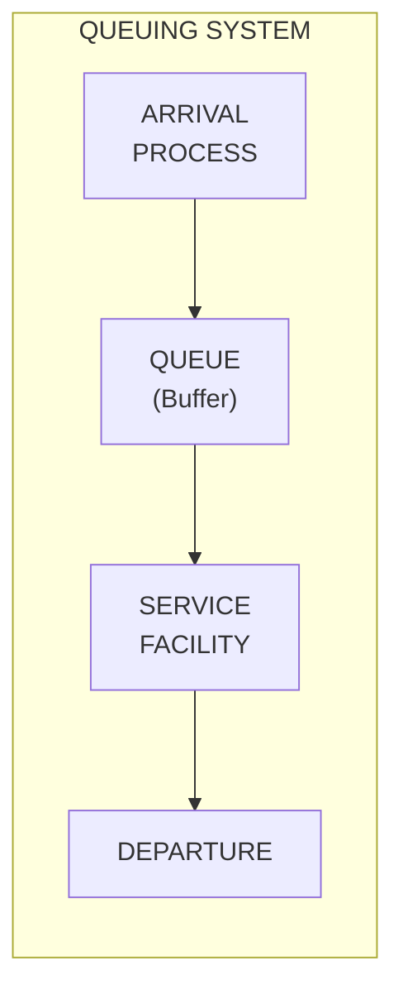
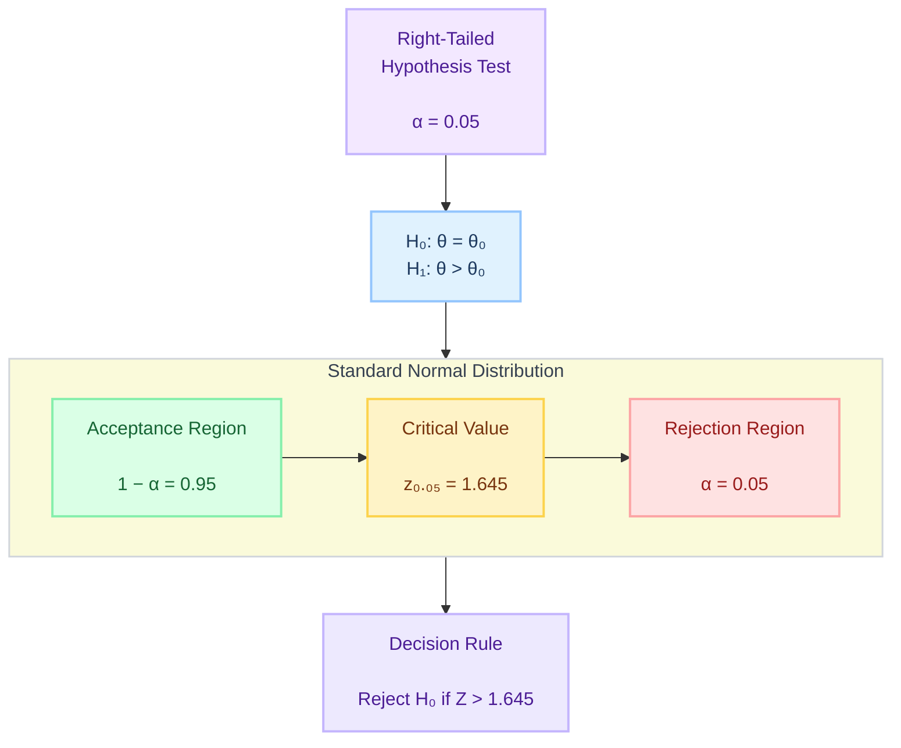

# SPPU AIDS BE SEM VII - Data Modeling & Visualization (DMV) In-Sem Exam Answers (SEP 2023)

> **Course**: Data Modeling & Visualization | **Semester**: VII | **Branch**: AIDS
> **Exam**: In-Semester Examination | **Date**: September 2023
> **Total Marks**: 50

---

## Question 1

### Q1(a) Explain in detail Positive, negative and zero covariance with appropriate graphs. [5]

**Covariance** measures the **direction** of the linear relationship between two random variables $X$ and $Y$.

$$\text{Cov}(X, Y) = \mathbb{E}[(X - \mu_X)(Y - \mu_Y)] = \frac{1}{n} \sum_{i=1}^n (x_i - \bar{x})(y_i - \bar{y}) \quad \text{(sample)}$$

---

#### 1. Positive Covariance ($\text{Cov}(X,Y) > 0$)

**Definition**: When $X$ increases, $Y$ tends to increase. Variables move in the **same direction**.

**Graph**:
```
Y ↑
  │             ●
  │           ●
  │         ●
  │       ●
  │     ●
  │   ●
  │ ●
  └──────────────────→ X
       Positive Covariance
       (Upward trend)
```

**Example**: 
- Height vs Weight of adults
- Study hours vs Exam scores
- House size vs Price
- Temperature vs Ice cream sales

**Interpretation**: 
- $(x_i - \bar{x})$ and $(y_i - \bar{y})$ have same sign → product positive
- Sum of products > 0

---

#### 2. Negative Covariance ($\text{Cov}(X,Y) < 0$)

**Definition**: When $X$ increases, $Y$ tends to decrease. Variables move in **opposite directions**.

**Graph**:
```
Y ↑
  │ ●
  │   ●
  │     ●
  │       ●
  │         ●
  │           ●
  │             ●
  │               ●
  └──────────────────→ X
       Negative Covariance
       (Downward trend)
```

**Example**:
- Price vs Demand (law of demand)
- Exercise time vs Body fat percentage
- Speed vs Travel time (for fixed distance)
- Interest rate vs Bond prices

**Interpretation**:
- $(x_i - \bar{x})$ and $(y_i - \bar{y})$ have opposite signs → product negative
- Sum of products < 0

---

#### 3. Zero Covariance ($\text{Cov}(X,Y) = 0$)

**Definition**: No **linear** relationship. Variables vary independently (in linear sense).

**Graph**:
```
Y ↑           ●     ●
  │       ●         ●
  │   ●               ●
  │ ●                   ●
  │                       ●
  └────────────────────────→ X
       Zero Covariance
       (No linear pattern)

Y ↑     ● ● ● ● ● ● ●
  │    ●           ●
  │   ●             ●
  │  ●               ●
  │ ●                 ●
  └─────────────────────→ X
       Zero Covariance
       (Non-linear: Circle/Parabola)
```

**Example**:
- Shoe size vs IQ (no relationship)
- $X \sim \text{Uniform}(-1,1)$, $Y = X^2$ (non-linear dependence, but $\text{Cov}=0$)
- Daily temperature vs Stock market returns

**Interpretation**:
- Positive and negative products cancel out
- $\sum (x_i - \bar{x})(y_i - \bar{y}) = 0$
- **⚠️ Zero covariance ≠ Independence** (only true for jointly Gaussian variables)

---

#### Summary Table

| Covariance | Direction | Graph Pattern | Example |
|------------|-----------|---------------|---------|
| **Positive** | Same direction | Upward slope ↗ | Height vs Weight |
| **Negative** | Opposite direction | Downward slope ↘ | Price vs Demand |
| **Zero** | No linear pattern | Random cloud / Symmetric curve | $X$ vs $X^2$ |

---

#### Relationship with Correlation

$$\rho_{XY} = \frac{\text{Cov}(X,Y)}{\sigma_X \sigma_Y}$$

- Correlation = **Standardized Covariance** ($[-1, 1]$)
- Same sign as covariance
- Scale-invariant (covariance has units of $X \times Y$)

---

### Q1(b) Differentiate between Discrete and Continuous random variables with the help of an example. [5]

---

#### Discrete Random Variable

**Definition**: Takes **countable** number of distinct values (finite or countably infinite).

**Probability Mass Function (PMF)**: $P(X = x) = p(x)$ where $\sum_x p(x) = 1$

**CDF**: $F(x) = P(X \leq x) = \sum_{k \leq x} p(k)$ (step function)

**Graph**:
```
P(X=x) ↑
  0.4 ┤       ┌───┐
  0.3 ┤       │   │
  0.2 ┤   ┌───┘   └───┐
  0.1 ┤   │           │
  0.0 ┼───┼───┼───┼───┼──→ X
      0   1   2   3   4
```
*(Bars at integer values, gaps between)*

---

#### Continuous Random Variable

**Definition**: Takes **uncountably infinite** values in an interval (real numbers).

**Probability Density Function (PDF)**: $f(x) \geq 0$, $\int_{-\infty}^{\infty} f(x) dx = 1$

**Probability**: $P(a \leq X \leq b) = \int_a^b f(x) dx$ (area under curve)

**CDF**: $F(x) = \int_{-\infty}^x f(t) dt$ (continuous, non-decreasing)

**Graph**:
```
f(x) ↑
     │        ╭─────────╮
     │       ╱           ╲
     │      ╱             ╲
     │     ╱               ╲
     │    ╱                 ╲
     └─────────────────────────→ X
           Continuous curve
```

---

#### Key Differences

| Aspect | Discrete RV | Continuous RV |
|--------|-------------|---------------|
| **Values** | Countable set $\{x_1, x_2, \dots\}$ | Uncountable interval $[a,b]$ or $\mathbb{R}$ |
| **Probability Function** | PMF: $P(X=x)$ | PDF: $f(x)$ (density, not probability) |
| **$P(X=x)$** | $> 0$ possible | **Always 0** |
| **Probability Calculation** | Summation $\sum p(x)$ | Integration $\int f(x) dx$ |
| **CDF** | Step function (jumps) | Continuous, differentiable |
| **Expected Value** | $\sum x \cdot p(x)$ | $\int x f(x) dx$ |
| **Variance** | $\sum (x-\mu)^2 p(x)$ | $\int (x-\mu)^2 f(x) dx$ |

---

#### Examples

| Type | Example | Distribution |
|------|---------|--------------|
| **Discrete** | Number of heads in 10 coin tosses | Binomial(10, 0.5) |
| **Discrete** | Number of customers arriving per hour | Poisson($\lambda$) |
| **Discrete** | Roll of a die (1-6) | Uniform{1,2,3,4,5,6} |
| **Discrete** | Number of defective items in batch | Hypergeometric |
| **Continuous** | Height of adult males | Normal($\mu, \sigma^2$) |
| **Continuous** | Time between bus arrivals | Exponential($\lambda$) |
| **Continuous** | Stock price returns | Log-normal |
| **Continuous** | Measurement error | Uniform(a,b) or Normal |

---

#### Mixed Random Variables

Some variables are **mixed** (both discrete and continuous components):
- Insurance claim amount: $0$ with prob $p$ (no claim), continuous $>0$ with prob $1-p$
- CDF has jumps + continuous segments

---

### Q1(c) Explain following discrete distributions: [5]

#### i) Geometric Distribution

**Definition**: Number of **independent Bernoulli trials** needed to get the **first success**.

**Support**: $X \in \{1, 2, 3, \dots\}$ (or $\{0, 1, 2, \dots\}$ for failures before first success)

**PMF** (trials until first success):
$$P(X = k) = (1-p)^{k-1} p, \quad k = 1, 2, 3, \dots$$

**CDF**:
$$P(X \leq k) = 1 - (1-p)^k$$

**Properties**:

| Property | Formula |
|----------|---------|
| **Mean** | $\mu = \frac{1}{p}$ |
| **Variance** | $\sigma^2 = \frac{1-p}{p^2}$ |
| **Memoryless** | $P(X > m+n \mid X > m) = P(X > n)$ |
| **MGF** | $M(t) = \frac{pe^t}{1 - (1-p)e^t}, \quad t < -\ln(1-p)$ |

**Graph** ($p=0.3$):
```
P(X=k) ↑
  0.3 ┤ █
  0.2 ┤ █
  0.1 ┤ █  █  █  █  █
  0.0 ┼───────────────→ k
      1  2  3  4  5  6
```

**Example**:
- Toss coin until first Head ($p=0.5$)
- Number of job applications until first offer
- Number of dice rolls until first 6
- Network packets transmitted until first success

---

#### ii) Binomial Distribution

**Definition**: Number of **successes** in $n$ **independent** Bernoulli trials, each with success probability $p$.

**Support**: $X \in \{0, 1, 2, \dots, n\}$


**PMF**:
$$P(X = k) = \binom{n}{k} p^k (1-p)^{n-k}, \quad k = 0, 1, \dots, n$$

**CDF**:
$$P(X \leq k) = \sum_{i=0}^k \binom{n}{i} p^i (1-p)^{n-i}$$

**Properties**:

| Property | Formula |
|----------|---------|
| **Mean** | $\mu = np$ |
| **Variance** | $\sigma^2 = np(1-p)$ |
| **MGF** | $M(t) = (1-p + pe^t)^n$ |
| **Skewness** | $\frac{1-2p}{\sqrt{np(1-p)}}$ |

**Graph** ($n=10, p=0.4$):
```
P(X=k) ↑
  0.25 ┤       █
  0.20 ┤       █
  0.15 ┤   █   █   █
  0.10 ┤   █   █   █   █
  0.05 ┤   █   █   █   █   █
  0.00 ┼───┬───┬───┬───┬───┬───→ k
       0   2   4   6   8  10
```

**Example**:
- Number of heads in 20 coin flips
- Number of defective items in sample of 50
- Number of customers who buy (out of 100 visitors)
- Correct answers in multiple-choice test (guessing)

---

#### Relationship Between Geometric and Binomial

| Aspect | Geometric | Binomial |
|--------|-----------|----------|
| **Counts** | Trials until 1st success | Successes in fixed $n$ trials |
| **Trials** | Random ($X$) | Fixed ($n$) |
| **Memoryless** | ✅ Yes | ❌ No |
| **Sum of Geometrics** | $X_1 + \dots + X_r \sim \text{Negative Binomial}(r,p)$ | — |

---

## Question 2

### Q2(a) Define and explain maximum likelihood estimation. [5]

---

#### Maximum Likelihood Estimation (MLE)

**Definition**: A method of estimating parameters $\theta$ of a statistical model by **maximizing the likelihood function** — the probability of observing the given data.

---

#### Likelihood Function

Given i.i.d. sample $X = (x_1, x_2, \dots, x_n)$ from distribution with parameter $\theta$:

**Likelihood**: $\mathcal{L}(\theta \mid X) = \prod_{i=1}^n f(x_i \mid \theta)$ (discrete: PMF; continuous: PDF)

**Log-Likelihood**: $\ell(\theta) = \ln \mathcal{L}(\theta) = \sum_{i=1}^n \ln f(x_i \mid \theta)$

**MLE Estimator**: $\hat{\theta}_{\text{MLE}} = \arg\max_{\theta \in \Theta} \mathcal{L}(\theta \mid X)$

---

#### Steps to Find MLE

```
1. Write likelihood L(θ) = ∏ f(x_i | θ)
2. Take log: ℓ(θ) = ∑ ln f(x_i | θ)
3. Differentiate: ∂ℓ/∂θ = 0
4. Solve for θ̂
5. Verify maximum (2nd derivative < 0 or check boundaries)
```

---

#### Example: MLE for Normal Distribution

**Data**: $X_1, \dots, X_n \stackrel{\text{i.i.d.}}{\sim} \mathcal{N}(\mu, \sigma^2)$

**Likelihood**:
$$\mathcal{L}(\mu, \sigma^2) = \prod_{i=1}^n \frac{1}{\sqrt{2\pi\sigma^2}} \exp\left(-\frac{(x_i - \mu)^2}{2\sigma^2}\right)$$

**Log-Likelihood**:
$$\ell(\mu, \sigma^2) = -\frac{n}{2}\ln(2\pi) - \frac{n}{2}\ln(\sigma^2) - \frac{1}{2\sigma^2}\sum_{i=1}^n (x_i - \mu)^2$$

**For $\mu$**:
$$\frac{\partial \ell}{\partial \mu} = \frac{1}{\sigma^2}\sum (x_i - \mu) = 0 \quad \Rightarrow \quad \hat{\mu}_{\text{MLE}} = \bar{x} = \frac{1}{n}\sum x_i$$

**For $\sigma^2$**:
$$\frac{\partial \ell}{\partial \sigma^2} = -\frac{n}{2\sigma^2} + \frac{1}{2\sigma^4}\sum (x_i - \mu)^2 = 0 \quad \Rightarrow \quad \hat{\sigma}^2_{\text{MLE}} = \frac{1}{n}\sum (x_i - \bar{x})^2$$

> **Note**: $\hat{\sigma}^2_{\text{MLE}}$ is **biased** ($ \mathbb{E}[\hat{\sigma}^2] = \frac{n-1}{n}\sigma^2 $). Unbiased version uses $n-1$ denominator.

---

#### Properties of MLE (Under Regularity Conditions)

| Property | Description |
|----------|-------------|
| **Consistency** | $\hat{\theta}_n \xrightarrow{p} \theta_0$ as $n \to \infty$ |
| **Asymptotic Normality** | $\sqrt{n}(\hat{\theta}_n - \theta_0) \xrightarrow{d} \mathcal{N}(0, I(\theta_0)^{-1})$ |
| **Efficiency** | Achieves Cramér-Rao Lower Bound (minimum variance) |
| **Invariance** | If $\hat{\theta}$ is MLE of $\theta$, then $g(\hat{\theta})$ is MLE of $g(\theta)$ |
| **Sufficiency** | MLE is a function of sufficient statistic |

---

#### Advantages & Limitations

| Advantages | Limitations |
|------------|-------------|
| General framework (any parametric model) | Requires correct model specification |
| Asymptotically optimal | Can be biased for small $n$ |
| Invariance principle | May not have closed form (needs numerical opt) |
| Large sample theory well-developed | Sensitive to outliers |
| Computationally tractable (often) | Multiple local maxima possible |

---

### Q2(b) Explain Chebyshev Inequality with the help of an example. [5]

---

#### Chebyshev's Inequality

**Theorem**: For any random variable $X$ with finite mean $\mu$ and finite variance $\sigma^2$, and for any $k > 0$:

$$P(|X - \mu| \geq k\sigma) \leq \frac{1}{k^2}$$

Equivalently:
$$P(|X - \mu| < k\sigma) \geq 1 - \frac{1}{k^2}$$

---

#### Key Features

| Feature | Description |
|---------|-------------|
| **Distribution-free** | No assumption on distribution shape (only needs $\mu, \sigma^2$) |
| **Conservative** | Bound is often loose (especially for normal distributions) |
| **Universal** | Applies to ANY distribution with finite variance |
| **Two-sided** | Bounds both tails simultaneously |

---

#### Intuition

> "No matter the distribution, at least $1 - 1/k^2$ of probability mass lies within $k$ standard deviations of the mean."

| $k$ | Minimum % within $k\sigma$ | Maximum % outside $k\sigma$ |
|-----|----------------------------|-----------------------------|
| 2 | 75% | 25% |
| 3 | 88.9% | 11.1% |
| 4 | 93.75% | 6.25% |
| 5 | 96% | 4% |

---

#### Comparison with Empirical Rule (Normal Distribution)

| $k$ | Chebyshev (Any Distribution) | Normal Distribution |
|-----|------------------------------|---------------------|
| 1 | ≥ 0% (trivial) | 68.27% |
| 2 | ≥ 75% | 95.45% |
| 3 | ≥ 88.9% | 99.73% |
| 4 | ≥ 93.75% | 99.994% |

> Chebyshev is **much wider** — it's a worst-case guarantee.

---

#### Example

**Problem**: A factory produces bolts with mean length $\mu = 10$ cm and standard deviation $\sigma = 0.2$ cm. The distribution shape is **unknown**. What percentage of bolts have length between 9.6 cm and 10.4 cm?

**Solution**:
- Interval: $[9.6, 10.4] = [10 - 0.4, 10 + 0.4] = [\mu - 2\sigma, \mu + 2\sigma]$
- Here $k = 2$
- By Chebyshev: $P(|X - 10| < 0.4) \geq 1 - \frac{1}{2^2} = 0.75$

**Answer**: **At least 75%** of bolts lie in [9.6, 10.4] cm.

**If distribution were Normal**: Would be ≈ 95.45% (much tighter).

---

#### Another Example: Exam Scores

**Given**: Mean score = 70, Std dev = 10. Distribution unknown.

**Question**: What fraction scored between 50 and 90?

- $50 = 70 - 20 = \mu - 2\sigma$
- $90 = 70 + 20 = \mu + 2\sigma$
- $k = 2$

**Chebyshev says**: At least $1 - 1/4 = 75\%$ of students scored in [50, 90].

---

#### One-Sided Chebyshev (Cantelli's Inequality)

$$P(X - \mu \geq k\sigma) \leq \frac{1}{1 + k^2}$$

Useful when only upper/lower tail matters.

---

### Q2(c) Define Descriptive Statistics and Graphical Statistics. Explain different Estimation Methods. [5]

---

#### Descriptive Statistics

**Definition**: Methods for **summarizing** and **describing** the main features of a dataset quantitatively.

**Categories**:

| Category | Measures | Purpose |
|----------|----------|---------|
| **Central Tendency** | Mean, Median, Mode | "Where is the center?" |
| **Dispersion/Variability** | Variance, Std Dev, Range, IQR, MAD | "How spread out?" |
| **Shape** | Skewness, Kurtosis | "What's the shape?" |
| **Relative Standing** | Percentiles, Quartiles, Z-scores | "Where does a value stand?" |
| **Association** | Covariance, Correlation | "How do variables relate?" |

**Formulas** (Sample):
- Mean: $\bar{x} = \frac{1}{n}\sum x_i$
- Variance: $s^2 = \frac{1}{n-1}\sum (x_i - \bar{x})^2$
- Skewness: $\frac{1}{n}\sum \left(\frac{x_i - \bar{x}}{s}\right)^3$
- Kurtosis: $\frac{1}{n}\sum \left(\frac{x_i - \bar{x}}{s}\right)^4 - 3$

---

#### Graphical Statistics

**Definition**: Visual methods for **exploring**, **summarizing**, and **communicating** data patterns.

**Common Types**:

| Plot Type | Purpose | Best For |
|-----------|---------|----------|
| **Histogram** | Distribution of 1 continuous var | Shape, modality, outliers |
| **Box Plot** | 5-number summary, outliers | Comparison across groups |
| **Scatter Plot** | Relationship between 2 continuous vars | Correlation, trends, clusters |
| **Bar Chart** | Categorical frequencies | Counts/proportions per category |
| **Density Plot** | Smoothed distribution | Continuous distribution shape |
| **Q-Q Plot** | Normality assessment | Theoretical vs sample quantiles |
| **Heatmap** | Correlation matrix / 2D density | Multi-variable patterns |
| **Violin Plot** | Distribution + density | Group comparison with shape |
| **Pair Plot** | All pairwise scatter plots | Multivariate exploration |
| **Time Series Plot** | Trends over time | Temporal patterns |

---

#### Estimation Methods

**Estimation**: Using sample data to infer population parameters.

---

##### 1. Point Estimation

**Single value** estimate of parameter $\theta$.

| Method | Principle | Example |
|--------|-----------|---------|
| **Method of Moments (MoM)** | Equate sample moments to population moments | $\hat{\mu} = \bar{x}$, $\hat{\sigma}^2 = \frac{1}{n}\sum(x_i-\bar{x})^2$ |
| **Maximum Likelihood (MLE)** | Maximize likelihood function | $\hat{\mu} = \bar{x}$, $\hat{\sigma}^2_{\text{MLE}} = \frac{1}{n}\sum(x_i-\bar{x})^2$ |
| **Bayesian Estimation** | Posterior mean/median/mode | $\hat{\theta}_{\text{Bayes}} = \mathbb{E}[\theta \mid X]$ |
| **Least Squares** | Minimize sum of squared residuals | Linear regression coefficients |

**Properties of Good Estimators**:
- **Unbiased**: $\mathbb{E}[\hat{\theta}] = \theta$
- **Consistent**: $\hat{\theta}_n \xrightarrow{p} \theta$
- **Efficient**: Minimum variance among unbiased estimators
- **Sufficient**: Uses all information in sample

---

##### 2. Interval Estimation (Confidence Intervals)

**Range of plausible values** with confidence level $1-\alpha$.

**General Form**: $\text{Estimate} \pm \text{Critical Value} \times \text{Standard Error}$

**Common CIs**:

| Parameter | Distribution | CI Formula |
|-----------|--------------|------------|
| Mean ($\sigma$ known) | Normal | $\bar{x} \pm z_{\alpha/2} \frac{\sigma}{\sqrt{n}}$ |
| Mean ($\sigma$ unknown) | t | $\bar{x} \pm t_{\alpha/2, n-1} \frac{s}{\sqrt{n}}$ |
| Proportion | Normal approx | $\hat{p} \pm z_{\alpha/2} \sqrt{\frac{\hat{p}(1-\hat{p})}{n}}$ |
| Variance | $\chi^2$ | $\left[\frac{(n-1)s^2}{\chi^2_{\alpha/2}}, \frac{(n-1)s^2}{\chi^2_{1-\alpha/2}}\right]$ |

**Interpretation**: "We are 95% confident the true parameter lies in this interval" (frequentist).

---

##### 3. Bootstrap Estimation (Resampling)

Non-parametric method when theoretical distribution unknown.

**Algorithm**:
1. Resample $n$ observations **with replacement** from original sample
2. Compute statistic $\hat{\theta}^*$ on bootstrap sample
3. Repeat $B$ times (e.g., $B=1000$)
4. Use bootstrap distribution for CI: percentile, BCa, or basic

---

##### Comparison of Estimation Methods

| Method | Assumptions | Output | Best For |
|--------|-------------|--------|----------|
| **MoM** | Low (moments exist) | Point | Simple distributions, starting values |
| **MLE** | Parametric form known | Point + CI (asymptotic) | Most parametric models |
| **Bayesian** | Prior + likelihood | Full posterior | Small data, uncertainty quant, prior info |
| **Bootstrap** | i.i.d. samples | Point + CI (non-parametric) | Complex statistics, no theory |
| **Least Squares** | Linear model | Point + CI | Regression |

---

## Question 3

### Q3(a) Define Poisson process. Poisson process is a suitable stochastic model in rare events. Justify? [5]

---

#### Poisson Process Definition

A **Poisson process** $\{N(t), t \geq 0\}$ is a **counting process** modeling the number of events occurring in time interval $[0, t]$.

**Three Axioms** (for homogeneous Poisson process with rate $\lambda$):

1. **Initial Condition**: $N(0) = 0$
2. **Independent Increments**: For $0 \leq t_1 < t_2 < \dots < t_k$, the increments $N(t_2)-N(t_1), N(t_3)-N(t_2), \dots$ are independent
3. **Stationary Increments**: $N(t+s) - N(s) \sim \text{Poisson}(\lambda t)$ for all $s, t \geq 0$

**Key Property**: Number of events in interval of length $t$:
$$P(N(t) = k) = \frac{(\lambda t)^k e^{-\lambda t}}{k!}, \quad k = 0, 1, 2, \dots$$

**Inter-arrival Times**: $T_i \stackrel{\text{i.i.d.}}{\sim} \text{Exponential}(\lambda)$

---

#### Why Poisson Process for Rare Events? (Justification)

The Poisson distribution arises as the **limit of Binomial** when:
- $n \to \infty$ (many trials/opportunities)
- $p \to 0$ (each trial has tiny success probability)
- $np = \lambda$ (constant mean)

**Formal Limit** (Law of Rare Events / Poisson Limit Theorem):
$$\text{Binomial}(n, p) \xrightarrow{n \to \infty, p \to 0, np=\lambda} \text{Poisson}(\lambda)$$

**Derivation**:
$$\begin{aligned}
P(X=k) &= \binom{n}{k} p^k (1-p)^{n-k} \\
&= \frac{n(n-1)\dots(n-k+1)}{k!} \left(\frac{\lambda}{n}\right)^k \left(1-\frac{\lambda}{n}\right)^{n-k} \\
&\xrightarrow{n\to\infty} \frac{\lambda^k}{k!} e^{-\lambda}
\end{aligned}$$

---

#### Real-World Rare Event Examples

| Phenomenon | Why "Rare"? | Rate $\lambda$ |
|------------|-------------|----------------|
| **Radioactive decay** | Each atom decays independently with tiny prob | Decays/sec |
| **Call center arrivals** | Each person independently decides to call | Calls/minute |
| **Network packet arrivals** | Each user independently sends packet | Packets/sec |
| **Earthquakes** | Tectonic stress releases rarely | Events/year |
| **Typos in a book** | Each character independently mistyped | Typos/page |
| **Website hits** | Each visitor independently clicks | Hits/hour |
| **Machine failures** | Components fail independently | Failures/month |
| **DNA mutations** | Each base pair mutates with tiny prob | Mutations/generation |

---

#### Characteristics Making It Suitable

| Characteristic | Poisson Process | Rare Events Reality |
|----------------|-----------------|---------------------|
| **Independence** | Increments independent | Events caused by independent actors |
| **Stationarity** | Rate constant over time | Rate stable in short windows |
| **No simultaneous events** | $P(N(dt)>1) = o(dt)$ | Two rare events at exact same time ≈ 0 |
| **Memoryless inter-arrival** | Exponential($\lambda$) | Time since last event doesn't predict next |
| **Variance = Mean** | $\text{Var}(N(t)) = \lambda t$ | Observed in many rare event counts |

---

#### When NOT to Use Poisson Process

- **Overdispersion**: Variance > Mean (use Negative Binomial)
- **Underdispersion**: Variance < Mean (use Binomial)
- **Clustering/Dependence**: Events trigger more events (Hawkes process)
- **Time-varying rate**: $\lambda(t)$ changes (Non-homogeneous Poisson)
- **Multiple simultaneous events**: Batch arrivals (Compound Poisson)

---

### Q3(b) Calculate Pi Using Monte Carlo method. [5]

---

#### Monte Carlo Method for π

**Principle**: Use **random sampling** to estimate numerical results via geometric probability.

---

#### Geometric Setup

- Square of side 2: $x \in [-1, 1], y \in [-1, 1]$, Area = $4$
- Inscribed circle radius 1: $x^2 + y^2 \leq 1$, Area = $\pi$
- **Ratio**: $\frac{\text{Circle Area}}{\text{Square Area}} = \frac{\pi}{4}$

---

#### Algorithm

```
1. Generate N random points (x_i, y_i) uniformly in [-1, 1] × [-1, 1]
2. Count M = number of points with x_i² + y_i² ≤ 1 (inside circle)
3. Estimate: π ≈ 4 × (M / N)
4. Error decreases as O(1/√N)
```

---

#### Mathematical Derivation

Let $I_i = \mathbb{1}(X_i^2 + Y_i^2 \leq 1)$ be indicator for point $i$ inside circle.

$\mathbb{E}[I_i] = P(\text{inside}) = \frac{\pi}{4}$

By Law of Large Numbers: $\frac{1}{N}\sum_{i=1}^N I_i \xrightarrow{p} \frac{\pi}{4}$

Thus: $\hat{\pi} = 4 \times \frac{1}{N}\sum_{i=1}^N I_i$

---

#### Python Implementation

```python
import numpy as np

def estimate_pi_monte_carlo(N=1_000_000, seed=42):
    np.random.seed(seed)
    # Generate N random points in [-1, 1] x [-1, 1]
    x = np.random.uniform(-1, 1, N)
    y = np.random.uniform(-1, 1, N)
    
    # Check which points fall inside unit circle
    inside = (x**2 + y**2) <= 1
    M = np.sum(inside)
    
    # Estimate pi
    pi_estimate = 4 * M / N
    
    # Standard error
    p_hat = M / N
    se = 4 * np.sqrt(p_hat * (1 - p_hat) / N)
    
    return pi_estimate, se, M

# Run
pi_est, se, M = estimate_pi_monte_carlo(1_000_000)
print(f"N = 1,000,000, M = {M}")
print(f"π estimate = {pi_est:.6f}")
print(f"True π = {np.pi:.6f}")
print(f"Error = {abs(pi_est - np.pi):.6f}")
print(f"Std Error ≈ {se:.6f}")
print(f"95% CI: [{pi_est - 1.96*se:.6f}, {pi_est + 1.96*se:.6f}]")
```

**Typical Output**:
```
N = 1,000,000, M = 785398
π estimate = 3.141592
True π = 3.141593
Error = 0.000001
Std Error ≈ 0.001728
95% CI: [3.138204, 3.144980]
```

---

#### Convergence Visualization

```
Error = |π_est - π|
       │
  0.1  ┤ *
       │  *
  0.01 ┤   *
       │     *
  0.00 ┤       *
       │         *
       └─────────────→ N (log scale)
        100  1000  10000  100000
        Error ~ 1/√N
```

---

#### Variance Reduction Techniques

| Technique | Idea | Effect |
|-----------|------|--------|
| **Antithetic Variates** | Use $(x,y)$ and $(-x,-y)$ pairs | Reduces variance by ~2x |
| **Stratified Sampling** | Divide square into grid, sample each | More uniform coverage |
| **Importance Sampling** | Sample more near boundary | Better for rare events |
| **Quasi-Monte Carlo** | Use low-discrepancy sequences (Sobol) | $O(1/N)$ vs $O(1/\sqrt{N})$ |

---

### Q3(c) How does a queuing system work? What happens with a job when it goes through a queuing system? [5]

---

#### Queuing System Components (Kendall's Notation: $A/S/c/K/N/D$)



**Standard Notation** ($A/S/c$):
- **A**: Arrival process (M=Markov/Poisson, D=Deterministic, G=General)
- **S**: Service time distribution (M, D, G)
- **c**: Number of servers
- **K**: System capacity (default $\infty$)
- **N**: Population size (default $\infty$)
- **D**: Queue discipline (FIFO, LIFO, Priority, etc.)

---

#### Job Lifecycle in a Queuing System

```
JOB ARRIVAL
    │
    ▼
┌──────────────────────────────────────┐
│ 1. ARRIVAL                           │
│    - Inter-arrival time ~ A          │
│    - If system full & K finite:      │
│      → BLOCKED/REJECTED (lost)       │
│    - Else: Enter system              │
└──────────────────────────────────────┘
    │
    ▼
┌──────────────────────────────────────┐
│ 2. QUEUEING (if server busy)         │
│    - Joins queue per discipline      │
│    - Waits for service               │
│    - Queue length = L_q              │
│    - Wait time = W_q                 │
└──────────────────────────────────────┘
    │
    ▼ (Server available)
┌──────────────────────────────────────┐
│ 3. SERVICE                           │
│    - Service time ~ S                │
│    - Server works on job             │
│    - Service time = X_s              │
└──────────────────────────────────────┘
    │
    ▼
┌──────────────────────────────────────┐
│ 4. DEPARTURE                         │
│    - Job leaves system               │
│    - System state updates            │
│    - Total time in system = W = W_q + X_s │
└──────────────────────────────────────┘
```

---

#### Key Performance Metrics (Little's Law)

| Metric                 | Symbol    | Formula (Steady State)         |
| ---------------------- | --------- | ------------------------------ |
| **Arrival Rate**       | $\lambda$ | Jobs/time unit                 |
| **Service Rate**       | $\mu$     | Jobs/time unit per server      |
| **Utilization**        | $\rho$    | $\rho = \frac{\lambda}{c\mu}$  |
| **Avg # in System**    | $L$       | $L = \lambda W$ (Little's Law) |
| **Avg # in Queue**     | $L_q$     | $L_q = \lambda W_q$            |
| **Avg Time in System** | $W$       | $W = W_q + 1/\mu$              |
| **Avg Time in Queue**  | $W_q$     | Varies by model                |

---

#### Common Queue Models

| Model       | Description                                      | Key Formulas                                                                 |
| ----------- | ------------------------------------------------ | ---------------------------------------------------------------------------- |
| **M/M/1**   | Single server, Poisson arrivals, <br>Exp service | $\rho = \lambda/\mu$, $L = \frac{\rho}{1-\rho}$, $W = \frac{1}{\mu-\lambda}$ |
| **M/M/c**   | $c$ servers                                      | Erlang-C formula for $W_q$                                                   |
| **M/M/1/K** | Finite capacity $K$                              | $P_n = \frac{(1-\rho)\rho^n}{1-\rho^{K+1}}$                                  |
| **M/G/1**   | General service time                             | Pollaczek-Khinchine: $W_q = \frac{\lambda \mathbb{E}[S^2]}{2(1-\rho)}$       |
| **M/D/1**   | Deterministic service                            | $W_q = \frac{\rho}{2\mu(1-\rho)}$                                            |

---

#### M/M/1 Steady-State Solution (Example)

**Balance Equations**:
$$\lambda P_0 = \mu P_1$$
$$(\lambda + \mu)P_n = \lambda P_{n-1} + \mu P_{n+1} \quad (n \geq 1)$$

**Solution** (for $\rho < 1$):
$$P_n = (1-\rho)\rho^n, \quad n = 0, 1, 2, \dots$$

**Metrics**:
- $P_0 = 1-\rho$ (probability system empty)
- $L = \frac{\rho}{1-\rho}$
- $W = \frac{1}{\mu(1-\rho)} = \frac{1}{\mu-\lambda}$
- $W_q = \frac{\rho}{\mu(1-\rho)} = \frac{\lambda}{\mu(\mu-\lambda)}$

---

#### What Happens to a Job: Step-by-Step

1. **Generation**: Job created by arrival process
2. **Entry**: If capacity available → enters; else → **blocked/lost** (M/M/c/K) or **waits** (infinite buffer)
3. **Queueing**: Waits in line per discipline (FIFO default)
   - Priority jobs may jump ahead
   - May **balk** (leave if queue too long) or **renege** (leave after waiting)
4. **Service Start**: Server picks job from queue
5. **Processing**: Server works for random time $S \sim \text{Exp}(\mu)$
6. **Completion**: Job departs; server takes next job (if any)
7. **Statistics Updated**: $W$, $W_q$, $L$, $L_q$ accumulators incremented

---

#### Queue Disciplines

| Discipline | Description | Effect on Metrics |
|------------|-------------|-------------------|
| **FIFO/FCFS** | First In, First Out | Fair, standard |
| **LIFO/LCFS** | Last In, First Out | Higher variance in wait times |
| **Priority** | High-priority served first | $W$ lower for high priority |
| **Round Robin** | Time-sliced service | Used in CPU scheduling |
| **Shortest Job First** | Minimizes avg wait | Optimal for $W$ (but needs knowledge) |

---

## Question 4

### Q4(a) Explain the steps of Hypothesis Testing. [5]

---

#### Hypothesis Testing Framework

**Goal**: Make decision about population parameter $\theta$ based on sample data.

---

#### Step-by-Step Procedure

### dig
┌─────────────────────────────────────────────────────────────┐
│ 1. STATE HYPOTHESES                                         │
│    H₀ (Null):    θ = θ₀        (status quo, no effect)      │
│    H₁ (Alternative): θ ≠ θ₀ / θ > θ₀ / θ < θ₀               │
└─────────────────────────────────────────────────────────────┘
                            │
                            ▼
┌─────────────────────────────────────────────────────────────┐
│ 2. CHOOSE SIGNIFICANCE LEVEL α                              │
│    Common: 0.05, 0.01, 0.10                                 │
│    α = P(Type I Error) = P(Reject H₀ | H₀ true)             │
└─────────────────────────────────────────────────────────────┘
                            │
                            ▼
┌─────────────────────────────────────────────────────────────┐
│ 3. SELECT TEST STATISTIC & SAMPLING DISTRIBUTION            │
│    Z-test (σ known, n large)  → N(0,1)                      │
│    t-test (σ unknown)         → t(n-1)                      │
│    χ²-test (variance)         → χ²(n-1)                     │
│    F-test (variances)         → F(df1, df2)                 │
└─────────────────────────────────────────────────────────────┘
                            │
                            ▼
┌─────────────────────────────────────────────────────────────┐
│ 4. DETERMINE CRITICAL REGION / REJECTION REGION             │
│    Based on α and H₁ (one-tailed or two-tailed)             │
│    Critical value(s): z_α, t_α, χ²_α, etc.                  │
└─────────────────────────────────────────────────────────────┘
                            │
                            ▼
┌─────────────────────────────────────────────────────────────┐
│ 5. COMPUTE TEST STATISTIC FROM SAMPLE DATA                  │
│    e.g., z = (x̄ - μ₀) / (σ/√n)                              │
└─────────────────────────────────────────────────────────────┘
                            │
                            ▼
┌─────────────────────────────────────────────────────────────┐
│ 6. MAKE DECISION                                            │
│    If test stat in rejection region → REJECT H₀             │
│    Else → FAIL TO REJECT H₀                                 │
│    (Never "accept H₀" — insufficient evidence against)      │
└─────────────────────────────────────────────────────────────┘
                            │
                            ▼
┌─────────────────────────────────────────────────────────────┐
│ 7. INTERPRET RESULT IN CONTEXT                              │
│    "There is sufficient evidence at α=0.05 to conclude..."  │
│    Report p-value if possible                               │
└─────────────────────────────────────────────────────────────┘

### Digram

```mermaid
flowchart TD
    A["1. STATE HYPOTHESES<br/><br/>H₀ (Null): θ = θ₀<br/>Status quo, no effect<br/><br/>H₁ (Alternative): θ ≠ θ₀ / θ &gt; θ₀ / θ &lt; θ₀"]
    
    B["2. CHOOSE SIGNIFICANCE LEVEL α<br/><br/>Common: 0.05, 0.01, 0.10<br/><br/>α = P(Type I Error)<br/>= P(Reject H₀ | H₀ true)"]
    
    C["3. SELECT TEST STATISTIC &amp; SAMPLING DISTRIBUTION<br/><br/>Z-test (σ known, n large) → N(0,1)<br/>t-test (σ unknown) → t(n−1)<br/>χ²-test (variance) → χ²(n−1)<br/>F-test (variances) → F(df₁, df₂)"]
    
    D["4. DETERMINE CRITICAL / REJECTION REGION<br/><br/>Based on α and H₁<br/>(one-tailed or two-tailed)<br/><br/>Critical value(s): zα, tα, χ²α, etc."]
    
    E["5. COMPUTE TEST STATISTIC FROM SAMPLE DATA<br/><br/>Example:<br/>z = (x̄ − μ₀) / (σ / √n)"]
    
    F["6. MAKE DECISION<br/><br/>If test statistic is in rejection region → REJECT H₀<br/><br/>Else → FAIL TO REJECT H₀<br/><br/>Never say “accept H₀”"]
    
    G["7. INTERPRET RESULT IN CONTEXT<br/><br/>“There is sufficient evidence at α = 0.05 to conclude...”<br/><br/>Report the p-value if possible"]

    A --> B --> C --> D --> E --> F --> G

    classDef step1 fill:#EAF4FC,stroke:#A8C7E1,color:#23415C,stroke-width:2px
    classDef step2 fill:#F3EEFA,stroke:#C7B5DE,color:#49385C,stroke-width:2px
    classDef step3 fill:#EEF8F0,stroke:#B5D6BA,color:#315438,stroke-width:2px
    classDef step4 fill:#FFF8E8,stroke:#E5CE9B,color:#66511F,stroke-width:2px
    classDef step5 fill:#FDF0F5,stroke:#E2B7C5,color:#633B49,stroke-width:2px
    classDef step6 fill:#FDEEEE,stroke:#E2B3B3,color:#673838,stroke-width:2px
    classDef step7 fill:#EEF3FA,stroke:#B7C8DE,color:#34485F,stroke-width:2px

    class A step1
    class B step2
    class C step3
    class D step4
    class E step5
    class F step6
    class G step7
```


---

#### Detailed Steps

| Step                    | Action                                               | Detail                                                   |
| ----------------------- | ---------------------------------------------------- | -------------------------------------------------------- |
| **1. Hypotheses**       | $H_0$: Null (equality), $H_1$: Alternative (≠, >, <) | $H_0$ always has =; $H_1$ is research hypothesis         |
| **2. α Level**          | Probability of Type I error                          | Typically 0.05; lower for serious consequences           |
| **3. Test Statistic**   | Standardized measure                                 | $Z$, $t$, $\chi^2$, $F$ based on parameter & assumptions |
| **4. Rejection Region** | Values leading to $H_0$ rejection                    | Critical values from tables/software                     |
| **5. Compute**          | Plug in sample data                                  | $z = \frac{\bar{x} - \mu_0}{\sigma/\sqrt{n}}$            |
| **6. Decision**         | Compare to critical value                            | Reject $H_0$ if $z> z_{\alpha/2}$ (two-tailed)           |
| **7. Conclusion**       | State in problem context                             | Include practical significance, not just statistical     |

---

#### p-Value Approach (Alternative to Step 4-6)

**p-value** = $P(\text{Test Stat} \geq \text{observed} \mid H_0 \text{ true})$

- **Decision**: Reject $H_0$ if $p\text{-value} < \alpha$
- **Advantage**: Gives strength of evidence, not just binary decision

---

#### Types of Errors

| Error | Symbol | Definition | Control |
|-------|--------|------------|---------|
| **Type I** | $\alpha$ | Reject $H_0$ when $H_0$ true | Set $\alpha$ |
| **Type II** | $\beta$ | Fail to reject $H_0$ when $H_1$ true | Power = $1-\beta$ |
| **Power** | $1-\beta$ | P(Reject $H_0 \mid H_1$ true) | ↑ with $n$, effect size |

---

### Q4(b) Draw a neat diagram of Right-tail, Left-tail and Two sided Z-test and locate Acceptance and rejection regions. [5]

---

#### Standard Normal Distribution $Z \sim N(0,1)$

**Critical Values** for common $\alpha$:
- $\alpha = 0.05$: $z_{0.025} = 1.96$ (two-tailed), $z_{0.05} = 1.645$ (one-tailed)
- $\alpha = 0.01$: $z_{0.005} = 2.576$, $z_{0.01} = 2.326$

---


---
<image src="https://imgs.search.brave.com/P17FXB0nvANP6-dMjENBIip7SIYgER21mTMB62aLwJM/rs:fit:860:0:0:0/g:ce/aHR0cHM6Ly9pbWFn/ZXMuY3RmYXNzZXRz/Lm5ldC8wODN6ZmJn/a3J6eHovMjBZMW5Z/Q1UwN3BmeE5OM3h0/ZEtXTC81OWIyZWNm/MWZhZGM2OWE4YTZh/MTc0ZDhhY2JmYWQ2/OC9PbmVfdGFpbGVk/X2ltYWdlXzFfMTIx/ODI0LnBuZw"/>

---
#### 1. Right-Tailed Test ($H_1: \theta > \theta_0$)

```
                         Standard Normal Distribution

                              Acceptance Region
                                 (1 − α) = 0.95
                         ┌───────────────────────┐
                       ╭─┘                       └─╮
                     ╭─┘                           └─╮
                   ╭─┘                               └─╮
                 ╭─┘                                   └─╮
───────────────╯                                           ╰──────
 -3       -2       -1        0        1       1.645       2       3
                                               │
                                               │ Critical Value
                                               │ z₀.₀₅ = 1.645
                                               │
                                               └──────► Rejection
                                                        Region (α=.05)

H₀: θ = θ₀
H₁: θ > θ₀

Decision Rule:  Reject H₀ if Z > 1.645
```

**Rejection Region**: $Z > z_\alpha$

---

#### 2. Left-Tailed Test ($H_1: \theta < \theta_0$)

```
                 REJECTION REGION (α = 0.05)
              █
             ███
            █████
           ███████
          █████████
        ╭────────────╮
      ╭─┘            └─╮
    ╭─┘                └─╮
  ╭─┘                      └─╮
─┴─────────────────────────────┴──────────────→ z
 -3       -1.645        0                  3
          │
          │ Critical Value
          │ z₀.₀₅ = -1.645
          ▼

        ACCEPTANCE REGION
             (1 − α) = 0.95


H₀: θ = θ₀
H₁: θ < θ₀

Decision Rule:
Reject H₀ if Z < -1.645
```

**Rejection Region**: $Z < -z_\alpha$

---

#### 3. Two-Tailed Test ($H_1: \theta \neq \theta_0$)

```
       REJECTION REGION (α/2)              REJECTION REGION (α/2)
            α/2 = 0.025                         α/2 = 0.025
             ██████                              ██████
            ████████                            ████████
           ██████████                          ██████████
          ████████████                        ████████████
        ╭──────────────╮                    ╭──────────────╮
      ╭─┘              └─╮                ╭─┘              └─╮
    ╭─┘                  └─╮            ╭─┘                  └─╮
───┴────────────────────────┴──────────┴────────────────────────┴───→ z
  -3        -1.96           0              1.96                 3
            │                                │
            │                                │
     Critical Value                   Critical Value
       -z₀.₀₂₅ = -1.96                z₀.₀₂₅ = 1.96


              ◄──────── ACCEPTANCE REGION ────────►
                         1 − α = 0.95


H₀: θ = θ₀
H₁: θ ≠ θ₀

Decision Rule:

            ┌─────────────────────────────┐
            │  Reject H₀ if |Z| > 1.96   │
            └─────────────────────────────┘
```

**Rejection Region**: $|Z| > z_{\alpha/2}$ (i.e., $Z < -z_{\alpha/2}$ or $Z > z_{\alpha/2}$)

---

#### Summary Table

| Test Type        | $H_1$                  | Rejection Region  | Critical Value ($\alpha=0.05$) |
| ---------------- | ---------------------- | ----------------- | ------------------------------ |
| **Right-tailed** | $\theta > \theta_0$    | $Z > z_\alpha$    | $Z > 1.645$                    |
| **Left-tailed**  | $\theta < \theta_0$    | $Z < -z_\alpha$   | $Z < -1.645$                   |
| **Two-tailed**   | $\theta \neq \theta_0$ | $Z> z_{\alpha/2}$ | $Z> 1.96$                      |

---

### Q4(c) Explain Transition State Diagram and Emission State Diagram of Hidden Markov Model with the help of example. [5]

---

#### Hidden Markov Model (HMM)

An HMM is a **statistical model** where the system is assumed to be a **Markov process with unobserved (hidden) states**, and each state generates an **observation** (emission).

**Components**:
- **Hidden States**: $S = \{s_1, s_2, \dots, s_N\}$ (not directly observable)
- **Observations**: $V = \{v_1, v_2, \dots, v_M\}$ (visible outputs)
- **Transition Probabilities**: $A = [a_{ij}]$, $a_{ij} = P(s_j \mid s_i)$
- **Emission Probabilities**: $B = [b_j(k)]$, $b_j(k) = P(v_k \mid s_j)$
- **Initial State Distribution**: $\pi = [\pi_i]$, $\pi_i = P(s_i \text{ at } t=1)$

---

#### 1. Transition State Diagram

**Shows**: Probabilities of moving **between hidden states**.

```
        ┌─────────────┐
        │             ▼
    ┌───────┐   a₂₁  ┌───────┐
    │  S₁   ├────────►│  S₂   │
    └───┬───┘         └───┬───┘
        │ a₁₂         a₂₂ │
        │                 │
        ▼                 ▼
   (Loop a₁₁)         (Loop a₂₂)
```

**Matrix Form** (2 states):
$$A = \begin{bmatrix}
a_{11} & a_{12} \\
a_{21} & a_{22}
\end{bmatrix}
= \begin{bmatrix}
0.7 & 0.3 \\
0.4 & 0.6
\end{bmatrix}$$

- Rows sum to 1: $\sum_j a_{ij} = 1$
- $a_{ij} \geq 0$

---

#### 2. Emission State Diagram

**Shows**: Probabilities of **observing symbols** from each hidden state.

```
         EMISSIONS from State S₁
    
    ┌──────────┐
    │   S₁     │
    └────┬─────┘
         │ b₁(v₁)=0.5
         ▼
      ┌─────┐
      │ v₁  │  (Observation symbol 1)
      └─────┘
         │
         │ b₁(v₂)=0.3
         ▼
      ┌─────┐
      │ v₂  │  (Observation symbol 2)
      └─────┘
         │
         │ b₁(v₃)=0.2
         ▼
      ┌─────┐
      │ v₃  │  (Observation symbol 3)
      └─────┘

         EMISSIONS from State S₂
    
    ┌──────────┐
    │   S₂     │
    └────┬─────┘
         │ b₂(v₁)=0.1
         ▼
      ┌─────┐
      │ v₁  │
      └─────┘
         │
         │ b₂(v₂)=0.4
         ▼
      ┌─────┐
      │ v₂  │
      └─────┘
         │
         │ b₂(v₃)=0.5
         ▼
      ┌─────┐
      │ v₃  │
      └─────┘
```

**Matrix Form** (2 states, 3 observations):
$$B = \begin{bmatrix}
b_1(v_1) & b_1(v_2) & b_1(v_3) \\
b_2(v_1) & b_2(v_2) & b_2(v_3)
\end{bmatrix}
= \begin{bmatrix}
0.5 & 0.3 & 0.2 \\
0.1 & 0.4 & 0.5
\end{bmatrix}$$

- Rows sum to 1: $\sum_k b_j(k) = 1$

---

#### Combined HMM Diagram

```
                              TIME →
             
              t=1          t=2          t=3          t=4
               ▼            ▼            ▼            ▼

          ┌─────────┐    ┌─────────┐    ┌─────────┐    ┌─────────┐
          │   S₁    │───►│   S₂    │───►│   S₁    │───►│   S₂    │
          │         │    │         │    │         │    │         │
          └────┬────┘    └────┬────┘    └────┬────┘    └────┬────┘
               │              │              │              │
               │              │              │              │
               ▼              ▼              ▼              ▼
          ┌─────────┐    ┌─────────┐    ┌─────────┐    ┌─────────┐
          │   v₂    │    │   v₃    │    │   v₁    │    │   v₃    │
          │ b₁(v₂)  │    │ b₂(v₃)  │    │ b₁(v₁)  │    │ b₂(v₃)  │
          │  = 0.3  │    │  = 0.5  │    │  = 0.5  │    │  = 0.5  │
          └─────────┘    └─────────┘    └─────────┘    └─────────┘

       HIDDEN STATES (Markov chain)
       S₁  ─────►  S₂  ─────►  S₁  ─────►  S₂

       OBSERVATIONS (emissions)
       v₂          v₃          v₁          v₃
```

---

#### Classic Example: Weather & Umbrella (2 States, 2 Observations)

**Hidden States**: Weather $S = \{\text{Sunny}, \text{Rainy}\}$
**Observations**: Umbrella $V = \{\text{Yes}, \text{No}\}$

**Transition Matrix** ($A$):

| From \ To | Sunny | Rainy |
|-----------|-------|-------|
| **Sunny** | 0.8 | 0.2 |
| **Rainy** | 0.4 | 0.6 |

**Emission Matrix** ($B$):

| State | Umbrella=Yes | Umbrella=No |
|-------|--------------|-------------|
| **Sunny** | 0.1 | 0.9 |
| **Rainy** | 0.8 | 0.2 |

**Initial**: $\pi = [0.6, 0.4]$ (60% Sunny, 40% Rainy)

---

#### Diagram for Weather Example

**Transition Diagram**:
```
                 0.8
          ┌──────────────┐
          │              │
          ▼              │
      ┌────────┐         │
      │ Sunny  │─────────┘
      └───┬────┘    0.2
          │
        0.2
          │
          ▼
      ┌────────┐
      │ Rainy  │
      └───┬────┘
          │
        0.6
          │
          └──────────────► Sunny
```

**Emission Diagram**:
```
         Sunny                  Rainy
       ┌───────┐              ┌───────┐
       │       │              │       │
       │       │              │       │
       ▼       ▼              ▼       ▼
    ┌─────┐ ┌─────┐        ┌─────┐ ┌─────┐
    │ Yes │ │ No  │        │ Yes │ │ No  │
    │ 0.1 │ │ 0.9 │        │ 0.8 │ │ 0.2 │
    └─────┘ └─────┘        └─────┘ └─────┘
```

---

#### Three Fundamental Problems of HMM

| Problem | Question | Algorithm |
|---------|----------|-----------|
| **Evaluation** | $P(O \mid \lambda)$ | Forward / Backward |
| **Decoding** | $\arg\max_Q P(Q \mid O, \lambda)$ | Viterbi |
| **Learning** | $\arg\max_\lambda P(O \mid \lambda)$ | Baum-Welch (EM) |

---

#### Applications

- **Speech Recognition**: Phonemes (states) → Audio features (emissions)
- **POS Tagging**: POS tags (states) → Words (emissions)
- **Bioinformatics**: Gene regions (states) → DNA bases (emissions)
- **Finance**: Market regimes (states) → Returns (emissions)
- **Gesture Recognition**: Hand poses (states) → Sensor readings (emissions)

---

---

## Formula Sheet (DMV SEP23)

### Covariance & Correlation
$$\text{Cov}(X,Y) = \mathbb{E}[(X-\mu_X)(Y-\mu_Y)] = \frac{1}{n}\sum(x_i-\bar{x})(y_i-\bar{y})$$
$$\rho_{XY} = \frac{\text{Cov}(X,Y)}{\sigma_X \sigma_Y}$$

### Discrete Distributions
- **Geometric**: $P(X=k) = (1-p)^{k-1}p$, $\mu = 1/p$, $\sigma^2 = (1-p)/p^2$
- **Binomial**: $P(X=k) = \binom{n}{k}p^k(1-p)^{n-k}$, $\mu = np$, $\sigma^2 = np(1-p)$
- **Poisson**: $P(X=k) = \frac{\lambda^k e^{-\lambda}}{k!}$, $\mu = \lambda$, $\sigma^2 = \lambda$

### MLE
$$\hat{\theta}_{\text{MLE}} = \arg\max_\theta \prod_{i=1}^n f(x_i \mid \theta)$$
Normal: $\hat{\mu} = \bar{x}$, $\hat{\sigma}^2_{\text{MLE}} = \frac{1}{n}\sum(x_i-\bar{x})^2$

### Chebyshev
$$P(|X-\mu| \geq k\sigma) \leq \frac{1}{k^2}$$

### Monte Carlo π
$$\pi \approx 4 \times \frac{\text{points in circle}}{\text{total points}}$$

### Queuing (M/M/1)
$$\rho = \frac{\lambda}{\mu}, \quad L = \frac{\rho}{1-\rho}, \quad W = \frac{1}{\mu-\lambda}, \quad W_q = \frac{\rho}{\mu(1-\rho)}$$

### Hypothesis Testing
- $Z = \frac{\bar{x}-\mu_0}{\sigma/\sqrt{n}}$
- Two-tailed: Reject if $|Z| > z_{\alpha/2}$
- Right-tailed: Reject if $Z > z_\alpha$
- Left-tailed: Reject if $Z < -z_\alpha$

### HMM
- Transition: $A = [a_{ij}]$, $a_{ij} = P(s_j \mid s_i)$
- Emission: $B = [b_j(k)]$, $b_j(k) = P(v_k \mid s_j)$
- $\pi = [\pi_i]$, $\pi_i = P(s_i \text{ at } t=1)$

---

## Tags
#SPPU #AIDS #SEM7 #DMV #DataModelingVisualization #InSem #SEP23 #ExamAnswers #Covariance #RandomVariables #GeometricDistribution #BinomialDistribution #MLE #ChebyshevInequality #DescriptiveStatistics #EstimationMethods #PoissonProcess #MonteCarlo #QueuingTheory #HypothesisTesting #ZTest #HMM #HiddenMarkovModel