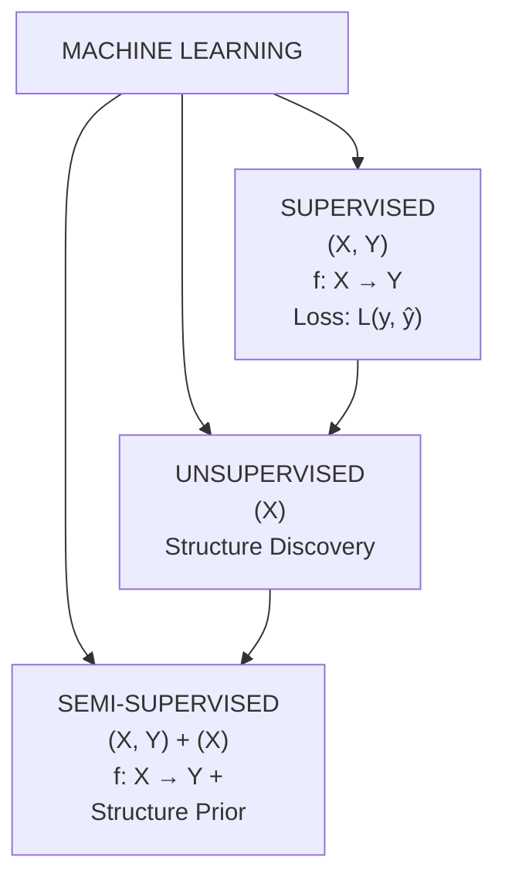
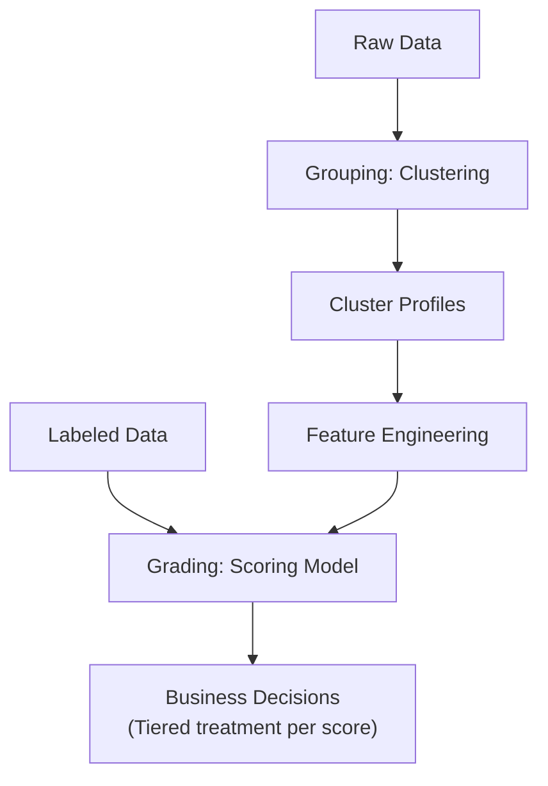

# SPPU AIDS BE SEM VII - Machine Learning In-Sem Exam Answers (AUG 2025)

> **Course**: Machine Learning | **Semester**: VII | **Branch**: AIDS
> **Exam**: In-Semester Examination | **Date**: August 2025
> **Total Marks**: 50

---

## Question 1

### Q1(a) Describe Machine Learning and highlight its key differences from traditional programming methods. (5 Marks)

**Machine Learning (ML)** is a subset of artificial intelligence that enables systems to automatically learn and improve from experience without being explicitly programmed. It focuses on developing algorithms that can access data, learn patterns from it, and make predictions or decisions based on those patterns.

**Formal Definition (Tom Mitchell, 1997)**:
> A computer program is said to learn from experience $E$ with respect to some class of tasks $T$ and performance measure $P$, if its performance at tasks in $T$, as measured by $P$, improves with experience $E$.

---

#### Key Differences from Traditional Programming

| Aspect | Traditional Programming | Machine Learning |
|--------|------------------------|------------------|
| **Core Paradigm** | Explicit instructions (rules) written by humans | Data-driven: system learns rules from data |
| **Input** | Rules + Data → Answers | Data + Answers → Rules (Model) |
| **Knowledge Source** | Human expert knowledge encoded as logic | Patterns extracted automatically from data |
| **Adaptability** | Static; requires manual updates for changes | Dynamic; adapts to new data via retraining |
| **Scalability** | Limited by human ability to codify rules | Scales with data volume and compute |
| **Handling Complexity** | Difficult for complex, non-linear problems | Excels at high-dimensional, non-linear patterns |
| **Maintenance** | Rule updates require domain experts | Model retraining often automated |
| **Example** | Spam filter with hardcoded keywords | Spam filter learning from labeled emails |

---

#### Traditional Programming Flow
```
Rules (Hardcoded Logic) + Input Data → Program → Output
```

#### Machine Learning Flow
```
Training Data (Input + Labels) → Learning Algorithm → Model → Predictions on New Data
```

---

#### Types of Machine Learning
1. **Supervised Learning** - Learning with labeled data (Classification, Regression)
2. **Unsupervised Learning** - Learning patterns from unlabeled data (Clustering, Dimensionality Reduction)
3. **Semi-Supervised Learning** - Combination of labeled and unlabeled data
4. **Reinforcement Learning** - Learning via interaction with environment (Rewards/Penalties)

---

### Q1(b) Explain the main difference between Linear Discriminant Analysis (LDA) and Principal Component Analysis (PCA) in reducing dimensions. (6 Marks)

Both **LDA** and **PCA** are linear dimensionality reduction techniques, but they differ fundamentally in their objectives, assumptions, and applications.

---

#### Principal Component Analysis (PCA)

**Objective**: Find orthogonal directions (principal components) that **maximize variance** in the data.

- **Unsupervised** method - does not use class labels
- Projects data onto directions of maximum spread
- Preserves **global structure** and **maximum information (variance)**
- Components are **orthogonal** ($w_i^T w_j = 0$ for $i \neq j$)

**Mathematical Formulation**:
Given data matrix $X \in \mathbb{R}^{n \times d}$ (centered), find projection matrix $W \in \mathbb{R}^{d \times k}$ that maximizes:
$$J_{PCA}(W) = \text{Tr}(W^T S_T W) = \sum_{i=1}^k w_i^T S_T w_i$$
where $S_T = \frac{1}{n} X^T X$ is the **total scatter matrix** (covariance matrix).

**Solution**: Eigenvectors of $S_T$ corresponding to the $k$ largest eigenvalues.

---

#### Linear Discriminant Analysis (LDA)

**Objective**: Find directions that **maximize class separability** (between-class variance / within-class variance).

- **Supervised** method - uses class labels
- Projects data to maximize **Fisher's criterion**
- Preserves **discriminatory information** for classification
- Maximum $C-1$ components for $C$ classes

**Mathematical Formulation**:
Find projection matrix $W$ that maximizes:
$$J_{LDA}(W) = \frac{|W^T S_B W|}{|W^T S_W W|}$$
where:
- **Between-class scatter**: $S_B = \sum_{c=1}^C n_c (\mu_c - \mu)(\mu_c - \mu)^T$
- **Within-class scatter**: $S_W = \sum_{c=1}^C \sum_{x \in \mathcal{C}_c} (x - \mu_c)(x - \mu_c)^T$
- $\mu_c$ = mean of class $c$, $\mu$ = global mean, $n_c$ = samples in class $c$

**Solution**: Generalized eigenvalue problem $S_B w = \lambda S_W w$ → eigenvectors of $S_W^{-1} S_B$

---

#### Key Differences Summary

| Criterion | PCA | LDA |
|-----------|-----|-----|
| **Supervision** | Unsupervised | Supervised |
| **Objective** | Maximize total variance | Maximize class separability |
| **Uses Labels** | No | Yes |
| **Max Components** | $\min(n, d)$ | $C - 1$ (C = number of classes) |
| **Optimality** | Optimal for reconstruction | Optimal for classification |
| **Assumptions** | Gaussian data, linear correlations | Gaussian classes, equal covariances |
| **Component Orthogonality** | Yes | Not necessarily (in original space) |
| **Use Case** | Visualization, compression, denoising | Classification preprocessing |
| **Sensitivity** | Sensitive to outliers | Sensitive to class imbalance |

---

#### When to Use Which?

> **Use PCA when**: No labels available, need visualization/compression, or as preprocessing for unsupervised tasks.
>
> **Use LDA when**: Labels available, goal is classification, classes are well-separated, and $n > d$ (or regularized LDA).

---

#### Geometric Intuition

```
PCA Direction:        LDA Direction:
                     
  ● ● ● ● ●            Class 1: ● ● ●
 ● ● ● ● ● ●           Class 2:     ● ● ●
  ● ● ● ● ●            
   ↑ Max Variance      ← Max Separation →
```

---

### Q1(c) Write a note on Reinforcement Learning. (4 Marks)

**Reinforcement Learning (RL)** is a type of machine learning where an **agent** learns to make decisions by interacting with an **environment** to maximize cumulative **reward**.

---

#### Core Components

| Component          | Symbol              | Description                                |
| ------------------ | ------------------- | ------------------------------------------ |
| **Agent**          | -                   | The learner/decision maker                 |
| **Environment**    | -                   | The world the agent interacts with         |
| **State**          | $s \in \mathcal{S}$ | Current situation of the environment       |
| **Action**         | $a \in \mathcal{A}$ | Decision made by the agent                 |
| **Reward**         | $r \in \mathbb{R}$  | Scalar feedback signal                     |
| **Policy**         | $\pi(a, s)$         | Strategy mapping states to actions         |
| **Value Function** | $V^\pi(s)$          | Expected return from state $s$ under $\pi$ |
| **Q-Function**     | $Q^\pi(s,a)$        | Expected return from $(s,a)$ under $\pi$   |

---

#### The RL Loop (Markov Decision Process)

```
          Action a_t
    Agent ─────────► Environment
     ▲                │
     │                ▼
     │            State s_{t+1}
     │            Reward r_{t+1}
     └────────────────┘
          Observation
```

At each timestep $t$:
1. Agent observes state $s_t$
2. Agent selects action $a_t \sim \pi(a|s_t)$
3. Environment transitions to $s_{t+1} \sim P(s'|s_t, a_t)$
4. Environment emits reward $r_{t+1} = R(s_t, a_t, s_{t+1})$
5. Agent updates policy/value function

---

#### Objective

Maximize **expected cumulative discounted reward** (Return):
$$G_t = \sum_{k=0}^{\infty} \gamma^k r_{t+k+1}$$
where $\gamma \in [0,1]$ is the **discount factor**.

---

#### Key Approaches

| Category         | Method          | Description                                                |
| ---------------- | --------------- | ---------------------------------------------------------- |
| **Value-Based**  | Q-Learning, DQN | Learn $Q(s,a)$, derive policy $\pi(s) = \arg\max_a Q(s,a)$ |
| **Policy-Based** | REINFORCE, PPO  | Directly optimize policy $\pi_\theta(a,s)$                 |
| **Actor-Critic** | A2C, A3C, SAC   | Combine value + policy (critic evaluates actor)            |
| **Model-Based**  | Dyna, MuZero    | Learn environment model for planning                       |

---

#### Exploration vs Exploitation

- **Exploitation**: Choose best-known action (greedy)
- **Exploration**: Try suboptimal actions to discover better rewards
- **Strategies**: $\epsilon$-greedy, UCB, Thompson Sampling, Entropy Regularization

---

#### Applications
- **Game Playing**: AlphaGo, AlphaZero, OpenAI Five
- **Robotics**: Locomotion, manipulation, autonomous driving
- **Recommendation Systems**: News feed, ad placement
- **Finance**: Algorithmic trading, portfolio optimization
- **Healthcare**: Treatment planning, drug discovery

---

#### Challenges
- Sample inefficiency (requires many interactions)
- Credit assignment problem (delayed rewards)
- Non-stationarity (policy changes during training)
- Safety and ethical concerns in real-world deployment

---

## Question 2

### Q2(a) What is a logical model in the context of Machine Learning? (5 Marks)

A **Logical Model** in Machine Learning is a model that represents learned knowledge using **logical expressions**, **rules**, or **decision structures** that are human-interpretable and based on formal logic (propositional or first-order).

---

#### Characteristics

| Property | Description |
|----------|-------------|
| **Representation** | If-then rules, decision trees, logical formulas |
| **Interpretability** | High - humans can read and verify logic |
| **Expressiveness** | Can represent discrete, symbolic knowledge |
| **Reasoning** | Supports deductive inference |
| **Learning** | Inductive Logic Programming (ILP), rule induction |

---

#### Forms of Logical Models

1. **Propositional Logic Models**
   - Rules over boolean attributes
   - Example: `IF (Outlook=Sunny) AND (Humidity=High) THEN Play=No`

2. **First-Order Logic (Relational) Models**
   - Rules with variables, quantifiers, relations
   - Example: `Parent(x,y) ∧ Male(x) → Father(x,y)`

3. **Decision Trees** (as logical models)
   - Each path root→leaf = conjunction of tests = a rule
   - Disjunction of paths = complete model

4. **Rule Sets / Rule Lists**
   - Ordered (decision lists) or unordered sets of rules
   - Example: RIPPER, CN2, OneR algorithms

---

#### Learning Logical Models: Inductive Logic Programming (ILP)

**Given**:
- Background knowledge $B$ (facts + rules)
- Positive examples $E^+$
- Negative examples $E^-$

**Find**: Hypothesis $H$ (set of rules) such that:
- $B \land H \models E^+$ (completeness - covers all positives)
- $B \land H \not\models E^-$ (consistency - covers no negatives)

---

#### Example: Learning "Grandparent" Relation

**Background Knowledge**:
```prolog
parent(john, mary).
parent(mary, ann).
parent(tom, mary).
female(mary). female(ann).
male(john). male(tom).
```

**Positive Examples**: `grandparent(john, ann).`, `grandparent(tom, ann).`

**Learned Hypothesis**:
```prolog
grandparent(X, Z) :- parent(X, Y), parent(Y, Z).
```

---

#### Advantages
- **Interpretable**: Domain experts can validate
- **Prior Knowledge Integration**: Easy to incorporate domain rules
- **Relational Data**: Naturally handles multi-table/relational data
- **Small Data**: Can learn from few examples with strong bias

#### Limitations
- **Scalability**: Combinatorial search space
- **Noise Sensitivity**: Hard to handle noisy/contradictory data
- **Continuous Features**: Requires discretization
- **Expressiveness vs Tractability**: Trade-off in logic complexity

---

### Q2(b) What distinguishes unsupervised learning from supervised and semi-supervised learning techniques? (6 Marks)

---

#### Supervised Learning

**Definition**: Learning a mapping $f: \mathcal{X} \to \mathcal{Y}$ from **labeled** training data $\mathcal{D} = \{(x_i, y_i)\}_{i=1}^n$ where $x_i \in \mathcal{X}$ (features) and $y_i \in \mathcal{Y}$ (labels/targets).

**Key Characteristics**:
- **Input**: Feature vectors + Ground truth labels
- **Objective**: Minimize loss $\mathcal{L}(y, \hat{y})$ on predictions
- **Feedback**: Direct (error signal per example)
- **Tasks**: Classification ($\mathcal{Y}$ discrete), Regression ($\mathcal{Y}$ continuous)

**Examples**: Linear Regression, Logistic Regression, SVM, Neural Networks, Random Forest

---

#### Unsupervised Learning

**Definition**: Learning patterns/structure from **unlabeled** data $\mathcal{D} = \{x_i\}_{i=1}^n$ without any target labels.

**Key Characteristics**:
- **Input**: Only feature vectors (no labels)
- **Objective**: Discover hidden structure (clusters, manifolds, density, factors)
- **Feedback**: Indirect (internal structure of data)
- **No "Correct" Answer**: Evaluation often subjective or proxy metrics

**Main Categories**:

| Task | Goal | Examples |
|------|------|----------|
| **Clustering** | Group similar instances | K-Means, DBSCAN, Hierarchical, GMM |
| **Dimensionality Reduction** | Compress while preserving info | PCA, t-SNE, UMAP, Autoencoders |
| **Density Estimation** | Model $p(x)$ | KDE, Normalizing Flows, VAE |
| **Anomaly Detection** | Find outliers | Isolation Forest, One-Class SVM |
| **Association Rules** | Find frequent patterns | Apriori, FP-Growth |
| **Representation Learning** | Learn useful embeddings | Word2Vec, BERT (self-supervised) |

---

#### Semi-Supervised Learning

**Definition**: Learning from **partially labeled** data: small labeled set $\mathcal{D}_L = \{(x_i, y_i)\}_{i=1}^l$ and large unlabeled set $\mathcal{D}_U = \{x_j\}_{j=1}^u$ where $l \ll u$.

**Key Characteristics**:
- **Motivation**: Labels expensive/scarce; unlabeled data abundant
- **Assumption**: Unlabeled data informs about $p(x)$, which helps learn $p(y|x)$
- **Key Assumptions**:
  1. **Continuity/Cluster Assumption**: Points in same cluster share label
  2. **Manifold Assumption**: Data lies on low-dim manifold; nearby points similar labels
  3. **Low-Density Separation**: Decision boundary in low-density regions

**Approaches**:
- **Self-Training**: Train on labeled → predict pseudo-labels on unlabeled → retrain
- **Co-Training**: Multiple views; each classifier labels data for the other
- **Consistency Regularization**: Enforce similar predictions for perturbed inputs (FixMatch, Mean Teacher)
- **Generative Models**: VAE/GAN with labeled + unlabeled (e.g., CatGAN)
- **Graph-Based**: Label propagation on similarity graphs

---

#### Comparison Summary

| Dimension | Supervised | Unsupervised | Semi-Supervised |
|-----------|------------|--------------|-----------------|
| **Label Availability** | Full labels | No labels | Partial labels |
| **Data Requirement** | Large labeled datasets | Unlabeled data only | Small labeled + large unlabeled |
| **Objective** | Predict $y$ from $x$ | Discover structure in $x$ | Predict $y$ using $x$ + structure of $x$ |
| **Feedback Signal** | Direct (per-example loss) | Indirect (internal structure) | Mixed (labeled loss + unlabeled regularization) |
| **Evaluation** | Accuracy, F1, MSE on test labels | Silhouette, NMI, Reconstruction error | Supervised metrics on held-out labels |
| **Typical Use Case** | Classification, Regression | Clustering, Viz, Preprocessing | When labeling is expensive (medical, NLP) |
| **Complexity** | Well-defined optimization | Ill-posed, multiple solutions | More complex (combines both paradigms) |

---

#### Venn Diagram Representation



---

### Q2(c) Explain Grouping and Grading models in Machine Learning with an example. (4 Marks)

**Grouping** and **Grading** are two fundamental types of **unsupervised** and **supervised** modeling tasks respectively, often used in customer analytics, risk assessment, and segmentation.

---

#### Grouping Models (Clustering / Segmentation)

**Definition**: Unsupervised models that partition data into **groups (clusters)** such that instances within a group are more similar to each other than to those in other groups.

**Key Properties**:
- No predefined labels
- Discover natural groupings
- Similarity based on feature distance/density
- Output: Cluster assignments $c_i \in \{1, \dots, K\}$

**Common Algorithms**:
- **K-Means**: Centroid-based, minimizes within-cluster SSE
- **Hierarchical**: Agglomerative/Divisive, dendrogram
- **DBSCAN**: Density-based, finds arbitrary shapes
- **GMM**: Probabilistic, soft assignments

**Example**: **Customer Segmentation for E-commerce**

```python
# Features: [Avg_Order_Value, Purchase_Frequency, Recency, Category_Diversity]
# K-Means with K=4 discovers:
Cluster 0: "Whales"       - High value, high frequency, recent
Cluster 1: "Regulars"     - Medium value, medium frequency
Cluster 2: "At-Risk"      - Low recency, declining frequency
Cluster 3: "New/One-time" - Low frequency, low diversity, recent
```

**Business Actions per Group**:
- Whales → VIP program, early access
- Regulars → Loyalty rewards, cross-sell
- At-Risk → Win-back campaigns, discounts
- New → Onboarding, welcome series

---

#### Grading Models (Scoring / Ranking / Rating)

**Definition**: Supervised models that assign a **continuous score**, **rank**, or **ordinal grade** to instances, typically representing **risk**, **quality**, **propensity**, or **value**.

**Key Properties**:
- Requires labeled data (target = score/grade)
- Output: Continuous $\hat{y} \in \mathbb{R}$ or Ordinal $\hat{y} \in \{1,2,3,4,5\}$
- Often calibrated to probabilities
- Enables **ranking** and **threshold-based decisions**

**Common Algorithms**:
- **Regression**: Linear, Ridge, Lasso, Gradient Boosting (XGBoost, LightGBM)
- **Ordinal Regression**: Proportional odds model, Ordinal Logistic
- **Learning to Rank**: RankNet, LambdaMART, ListNet
- **Calibration**: Platt Scaling, Isotonic Regression

**Example**: **Credit Risk Scoring (Grading Model)**

```python
# Features: [Income, Debt_Ratio, Credit_History_Length, 
#            Num_Delinquencies, Employment_Years, Loan_Amount]
# Target: Probability of Default (PD) ∈ [0, 1]

# Model: XGBoost Regression → outputs PD score
# Grading: Map PD to Risk Grades
Grade A: PD < 0.02    → "Excellent"  → Approve, best rates
Grade B: 0.02-0.05    → "Good"       → Approve, standard rates
Grade C: 0.05-0.15    → "Fair"       → Approve with conditions
Grade D: 0.15-0.30    → "Poor"       → High rates, collateral
Grade E: PD > 0.30    → "High Risk"  → Decline or secured only
```

**Usage**:
- **Ranking**: Sort applicants by score → approve top $K$
- **Thresholding**: Auto-approve if score > 0.7
- **Pricing**: Interest rate = $f(\text{score})$
- **Monitoring**: Population stability index (PSI) on score distribution

---

#### Comparison: Grouping vs Grading

| Aspect | Grouping (Clustering) | Grading (Scoring) |
|--------|----------------------|-------------------|
| **Supervision** | Unsupervised | Supervised |
| **Output** | Discrete cluster ID | Continuous score / Ordinal grade |
| **Labels Needed** | None | Yes (historical outcomes) |
| **Interpretability** | Post-hoc (cluster profiles) | Direct (feature importance, SHAP) |
| **Primary Use** | Discovery, Segmentation | Decision-making, Ranking, Pricing |
| **Evaluation** | Internal (Silhouette), External (if labels exist) | AUC, KS, Gini, Calibration, MSE |
| **Example** | Customer Personas | Credit Score, Lead Score, Churn Risk |

---

#### Combined Workflow (Common in Practice)



---

## Question 3

### Q3(a) Elaborate Decision Tree Regression and Random Forest Regression. (6 Marks)

---

#### Decision Tree Regression

**Decision Tree Regression** adapts classification trees to predict **continuous target values** by learning piecewise constant approximations.

---

##### How It Works

1. **Recursive Partitioning**: Split feature space into axis-aligned rectangles $R_1, R_2, \dots, R_M$
2. **Splitting Criterion**: Minimize **impurity** (variance reduction / MSE)
3. **Prediction**: For region $R_m$, predict $\hat{y} = \frac{1}{|R_m|} \sum_{x_i \in R_m} y_i$ (mean of targets in leaf)

---

##### Splitting Criterion: Variance Reduction (MSE)

For a node with $N$ samples, split into left ($N_L$) and right ($N_R$) children:

$$\text{MSE}_{\text{node}} = \frac{1}{N} \sum_{i \in \text{node}} (y_i - \bar{y}_{\text{node}})^2$$

$$\text{Reduction} = \text{MSE}_{\text{parent}} - \left( \frac{N_L}{N} \text{MSE}_L + \frac{N_R}{N} \text{MSE}_R \right)$$

**Choose split** $(j, t)$ maximizing reduction:
$$\max_{j, t} \left[ \text{MSE}_{\text{parent}} - \frac{N_L}{N}\text{MSE}_L - \frac{N_R}{N}\text{MSE}_R \right]$$

---

##### Algorithm (CART for Regression)

```bash
BUILD_TREE(X, y, depth=0):
    if stopping_criteria_met:  # max_depth, min_samples_split, min_samples_leaf, max_leaf_nodes
        return LeafNode(value=mean(y))
    
    best_split = None
    best_gain = -∞
    
    for each feature j:
        for each threshold t in unique_values(X[:, j]):
            left_idx = X[:, j] <= t
            right_idx = X[:, j] > t
            gain = variance_reduction(y, left_idx, right_idx)
            if gain > best_gain:
                best_gain = gain
                best_split = (j, t)
    
    if best_gain < min_impurity_decrease:
        return LeafNode(value=mean(y))
    
    left_tree = BUILD_TREE(X[left_idx], y[left_idx], depth+1)
    right_tree = BUILD_TREE(X[right_idx], y[right_idx], depth+1)
    
    return DecisionNode(feature=j, threshold=t, left=left_tree, right=right_tree)
```

---

##### Prediction

For input $x$, traverse tree to leaf $R_m$, return $\hat{y} = \bar{y}_{R_m}$

---

##### Hyperparameters

| Parameter | Purpose | Typical Values |
|-----------|---------|----------------|
| `max_depth` | Limit tree depth (prevent overfit) | 3-10, None |
| `min_samples_split` | Min samples to split node | 2, 5, 10, 20 |
| `min_samples_leaf` | Min samples in leaf | 1, 2, 5, 10 |
| `min_impurity_decrease` | Min MSE reduction to split | 0.0, 1e-7 |
| `max_features` | Features to consider per split | `sqrt`, `log2`, `None` (all) |
| `max_leaf_nodes` | Limit total leaves | None, 10-50 |

---

##### Pros & Cons

| Pros | Cons |
|------|------|
| Interpretable (white-box) | High variance (unstable) |
| Handles non-linear relationships | Overfits easily (deep trees) |
| No feature scaling needed | Piecewise constant (not smooth) |
| Handles mixed data types | Biased toward high-cardinality features |
| Fast training & prediction | Extrapolation impossible (flat outside range) |

---

#### Random Forest Regression

**Random Forest** is an **ensemble** of decision trees using **bagging** (bootstrap aggregating) + **feature randomness** to reduce variance.

---

##### Core Idea

$$\hat{f}_{RF}(x) = \frac{1}{B} \sum_{b=1}^B T_b(x)$$

where $T_b$ are decorrelated trees trained on bootstrap samples.

---

##### Algorithm

```bash
RANDOM_FOREST_REGRESSION(X, y, B, max_features):
    trees = []
    for b in 1..B:
        # 1. Bootstrap sample (with replacement)
        idx = random_sample_with_replacement(n_samples=n)
        X_boot, y_boot = X[idx], y[idx]
        
        # 2. Train tree with feature subsampling
        tree = BUILD_TREE_RF(X_boot, y_boot, max_features)
        trees.append(tree)
    
    return trees

BUILD_TREE_RF(X, y, max_features):
    # Same as decision tree but:
    # At each split, randomly select max_features features
    # Choose best split only among those
    ...
```

---

##### Key Mechanisms

| Mechanism | Purpose | Effect |
|-----------|---------|--------|
| **Bootstrapping** (Bagging) | Each tree sees different data sample | Reduces variance, enables OOB estimate |
| **Feature Subsampling** (`max_features`) | Decorrelate trees | Further reduces variance |
| **Averaging** | Combine predictions | Variance reduction: $\text{Var}(\bar{X}) = \frac{\rho \sigma^2}{B} + \frac{1-\rho}{B}\sigma^2$ |

---

##### Out-of-Bag (OOB) Evaluation

- Each tree uses ~63.2% of data (bootstrap)
- Remaining ~36.8% = **OOB samples** for that tree
- **OOB Prediction**: Average predictions from trees where sample was OOB
- **OOB Score**: $R^2$ or MSE on OOB predictions → **unbiased validation without CV**

---

##### Hyperparameters (Additional to Decision Tree)

| Parameter | Description | Typical |
|-----------|-------------|---------|
| `n_estimators` (B) | Number of trees | 100-1000 |
| `max_features` | Features per split | `n_features/3` (regression), `sqrt` (classification) |
| `bootstrap` | Use bootstrap samples | True |
| `oob_score` | Compute OOB $R^2$ | True/False |
| `n_jobs` | Parallel jobs | -1 (all cores) |

---

##### Feature Importance

**Mean Decrease in Impurity (MDI)**:
$$\text{Importance}(j) = \frac{1}{B} \sum_{b=1}^B \sum_{t \in T_b: v(t)=j} \frac{N_t}{N} \Delta \text{MSE}_t$$

**Permutation Importance** (more reliable):
- Shuffle feature $j$ in OOB data
- Measure increase in OOB error
- Higher increase = more important

---

##### Comparison: Decision Tree vs Random Forest Regression

| Aspect | Decision Tree | Random Forest |
|--------|---------------|---------------|
| **Model Type** | Single tree | Ensemble of trees |
| **Variance** | High | Low (averaging + decorrelation) |
| **Bias** | Low (deep trees) | Slightly higher (shallower effective depth) |
| **Overfitting** | Prone | Resistant |
| **Interpretability** | High (visualizable) | Low (feature importance only) |
| **Training Speed** | Fast | Slower (parallelizable) |
| **Prediction Speed** | Very fast | Slower (B trees) |
| **Hyperparameters** | Few | More (but robust defaults) |
| **Extrapolation** | Impossible | Impossible |

---

### Q3(b) Differentiate between multivariate regression and univariate regression. (4 Marks)

---

#### Univariate Regression

**Definition**: Regression with **one dependent variable (target)** and **one or more independent variables (features)**.

**Model**: $y = f(x) + \epsilon$, where $y \in \mathbb{R}$ (scalar)

**Notation**:
- $X \in \mathbb{R}^{n \times p}$: Feature matrix ($n$ samples, $p$ features)
- $y \in \mathbb{R}^n$: Target vector
- $\beta \in \mathbb{R}^p$: Coefficients

**Linear Univariate Regression**:
$$y = X\beta + \epsilon, \quad \epsilon \sim \mathcal{N}(0, \sigma^2 I)$$

**Objective (OLS)**:
$$\hat{\beta} = \arg\min_\beta \|y - X\beta\|_2^2 = (X^T X)^{-1} X^T y$$

**Examples**:
- House price prediction (price from area, rooms, location)
- Sales forecasting (revenue from ad spend, seasonality)
- Temperature prediction (from humidity, pressure, wind)

---

#### Multivariate Regression

**Definition**: Regression with **multiple dependent variables (targets)** simultaneously, sharing the same feature set.

**Model**: $Y = X B + E$, where $Y \in \mathbb{R}^{n \times q}$ ($q$ targets)

**Notation**:
- $Y = [y_1, y_2, \dots, y_q]$: Target matrix ($q$ response variables)
- $B = [\beta_1, \beta_2, \dots, \beta_q] \in \mathbb{R}^{p \times q}$: Coefficient matrix
- $E \in \mathbb{R}^{n \times q}$: Error matrix, $\text{vec}(E) \sim \mathcal{N}(0, \Sigma \otimes I_n)$

**Objective (Multivariate OLS)**:
$$\hat{B} = \arg\min_B \|Y - X B\|_F^2 = (X^T X)^{-1} X^T Y$$

**Equivalent**: Solving $q$ separate univariate regressions **if errors are uncorrelated** ($\Sigma$ diagonal).

**Key Difference**: When $\Sigma$ has off-diagonals (correlated errors), **joint estimation** borrows strength across targets.

---

#### Comparison

| Aspect | Univariate Regression | Multivariate Regression |
|--------|----------------------|------------------------|
| **Targets ($q$)** | 1 (scalar $y$) | $q \geq 2$ (vector/matrix $Y$) |
| **Coefficients** | Vector $\beta \in \mathbb{R}^p$ | Matrix $B \in \mathbb{R}^{p \times q}$ |
| **Error Structure** | Scalar $\sigma^2$ | Covariance $\Sigma \in \mathbb{R}^{q \times q}$ |
| **Estimation** | $(X^T X)^{-1} X^T y$ | $(X^T X)^{-1} X^T Y$ |
| **Correlated Targets** | Ignored (separate models) | Explicitly modeled via $\Sigma$ |
| **Efficiency** | Less efficient if targets correlated | More efficient (borrows strength) |
| **Interpretation** | One model per target | Joint model, shared features |
| **Use Case** | Single outcome prediction | Multiple related outcomes |

---

#### When Multivariate Helps

1. **Correlated Targets**: Predicting $(y_1, y_2)$ where $\text{Corr}(y_1, y_2) \neq 0$
   - Example: **Sales of complementary products** (printers + ink)
   - Example: **Multi-output time series** (temperature at multiple locations)

2. **Shared Feature Effects**: Same features affect all targets similarly
   - Regularization: **Multi-task Lasso** ($\ell_{2,1}$ norm on $B$ rows)

3. **Missing Targets**: Some targets missing for some samples
   - Joint model can impute via correlations

---

#### Mathematical Insight

**Univariate (separate)**:
$$\hat{\beta}_j = (X^T X)^{-1} X^T y_j \quad \forall j=1..q$$

**Multivariate (joint)**:
$$\hat{B} = (X^T X)^{-1} X^T Y$$

**If $X^T X$ invertible and no regularization**: Solutions are **identical** column-wise.

**Difference appears with**:
- Regularization (Group Lasso, Multi-task Lasso)
- Bayesian priors on $B$ (matrix normal)
- Missing data in $Y$
- Structured covariance $\Sigma$ estimation

---

#### Example: Multivariate Regression

**Problem**: Predict **3D coordinates** $(x, y, z)$ of robot arm end-effector from **joint angles** $(\theta_1, \dots, \theta_6)$.

- $X \in \mathbb{R}^{n \times 6}$ (joint angles)
- $Y \in \mathbb{R}^{n \times 3}$ (x, y, z positions)
- Errors in x,y,z are **correlated** (mechanical coupling)
- Multivariate regression captures $\Sigma_{xyz}$ → better predictions

---

### Q3(c) Explain bias-variance trade-off with neat diagram. (5 Marks)

---

#### The Bias-Variance Decomposition

For a regression problem with true function $f(x)$ and estimator $\hat{f}(x)$ trained on dataset $\mathcal{D}$:

$$\mathbb{E}_{\mathcal{D}}[(y - \hat{f}(x))^2] = \underbrace{(\mathbb{E}_{\mathcal{D}}[\hat{f}(x)] - f(x))^2}_{\text{Bias}^2} + \underbrace{\mathbb{E}_{\mathcal{D}}[(\hat{f}(x) - \mathbb{E}_{\mathcal{D}}[\hat{f}(x)])^2]}_{\text{Variance}} + \underbrace{\sigma^2}_{\text{Irreducible Error}}$$

---

#### Definitions

| Component | Formula | Meaning |
|-----------|---------|---------|
| **Bias** | $\text{Bias}(\hat{f}) = \mathbb{E}[\hat{f}(x)] - f(x)$ | Systematic error; how far average prediction is from truth |
| **Variance** | $\text{Var}(\hat{f}) = \mathbb{E}[(\hat{f}(x) - \mathbb{E}[\hat{f}(x)])^2]$ | Sensitivity to training data; how much predictions vary across datasets |
| **Irreducible Error** | $\sigma^2 = \text{Var}(\epsilon)$ | Noise in data; fundamental limit |

---

#### Bias-Variance Trade-off

- **Simple Models** (High Bias, Low Variance): Underfit → Miss patterns
- **Complex Models** (Low Bias, High Variance): Overfit → Capture noise
- **Optimal Complexity**: Balances both → Minimum total error

---

#### Diagram: Bias-Variance Trade-off

<image src="https://imgs.search.brave.com/cD1uJ8E4wbXuffbS5Ep6Urd0YPiWceupS-RPEzpOrLk/rs:fit:860:0:0:0/g:ce/aHR0cHM6Ly93d3cu/dHV0b3JpYWxzcG9p/bnQuY29tL21hY2hp/bmVfbGVhcm5pbmcv/aW1hZ2VzL2JpYXNf/dmFyaWFuY2VfdHJh/ZGVvZmYuanBn"></image>

---

#### Concrete Example: Polynomial Regression

| Degree | Bias | Variance | Behavior |
|--------|------|----------|----------|
| 1 (Linear) | High | Low | **Underfit** - misses curvature |
| 3 (Cubic) | Medium | Medium | **Good fit** - captures pattern |
| 15 (High) | Very Low | Very High | **Overfit** - fits noise |

---

#### Managing the Trade-off

| Technique | Effect on Bias | Effect on Variance |
|-----------|----------------|-------------------|
| **More Data** | ↔ | ↓ (reduces variance) |
| **Feature Engineering** | ↓ | ↔/↑ |
| **Regularization** (L1/L2) | ↑ | ↓ |
| **Ensemble (Bagging)** | ↔ | ↓ |
| **Ensemble (Boosting)** | ↓ | ↑ (controlled) |
| **Model Simplification** | ↑ | ↓ |
| **Cross-Validation** | Selects optimal | Selects optimal |

---

#### Key Insight

> **There is no free lunch**: Reducing bias typically increases variance and vice versa. The art of ML is finding the **sweet spot** where **Total Error = Bias² + Variance + Noise** is minimized.

---

## Question 4

### Q4(a) Which one of these is Underfit or Overfit? Why? Comment with respect to Bias and Variance. (6 Marks)

> **Note**: Since the question references "these" (likely referring to diagrams/figures in the original exam paper), I provide the **general framework** for identifying and commenting on underfitting vs overfitting with respect to bias and variance.

---

#### Identifying Underfit vs Overfit

| Scenario | Training Error | Test/Validation Error | Gap | Diagnosis |
|----------|----------------|----------------------|-----|-----------|
| **Underfit** | High | High | Small | Model too simple |
| **Overfit** | Low | High | Large | Model too complex |
| **Good Fit** | Low | Low | Small | Balanced complexity |
| **High Noise** | High | High | Small | Irreducible error dominant |

---

#### Underfitting (High Bias, Low Variance)

**Definition**: Model fails to capture underlying pattern in training data.

**Characteristics**:
- **Training Error**: High
- **Test Error**: High (≈ Training Error)
- **Bias**: **High** - systematic deviation from true function
- **Variance**: **Low** - predictions stable across datasets
- **Model**: Too simple (e.g., linear for non-linear data, shallow tree, high regularization)

**Why?**
- Insufficient model capacity
- Too few features / wrong features
- Excessive regularization ($\lambda$ too large)
- Insufficient training (early stopping too early)

**Bias-Variance View**:
$$\text{Error}_{\text{train}} \approx \text{Error}_{\text{test}} \approx \text{Bias}^2 + \sigma^2$$
Variance term negligible; error dominated by Bias².

---

#### Overfitting (Low Bias, High Variance)

**Definition**: Model captures noise/spurious patterns in training data that don't generalize.

**Characteristics**:
- **Training Error**: Very Low (near zero)
- **Test Error**: High
- **Gap (Train - Test)**: Large
- **Bias**: **Low** - flexible enough to fit training data perfectly
- **Variance**: **High** - predictions vary wildly with different training sets
- **Model**: Too complex (e.g., deep tree, high-degree polynomial, no regularization)

**Why?**
- Excessive model capacity (too many parameters)
- Too little training data relative to complexity
- Insufficient regularization
- Training too long (epochs without early stopping)
- Data leakage (features from future/target)

**Bias-Variance View**:
$$\text{Error}_{\text{train}} \approx \sigma^2 \quad \text{(near zero bias on training)}$$
$$\text{Error}_{\text{test}} \approx \text{Bias}^2 + \text{Variance} + \sigma^2 \approx \text{Variance} + \sigma^2$$
Test error dominated by Variance.

---

#### Learning Curves Diagnosis

```
ERROR
  │
  │  UNDERFITTING                    OVERFITTING
  │  ┌──────────────┐                ┌──────────────┐
  │  │  Train  ─────┤                │  Train  ╱    │
  │  │  Test   ─────┤                │  Test  ╱╲    │
  │  │              │                │        ╲     │
  │  │  High bias   │                │  High variance│
  │  │  Low variance│                │  Low bias     │
  │  └──────────────┘                └──────────────┘
  │       │                                │
  │       ▼                                ▼
  │  More data: NO HELP              More data: HELPS
  │  Need: Complex model             Need: Regularization
  │          More features                   Less features
  │          Less regularization             More data
  │
  └──────────────────────────────────────────────────► TRAINING SET SIZE
```

---

#### Decision Framework

```
Given: Training Error (E_train), Validation Error (E_val)

if E_train HIGH and E_val HIGH:
    → UNDERFIT (High Bias)
    → Action: Increase model complexity, add features, reduce regularization
    
elif E_train LOW and E_val HIGH:
    → OVERFIT (High Variance)  
    → Action: More data, regularization, simplify model, feature selection, dropout
    
elif E_train LOW and E_val LOW:
    → GOOD FIT
    → Action: Deploy, monitor
    
else:  # E_train HIGH, E_val LOW (rare)
    → Data issue (leakage, different distributions)
    → Action: Check data splits, preprocessing
```

---

#### Practical Example: Polynomial Degree

| Degree | Train MSE | Val MSE | Bias² | Variance | Diagnosis |
|--------|-----------|---------|-------|----------|-----------|
| 1 | 0.45 | 0.47 | High | Low | **Underfit** |
| 3 | 0.12 | 0.14 | Medium | Medium | **Good** |
| 10 | 0.001 | 0.85 | Very Low | Very High | **Overfit** |

---

### Q4(b) Explain any two evaluation metrics in regression model. (4 Marks)

---

#### 1. Mean Squared Error (MSE)

**Definition**: Average squared difference between predicted and actual values.

$$\text{MSE} = \frac{1}{n} \sum_{i=1}^n (y_i - \hat{y}_i)^2$$

**Root Mean Squared Error (RMSE)**:
$$\text{RMSE} = \sqrt{\text{MSE}} = \sqrt{\frac{1}{n} \sum_{i=1}^n (y_i - \hat{y}_i)^2}$$

---

##### Properties

| Property              | Description                                                      |
| --------------------- | ---------------------------------------------------------------- |
| **Scale**             | Same units as target (RMSE) or squared units (MSE)               |
| **Sensitivity**       | **Heavily penalizes large errors** (quadratic)                   |
| **Differentiability** | Smooth, differentiable everywhere → good for optimization        |
| **Optimal Predictor** | Minimizing MSE → predicts **conditional mean** $\mathbb{E}[Y/X]$ |
| **Range**             | $[0, \infty)$, lower is better                                   |

---

##### When to Use
- General-purpose regression metric
- When large errors are **particularly undesirable** (safety-critical, financial risk)
- As **loss function** for training (OLS, neural networks)
- When target distribution is **Gaussian**

---

##### Limitations
- Sensitive to outliers (single large error dominates)
- Scale-dependent (hard to compare across datasets)
- Squared units (MSE) less interpretable

---

#### 2. Mean Absolute Error (MAE)

**Definition**: Average absolute difference between predicted and actual values.

$$\text{MAE} = \frac{1}{n} \sum_{i=1}^n |y_i - \hat{y}_i|$$

---

##### Properties

| Property              | Description                                                           |
| --------------------- | --------------------------------------------------------------------- |
| **Scale**             | Same units as target (interpretable)                                  |
| **Sensitivity**       | **Linear penalty** - treats all errors proportionally                 |
| **Robustness**        | **Robust to outliers** (less influenced by extreme values)            |
| **Optimal Predictor** | Minimizing MAE → predicts **conditional median** $\text{Median}[Y/X]$ |
| **Differentiability** | Not differentiable at 0 (subgradient used)                            |
| **Range**             | $[0, \infty)$, lower is better                                        |

---

##### When to Use
- When outliers are **noise/errors** (not signal)
- When **interpretability** matters (e.g., "average error is $500")
- When target distribution is **Laplace/heavy-tailed**
- Business contexts where all errors equally costly

---

##### Comparison: MSE vs MAE

| Aspect | MSE / RMSE | MAE |
|--------|------------|-----|
| **Error Penalty** | Quadratic (large errors hurt more) | Linear (proportional) |
| **Outlier Sensitivity** | High | Low |
| **Optimal Estimate** | Mean | Median |
| **Differentiability** | Yes (everywhere) | No (at 0) |
| **Interpretability** | RMSE in target units | Direct in target units |
| **Optimization** | Native for gradient descent | Requires Huber/smooth approx |

---

#### Example Calculation

| Actual ($y$) | Predicted ($\hat{y}$) | Error | Squared Error | Abs Error |
|--------------|----------------------|-------|---------------|-----------|
| 10 | 12 | -2 | 4 | 2 |
| 20 | 18 | 2 | 4 | 2 |
| 30 | 35 | -5 | 25 | 5 |
| 40 | 38 | 2 | 4 | 2 |
| 50 | 100 | -50 | 2500 | 50 |

**MSE** = $(4+4+25+4+2500)/5 = \mathbf{507.4}$
**RMSE** = $\sqrt{507.4} = \mathbf{22.5}$
**MAE** = $(2+2+5+2+50)/5 = \mathbf{12.2}$

> **Note**: The outlier (50→100) dominates MSE but MAE reflects typical error better.

---

#### Other Notable Metrics (Bonus)

| Metric                                | Formula                                                                                                   | Use Case                                     |
| ------------------------------------- | --------------------------------------------------------------------------------------------------------- | -------------------------------------------- |
| **R² (Coefficient of Determination)** | $1 - \frac{\sum(y-\hat{y})^2}{\sum(y-\bar{y})^2}$                                                         | Proportion of variance explained; scale-free |
| **Adjusted R²**                       | $1 - \frac{(1-R^2)(n-1)}{n-p-1}$                                                                          | Penalizes unnecessary features               |
| **MAPE**                              | $\frac{100\%}{n}\sum\frac{y-\hat{y}}{y}$                                                                  | Percentage error; scale-free                 |
| **SMAPE**                             | $\frac{100\%}{n}\sum\frac{y-\hat{y}}{(y+\hat{y})/2}$                                                      | Symmetric, handles near-zero actuals         |
| **Huber Loss**                        | $\begin{cases} \frac{1}{2}e^2 &e\leq \delta \\ \delta(e-\frac{\delta}{2}) & \text{otherwise} \end{cases}$ | Robust + differentiable                      |

---

### Q4(c) List and explain any two different types of Regression. (5 Marks)

---

#### 1. Linear Regression (Ordinary Least Squares)

**Definition**: Models linear relationship between features and continuous target using linear combination of inputs.

**Model**:
$$\hat{y} = \beta_0 + \beta_1 x_1 + \beta_2 x_2 + \dots + \beta_p x_p = \beta_0 + X\beta$$

**Matrix Form**:
$$\hat{y} = X\beta \quad \text{where } X \in \mathbb{R}^{n \times (p+1)} \text{ (with bias column)}$$

**Estimation (OLS)**:
$$\hat{\beta} = \arg\min_\beta \|y - X\beta\|_2^2 = (X^T X)^{-1} X^T y$$

---

##### Assumptions (Gauss-Markov)

| Assumption               | Description                             | Violation Consequence                |
| ------------------------ | --------------------------------------- | ------------------------------------ |
| **Linearity**            | $E[y/X] = X\beta$                       | Bias, poor fit                       |
| **Independence**         | Errors uncorrelated                     | Invalid SE, wrong inference          |
| **Homoscedasticity**     | Constant error variance $\sigma^2$      | Inefficient, wrong SE                |
| **Normality**            | $\epsilon \sim \mathcal{N}(0,\sigma^2)$ | Invalid small-sample inference       |
| **No Multicollinearity** | $X^T X$ invertible                      | Unstable coefficients, high variance |

---

##### Regularized Variants

| Variant | Penalty | Effect |
|---------|---------|--------|
| **Ridge (L2)** | $\lambda \|\beta\|_2^2$ | Shrinks coefficients, handles multicollinearity |
| **Lasso (L1)** | $\lambda \|\beta\|_1$ | **Feature selection** (sparse solutions) |
| **Elastic Net** | $\lambda_1 \|\beta\|_1 + \lambda_2 \|\beta\|_2^2$ | Combines both; groups correlated features |

---

##### Pros & Cons

| Pros | Cons |
|------|------|
| Highly interpretable (coefficients = marginal effects) | Assumes linear relationships |
| Fast training & prediction | Sensitive to outliers |
| Probabilistic framework (confidence intervals) | Poor with high-dimensional $p \gg n$ |
| Works well when assumptions hold | Cannot capture interactions without feature engineering |
| Baseline for comparison | Extrapolation unreliable |

---

#### 2. Polynomial Regression

**Definition**: Extends linear regression by adding **polynomial terms** to model **non-linear relationships** while staying linear in parameters.

**Model (Univariate)**:
$$\hat{y} = \beta_0 + \beta_1 x + \beta_2 x^2 + \dots + \beta_d x^d = \sum_{j=0}^d \beta_j x^j$$

**Multivariate (Degree 2 Example)**:
$$\hat{y} = \beta_0 + \sum_i \beta_i x_i + \sum_i \beta_{ii} x_i^2 + \sum_{i<j} \beta_{ij} x_i x_j$$

**Matrix Form**: Same as linear regression with **transformed features** $\phi(x) = [1, x, x^2, \dots, x^d]$

$$\hat{y} = \Phi \beta, \quad \Phi_{ij} = x_i^j$$

---

##### Key Properties

| Aspect | Description |
|--------|-------------|
| **Linearity in Parameters** | Still linear in $\beta$ → OLS applies directly |
| **Flexibility** | Degree $d$ controls complexity |
| **Basis Functions** | Polynomials = one choice; can use splines, radial basis, Fourier |
| **Overfitting Risk** | High degree → wild oscillations (Runge's phenomenon) |

---

##### Regularization Essential

**Always use regularization** (Ridge/Lasso) with polynomial regression:
- High-degree polynomials → extreme coefficient magnitudes
- Ridge stabilizes: $\hat{\beta} = (\Phi^T \Phi + \lambda I)^{-1} \Phi^T y$

---

##### Comparison: Linear vs Polynomial Regression

| Aspect | Linear Regression | Polynomial Regression |
|--------|------------------|----------------------|
| **Relationship** | Linear only | Non-linear (curved) |
| **Features** | Original $x$ | Transformed $\phi(x) = [x, x^2, \dots]$ |
| **Parameters** | $p+1$ | $p \times d$ (grows with degree) |
| **Interpretability** | High (direct coefficients) | Lower (coefficients on transformed features) |
| **Extrapolation** | Linear trend continues | **Dangerous** (explodes) |
| **Overfitting** | Low (if $p < n$) | High (needs regularization) |
| **Best For** | Approximately linear trends | Smooth curves, known non-linearities |

---

##### Practical Recommendations

1. **Start with Linear** → Check residuals for patterns
2. **If Curved Pattern**: Try degree 2 or 3 with **Ridge regularization**
3. **Cross-Validate Degree**: Use CV to select optimal $d$
4. **Consider Alternatives**: Splines (piecewise polynomials), GAMs, Tree-based models for complex non-linearities
5. **Center Features**: $x \leftarrow x - \bar{x}$ before polynomial expansion → reduces multicollinearity

---

#### Summary: Two Regression Types

| Type | Equation | Key Idea | Best For |
|------|----------|----------|----------|
| **Linear Regression** | $y = X\beta + \epsilon$ | Linear in original features | Linear relationships, interpretability, baseline |
| **Polynomial Regression** | $y = \Phi(x)\beta + \epsilon$ | Linear in polynomial features | Smooth non-linear curves, low-dimensional non-linearity |

---

---

## Formula Sheet (Quick Reference)

### Bias-Variance Decomposition
$$\mathbb{E}[(y-\hat{f})^2] = \text{Bias}^2 + \text{Variance} + \sigma^2$$
$$\text{Bias} = \mathbb{E}[\hat{f}] - f, \quad \text{Variance} = \mathbb{E}[(\hat{f} - \mathbb{E}[\hat{f}])^2]$$

### PCA
$$\max_W \text{Tr}(W^T S_T W), \quad S_T = \frac{1}{n}X^T X$$
Solution: Eigenvectors of $S_T$

### LDA
$$\max_W \frac{|W^T S_B W|}{|W^T S_W W|}$$
$$S_B = \sum_c n_c (\mu_c - \mu)(\mu_c - \mu)^T, \quad S_W = \sum_c \sum_{x \in C_c} (x-\mu_c)(x-\mu_c)^T$$

### Regression Metrics
$$\text{MSE} = \frac{1}{n}\sum(y_i-\hat{y}_i)^2, \quad \text{RMSE} = \sqrt{\text{MSE}}$$
$$\text{MAE} = \frac{1}{n}\sum|y_i-\hat{y}_i|, \quad R^2 = 1 - \frac{\sum(y-\hat{y})^2}{\sum(y-\bar{y})^2}$$

### Linear Regression (OLS)
$$\hat{\beta} = (X^T X)^{-1} X^T y$$

### Ridge Regression
$$\hat{\beta}_{\text{ridge}} = (X^T X + \lambda I)^{-1} X^T y$$

### Random Forest Prediction
$$\hat{f}_{RF}(x) = \frac{1}{B}\sum_{b=1}^B T_b(x)$$

---

## Tags
#SPPU #AIDS #SEM7 #MachineLearning #InSem #ExamAnswers #BiasVarianceTradeoff #PCA #LDA #DecisionTree #RandomForest #Regression #ReinforcementLearning #LogicalModels #UnsupervisedLearning #SemiSupervisedLearning