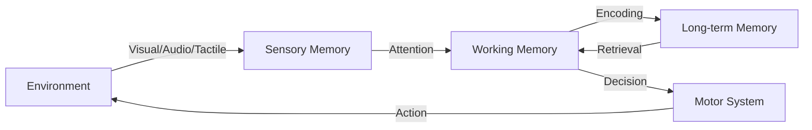
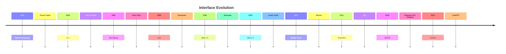
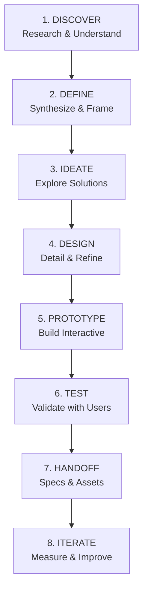

# SPPU AIDS BE SEM VII - UI/UX Design (Unit 1) In-Sem Exam Answers

> **Course**: UI/UX Design | **Unit**: 1 | **Branch**: AIDS
> **Exam**: In-Semester Examination
> **Total Marks**: 100 (approx)

---

## Question 1
### Explain human input–output (I/P–O/P) channels with examples. How do they influence user interface design? [6]

#### Human Input-Output Channels

Humans interact with systems through **sensory input channels** (receiving information) and **motor output channels** (acting on the system).

---

#### Input Channels (Sensory)

| Channel | Description | UI Application | Example |
|---------|-------------|----------------|---------|
| **Vision** | Primary channel (~80% of info) | Visual hierarchy, color, typography, icons | Reading text, recognizing icons, seeing alerts |
| **Hearing** | Secondary channel | Audio feedback, alerts, voice commands | Notification sounds, screen readers, voice assistants |
| **Touch** | Tactile/haptic feedback | Touch targets, vibration, gestures | Button press feedback, swipe gestures, haptic alerts |
| **Smell/Taste** | Rarely used | Specialized applications | VR training, food apps (experimental) |

---

#### Output Channels (Motor)

| Channel | Description | UI Application | Example |
|---------|-------------|----------------|---------|
| **Hand/Finger** | Primary manipulation | Mouse, touchscreen, keyboard | Clicking, tapping, typing, dragging |
| **Voice** | Speech input | Voice commands, dictation | Siri, Google Assistant, voice search |
| **Eye Gaze** | Emerging | Eye tracking, accessibility | Gaze-based selection, foveated rendering |
| **Body/Gesture** | Motion capture | VR/AR, gaming, kiosks | Swipe in air, body tracking |

---

#### Influence on UI Design

**Vision → Design Decisions:**
- **Visual hierarchy**: Size, color, contrast guide attention
- **Reading patterns**: F-pattern, Z-pattern for content layout
- **Color blindness**: Use patterns + color (not color alone)
- **Peripheral vision**: Place critical alerts centrally

**Hearing → Design Decisions:**
- **Audio feedback** for invisible actions (email sent, error)
- **Screen reader support**: Semantic HTML, ARIA labels
- **Non-speech audio**: Earcons for navigation

**Touch → Design Decisions:**
- **Target size**: Minimum 44×44pt (Apple), 48×48dp (Material)
- **Gesture discoverability**: Visual hints for swipe/pull-to-refresh
- **Haptic feedback**: Confirmation for critical actions

**Motor Limitations → Design Decisions:**
- **Fitts's Law**: Larger, closer targets = faster selection
- **Thumb zone**: Bottom navigation for one-handed mobile use
- **Accessibility**: Voice control, switch control, large text

---

#### Diagram: Human Information Processing Model


---

## Question 2
### Describe the role of human memory, thinking, emotion, and individual differences (diversity) in UI design. [6]

---

#### Human Memory in UI Design

| Memory Type | Capacity/Duration | UI Implications |
|-------------|-------------------|-----------------|
| **Sensory Memory** | < 1 sec (iconic/echoic) | Immediate feedback, smooth animations (60fps) |
| **Working Memory** | 7±2 items, ~20 sec | Limit choices (Miller's Law), chunk information, breadcrumbs |
| **Long-term Memory** | Unlimited, permanent | Consistent patterns, mental models, learnability |

**Design Principles:**
- **Recognition over recall**: Show options (menus) vs. command line
- **Chunking**: Group related items (navigation categories)
- **Consistency**: Same action = same result (builds LTM schemas)

---

#### Human Thinking (Cognition)

| Cognitive Aspect | UI Application |
|------------------|----------------|
| **Mental Models** | Match system model to user's expectation (desktop metaphor) |
| **Attention** | Minimize distractions, progressive disclosure |
| **Problem Solving** | Clear error messages with recovery steps |
| **Decision Making** | Hick's Law: More choices = longer decision time |
| **Learning** | Onboarding, tooltips, progressive complexity |

---

#### Emotion in UI Design

| Level (Norman) | Description | UI Example |
|----------------|-------------|------------|
| **Visceral** | Immediate, aesthetic | Beautiful landing page, smooth animations |
| **Behavioral** | Usability, function | Intuitive flow, responsive feedback |
| **Reflective** | Meaning, memory | Brand loyalty, sense of accomplishment |

**Emotional Design Principles:**
- **Delight**: Micro-interactions (like button, pull-to-refresh)
- **Trust**: Security badges, clear privacy policy
- **Reduce anxiety**: Progress indicators, undo options
- **Empathy**: Empty states with guidance, not just "No data"

---

#### Individual Differences (Diversity)

| Dimension | Design Consideration |
|-----------|---------------------|
| **Age** | Larger text, higher contrast, simpler flows for elderly |
| **Ability** | WCAG 2.1 AA: screen readers, keyboard nav, captions |
| **Culture** | RTL layouts, color meanings, date/number formats |
| **Language** | Localization, simple language, icon + text |
| **Tech Literacy** | Progressive onboarding, expert shortcuts |
| **Context** | Mobile vs desktop, bright sunlight, one-handed |

---

#### Inclusive Design Checklist
- [ ] Semantic HTML for screen readers
- [ ] Color contrast ≥ 4.5:1 (AA)
- [ ] Keyboard navigation (tab order, focus states)
- [ ] Scalable text (rem/em units)
- [ ] Alternative text for images
- [ ] Motion reduction option
- [ ] Error identification + suggestions

---

## Question 3
### Discuss the relationship between UI and UX with suitable examples. [6]

---

#### UI vs UX: Definitions

| Aspect | **UI (User Interface)** | **UX (User Experience)** |
|--------|-------------------------|--------------------------|
| **Focus** | Visual presentation, interaction surface | Entire journey, problem-solving, feelings |
| **Scope** | Screens, buttons, typography, color | Research, strategy, IA, usability, accessibility |
| **Question** | "How does it look/feel?" | "Does it solve the problem? Is it delightful?" |
| **Output** | Mockups, style guides, prototypes | User flows, personas, journey maps, test reports |

---

#### Relationship: UI ⊂ UX

```
┌─────────────────────────────────────────────────────────┐
│                    USER EXPERIENCE (UX)                 │
│  ┌─────────────────────────────────────────────────┐   │
│  │              USER INTERFACE (UI)                │   │
│  │  • Visual Design    • Interaction Design       │   │
│  │  • Typography       • Color & Spacing          │   │
│  │  • Icons            • Responsive Layout        │   │
│  └─────────────────────────────────────────────────┘   │
│  ┌─────────┐ ┌──────────┐ ┌───────────┐ ┌──────────┐  │
│  │Research │ │Strategy  │ │Content    │ │Testing   │  │
│  └─────────┘ └──────────┘ └───────────┘ └──────────┘  │
└─────────────────────────────────────────────────────────┘
```

---

#### Analogy: Restaurant
- **UX**: Entire dining experience (reservation, greeting, food quality, service, payment, memory)
- **UI**: Menu design, plate presentation, cutlery, lighting, table layout

---

#### Examples

**Example 1: Google Search**
- **UX**: Fast results, relevant ranking, autocomplete, voice search, instant answers
- **UI**: Minimalist homepage, centered logo, clean results list, clear snippets

**Example 2: Duolingo**
- **UX**: Gamified learning, streak motivation, adaptive difficulty, daily reminders
- **UI**: Bright colors, mascot (Duo), progress rings, bite-sized lesson cards

**Example 3: Bad UI, Good UX (Rare)**
- Craigslist: Ugly UI but excellent UX for classifieds (fast, functional, no fluff)

**Example 4: Good UI, Bad UX**
- Beautiful dashboard with confusing navigation, slow load, no export → Frustration

---

#### Key Insight
> **"UI is the saddle, the stirrups, and the reins. UX is the feeling of being able to ride the horse."** — Dain Miller

---

## Question 4
### Trace the historical evolution of interface design. How have interfaces changed over decades? [6]

---

#### Historical Evolution Timeline

| Era | Period | Paradigm | Key Characteristics | Example |
|-----|--------|----------|---------------------|---------|
| **1. Batch Processing** | 1940s-1960s | **No Interface** | Punch cards, printed output, no interaction | IBM 704 |
| **2. Command Line (CLI)** | 1960s-1980s | **Text-based** | Typed commands, memorization, expert users | Unix, MS-DOS, CP/M |
| **3. Text-based Menus** | 1970s-1980s | **Menu-driven** | Hierarchical menus, function keys | Lotus 1-2-3, WordPerfect |
| **4. GUI (WIMP)** | 1980s-2000s | **Desktop Metaphor** | Windows, Icons, Menus, Pointer (WIMP) | Macintosh 1984, Windows 95 |
| **5. Web 1.0** | 1990s-2000s | **Document-centric** | Static pages, links, forms | Netscape, early Yahoo |
| **6. Web 2.0 / RIAs** | 2000s-2010s | **Interactive** | AJAX, Flash, drag-drop, real-time | Gmail, Google Maps, Facebook |
| **7. Mobile Touch** | 2007-present | **Direct Manipulation** | Multi-touch, gestures, apps | iPhone, Android |
| **8. Post-WIMP / NUI** | 2010s-present | **Natural** | Voice, gesture, AR/VR, AI | Siri, Alexa, HoloLens, Vision Pro |
| **9. AI-First / Conversational** | 2020s-present | **Intent-based** | LLMs, agents, generative UI | ChatGPT, Copilot, Cursor |

---

#### Key Transitions



---

#### How Interfaces Changed

| Dimension | Then (CLI) | Now (AI/Multimodal) |
|-----------|------------|---------------------|
| **Cognitive Load** | High (memorize syntax) | Low (natural language) |
| **Discoverability** | None (man pages) | High (visual, conversational) |
| **Feedback** | Text only | Rich (visual, haptic, audio) |
| **Accessibility** | Poor | Core requirement |
| **Personalization** | None | Adaptive, contextual |
| **Error Handling** | Cryptic codes | Conversational recovery |

---

## Question 5
### Explain interface conventions. Why are they important in modern UI design? [6]

---

#### Interface Conventions

**Definition**: Established, widely-adopted patterns for layout, interaction, and visual design that users recognize instinctively.

---

#### Common Convention Categories

| Category | Conventions | Example |
|----------|-------------|---------|
| **Layout** | Logo top-left, nav top/side, search top-right, footer bottom | Most websites |
| **Navigation** | Hamburger menu (mobile), breadcrumbs, tabs, pagination | E-commerce sites |
| **Interaction** | Click=select, double-click=open, right-click=context menu | Desktop OS |
| **Visual** | Blue=links, red=error/destructive, green=success | Forms, buttons |
| **Feedback** | Loading spinners, toast notifications, skeleton screens | Modern web apps |
| **Icons** | Magnifier=search, trash=delete, gear=settings, hamburger=menu | Universal |
| **Gestures** | Swipe=delete/archive, pull=refresh, pinch=zoom | Mobile apps |

---

#### Platform-Specific Conventions

| Platform | Key Conventions |
|----------|-----------------|
| **iOS (HIG)** | Bottom tab bar, swipe back, native back gesture, SF Symbols |
| **Android (Material)** | Top app bar, navigation drawer, FAB, Material icons |
| **Web** | Underlined links, hover states, browser back button |
| **Desktop** | Menu bar (macOS top, Windows per-window), keyboard shortcuts |

---

#### Why Conventions Matter

| Benefit | Explanation |
|---------|-------------|
| **Reduced Cognitive Load** | Users don't relearn basics (Jakob's Law) |
| **Faster Onboarding** | Familiar patterns = immediate productivity |
| **Trust & Credibility** | Professional, predictable feel |
| **Accessibility** | Screen readers expect standard patterns |
| **Development Efficiency** | Component libraries, design systems |
| **Cross-app Consistency** | Muscle memory transfers |

---

#### When to Break Conventions

> **Only when**: Significant UX improvement, tested with users, clear affordance provided

**Example**: Tinder's swipe (broke "click to select" convention) → Revolutionary for dating

---

## Question 6
### Describe various approaches to screen-based UI design. [6]

---

#### Screen-Based UI Design Approaches

| Approach | Description | Best For | Example |
|----------|-------------|----------|---------|
| **Responsive Design** | Fluid grids, flexible images, media queries | Web, multi-device | Bootstrap, CSS Grid |
| **Adaptive Design** | Fixed layouts for specific breakpoints | Complex web apps | Separate mobile/desktop sites |
| **Mobile-First** | Design for mobile, enhance up | Modern web, progressive enhancement | Google, Airbnb |
| **Desktop-First** | Design for desktop, gracefully degrade | Legacy, admin panels | Enterprise software |
| **Atomic Design** | Atoms→Molecules→Organisms→Templates→Pages | Design systems | Brad Frost methodology |
| **Component-Driven** | Reusable, isolated components | React, Vue, design systems | Storybook, Bit |
| **Content-First** | Content structure drives layout | Blogs, documentation | Medium, Notion |
| **Task-First** | User flows/tasks drive screens | Complex workflows | Jira, Figma |

---

#### Detailed Comparison

**Responsive vs Adaptive:**
```
Responsive: One codebase, fluid → CSS media queries
Adaptive: Multiple fixed layouts → Server/client detection
```

**Atomic Design Hierarchy:**
```
Atoms (buttons, inputs) 
  → Molecules (search box = input + button) 
    → Organisms (header = logo + nav + search) 
      → Templates (page layout) 
        → Pages (real content)
```

---

#### Modern Approach: Design Systems
- **Tokens**: Colors, spacing, typography (design decisions as data)
- **Components**: Documented, versioned, tested UI building blocks
- **Patterns**: Documented solutions for common problems
- **Governance**: Contribution model, versioning, adoption metrics

---

## Question 7
### Differentiate between template-based UI and content-based UI. [6]

---

#### Template-Based UI

**Definition**: Pre-defined layout structures where content is poured into fixed slots.

| Aspect | Description |
|--------|-------------|
| **Structure** | Fixed grid, zones, placeholders |
| **Flexibility** | Low (content fits template) |
| **Consistency** | High (enforced by template) |
| **Speed** | Fast production once templates exist |
| **CMS Friendly** | WordPress, Drupal, Sitecore |

**Examples:**
- Blog post template (hero, body, sidebar, footer)
- Dashboard templates (KPI cards, charts, tables)
- Email newsletter templates

---

#### Content-Based UI

**Definition**: Layout emerges from content structure and relationships; design serves content.

| Aspect | Description |
|--------|-------------|
| **Structure** | Fluid, content-driven |
| **Flexibility** | High (layout adapts to content) |
| **Consistency** | Through design system, not templates |
| **Speed** | Slower initial, faster iteration |
| **Modern Stack** | Headless CMS, component-driven |

**Examples:**
- Notion (blocks compose pages)
- Medium (adaptive article layout)
- Figma (canvas-based)

---

#### Comparison Table

| Criterion | Template-Based | Content-Based |
|-----------|----------------|---------------|
| **Primary Driver** | Layout/template | Content structure |
| **Flexibility** | Rigid | Fluid |
| **Scalability** | Easy (clone template) | Requires component system |
| **Design Control** | High (fixed) | Shared (system + content) |
| **Content Changes** | May break layout | Graceful adaptation |
| **Best For** | Marketing sites, blogs, dashboards | Product UIs, docs, knowledge bases |
| **CMS Fit** | Traditional (WordPress) | Headless (Contentful, Sanity) |

---

#### Hybrid Approach (Modern Best Practice)
- **Template shells** for page types (landing, article, dashboard)
- **Component slots** within templates for flexible content
- **Design tokens** ensure consistency across both

---

## Question 8
### Explain the formal elements and active elements of interface design. [6]

---

#### Formal Elements (Visual/Static)

| Element | Description | Purpose |
|---------|-------------|---------|
| **Point** | Single position | Location, focus |
| **Line** | Connection, direction | Division, flow, hierarchy |
| **Shape** | Enclosed area (geometric/organic) | Buttons, cards, icons |
| **Form** | 3D illusion (shadow, depth) | Elevation, layering |
| **Color** | Hue, saturation, value | Meaning, hierarchy, emotion |
| **Texture** | Surface quality | Tactile feel, realism |
| **Space** | Positive/negative, proximity | Grouping, breathing room |
| **Typography** | Typeface, size, weight, leading | Readability, hierarchy, brand |
| **Value** | Lightness/darkness | Contrast, depth |

---

#### Active Elements (Interactive/Dynamic)

| Element | Description | States |
|---------|-------------|--------|
| **Buttons** | Primary action trigger | Default, hover, active, disabled, loading |
| **Links** | Navigation | Visited, hover, focus, active |
| **Forms** | Data input | Empty, filled, error, success, disabled |
| **Navigation** | Menus, tabs, breadcrumbs | Current, hover, expanded |
| **Feedback** | Toasts, modals, tooltips | Enter, exit, dismiss |
| **Data Display** | Tables, charts, lists | Sort, filter, paginate, expand |
| **Media** | Images, video, audio | Play, pause, fullscreen |
| **Gestures** | Swipe, drag, pinch, long-press | Begin, update, end, cancel |

---

#### Element States Diagram
```mermaid
stateDiagram-v2
    [*] --> Default
    Default --> Hover : mouseenter
    Hover --> Default : mouseleave
    Default --> Focus : keyboard/tap
    Focus --> Default : blur
    Default --> Active : mousedown
    Active --> Default : mouseup
    Default --> Disabled : condition
    Disabled --> Default : condition
    Default --> Loading : async start
    Loading --> Default : async end
```

---

#### Mapping Formal → Active

| Formal Element | Creates Active Element |
|----------------|------------------------|
| Shape + Color + Space | Button |
| Line + Space | Divider, progress bar |
| Typography + Color | Link, label |
| Shape + Form (shadow) | Card, modal |
| Color + Motion | Loading spinner |

---

## Question 9
### Describe the UI design process in detail with examples. [6]

---

#### UI Design Process (Double Diamond Adapted)



---

#### Stage Details

| Stage | Activities | Deliverables | Example |
|-------|------------|--------------|---------|
| **1. Discover** | Stakeholder interviews, user research, competitive audit, analytics review | Research report, insights | "Users abandon cart at shipping step" |
| **2. Define** | Personas, user journeys, problem statements, success metrics | Personas, JTBD, KPIs | "Busy parents need 2-min reorder" |
| **3. Ideate** | Crazy 8s, sketching, wireframing, design studio | Low-fi wireframes, flows | 5 checkout flow variations |
| **4. Design** | High-fidelity mockups, design system, accessibility check | Figma files, style guide | Pixel-perfect screens |
| **5. Prototype** | Interactive prototype, micro-interactions | Clickable prototype | Figma/Principle prototype |
| **6. Test** | Usability testing (5 users), A/B testing, accessibility audit | Test report, iterations | "3/5 missed promo code field" |
| **7. Handoff** | Specs (Zeplin/Figma), assets, annotations, tokens | Dev-ready specs | iOS/Android specs, tokens |
| **8. Iterate** | Analytics monitoring, user feedback, backlog prioritization | Improved versions | Conversion +15% after fix |

---

#### Example: Redesigning Checkout Flow

**Discover**: Analytics show 68% drop at shipping; support tickets about address entry

**Define**: Persona "Maria, 34, working mom"; Goal: Reorder in <2 min; KPI: Checkout completion rate

**Ideate**: Sketch 5 flows: guest checkout, address autocomplete, save-for-later, express pay, progressive

**Design**: High-fidelity with design system; address autocomplete + Google Places; Apple Pay/Google Pay prominent

**Prototype**: Figma prototype with real transitions; test on mobile

**Test**: 5 users; 4/5 completed in <90 sec; 1 confused by "save address" toggle

**Handoff**: Figma dev mode; annotated states; iOS/Android spacing tokens

**Iterate**: Post-launch: completion 72% → 89%; address errors -60%

---

## Question 10
### Discuss the role of visual communication design in UI development. [5]

---

#### Visual Communication Design in UI

**Definition**: Using visual elements to convey information, guide behavior, and create emotional resonance—making the interface **understandable**, **usable**, and **delightful**.

---

#### Key Roles

| Role | Principles | UI Application |
|------|------------|----------------|
| **Hierarchy** | Size, color, contrast, spacing | Headlines > body; Primary > secondary buttons |
| **Organization** | Grid, alignment, proximity, whitespace | Card layouts, form groups, navigation |
| **Communication** | Icons, illustration, data viz | Status icons, onboarding illustrations, charts |
| **Branding** | Color palette, typography, voice | Consistent personality across touchpoints |
| **Accessibility** | Contrast, scale, color-independence | WCAG compliance, inclusive design |

---

#### Gestalt Principles in UI

| Principle | UI Example |
|-----------|------------|
| **Proximity** | Related fields grouped (name + email) |
| **Similarity** | Same style = same function (all primary buttons blue) |
| **Closure** | Progress circles, loading rings |
| **Continuity** | Stepper flow, breadcrumbs |
| **Figure/Ground** | Modal overlay, cards on background |
| **Symmetry** | Balanced layouts, centered CTAs |

---

#### Visual Design System Components

| Component | Purpose |
|-----------|---------|
| **Color System** | Primary, semantic (success/error), neutral, data viz |
| **Typography Scale** | Display, headline, title, body, caption, code |
| **Spacing Scale** | 4px base unit (4, 8, 12, 16, 24, 32, 48, 64) |
| **Icon System** | Consistent stroke, size, optical alignment |
| **Elevation/Shadow** | Layer depth (0-5 levels) |
| **Motion Tokens** | Duration, easing, choreography |

---

#### Impact on Development
- **Design tokens** → CSS variables / SwiftUI / Compose themes
- **Component library** → Single source of truth
- **Documentation** → Reduces design-dev gaps
- **Accessibility baked in** → Contrast, focus, semantics by default

---

## Question 11
### Explain the applications of UI design in modern digital systems. [5]

---

#### UI Design Applications Across Domains

| Domain | UI Applications | Key Considerations |
|--------|-----------------|-------------------|
| **Consumer Apps** | Social, shopping, entertainment, finance | Delight, retention, virality, trust |
| **Enterprise/SaaS** | Dashboards, CRMs, ERPs, analytics | Density, efficiency, customization, scalability |
| **Mobile Apps** | iOS/Android native, cross-platform | Platform conventions, offline, permissions |
| **Web Apps** | SPAs, PWAs, responsive | Performance, SEO, accessibility, browser support |
| **Embedded/IoT** | Smart home, wearables, automotive | Glanceability, voice, haptics, safety |
| **AR/VR/XR** | Spatial computing, 3D UI | Depth, comfort, locomotion, field of view |
| **Voice/Conversational** | VUI, chatbots, IVR | Turn-taking, context, error recovery |
| **Design Tools** | Figma, Sketch, Framer | Precision, collaboration, plugins |
| **Developer Tools** | IDEs, CLI, docs, CI/CD | Efficiency, keyboard-first, extensibility |
| **Public/Accessibility** | Kiosks, ATMs, gov portals | Inclusive, multilingual, robust |

---

#### Emerging Applications

| Trend | UI Implication |
|-------|----------------|
| **AI-Generated UI** | Dynamic layouts per user intent |
| **Ambient Computing** | Zero-UI, proactive suggestions |
| **Digital Twins** | 3D data visualization |
| **Metaverse/Shared Spaces** | Avatars, spatial audio, persistence |
| **Biometric Auth** | FaceID, TouchID, behavioral |

---

## Question 12
### Write short notes on any three design tools: Sketch, Wireframe, InVision, Axure, Figma, Flutter, Mockups. [6]

---

#### 1. Figma

**Category**: Cloud-based collaborative design & prototyping

| Feature | Details |
|---------|---------|
| **Platform** | Browser + desktop (Electron) |
| **Collaboration** | Real-time multiplayer, comments, branching |
| **Strengths** | Design systems, auto-layout, components, plugins, dev handoff |
| **Prototyping** | Advanced (smart animate, scroll, overlays) |
| **Pricing** | Free tier generous; paid for teams |
| **Best For** | Team collaboration, design systems, web-first |

**Ecosystem**: FigJam (whiteboarding), Dev Mode, Community templates

---

#### 2. Sketch

**Category**: Mac-only vector UI design tool

| Feature | Details |
|---------|---------|
| **Platform** | macOS only (native) |
| **Collaboration** | Sketch Cloud (limited real-time) |
| **Strengths** | Performance, symbols, plugins, lightweight |
| **Prototyping** | Basic (links, overlays) |
| **Pricing** | Per-seat license + yearly renewal |
| **Best For** | Mac-only teams, heavy plugin users, performance |

**Note**: Pioneered symbols, shared styles; losing ground to Figma

---

#### 3. Axure RP

**Category**: Advanced prototyping & specification tool

| Feature | Details |
|---------|---------|
| **Platform** | Windows, macOS |
| **Collaboration** | Axure Cloud, co-authoring (newer) |
| **Strengths** | Complex logic, conditions, variables, dynamic panels, adaptive views |
| **Prototyping** | Most advanced (if/else, math, repeaters) |
| **Pricing** | Perpetual license + maintenance; subscription option |
| **Best For** | Complex interactions, enterprise UX, documentation-heavy |

**Unique**: Generates HTML specs with logic for developers

---

#### Comparison Table

| Tool | Collaboration | Prototyping | Design Systems | Platform | Learning Curve |
|------|---------------|-------------|----------------|----------|----------------|
| **Figma** | ⭐⭐⭐⭐⭐ | ⭐⭐⭐⭐ | ⭐⭐⭐⭐⭐ | Web/Mac/Win | Low |
| **Sketch** | ⭐⭐ | ⭐⭐ | ⭐⭐⭐⭐ | Mac only | Low |
| **Axure** | ⭐⭐ | ⭐⭐⭐⭐⭐ | ⭐⭐ | Win/Mac | High |
| **InVision** | ⭐⭐⭐ | ⭐⭐⭐ | ⭐⭐ | Web | Low |
| **Flutter** | N/A (code) | ⭐⭐⭐⭐ (hot reload) | ⭐⭐⭐ | Cross-platform | Medium |
| **Mockups** | ⭐⭐ | ⭐ | ⭐ | Web/Win/Mac | Very Low |

---

## Question 13
### Case Study: Online Grocery App Redesign

**Problem**: Confusing navigation, slow decision-making

---

#### Analysis Using Human Factors

| Human Factor | Current Problem | Evidence |
|--------------|-----------------|----------|
| **Vision (Input)** | Cluttered categories, poor visual hierarchy | Users can't find "Organic" vs "Regular" |
| **Working Memory** | Too many categories visible at once (15+) | Exceeds 7±2 limit; decision paralysis |
| **Motor (Output)** | Small tap targets, deep nesting (4+ levels) | Fitts's Law violation; thumb strain |
| **Mental Model** | Navigation doesn't match shopping mental model | Users think by "Meal" not "Aisle" |
| **Emotion** | Frustration, anxiety about missing items | Negative reviews, cart abandonment |

---

#### Suggested Improvements

| Principle | Improvement | Expected Impact |
|-----------|-------------|-----------------|
| **Chunking** | Group into 5-7 top categories: "Fresh", "Pantry", "Frozen", "Household", "Personal" | Reduces cognitive load |
| **Recognition over Recall** | Visual category cards with icons + images | Faster scanning |
| **Progressive Disclosure** | Subcategories on tap, not all visible | Cleaner top level |
| **Thumb Zone** | Bottom nav: Home, Cart, Lists, Account | One-handed use |
| **Smart Defaults** | "Usually buy" carousel on home | Reduces decisions |
| **Search First** | Prominent search with autocomplete, filters | Bypass navigation |
| **Visual Feedback** | Added-to-cart animation, haptic | Confidence, delight |
| **Accessibility** | Voice search, large text mode, screen reader labels | Inclusive |

---

#### Redesigned IA (Information Architecture)
```
Home
├── For You (personalized)
├── Categories (5-7 cards)
│   ├── Fresh Produce
│   ├── Meat & Seafood
│   ├── Pantry Essentials
│   ├── Frozen
│   └── Household
├── Quick Reorder (history)
├── Lists (meal planning)
└── Cart (persistent bottom)
```

---

## Question 14
### Case Study: Banking Website Interface Overhaul

**Problem**: 10-year-old website, outdated, cluttered

---

#### Historical Context Applied

| Legacy Pattern (2014) | Modern Convention (2024) | Migration Strategy |
|----------------------|--------------------------|-------------------|
| Fixed 960px width | Fluid/responsive (320-1440px) | Mobile-first redesign |
| Dense tables, small text | Card-based, generous whitespace | Component library |
| Multi-level dropdown menus | Mega-menu / bottom nav (mobile) | IA simplification |
| Blue links everywhere | Semantic colors (primary, destructive) | Design tokens |
| Page reloads | SPA transitions, skeleton loading | React/Vue migration |
| Captcha | Invisible reCAPTCHA / honeypot | Remove friction |
| Separate mobile site (m.) | Single responsive codebase | Unified codebase |

---

#### Redesign Approach

**Phase 1: Research & Audit**
- Heuristic evaluation (Nielsen's 10)
- Analytics: Top 10 tasks, drop-off points
- Accessibility audit (WCAG 2.1 AA)
- Competitive benchmark (Chase, Monzo, Revolut)

**Phase 2: IA Simplification**
- Card sorting with customers
- Reduce 47 nav items → 8 primary
- Group by user intent: "Everyday", "Borrow", "Invest", "Help"

**Phase 3: Design System**
- Tokens: Colors (brand, semantic), spacing, type scale
- Components: Button, Card, Table, Form, Modal, Alert
- Patterns: Auth flow, Money movement, Settings

**Phase 4: Key Screens**
- **Dashboard**: Account cards, quick actions, insights
- **Transfer**: Single-page, smart recipients, review step
- **Statements**: Infinite scroll, filters, export
- **Help**: Chatbot + search + contextual help

**Phase 5: Validation**
- Prototype testing (8 users)
- A/B test new dashboard vs old
- Accessibility testing (NVDA, VoiceOver)
- Performance budget (<3s load)

---

#### Convention Checklist
- [ ] Logo top-left → Home
- [ ] Primary actions right-aligned
- [ ] Destructive actions red, confirmed
- [ ] Loading states for all async
- [ ] Keyboard navigation throughout
- [ ] Focus indicators visible
- [ ] Error messages inline + toast

---

## Question 15
### Case Study: Healthcare Kiosk Interface

**Problem**: Elderly users struggle with touch-screen kiosk

---

#### Analysis: Individual Differences & Psychology

| Factor | Elderly Challenge | Design Response |
|--------|-------------------|-----------------|
| **Vision** | Presbyopia, cataracts, contrast sensitivity | Large text (≥18pt), high contrast (7:1), scalable UI |
| **Motor** | Tremor, arthritis, reduced dexterity | Large targets (60×60px), generous spacing, no drag |
| **Cognition** | Working memory decline, slower processing | Single task per screen, clear progress, no jargon |
| **Emotion** | Anxiety, fear of mistakes, tech apprehension | Reassuring language, clear undo, staff call button |
| **Experience** | Low digital literacy | No gestures, explicit buttons, voice guidance option |

---

#### Thinking & Emotion Application

**System 1 (Fast, Intuitive) vs System 2 (Slow, Analytical)**
- Elderly rely more on System 2 → Reduce cognitive load
- **Design**: One decision per screen, plain language, visual cues

**Emotional Design (Norman):**
- **Visceral**: Warm colors, friendly imagery, large friendly text
- **Behavioral**: Error prevention (confirm before submit), clear progress
- **Reflective**: "You're done!" success screen, printed receipt

---

#### Redesign Recommendations

| Area | Current | Redesigned |
|------|---------|------------|
| **Home Screen** | 12 small buttons | 4 large cards: "Check In", "Appointments", "Bills", "Help" |
| **Flow** | 7 steps, branching | Linear 4-step: Verify → Confirm → Pay → Done |
| **Text** | 12px, medical terms | 20px, plain language ("Birth Date" not "DOB") |
| **Input** | On-screen keyboard | Numeric keypad for DOB/Phone; QR code scan |
| **Feedback** | Subtle toast | Large modal + haptic + optional voice |
| **Error** | Red text inline | Modal: "Let's fix this together" + big button |
| **Accessibility** | None | High contrast mode, text-to-speech, physical keypad option |

---

#### Physical Design Considerations
- **Screen height**: Adjustable or wheelchair accessible (max 120cm)
- **Glare**: Anti-reflective coating, hood
- **Hygiene**: Antimicrobial screen, stylus holder
- **Assistance**: Prominent "Call Staff" button (physical or on-screen)

---

## Question 16
### Case Study: Graphic Tool Comparison

**Scenario**: Startup choosing between Figma, Axure, Sketch for rapid prototyping

---

#### Tool Evaluation Matrix

| Criterion (Weight) | Figma | Axure | Sketch | Notes |
|--------------------|-------|-------|--------|-------|
| **Rapid Prototyping (30%)** | ⭐⭐⭐⭐⭐ | ⭐⭐⭐ | ⭐⭐⭐ | Figma: smart animate, instant preview |
| **Collaboration (25%)** | ⭐⭐⭐⭐⭐ | ⭐⭐ | ⭐⭐ | Figma: real-time multiplayer |
| **Learning Curve (15%)** | ⭐⭐⭐⭐ | ⭐⭐ | ⭐⭐⭐⭐ | Sketch simplest; Axure steep |
| **Design System (15%)** | ⭐⭐⭐⭐⭐ | ⭐⭐ | ⭐⭐⭐⭐ | Figma/Sketch: tokens, components |
| **Handoff (10%)** | ⭐⭐⭐⭐⭐ | ⭐⭐⭐ | ⭐⭐⭐ | Figma Dev Mode best |
| **Cost (5%)** | ⭐⭐⭐⭐ (free tier) | ⭐⭐ (expensive) | ⭐⭐⭐ (license) | Figma free for small teams |

**Weighted Scores**: Figma: 4.7 | Sketch: 3.7 | Axure: 2.8

---

#### Recommendation: **Figma**

**Rationale for Rapid Prototyping:**
1. **Zero setup**: Browser-based, no install, works on any OS
2. **Auto-layout**: Responsive components in seconds
3. **Components + Variants**: Build once, reuse with property controls
4. **Smart Animate**: Micro-interactions without code
5. **Real-time collaboration**: Designer + PM + dev simultaneously
6. **Community**: Templates, UI kits, plugins (FigJam for ideation)
7. **Dev Handoff**: Inspect, copy CSS/Swift/Compose, assets export
8. **Free tier**: Unlimited personal files, 3 team files

**When to consider others:**
- **Axure**: Complex logic (wizard with conditional branches, calculators)
- **Sketch**: Mac-only team, heavy plugin dependency, offline work

---

#### Rapid Prototyping Workflow in Figma
```
1. Wireframe (FigJam) → 2. Components (Library) → 3. Screens (Auto-layout)
                                                    ↓
6. Test (Prototype) ← 5. Interactions (Smart Animate) ← 4. Flows (Connections)
```

---

## Question 17
### Case Study: E-commerce Homepage Layout

**Question**: Template-driven vs Content-driven design?

---

#### Analysis

| Factor | Template-Driven | Content-Driven |
|--------|-----------------|----------------|
| **Consistency** | Guaranteed | Requires discipline |
| **Speed to Market** | Fast (clone template) | Slower initial |
| **Personalization** | Limited slots | Dynamic composition |
| **Content Variety** | Forces fit | Adapts naturally |
| **Seasonal Campaigns** | New template each time | Swap components |
| **A/B Testing** | Whole template swap | Component-level tests |

---

#### Recommendation: **Hybrid (Template Shell + Content Components)**

**For E-commerce Homepage Specifically:**

```
Template Shell (Fixed):
├── Header (logo, search, cart, account) → TEMPLATE
├── Hero Slot (1-2) → CONTENT-DRIVEN
├── Category Row → TEMPLATE STRUCTURE + CONTENT
├── Personalized Recommendations → CONTENT-DRIVEN (ML)
├── Promotional Bands → TEMPLATE SLOTS
├── Featured Brands → CONTENT-DRIVEN
└── Footer → TEMPLATE
```

**Why Hybrid Wins:**
- **Brand consistency**: Header, footer, nav always on-brand
- **Merchandising flexibility**: Marketing swaps hero/promos without dev
- **Personalization**: ML-driven sections adapt per user
- **Testing**: Test individual components (hero CTA, card layout)
- **Performance**: Template shells cache; content streams

---

#### Implementation with Modern Stack
- **Headless CMS** (Contentful/Sanity) for content blocks
- **Component Library** (React/Vue) for template + components
- **Page Builder** (visual) for marketing team composition
- **Feature Flags** for gradual rollouts

---

## Question 18
### Formula Sheet & Quick Reference

### Key Laws & Principles
- **Fitts's Law**: MT = a + b log₂(2D/W) → Bigger, closer targets
- **Hick's Law**: RT = a + b log₂(n) → Fewer choices = faster decisions
- **Miller's Law**: Working memory = 7±2 chunks
- **Jakob's Law**: Users prefer familiar patterns
- **Doherty Threshold**: <400ms response = addictive
- **Von Restorff Effect**: Isolated item remembered most
- **Serial Position Effect**: First/last items remembered best

### Accessibility (WCAG 2.1 AA)
- Contrast: 4.5:1 (text), 3:1 (large text/UI)
- Focus: Visible, logical order
- Text: Resizable to 200% without loss
- Motion: Respect prefers-reduced-motion

### Touch Targets
- iOS: 44×44pt minimum
- Material: 48×48dp minimum
- Spacing: 8dp between targets

---

## Tags
#SPPU #AIDS #SEM7 #UIUX #Unit1 #HumanFactors #UIDesignProcess #DesignTools #CaseStudies #InSem
