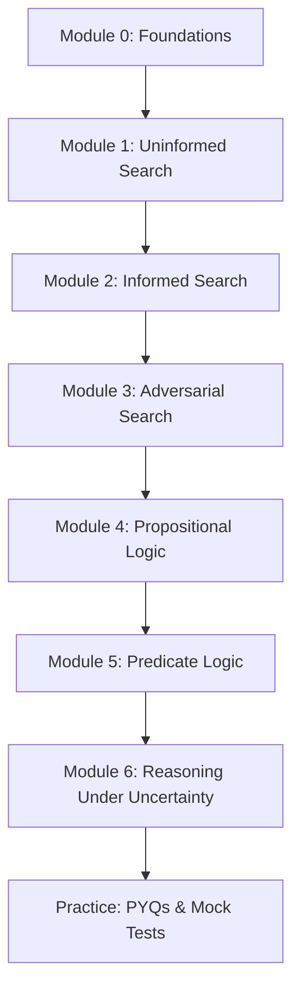

---
tags:
  - AI
  - GATE-DA
  - Artificial-Intelligence
  - Theory
  - Search
  - Logic
  - Probabilistic-Reasoning
aliases:
  - AI Theory
  - GATE DA AI Notes
  - Artificial Intelligence Theory
---

# 🤖 Artificial Intelligence — Complete Theory for GATE DA

> **Goal:** Master the complete GATE DA AI syllabus — Search (Informed, Uninformed, Adversarial), Logic (Propositional, Predicate), and Reasoning Under Uncertainty (Bayesian Networks, Variable Elimination, Sampling).
>
> **Syllabus Coverage:** Section 7 of GATE DA 2025/2026
>
> **Time Investment:** 2–3 weeks (1.5–2 hrs/day) for thorough mastery

---

## 🗂️ MODULE 0: AI FOUNDATIONS & MENTAL MODELS

### What is AI? (GATE Perspective)

| Aspect | GATE DA View |
|--------|--------------|
| **Agent** | Entity that perceives (sensors) and acts (actuators) |
| **Environment** | Fully/partially observable, deterministic/stochastic, episodic/sequential, static/dynamic, discrete/continuous, single/multi-agent |
| **Rationality** | Maximize expected utility given percept history |
| **PEAS** | Performance, Environment, Actuators, Sensors |

### Problem Formulation

```
┌─────────────────────────────────────────────────────────────────┐
│                  SEARCH PROBLEM DEFINITION                      │
├─────────────────────────────────────────────────────────────────┤
│  1. Initial State      — Where we start                         │
│  2. Actions(s)         — Possible moves from state s            │
│  3. Transition Model   — Result(s, a) = s'                      │
│  4. Goal Test          — Is state a goal?                       │
│  5. Path Cost          — Sum of step costs c(s, a, s')          │
│  6. Solution           — Sequence of actions to goal            │
│  7. Optimal Solution   — Minimum path cost                      │
└─────────────────────────────────────────────────────────────────┘
```

### Search Strategy Evaluation Criteria

| Criterion | Question |
|-----------|----------|
| **Completeness** | Guaranteed to find solution if one exists? |
| **Optimality** | Guaranteed to find *optimal* (lowest cost) solution? |
| **Time Complexity** | How many nodes expanded? |
| **Space Complexity** | Max nodes in memory at once? |

> **Notation:** `b` = branching factor, `d` = depth of shallowest solution, `m` = max depth of state space

---

## 🔍 MODULE 1: UNINFORMED SEARCH (Blind Search)

> **No heuristic information** — only problem definition

### 1.1 Breadth-First Search (BFS)

```python
def bfs(start, goal_test, successors):
    from collections import deque
    queue = deque([(start, [])])
    visited = {start}
    while queue:
        state, path = queue.popleft()
        if goal_test(state):
            return path + [state]
        for next_state in successors(state):
            if next_state not in visited:
                visited.add(next_state)
                queue.append((next_state, path + [state]))
    return None
```

| Property | Value |
|----------|-------|
| **Complete** | ✅ Yes (if b finite) |
| **Optimal** | ✅ Yes (if all step costs equal) |
| **Time** | O(b^d) |
| **Space** | O(b^d) — **main drawback** |

> **Use when:** Shallow solutions, small branching factor, need optimal solution with uniform costs

---

### 1.2 Uniform Cost Search (UCS) — Dijkstra for Search

```python
import heapq
def ucs(start, goal_test, successors, step_cost):
    pq = [(0, start, [])]  # (cost, state, path)
    visited = {}
    while pq:
        cost, state, path = heapq.heappop(pq)
        if goal_test(state):
            return path + [state], cost
        if state in visited and visited[state] <= cost:
            continue
        visited[state] = cost
        for next_state in successors(state):
            new_cost = cost + step_cost(state, next_state)
            heapq.heappush(pq, (new_cost, next_state, path + [state]))
    return None, inf
```

| Property | Value |
|----------|-------|
| **Complete** | ✅ Yes (if costs ≥ ε > 0) |
| **Optimal** | ✅ Yes (for any positive costs) |
| **Time** | O(b^(1 + ⌊C*/ε⌋)) where C* = optimal cost |
| **Space** | O(b^(1 + ⌊C*/ε⌋)) |

> **Key:** Expands nodes in order of **path cost g(n)**. Equivalent to Dijkstra.

---

### 1.3 Depth-First Search (DFS)

```python
def dfs(start, goal_test, successors, depth_limit=None):
    stack = [(start, [], 0)]
    visited = set()
    while stack:
        state, path, depth = stack.pop()
        if goal_test(state):
            return path + [state]
        if state not in visited and (depth_limit is None or depth < depth_limit):
            visited.add(state)
            for next_state in successors(state):
                stack.append((next_state, path + [state], depth + 1))
    return None
```

| Property | Value |
|----------|-------|
| **Complete** | ❌ No (infinite depth) / ✅ Yes (finite, no cycles) |
| **Optimal** | ❌ No |
| **Time** | O(b^m) — terrible if m >> d |
| **Space** | O(bm) — **linear in depth!** |

---

### 1.4 Depth-Limited Search (DLS)

```python
def dls(start, goal_test, successors, limit):
    def recurse(state, path, depth):
        if goal_test(state):
            return path + [state]
        if depth == limit:
            return 'cutoff'
        cutoff_occurred = False
        for next_state in successors(state):
            result = recurse(next_state, path + [state], depth + 1)
            if result == 'cutoff':
                cutoff_occurred = True
            elif result is not None:
                return result
        return 'cutoff' if cutoff_occurred else None
    return recurse(start, [], 0)
```

---

### 1.5 Iterative Deepening Search (IDS) — **Best of Both Worlds**

```python
def ids(start, goal_test, successors):
    for depth in range(0, inf):
        result = dls(start, goal_test, successors, depth)
        if result != 'cutoff':
            return result
    return None
```

| Property | Value |
|----------|-------|
| **Complete** | ✅ Yes |
| **Optimal** | ✅ Yes (if step costs equal) |
| **Time** | O(b^d) — same as BFS! |
| **Space** | O(bd) — **linear like DFS!** |

> **🎯 GATE Favorite:** IDS is preferred when search space large and depth unknown. Only b/(b-1) overhead vs BFS.

---

### 1.6 Bidirectional Search

- **Forward** from start + **Backward** from goal
- **Time/Space:** O(b^(d/2)) — exponential speedup!
- **Requirement:** Goal test must be invertible, explicit goal states

---

### 1.7 Uninformed Search Comparison Table

| Algorithm | Complete | Optimal | Time | Space |
|-----------|----------|---------|------|-------|
| **BFS** | ✅ | ✅* | O(b^d) | O(b^d) |
| **UCS** | ✅ | ✅ | O(b^(C*/ε)) | O(b^(C*/ε)) |
| **DFS** | ❌/✅ | ❌ | O(b^m) | O(bm) |
| **DLS** | ❌ (if limit<d) | ❌ | O(b^ℓ) | O(bℓ) |
| **IDS** | ✅ | ✅* | O(b^d) | O(bd) |
| **Bidirectional** | ✅ | ✅* | O(b^(d/2)) | O(b^(d/2)) |

> *With equal step costs

---

## 🎯 MODULE 2: INFORMED SEARCH (Heuristic Search)

### 2.1 Heuristic Functions

- **h(n):** Estimated cost from n to goal
- **Admissible:** h(n) ≤ h*(n) (never overestimates)
- **Consistent (Monotonic):** h(n) ≤ c(n,a,n') + h(n') for all n, n'
  - Consistency ⇒ Admissibility
  - Allows re-expansion avoidance

### 2.2 Greedy Best-First Search

```python
def greedy(start, goal_test, successors, h):
    pq = [(h(start), start, [])]
    visited = set()
    while pq:
        _, state, path = heapq.heappop(pq)
        if goal_test(state):
            return path + [state]
        if state in visited: continue
        visited.add(state)
        for next_state in successors(state):
            heapq.heappush(pq, (h(next_state), next_state, path + [state]))
    return None
```

| Property | Value |
|----------|-------|
| **Complete** | ❌ No (can get stuck) |
| **Optimal** | ❌ No |
| **Time/Space** | O(b^m) worst, often much better |

---

### 2.3 A* Search — **The Gold Standard**

```python
def a_star(start, goal_test, successors, h, step_cost=1):
    # f(n) = g(n) + h(n)
    # g(n) = cost from start to n
    pq = [(h(start), 0, start, [])]  # (f, g, state, path)
    g_scores = {start: 0}
    while pq:
        f, g, state, path = heapq.heappop(pq)
        if goal_test(state):
            return path + [state], g
        if g > g_scores.get(state, inf): continue
        for next_state in successors(state):
            new_g = g + step_cost(state, next_state)
            if new_g < g_scores.get(next_state, inf):
                g_scores[next_state] = new_g
                heapq.heappush(pq, (new_g + h(next_state), new_g, next_state, path + [state]))
    return None, inf
```

| Property | Condition | Value |
|----------|-----------|-------|
| **Complete** | h admissible (or consistent) | ✅ Yes |
| **Optimal** | h admissible (tree) / consistent (graph) | ✅ Yes |
| **Time** | — | Exponential in worst case |
| **Space** | — | Exponential (stores all nodes) |

#### A* Variants

| Variant | f(n) | Use Case |
|---------|------|----------|
| **A*** | g + h | Standard optimal search |
| **IDA*** | g + h with depth limit | Memory-bounded A* |
| **SMA*** | g + h with memory limit | Simplified Memory-bounded A* |
| **Weighted A*** | g + w·h (w>1) | Faster, suboptimal (bounded by w) |

---

### 2.4 Heuristic Design — **Critical for GATE**

#### Admissible Heuristics (Relaxed Problems)

| Problem | Heuristic | Admissible? |
|---------|-----------|-------------|
| **8-Puzzle** | Misplaced tiles | ✅ |
|  | Manhattan distance | ✅ |
|  | Gaschnig's | ✅ (better) |
| **TSP** | MST cost | ✅ |
|  | Minimum spanning tree + min edge | ✅ |
| **Grid Pathfinding** | Euclidean distance | ✅ |
|  | Manhattan (4-dir) | ✅ |
|  | Chebyshev (8-dir) | ✅ |

#### Dominance

If h₁(n) ≥ h₂(n) for all n, **h₁ dominates h₂** → h₁ expands fewer nodes

#### Composite Heuristics

- **max(h₁, h₂, ...)** — admissible if all components admissible
- **Weighted sum** — generally NOT admissible

> **🎯 GATE Trick:** For sliding puzzles, Manhattan dominates misplaced tiles. For multiple heuristics, max is best.

---

### 2.5 Local Search & Optimization

| Algorithm | Complete | Optimal | Notes |
|-----------|----------|---------|-------|
| **Hill Climbing** | ❌ | ❌ | Gets stuck in local maxima |
| **Simulated Annealing** | ✅* | ✅* | With slow enough cooling |
| **Genetic Algorithms** | — | — | Population-based |
| **Local Beam Search** | — | — | Keeps k best states |

> *Asymptotically

---

## ⚔️ MODULE 3: ADVERSARIAL SEARCH (Game Playing)

### 3.1 Game Definition

- **Players:** MAX (us) and MIN (opponent)
- **Zero-sum:** Utility(MAX) = -Utility(MIN)
- **Perfect information:** Both see full state
- **Deterministic:** No chance nodes (for basic minimax)

### 3.2 Minimax Algorithm

```python
def minimax(state, depth, maximizing_player, eval_fn):
    if depth == 0 or terminal(state):
        return eval_fn(state), None
    
    if maximizing_player:
        max_eval = -inf
        best_move = None
        for move in get_moves(state):
            eval, _ = minimax(result(state, move), depth-1, False, eval_fn)
            if eval > max_eval:
                max_eval = eval
                best_move = move
        return max_eval, best_move
    else:
        min_eval = +inf
        best_move = None
        for move in get_moves(state):
            eval, _ = minimax(result(state, move), depth-1, True, eval_fn)
            if eval < min_eval:
                min_eval = eval
                best_move = move
        return min_eval, best_move
```

**Time:** O(b^m) | **Space:** O(m)

---

### 3.3 Alpha-Beta Pruning — **Essential**

```python
def alphabeta(state, depth, alpha, beta, maximizing, eval_fn):
    if depth == 0 or terminal(state):
        return eval_fn(state), None
    
    if maximizing:
        v = -inf
        best = None
        for move in get_moves(state):
            val, _ = alphabeta(result(state, move), depth-1, alpha, beta, False, eval_fn)
            if val > v:
                v = val
                best = move
            alpha = max(alpha, v)
            if beta <= alpha:  # Beta cutoff
                break
        return v, best
    else:
        v = +inf
        best = None
        for move in get_moves(state):
            val, _ = alphabeta(result(state, move), depth-1, alpha, beta, True, eval_fn)
            if val < v:
                v = val
                best = move
            beta = min(beta, v)
            if beta <= alpha:  # Alpha cutoff
                break
        return v, best
```

| Property | Minimax | Alpha-Beta |
|----------|---------|------------|
| **Time (worst)** | O(b^m) | O(b^m) |
| **Time (best)** | O(b^m) | **O(b^(m/2))** |
| **Time (random)** | O(b^m) | O(b^(3m/4)) |
| **Effective branching** | b | ~b^(1/2) (with good ordering) |

#### Move Ordering for Alpha-Beta

1. **Best moves first** — maximizes cutoffs
2. **Killer moves** — moves that caused cutoffs at same depth
3. **Transposition table** — hash table of seen positions
4. **Iterative deepening + aspiration windows**

---

### 3.4 Evaluation Functions

- **Linear:** Σ wᵢ·fᵢ(state)
- **Features:** Material, mobility, king safety, pawn structure (chess)
- **Horizon effect:** Fixed depth misses delayed consequences
- **Quiescence search:** Extend search for volatile positions

---

### 3.5 Stochastic Games (Chance Nodes)

```python
def expectiminimax(state, depth):
    if terminal(state): return utility(state)
    if chance_node(state):
        return Σ P(outcome) * expectiminimax(outcome, depth)
    if max_node(state):
        return max(expectiminimax(s, depth-1) for s in successors)
    if min_node(state):
        return min(expectiminimax(s, depth-1) for s in successors)
```

---

### 3.6 Partially Observable / Imperfect Information

- **Information sets:** States indistinguishable to player
- **Belief state:** Distribution over possible states
- **Monte Carlo Tree Search (MCTS):** UCB1 for exploration/exploitation

---

## 📐 MODULE 4: PROPOSITIONAL LOGIC

### 4.1 Syntax

| Symbol | Name | Example |
|--------|------|---------|
| ¬ | Negation | ¬P |
| ∧ | Conjunction (AND) | P ∧ Q |
| ∨ | Disjunction (OR) | P ∨ Q |
| → | Implication | P → Q |
| ↔ | Biconditional | P ↔ Q |

### 4.2 Semantics — Truth Tables

| P | Q | ¬P | P∧Q | P∨Q | P→Q | P↔Q |
|---|---|----|-----|-----|-----|-----|
| T | T | F  | T   | T   | T   | T   |
| T | F | F  | F   | T   | F   | F   |
| F | T | T  | F   | T   | T   | F   |
| F | F | T  | F   | F   | T   | T   |

> **P → Q ≡ ¬P ∨ Q** | **P ↔ Q ≡ (P→Q) ∧ (Q→P)**

### 4.3 Logical Equivalences (Must Memorize!)

| Name | Equivalence |
|------|-------------|
| **Double Negation** | ¬¬P ≡ P |
| **De Morgan** | ¬(P∧Q) ≡ ¬P∨¬Q  \|  ¬(P∨Q) ≡ ¬P∧¬Q |
| **Commutative** | P∧Q ≡ Q∧P  \|  P∨Q ≡ Q∨P |
| **Associative** | (P∧Q)∧R ≡ P∧(Q∧R) |
| **Distributive** | P∧(Q∨R) ≡ (P∧Q)∨(P∧R)  \|  P∨(Q∧R) ≡ (P∨Q)∧(P∨R) |
| **Idempotent** | P∧P ≡ P  \|  P∨P ≡ P |
| **Absorption** | P∧(P∨Q) ≡ P  \|  P∨(P∧Q) ≡ P |
| **Implication** | P→Q ≡ ¬P∨Q |
| **Contrapositive** | P→Q ≡ ¬Q→¬P |
| **Biconditional** | P↔Q ≡ (P→Q)∧(Q→P) ≡ (P∧Q)∨(¬P∧¬Q) |

### 4.4 Normal Forms

| Form | Structure | Use |
|------|-----------|-----|
| **CNF** (Conjunctive) | ∧ of ∨ of literals | Resolution, SAT solvers |
| **DNF** (Disjunctive) | ∨ of ∧ of literals | Model enumeration |
| **Horn Clause** | At most one positive literal | Logic programming, Prolog |

### 4.5 Inference Rules

| Rule | Pattern |
|------|---------|
| **Modus Ponens** | P, P→Q ⊢ Q |
| **Modus Tollens** | ¬Q, P→Q ⊢ ¬P |
| **And-Elimination** | P∧Q ⊢ P |
| **And-Introduction** | P, Q ⊢ P∧Q |
| **Or-Introduction** | P ⊢ P∨Q |
| **Resolution** | P∨Q, ¬P∨R ⊢ Q∨R |
| **Unit Resolution** | P, ¬P∨Q ⊢ Q |

### 4.6 Resolution Algorithm (Refutation Complete)

```python
def resolution(kb, query):
    # KB ∧ ¬query → contradiction?
    clauses = kb.clauses + [negate(query)]
    new = set()
    while True:
        pairs = [(c1, c2) for c1 in clauses for c2 in clauses if c1 != c2]
        for c1, c2 in pairs:
            resolvents = resolve(c1, c2)
            if empty_clause in resolvents:
                return True  # Unsatisfiable → query entailed
            new.update(resolvents)
        if new.issubset(clauses):
            return False  # No contradiction
        clauses.update(new)
```

> **GATE Note:** Resolution is **refutation-complete** for propositional logic.

---

## 🧮 MODULE 5: PREDICATE LOGIC (First-Order Logic)

### 5.1 Syntax Extensions

| Element | Example |
|---------|---------|
| **Constants** | John, 5, Red |
| **Variables** | x, y, z |
| **Predicates** | Loves(x,y), Red(x), Prime(n) |
| **Functions** | Father(x), x+y, sqrt(x) |
| **Quantifiers** | ∀x (for all), ∃x (there exists) |

### 5.2 Quantifier Rules

| Rule | Pattern |
|------|---------|
| **Universal Instantiation** | ∀x P(x) ⊢ P(c) for any constant c |
| **Existential Instantiation** | ∃x P(x) ⊢ P(c) for **new** constant c |
| **Universal Generalization** | P(c) ⊢ ∀x P(x) if c arbitrary |
| **Existential Generalization** | P(c) ⊢ ∃x P(x) |

### 5.3 Quantifier Equivalences

| Equivalence | Name |
|-------------|------|
| ¬∀x P(x) ≡ ∃x ¬P(x) | Quantifier Negation |
| ¬∃x P(x) ≡ ∀x ¬P(x) | Quantifier Negation |
| ∀x (P(x) ∧ Q(x)) ≡ ∀x P(x) ∧ ∀x Q(x) | ∧ distributes over ∀ |
| ∃x (P(x) ∨ Q(x)) ≡ ∃x P(x) ∨ ∃x Q(x) | ∨ distributes over ∃ |
| ∀x P(x) ∨ ∀x Q(x) ⊧ ∀x (P(x) ∨ Q(x)) | One-way only! |
| ∃x (P(x) ∧ Q(x)) ⊧ ∃x P(x) ∧ ∃x Q(x) | One-way only! |

>way only!

> **⚠️ GATE Trap:** ∀x (P(x) ∨ Q(x)) ⊭ (∀x P(x)) ∨ (∀x Q(x)) — counterexample: domain={1,2}, P(1)=T, P(2)=F, Q(1)=F, Q(2)=T

### 5.3 Unification & Resolution (FOL)

```python
def unify(x, y, theta={}):
    if theta is None: return None
    if x == y: return theta
    if is_variable(x): return unify_var(x, y, theta)
    if is_variable(y): return unify_var(y, x, theta)
    if is_compound(x) and is_compound(y):
        return unify(x.args, y.args, unify(x.op, y.op, theta))
    return None
```

**Most General Unifier (MGU):** Unifier from which all others can be obtained by substitution

### 5.4 FOL Resolution (Refutation Complete for FOL)

1. Convert to CNF (Skolemization for ∃)
2. Apply resolution with unification
3. Empty clause = contradiction

---

## 🎲 MODULE 6: REASONING UNDER UNCERTAINTY

### 6.1 Probability Recap

| Rule | Formula |
|------|---------|
| **Product Rule** | P(A∧B) = P(A\|B)P(B) = P(B\|A)P(A) |
| **Sum Rule** | P(A) = Σ_b P(A, B=b) |
| **Bayes' Rule** | P(A\|B) = P(B\|A)P(A) / P(B) |
| **Chain Rule** | P(X₁..Xₙ) = Π P(Xᵢ\|X₁..Xᵢ₋₁) |
| **Conditional Independence** | X ⊥ Y \| Z iff P(X,Y\|Z) = P(X\|Z)P(Y\|Z) |

---

### 6.2 Bayesian Networks (Bayes Nets)

#### Representation
- **DAG** where nodes = random variables
- **Edges** = direct influence
- **CPT** (Conditional Probability Table) for each node

#### Semantics
```
P(X₁..Xₙ) = Π P(Xᵢ | Parents(Xᵢ))
```

#### Example: Burglary Network

```
Burglary    Earthquake
     \         /
      \       /
       Alarm
      /   \
  JohnCalls  MaryCalls
```

**CPT for Alarm:**
| B | E | P(A\|B,E) |
|---|---|-----------|
| T | T | 0.95 |
| T | F | 0.94 |
| F | T | 0.29 |
| F | F | 0.001 |

#### Conditional Independence (d-separation)

| Path Type | Condition | Result |
|-----------|-----------|--------|
| **Chain** A → B → C | B observed | A ⊥ C \| B |
| **Fork** A ← B → C | B observed | A ⊥ C \| B |
| **V-structure** A → B ← C | B **not** observed | A ⊥ C (marginal) |
| | B **or descendant** observed | A ⊥̸ C \| B (explaining away!) |

> **🎯 GATE Favorite:** Explaining away (V-structure activation) — observing common effect makes causes dependent!

---

### 6.3 Exact Inference: Variable Elimination

**Algorithm:** Eliminate variables one by one by summing out

```python
def variable_elimination(bn, query, evidence, elimination_order):
    factors = [make_factor(node) for node in bn.nodes]
    # Incorporate evidence
    for var, val in evidence.items():
        factors = [restrict(f, var, val) for f in factors]
    
    for var in elimination_order:
        if var == query: continue
        # Multiply all factors containing var
        relevant = [f for f in factors if var in f.vars]
        factors = [f for f in factors if var not in f.vars]
        if relevant:
            product = multiply_all(relevant)
            # Sum out var
            factors.append(sum_out(product, var))
    
    # Multiply remaining, normalize
    result = multiply_all(factors)
    return normalize(result)
```

**Complexity:** O(n · d^w) where w = treewidth of elimination order

> **Treewidth:** Minimum over all orderings of max factor size - 1
> **NP-hard** to find optimal ordering, but min-fill/min-degree heuristics work well

---

### 6.4 Approximate Inference: Sampling

#### 6.4.1 Prior Sampling (Forward Sampling)

```python
def prior_sample(bn):
    state = {}
    for node in topological_order(bn):
        parents = state[parents_of(node)]
        state[node] = sample_from(CPT(node, parents))
    return state
```

#### 6.4.2 Rejection Sampling

```python
def rejection_sampling(bn, query, evidence, N):
    count = defaultdict(int)
    for _ in range(N):
        sample = prior_sample(bn)
        if matches_evidence(sample, evidence):
            count[sample[query]] += 1
    return normalize(count)
```

**Problem:** Very inefficient if evidence unlikely

#### 6.4.3 Likelihood Weighting

```python
def likelihood_weighting(bn, query, evidence, N):
    W = defaultdict(float)
    for _ in range(N):
        sample, weight = weighted_sample(bn, evidence)
        W[sample[query]] += weight
    return normalize(W)

def weighted_sample(bn, evidence):
    state = {}
    weight = 1.0
    for node in topo_order:
        if node in evidence:
            state[node] = evidence[node]
            weight *= P(node=evidence[node] | parents)
        else:
            state[node] = sample_from(CPT(node, state[parents]))
    return state, weight
```

**Fixes:** Evidence always matches, but doesn't handle upstream evidence well

#### 6.4.4 Gibbs Sampling (MCMC)

```python
def gibbs_sampling(bn, query, evidence, N, burnin=100):
    # Initialize non-evidence vars randomly
    state = {v: random_value() for v in bn.nodes if v not in evidence}
    state.update(evidence)
    
    counts = defaultdict(int)
    for i in range(N + burnin):
        for var in non_evidence_vars:
            # Sample from P(var | Markov blanket)
            mb = markov_blanket(bn, var)
            state[var] = sample_from(P(var | state[mb]))
        if i >= burnin:
            counts[state[query]] += 1
    return normalize(counts)
```

**Markov Blanket:** Parents + Children + Children's other parents

---

### 6.5 Inference Comparison

| Method | Type | Complexity | Handles Evidence | Converges |
|--------|------|------------|------------------|-----------|
| **Variable Elimination** | Exact | Exp (treewidth) | ✅ | Exact |
| **Junction Tree** | Exact | Exp (treewidth) | ✅ | Exact |
| **Rejection Sampling** | Approx | O(N) | ✅ | Slow |
| **Likelihood Weighting** | Approx | O(N) | ✅ | Better |
| **Gibbs Sampling** | Approx | O(N) | ✅ | Good |
| **MCMC** | Approx | O(N) | ✅ | Asymptotic |

---

## 🧠 MODULE 7: DECISION THEORY (Bonus — Often Tested)

### Utility & Rationality

| Concept | Formula |
|---------|---------|
| **Expected Utility** | EU(a) = Σ P(s\|a) · U(s) |
| **Maximum Expected Utility** | a* = argmax_a EU(a) |
| **Value of Information** | VOI = EU(with info) - EU(without info) |

### Value Iteration (MDP)

```python
def value_iteration(mdp, gamma, epsilon):
    V = {s: 0 for s in mdp.states}
    while True:
        delta = 0
        for s in mdp.states:
            if mdp.terminal(s): continue
            v = V[s]
            V[s] = max(sum(P(s'|s,a) * (R(s,a,s') + gamma * V[s']) 
                       for s' in mdp.states) for a in mdp.actions(s))
            delta = max(delta, abs(v - V[s]))
        if delta < epsilon * (1-gamma)/gamma: break
    # Extract policy
    policy = {s: argmax_a Q(s,a) for s in mdp.states}
    return policy, V
```

---

## 🔗 MODULE 8: CROSS-REFERENCES & LEARNING PATH

### Related Vault Notes

```dataview
LIST
FROM "ETAG" 
WHERE contains(file.name, "Probability") OR contains(file.name, "Machine") OR contains(file.name, "Logic")
SORT file.name ASC
```

### Recommended Learning Sequence



### 3-Week Mastery Plan

| Week | Focus | Daily Target |
|------|-------|--------------|
| **1** | Search (Modules 1-3) | 2 hrs theory + 1 hr coding search algos |
| **2** | Logic (Modules 4-5) | 1.5 hrs theory + 1 hr resolution practice |
| **3** | Uncertainty (Module 6) | 2 hrs theory + 1 hr BN inference problems |

---

## ✅ QUICK REFERENCE CARD (Print & Pin)

```
╔═══════════════════════════════════════════════════════════════════╗
║                    AI QUICK REFERENCE                           ║
╠═══════════════════════════════════════════════════════════════════╣
║ SEARCH:                                                         ║
║  BFS: Complete, Optimal*, O(b^d) time/space                    ║
║  UCS: Complete, Optimal, O(b^(C*/ε))                           ║
║  DFS: Incomplete, Non-optimal, O(b^m) time, O(bm) space       ║
║  IDS: Complete, Optimal*, O(b^d) time, O(bd) space  ←BEST      ║
║  A*: Complete/Optimal if h admissible (tree) / consistent (gph)║
║  α-β: O(b^(m/2)) with perfect ordering                         ║
║                                                                 ║
║ HEURISTICS:                                                     ║
║  Admissible: h(n) ≤ h*(n)    Consistent: h(n) ≤ c + h(n')     ║
║  Manhattan > Misplaced tiles (dominates)                       ║
║  max(h₁,h₂) admissible if both admissible                      ║
║                                                                 ║
║ LOGIC:                                                          ║
║  P→Q ≡ ¬P∨Q     ¬(P∧Q) ≡ ¬P∨¬Q    Resolution: P∨Q, ¬P∨R ⊢ Q∨R ║
║  FOL: ¬∀x P ≡ ∃x ¬P    Skolemize ∃ → function of ∀ vars      ║
║                                                                 ║
║ BAYESIAN NETS:                                                  ║
║  P(X) = Π P(Xᵢ\|Parents)    d-sep: Chain/Fork block if observed║
║  V-structure: activates if observed (explaining away!)         ║
║  VE: Eliminate vars by sum-out, order by min-fill              ║
║  Sampling: Rejection → LW → Gibbs (MCMC)                       ║
╚═══════════════════════════════════════════════════════════════════╝
```

---

## 🏷️ Tags & Metadata

```yaml
tags:
  - AI
  - GATE-DA
  - Artificial-Intelligence
  - Search-Algorithms
  - Logic
  - Propositional-Logic
  - Predicate-Logic
  - Bayesian-Networks
  - Variable-Elimination
  - Sampling
  - Adversarial-Search
  - Minimax
  - Alpha-Beta
  - Inference
  - Uncertainty
```