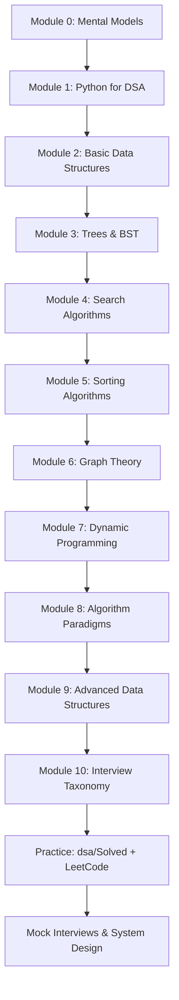

---
tags:
  - DSA
  - GATE-DA
  - Programming
  - Data-Structures
  - Algorithms
  - Interview-Preparation
  - Python
  - 20-LPA
aliases:
  - DSA Mastery Guide
  - GATE DA Programming & DSA
  - Coding Interview Prep
---

# 🧠 Programming, Data Structures & Algorithms — GATE DA Mastery Guide

> **Goal:** Master the **complete GATE DA "Programming, Data Structures and Algorithms" syllabus** — from Python basics to graph algorithms — so you can crack **20+ LPA interviews** at top tech companies (Google, Amazon, Microsoft, Flipkart, Uber, etc.).
>
> **Target Audience:** SDE-1/2, Data Engineer, ML Engineer, Backend Engineer, Quant Researcher interviews.
>
> **Prerequisites:** Basic programming logic, high-school math (logarithms, summations, probability basics).
>
> **Time Investment:** 4–6 weeks (2–3 hrs/day) for thorough mastery.

---

## 📚 Table of Contents

---

## 🗂️ MODULE 0: MENTAL MODELS & PROBLEM-SOLVING FRAMEWORK

> [!abstract] **How Top Engineers Think About DSA**
>
> ```
> ┌───────────────────────────────────────────────────────────────────┐
> │                    PROBLEM-SOLVING PIPELINE                       │
> ├───────────────────────────────────────────────────────────────────┤
> │                                                                   │
> │  1. UNDERSTAND                                                    │
> │     ▸ Rephrase in your own words                                  │
> │     ▸ Identify inputs, outputs, constraints                       │
> │     ▸ Ask clarifying questions (edge cases, scale)                │
> │                        │                                          │
> │                        ▼                                          │
> │  2. BRUTE FORCE                                                   │
> │     ▸ Naive solution first (correctness > speed)                  │
> │     ▸ State time/space complexity                                 │
> │     ▸ Identify bottlenecks                                        │
> │                        │                                          │
> │                        ▼                                          │
> │  3. OPTIMIZE                                                      │
> │     ▸ Look for patterns:                                          │
> │       • Sorting → Binary Search / Two Pointers                    │
> │       • Repeated subproblems → DP / Memoization                   │
> │       • Hierarchical / Tree → Recursion / DFS / BFS               │
> │       • Graph / Dependencies → Topological Sort / Union-Find      │
> │       • Sliding window / Subarray → Two Pointers / Prefix Sum     │
> │       • Frequency counting → Hash Map / Counter                   │
> │       • Min/Max in stream → Heap / Monotonic Stack                │
> │       • String matching → KMP / Trie / Rolling Hash               │
> │     ▸ Apply technique, derive complexity                          │
> │                        │                                          │
> │                        ▼                                          │
> │  4. CODE                                                          │
> │     ▸ Clean, modular, typed Python                                │
> │     ▸ Handle edge cases explicitly                                │
> │     ▸ Variable names: intention-revealing                         │
> │                        │                                          │
> │                        ▼                                          │
> │  5. VERIFY                                                        │
> │     ▸ Trace through examples                                      │
> │     ▸ Test edge cases: empty, single, max, duplicates, negatives  │
> │     ▸ Dry-run complexity analysis                                 │
> │                                                                   │
> └───────────────────────────────────────────────────────────────────┘
> ```

### 🎯 Core Patterns Cheat Sheet

| Pattern | When to Use | Key Insight | Example Problems |
|---------|-------------|-------------|------------------|
| **Two Pointers** | Sorted array, pair/triplet sum, palindrome | Move pointers based on comparison | 2Sum, 3Sum, Container With Most Water, Trapping Rain Water |
| **Sliding Window** | Subarray/substring with constraint | Expand right, shrink left when invalid | Longest Substring Without Repeating, Minimum Window Substring, Max Sum Subarray of Size K |
| **Prefix Sum / Diff Array** | Range sum queries, subarray sum equals K | Precompute cumulative sums | Subarray Sum Equals K, Range Sum Query, Car Pooling |
| **Binary Search** | Sorted search space, monotonic predicate | Search on *answer*, not just array | Koko Eating Bananas, Capacity To Ship, Search in Rotated Array |
| **Fast & Slow Pointers** | Cycle detection, middle, palindrome (LL) | Fast moves 2×, meet = cycle | Linked List Cycle, Middle of LL, Happy Number |
| **DFS / Backtracking** | Permutations, combinations, subsets, grids | Explore all paths, prune early | Subsets, Permutations, Word Search, N-Queens |
| **BFS** | Shortest path (unweighted), level-order, multi-source | Queue + visited set | Rotting Oranges, Number of Islands, Word Ladder |
| **Topological Sort** | Dependency ordering, course schedule | Kahn's (BFS) or DFS post-order | Course Schedule, Alien Dictionary, Build Order |
| **Union-Find (DSU)** | Dynamic connectivity, cycles in undirected graph | Path compression + union by rank | Number of Islands II, Accounts Merge, Redundant Connection |
| **Heap / Priority Queue** | Top-K, median stream, merge K sorted | Min-heap for largest, max-heap for smallest | Kth Largest Element, Merge K Lists, Task Scheduler |
| **Monotonic Stack** | Next greater/smaller, histogram, stock span | Maintain increasing/decreasing order | Next Greater Element, Largest Rectangle in Histogram, Daily Temperatures |
| **DP (1D/2D)** | Optimal substructure + overlapping subproblems | State → Transition → Base case | Climbing Stairs, House Robber, Coin Change, Edit Distance, LIS |
| **Greedy** | Local optimal → global optimal (proof needed) | Sort by end time / ratio / value | Interval Scheduling, Fractional Knapsack, Gas Station |
| **Bit Manipulation** | XOR properties, subsets, power of 2 | `x & (x-1)` clears LSB, `x ^ x = 0` | Single Number, Subsets, Power of Two, Counting Bits |

---

## 🐍 MODULE 1: PYTHON FOR DSA (GATE DA RELEVANT)

> [!tip] **GATE DA Python Focus**
> - Built-in data structures: `list`, `dict`, `set`, `tuple`, `collections`
> - Time complexity of operations (critical for analysis)
> - No need for classes/OOP unless implementing DS from scratch

### 1.1 Built-in Data Structures — Complexity Cheat Sheet

```python
# LIST (dynamic array)
# ┌─────────────────────┬──────────┬────────────────────────────────────┐
# │ Operation           │ Time     │ Notes                              │
# ├─────────────────────┼──────────┼────────────────────────────────────┤
# │ append(x)           │ O(1)*    │ Amortized (resize occasionally)    │
# │ pop()               │ O(1)     │ From end                           │
# │ pop(i) / del lst[i] │ O(n)     │ Shifts elements                    │
# │ insert(i, x)        │ O(n)     │ Shifts elements                    │
# │ lst[i]              │ O(1)     │ Random access                      │
# │ x in lst            │ O(n)     │ Linear scan                        │
# │ lst.sort()          │ O(n log n)│ Timsort (stable)                   │
# │ sorted(lst)         │ O(n log n)│ Returns new list                   │
# └─────────────────────┴──────────┴────────────────────────────────────┘

# DICT / SET (hash table)
# ┌─────────────────────┬──────────┬────────────────────────────────────┐
# │ Operation           │ Time     │ Notes                              │
# ├─────────────────────┼──────────┼────────────────────────────────────┤
# │ d[key] = val        │ O(1)*    │ Amortized                          │
# │ d[key]              │ O(1)*    │ KeyError if missing                │
# │ d.get(key, default) │ O(1)*    │ Safe access                        │
# │ key in d            │ O(1)*    │ Membership test                    │
# │ del d[key]          │ O(1)*    │                                    │
# │ set()               │ O(1)*    │ Add / check / remove               │
# └─────────────────────┴──────────┴────────────────────────────────────┘

# COLLECTIONS (high-performance building blocks)
from collections import deque, defaultdict, Counter, OrderedDict
from heapq import heappush, heappop, heapify, heappushpop, heapreplace
from bisect import bisect_left, bisect_right, insort
from itertools import combinations, permutations, product, accumulate
from functools import lru_cache, reduce
from math import inf, gcd, lcm, sqrt, log2, ceil, floor
```

### 1.2 Essential Idioms for Interviews

```python
# 1. Frequency counting
from collections import Counter
freq = Counter(arr)           # O(n)
most_common = freq.most_common(k)  # Top-k

# 2. Default dict (avoid KeyError)
graph = defaultdict(list)
for u, v in edges:
    graph[u].append(v)
    graph[v].append(u)  # undirected

# 3. Deque for BFS / sliding window (O(1) both ends)
from collections import deque
q = deque([start])
while q:
    node = q.popleft()  # O(1)
    for nei in graph[node]:
        q.append(nei)

# 4. Heap (min-heap by default)
heap = []
heappush(heap, val)
smallest = heappop(heap)
# Max-heap: push -val, pop -heappop(heap)
# heapify(list) → O(n) build

# 5. Bisect (binary search on sorted list)
bisect_left(arr, x)   # insertion point (leftmost)
bisect_right(arr, x)  # insertion point (rightmost)
insort(arr, x)        # insert maintaining sort

# 6. LRU Cache / Memoization
@lru_cache(maxsize=None)
def dp(i, j):
    if base_case: return base_val
    return min(dp(i-1, j), dp(i, j-1)) + cost

# 7. Combinatorics / Itertools
list(combinations(arr, 2))     # nC2 pairs
list(permutations(arr, 3))     # nP3 permutations
list(product(arr1, arr2))      # Cartesian product
list(accumulate(arr))          # Prefix sums

# 8. Math utilities
gcd(a, b)           # Euclidean algorithm
lcm(a, b)           # Least common multiple (py3.9+)
isqrt(n)            # Integer sqrt (py3.8+)
comb(n, k)          # nCk (py3.8+)
perm(n, k)          # nPk (py3.8+)
```

---

## 📦 MODULE 2: BASIC DATA STRUCTURES

### 2.1 Stack (LIFO)

```python
# Array-based (Python list)
stack = []
stack.append(x)      # push O(1)
stack.pop()          # pop O(1)
stack[-1]            # peek O(1)
len(stack) == 0      # isEmpty

# Interview Patterns:
# 1. Balanced Parentheses
def is_valid(s: str) -> bool:
    stack = []
    mapping = {')': '(', ']': '[', '}': '{'}
    for c in s:
        if c in mapping:
            if not stack or stack.pop() != mapping[c]:
                return False
        else:
            stack.append(c)
    return not stack

# 2. Next Greater Element (Monotonic Stack)
def next_greater(arr):
    stack, res = [], [-1] * len(arr)
    for i, val in enumerate(arr):
        while stack and arr[stack[-1]] < val:
            res[stack.pop()] = val
        stack.append(i)
    return res

# 3. Largest Rectangle in Histogram
def largest_rectangle(heights):
    stack, max_area = [], 0
    for i, h in enumerate(heights + [0]):  # sentinel
        while stack and heights[stack[-1]] >= h:
            height = heights[stack.pop()]
            width = i if not stack else i - stack[-1] - 1
            max_area = max(max_area, height * width)
        stack.append(i)
    return max_area
```

| Operation | Array Implementation | Linked List Implementation |
|-----------|---------------------|---------------------------|
| Push | O(1) amortized | O(1) |
| Pop | O(1) | O(1) |
| Peek | O(1) | O(1) |
| Space | O(n) | O(n) |

---

### 2.2 Queue (FIFO) & Deque

```python
from collections import deque

# BFS template
def bfs(graph, start):
    q = deque([start])
    visited = {start}
    while q:
        node = q.popleft()
        for nei in graph[node]:
            if nei not in visited:
                visited.add(nei)
                q.append(nei)

# Sliding Window Maximum (Monotonic Deque)
def max_sliding_window(nums, k):
    dq, res = deque(), []
    for i, n in enumerate(nums):
        # Remove indices outside window
        while dq and dq[0] < i - k + 1:
            dq.popleft()
        # Maintain decreasing order
        while dq and nums[dq[-1]] < n:
            dq.pop()
        dq.append(i)
        if i >= k - 1:
            res.append(nums[dq[0]])
    return res
```

| Operation | `deque` | `queue.Queue` (thread-safe) |
|-----------|---------|----------------------------|
| Enqueue | O(1) | O(1) |
| Dequeue | O(1) | O(1) |
| Peek | O(1) | O(1) |

---

### 2.3 Linked List

```python
class ListNode:
    __slots__ = ('val', 'next')
    def __init__(self, val=0, next=None):
        self.val = val
        self.next = next

# ── Core Patterns ──

# 1. Reverse Linked List (Iterative)
def reverse_list(head):
    prev = None
    curr = head
    while curr:
        nxt = curr.next
        curr.next = prev
        prev = curr
        curr = nxt
    return prev

# 2. Fast/Slow Pointers — Middle / Cycle Detection
def middle_node(head):
    slow = fast = head
    while fast and fast.next:
        slow = slow.next
        fast = fast.next.next
    return slow

def has_cycle(head):
    slow = fast = head
    while fast and fast.next:
        slow = slow.next
        fast = fast.next.next
        if slow is fast:
            return True
    return False

# 3. Merge Two Sorted Lists
def merge_two_lists(l1, l2):
    dummy = ListNode()
    tail = dummy
    while l1 and l2:
        if l1.val < l2.val:
            tail.next, l1 = l1, l1.next
        else:
            tail.next, l2 = l2, l2.next
        tail = tail.next
    tail.next = l1 or l2
    return dummy.next

# 4. Remove Nth From End (Two Pass or Fast/Slow)
def remove_nth_from_end(head, n):
    dummy = ListNode(0, head)
    fast = slow = dummy
    for _ in range(n + 1):
        fast = fast.next
    while fast:
        fast, slow = fast.next, slow.next
    slow.next = slow.next.next
    return dummy.next
```

| Operation | Singly Linked List | Doubly Linked List |
|-----------|-------------------|-------------------|
| Search | O(n) | O(n) |
| Insert at head | O(1) | O(1) |
| Insert at tail | O(1)* / O(n) | O(1) |
| Delete node | O(n) / O(1)* | O(1) |
| *with tail pointer / given node ref |

---

### 2.4 Hash Table (Dict / Set)

```python
# Core idea: O(1) average insert, delete, lookup
# Collision resolution: chaining (Python) or open addressing

# Pattern: Two Sum (exact match)
def two_sum(nums, target):
    seen = {}
    for i, x in enumerate(nums):
        need = target - x
        if need in seen:
            return [seen[need], i]
        seen[x] = i

# Pattern: Group Anagrams (key = sorted string / tuple of counts)
def group_anagrams(strs):
    groups = defaultdict(list)
    for s in strs:
        key = tuple(sorted(s))  # or tuple(count[c] for c in 'abcdefghijklmnopqrstuvwxyz')
        groups[key].append(s)
    return list(groups.values())

# Pattern: Subarray Sum Equals K (Prefix Sum + Hash)
def subarray_sum(nums, k):
    from collections import Counter
    pref = Counter({0: 1})
    curr = 0
    count = 0
    for x in nums:
        curr += x
        count += pref[curr - k]
        pref[curr] += 1
    return count
```

---

## 🌳 MODULE 3: TREES & BINARY TREES

### 3.1 Tree Node Definition & Traversals

```python
class TreeNode:
    __slots__ = ('val', 'left', 'right')
    def __init__(self, val=0, left=None, right=None):
        self.val = val
        self.left = left
        self.right = right

# ── Recursive Traversals ──
def inorder(root):   # Left, Root, Right
    return inorder(root.left) + [root.val] + inorder(root.right) if root else []

def preorder(root):  # Root, Left, Right
    return [root.val] + preorder(root.left) + preorder(root.right) if root else []

def postorder(root): # Left, Right, Root
    return postorder(root.left) + postorder(root.right) + [root.val] if root else []

# ── Iterative Traversals (Stack) ──
def inorder_iter(root):
    stack, res, curr = [], [], root
    while stack or curr:
        while curr:
            stack.append(curr)
            curr = curr.left
        curr = stack.pop()
        res.append(curr.val)
        curr = curr.right
    return res

def preorder_iter(root):
    if not root: return []
    stack, res = [root], []
    while stack:
        node = stack.pop()
        res.append(node.val)
        if node.right: stack.append(node.right)
        if node.left: stack.append(node.left)
    return res

def postorder_iter(root):
    if not root: return []
    stack, res = [root], []
    while stack:
        node = stack.pop()
        res.append(node.val)
        if node.left: stack.append(node.left)
        if node.right: stack.append(node.right)
    return res[::-1]  # Reverse of Root-Right-Left

# ── Level Order (BFS) ──
def level_order(root):
    if not root: return []
    q, res = deque([root]), []
    while q:
        level = []
        for _ in range(len(q)):
            node = q.popleft()
            level.append(node.val)
            if node.left: q.append(node.left)
            if node.right: q.append(node.right)
        res.append(level)
    return res
```

### 3.2 Core Tree Problems (Patterns)

```python
# 1. Maximum Depth / Height
def max_depth(root):
    return 1 + max(max_depth(root.left), max_depth(root.right)) if root else 0

# 2. Diameter of Binary Tree (longest path between any two nodes)
def diameter(root):
    ans = 0
    def depth(node):
        nonlocal ans
        if not node: return 0
        L, R = depth(node.left), depth(node.right)
        ans = max(ans, L + R)
        return 1 + max(L, R)
    depth(root)
    return ans

# 3. Balanced Binary Tree (height diff ≤ 1)
def is_balanced(root):
    def check(node):
        if not node: return 0
        left = check(node.left)
        if left == -1: return -1
        right = check(node.right)
        if right == -1: return -1
        if abs(left - right) > 1: return -1
        return 1 + max(left, right)
    return check(root) != -1

# 4. Lowest Common Ancestor (BST vs Binary Tree)
# BST: use ordering property
def lca_bst(root, p, q):
    while root:
        if p.val < root.val > q.val:
            root = root.left
        elif p.val > root.val < q.val:
            root = root.right
        else:
            return root

# Binary Tree: post-order traversal
def lca_bt(root, p, q):
    if not root or root is p or root is q:
        return root
    left = lca_bt(root.left, p, q)
    right = lca_bt(root.right, p, q)
    if left and right: return root
    return left or right

# 5. Path Sum / All Paths
def has_path_sum(root, target):
    if not root: return False
    if not root.left and not root.right:
        return root.val == target
    return has_path_sum(root.left, target - root.val) or has_path_sum(root.right, target - root.val)

def path_sum_all(root, target):
    res, path = [], []
    def dfs(node, remaining):
        if not node: return
        path.append(node.val)
        if not node.left and not node.right and remaining == node.val:
            res.append(path[:])
        else:
            dfs(node.left, remaining - node.val)
            dfs(node.right, remaining - node.val)
        path.pop()
    dfs(root, target)
    return res

# 6. Serialize / Deserialize (Preorder with 'None' markers)
def serialize(root):
    vals = []
    def dfs(node):
        if node:
            vals.append(str(node.val))
            dfs(node.left)
            dfs(node.right)
        else:
            vals.append('#')
    dfs(root)
    return ' '.join(vals)

def deserialize(data):
    vals = iter(data.split())
    def dfs():
        val = next(vals)
        if val == '#': return None
        node = TreeNode(int(val))
        node.left = dfs()
        node.right = dfs()
        return node
    return dfs()
```

### 3.3 Binary Search Tree (BST)

```python
# BST Property: left.val < node.val < right.val (no duplicates assumed)

# Search
def search_bst(root, val):
    while root:
        if val < root.val: root = root.left
        elif val > root.val: root = root.right
        else: return root
    return None

# Insert
def insert_bst(root, val):
    if not root: return TreeNode(val)
    if val < root.val: root.left = insert_bst(root.left, val)
    else: root.right = insert_bst(root.right, val)
    return root

# Delete (3 cases: leaf, one child, two children → replace with successor)
def delete_bst(root, val):
    if not root: return None
    if val < root.val:
        root.left = delete_bst(root.left, val)
    elif val > root.val:
        root.right = delete_bst(root.right, val)
    else:
        if not root.left: return root.right
        if not root.right: return root.left
        # Two children: find inorder successor (min in right subtree)
        succ = root.right
        while succ.left: succ = succ.left
        root.val = succ.val
        root.right = delete_bst(root.right, succ.val)
    return root

# Validate BST (range-based)
def is_valid_bst(root):
    def valid(node, lo, hi):
        if not node: return True
        if not (lo < node.val < hi): return False
        return valid(node.left, lo, node.val) and valid(node.right, node.val, hi)
    return valid(root, -inf, inf)

# Kth Smallest (Inorder traversal)
def kth_smallest(root, k):
    stack = []
    while True:
        while root:
            stack.append(root)
            root = root.left
        root = stack.pop()
        k -= 1
        if k == 0: return root.val
        root = root.right
```

| Operation | BST (Average) | BST (Worst) | Balanced BST (AVL/Red-Black) |
|-----------|---------------|-------------|------------------------------|
| Search | O(log n) | O(n) | O(log n) |
| Insert | O(log n) | O(n) | O(log n) |
| Delete | O(log n) | O(n) | O(log n) |
| Space | O(n) | O(n) | O(n) |

---

### 3.4 AVL Tree (Self-Balancing BST)

> **GATE DA Note:** Know rotation types, balance factor, and that AVL guarantees O(log n) height.

```python
class AVLNode:
    __slots__ = ('val', 'left', 'right', 'height')
    def __init__(self, val):
        self.val = val
        self.left = self.right = None
        self.height = 1

def height(node):
    return node.height if node else 0

def balance_factor(node):
    return height(node.left) - height(node.right) if node else 0

def update_height(node):
    node.height = 1 + max(height(node.left), height(node.right))

def rotate_right(y):
    x = y.left
    T2 = x.right
    x.right = y
    y.left = T2
    update_height(y)
    update_height(x)
    return x

def rotate_left(x):
    y = x.right
    T2 = y.left
    y.left = x
    x.right = T2
    update_height(x)
    update_height(y)
    return y

def insert_avl(root, val):
    if not root: return AVLNode(val)
    if val < root.val:
        root.left = insert_avl(root.left, val)
    else:
        root.right = insert_avl(root.right, val)
    
    update_height(root)
    bf = balance_factor(root)
    
    # LL
    if bf > 1 and val < root.left.val:
        return rotate_right(root)
    # RR
    if bf < -1 and val > root.right.val:
        return rotate_left(root)
    # LR
    if bf > 1 and val > root.left.val:
        root.left = rotate_left(root.left)
        return rotate_right(root)
    # RL
    if bf < -1 and val < root.right.val:
        root.right = rotate_right(root.right)
        return rotate_left(root)
    return root
```

| Rotation | When | Diagram |
|----------|------|---------|
| **Right (LL)** | Left-Left heavy | `y` ← `x` → `T2` |
| **Left (RR)** | Right-Right heavy | `x` → `y` ← `T2` |
| **Left-Right (LR)** | Left-Right heavy | Left rotate `x`, then right rotate `y` |
| **Right-Left (RL)** | Right-Left heavy | Right rotate `y`, then left rotate `x` |

---

### 3.5 Heap / Priority Queue

```python
import heapq

# Min-heap (default)
heap = []
heapq.heappush(heap, 5)
heapq.heappush(heap, 2)
heapq.heappush(heap, 8)
heapq.heappop(heap)  # 2

# Max-heap: negate values
max_heap = []
heapq.heappush(max_heap, -5)
heapq.heappush(max_heap, -2)
-heapq.heappop(max_heap)  # 5

# Heapify existing list O(n)
arr = [5, 2, 8, 1, 9]
heapq.heapify(arr)

# Heapreplace / heappushpop (atomic)
heapq.heapreplace(heap, new_val)  # pop then push
heapq.heappushpop(heap, new_val)  # push then pop

# ── Patterns ──

# 1. Kth Largest Element
def find_kth_largest(nums, k):
    return heapq.nlargest(k, nums)[-1]
    # Or: min-heap of size k
    heap = nums[:k]
    heapq.heapify(heap)
    for x in nums[k:]:
        if x > heap[0]:
            heapq.heapreplace(heap, x)
    return heap[0]

# 2. Merge K Sorted Lists
def merge_k_lists(lists):
    heap = [(lst.val, i, lst) for i, lst in enumerate(lists) if lst]
    heapq.heapify(heap)
    dummy = tail = ListNode()
    while heap:
        val, i, node = heapq.heappop(heap)
        tail.next = node
        tail = tail.next
        if node.next:
            heapq.heappush(heap, (node.next.val, i, node.next))
    return dummy.next

# 3. Top K Frequent Elements
def top_k_frequent(nums, k):
    freq = Counter(nums)
    return heapq.nlargest(k, freq.keys(), key=freq.get)

# 4. Median of Stream (Two Heaps)
class MedianFinder:
    def __init__(self):
        self.small = []  # max-heap (negated)
        self.large = []  # min-heap
    def addNum(self, num):
        heapq.heappush(self.small, -num)
        heapq.heappush(self.large, -heapq.heappop(self.small))
        if len(self.large) > len(self.small):
            heapq.heappush(self.small, -heapq.heappop(self.large))
    def findMedian(self):
        if len(self.small) > len(self.large):
            return -self.small[0]
        return (-self.small[0] + self.large[0]) / 2
```

| Operation | Min-Heap | Max-Heap |
|-----------|----------|----------|
| Peek min/max | O(1) | O(1) |
| Insert | O(log n) | O(log n) |
| Extract min/max | O(log n) | O(log n) |
| Build heap | O(n) | O(n) |

---

## 🔍 MODULE 4: SEARCH ALGORITHMS

### 4.1 Linear Search
- **Time:** O(n) | **Space:** O(1)
- Unsorted data, single query, small n

### 4.2 Binary Search (The Swiss Army Knife)

```python
# Standard: find target in sorted array
def binary_search(arr, target):
    lo, hi = 0, len(arr) - 1
    while lo <= hi:
        mid = (lo + hi) // 2
        if arr[mid] == target: return mid
        elif arr[mid] < target: lo = mid + 1
        else: hi = mid - 1
    return -1

# Lower bound: first index where arr[idx] >= target
def lower_bound(arr, target):
    lo, hi = 0, len(arr)
    while lo < hi:
        mid = (lo + hi) // 2
        if arr[mid] < target: lo = mid + 1
        else: hi = mid
    return lo

# Upper bound: first index where arr[idx] > target
def upper_bound(arr, target):
    lo, hi = 0, len(arr)
    while lo < hi:
        mid = (lo + hi) // 2
        if arr[mid] <= target: lo = mid + 1
        else: hi = mid
    return lo

# ── Search on Answer Space (Monotonic Predicate) ──
# Problem: Minimize maximum subarray sum when splitting into k parts
def split_array(nums, k):
    def can_split(max_sum):
        parts, curr = 1, 0
        for x in nums:
            if curr + x > max_sum:
                parts += 1
                curr = x
                if parts > k: return False
            else:
                curr += x
        return True
    
    lo, hi = max(nums), sum(nums)
    while lo < hi:
        mid = (lo + hi) // 2
        if can_split(mid): hi = mid
        else: lo = mid + 1
    return lo

# ── Search in Rotated Sorted Array ──
def search_rotated(nums, target):
    lo, hi = 0, len(nums) - 1
    while lo <= hi:
        mid = (lo + hi) // 2
        if nums[mid] == target: return mid
        # Left half sorted
        if nums[lo] <= nums[mid]:
            if nums[lo] <= target < nums[mid]: hi = mid - 1
            else: lo = mid + 1
        # Right half sorted
        else:
            if nums[mid] < target <= nums[hi]: lo = mid + 1
            else: hi = mid - 1
    return -1
```

| Variant | Use Case | Template |
|---------|----------|----------|
| Standard | Exact match | `lo <= hi` |
| Lower Bound | First ≥ target | `lo < hi`, `arr[mid] < target` |
| Upper Bound | First > target | `lo < hi`, `arr[mid] <= target` |
| Search Answer | Min/max satisfying predicate | `lo < hi`, `can(mid)` |

---

## 🔄 MODULE 5: SORTING ALGORITHMS

### 5.1 Comparison Sorts

```python
# 1. Selection Sort — O(n²), in-place, unstable
def selection_sort(arr):
    n = len(arr)
    for i in range(n):
        min_idx = i
        for j in range(i+1, n):
            if arr[j] < arr[min_idx]:
                min_idx = j
        arr[i], arr[min_idx] = arr[min_idx], arr[i]

# 2. Bubble Sort — O(n²), in-place, stable
def bubble_sort(arr):
    n = len(arr)
    for i in range(n):
        swapped = False
        for j in range(n - i - 1):
            if arr[j] > arr[j+1]:
                arr[j], arr[j+1] = arr[j+1], arr[j]
                swapped = True
        if not swapped: break  # optimization

# 3. Insertion Sort — O(n²), in-place, stable, O(n) best (nearly sorted)
def insertion_sort(arr):
    for i in range(1, len(arr)):
        key = arr[i]
        j = i - 1
        while j >= 0 and arr[j] > key:
            arr[j+1] = arr[j]
            j -= 1
        arr[j+1] = key

# 4. Merge Sort — O(n log n), stable, O(n) space
def merge_sort(arr):
    if len(arr) <= 1: return arr
    mid = len(arr) // 2
    left = merge_sort(arr[:mid])
    right = merge_sort(arr[mid:])
    return merge(left, right)

def merge(left, right):
    res = []
    i = j = 0
    while i < len(left) and j < len(right):
        if left[i] <= right[j]:
            res.append(left[i]); i += 1
        else:
            res.append(right[j]); j += 1
    res.extend(left[i:])
    res.extend(right[j:])
    return res

# 5. Quick Sort — O(n log n) avg, O(n²) worst, in-place, unstable
def quick_sort(arr, lo=0, hi=None):
    if hi is None: hi = len(arr) - 1
    if lo < hi:
        p = partition(arr, lo, hi)
        quick_sort(arr, lo, p-1)
        quick_sort(arr, p+1, hi)

def partition(arr, lo, hi):
    pivot = arr[hi]
    i = lo - 1
    for j in range(lo, hi):
        if arr[j] <= pivot:
            i += 1
            arr[i], arr[j] = arr[j], arr[i]
    arr[i+1], arr[hi] = arr[hi], arr[i+1]
    return i + 1

# Randomized pivot for O(n log n) expected
import random
def randomized_partition(arr, lo, hi):
    pivot_idx = random.randint(lo, hi)
    arr[pivot_idx], arr[hi] = arr[hi], arr[pivot_idx]
    return partition(arr, lo, hi)
```

### 5.2 Non-Comparison Sorts (Linear Time)

```python
# Counting Sort — O(n + k), stable, for small integer range
def counting_sort(arr, max_val):
    count = [0] * (max_val + 1)
    for x in arr: count[x] += 1
    for i in range(1, len(count)): count[i] += count[i-1]
    output = [0] * len(arr)
    for x in reversed(arr):  # reverse for stability
        output[count[x] - 1] = x
        count[x] -= 1
    return output

# Radix Sort — O(d(n + b)), stable, for integers/strings
def radix_sort(arr):
    max_val = max(arr)
    exp = 1
    while max_val // exp > 0:
        arr = counting_sort_by_digit(arr, exp)
        exp *= 10
    return arr

def counting_sort_by_digit(arr, exp):
    n = len(arr)
    output = [0] * n
    count = [0] * 10
    for x in arr: count[(x // exp) % 10] += 1
    for i in range(1, 10): count[i] += count[i-1]
    for x in reversed(arr):
        digit = (x // exp) % 10
        output[count[digit] - 1] = x
        count[digit] -= 1
    return output

# Bucket Sort — O(n) avg, for uniform distribution [0, 1)
def bucket_sort(arr):
    buckets = [[] for _ in range(len(arr))]
    for x in arr:
        buckets[int(x * len(arr))].append(x)
    for b in buckets: b.sort()
    return [x for b in buckets for x in b]
```

### 5.3 Sorting Complexity Summary

| Algorithm | Best | Average | Worst | Space | Stable | In-Place |
|-----------|------|---------|-------|-------|--------|----------|
| **Selection** | O(n²) | O(n²) | O(n²) | O(1) | ❌ | ✅ |
| **Bubble** | O(n) | O(n²) | O(n²) | O(1) | ✅ | ✅ |
| **Insertion** | O(n) | O(n²) | O(n²) | O(1) | ✅ | ✅ |
| **Merge** | O(n log n) | O(n log n) | O(n log n) | O(n) | ✅ | ❌ |
| **Quick** | O(n log n) | O(n log n) | O(n²) | O(log n) | ❌ | ✅* |
| **Heap** | O(n log n) | O(n log n) | O(n log n) | O(1) | ❌ | ✅ |
| **Counting** | O(n+k) | O(n+k) | O(n+k) | O(n+k) | ✅ | ❌ |
| **Radix** | O(d(n+b)) | O(d(n+b)) | O(d(n+b)) | O(n+b) | ✅ | ❌ |
| **Timsort (Python)** | O(n) | O(n log n) | O(n log n) | O(n) | ✅ | ❌ |

> *Quick sort stack space O(log n) average, O(n) worst

---

## 🌐 MODULE 6: GRAPH THEORY (INTRODUCTION)

> **GATE DA Scope:** Graph representations, traversals (BFS/DFS), shortest path (Dijkstra, BFS for unweighted), basic concepts.

### 6.1 Graph Representations

```python
# 1. Adjacency List (most common for sparse graphs)
# Space: O(V + E)
graph = defaultdict(list)
for u, v in edges:
    graph[u].append(v)
    graph[v].append(u)  # if undirected

# 2. Adjacency Matrix (dense graphs, O(1) edge check)
# Space: O(V²)
n = num_vertices
adj = [[0]*n for _ in range(n)]
for u, v in edges:
    adj[u][v] = 1
    adj[v][u] = 1

# 3. Edge List (for Kruskal, Bellman-Ford)
edges = [(u, v, w) for u, v, w in weighted_edges]
```

| Operation | Adj List | Adj Matrix | Edge List |
|-----------|----------|------------|-----------|
| Add vertex | O(1) | O(V²) | O(1) |
| Add edge | O(1) | O(1) | O(1) |
| Check edge | O(deg) | O(1) | O(E) |
| Iterate neighbors | O(deg) | O(V) | O(E) |
| Space | O(V+E) | O(V²) | O(E) |

---

### 6.2 Graph Traversals

```python
# ── BFS (Shortest path in unweighted graph) ──
from collections import deque

def bfs(graph, start):
    visited = set([start])
    q = deque([start])
    parent = {start: None}
    level = {start: 0}
    
    while q:
        u = q.popleft()
        for v in graph[u]:
            if v not in visited:
                visited.add(v)
                q.append(v)
                parent[v] = u
                level[v] = level[u] + 1
    return parent, level

# Reconstruct path
def get_path(parent, target):
    path = []
    while target is not None:
        path.append(target)
        target = parent[target]
    return path[::-1]

# Multi-source BFS (e.g., Rotting Oranges, 0-1 Matrix)
def multi_source_bfs(sources, graph):
    q = deque(sources)
    dist = {s: 0 for s in sources}
    while q:
        u = q.popleft()
        for v in graph[u]:
            if v not in dist:
                dist[v] = dist[u] + 1
                q.append(v)
    return dist

# ── DFS (Cycle detection, topological sort, components) ──
def dfs(graph, start, visited=None):
    if visited is None: visited = set()
    visited.add(start)
    for nei in graph[start]:
        if nei not in visited:
            dfs(graph, nei, visited)
    return visited

# Iterative DFS
def dfs_iterative(graph, start):
    visited, stack = set(), [start]
    while stack:
        u = stack.pop()
        if u in visited: continue
        visited.add(u)
        for v in graph[u]:
            if v not in visited:
                stack.append(v)
    return visited

# Cycle detection in undirected graph
def has_cycle_undirected(graph):
    visited = set()
    def dfs(u, parent):
        visited.add(u)
        for v in graph[u]:
            if v not in visited:
                if dfs(v, u): return True
            elif v != parent:
                return True
        return False
    for u in graph:
        if u not in visited:
            if dfs(u, None): return True
    return False

# Cycle detection in directed graph (3 colors)
def has_cycle_directed(graph):
    WHITE, GRAY, BLACK = 0, 1, 2
    color = {u: WHITE for u in graph}
    def dfs(u):
        color[u] = GRAY
        for v in graph[u]:
            if color[v] == GRAY: return True
            if color[v] == WHITE and dfs(v): return True
        color[u] = BLACK
        return False
    return any(dfs(u) for u in graph if color[u] == WHITE)
```

---

### 6.3 Topological Sort (DAG Only)

```python
# Kahn's Algorithm (BFS-based) — O(V + E)
def topological_sort_kahn(graph):
    indegree = {u: 0 for u in graph}
    for u in graph:
        for v in graph[u]:
            indegree[v] += 1
    
    q = deque([u for u in graph if indegree[u] == 0])
    topo = []
    while q:
        u = q.popleft()
        topo.append(u)
        for v in graph[u]:
            indegree[v] -= 1
            if indegree[v] == 0:
                q.append(v)
    
    if len(topo) != len(graph):
        return []  # Cycle detected
    return topo

# DFS-based (post-order reverse) — O(V + E)
def topological_sort_dfs(graph):
    visited, stack = set(), []
    def dfs(u):
        visited.add(u)
        for v in graph[u]:
            if v not in visited:
                dfs(v)
        stack.append(u)
    
    for u in graph:
        if u not in visited:
            dfs(u)
    return stack[::-1]

# Application: Course Schedule (LeetCode 207/210)
def can_finish(num_courses, prerequisites):
    graph = defaultdict(list)
    indegree = [0] * num_courses
    for dest, src in prerequisites:
        graph[src].append(dest)
        indegree[dest] += 1
    
    q = deque([i for i in range(num_courses) if indegree[i] == 0])
    count = 0
    while q:
        u = q.popleft()
        count += 1
        for v in graph[u]:
            indegree[v] -= 1
            if indegree[v] == 0:
                q.append(v)
    return count == num_courses
```

---

### 6.4 Shortest Path Algorithms

```python
import heapq

# ── Dijkstra (Non-negative weights) — O((V+E) log V) ──
def dijkstra(graph, start, n):
    dist = [inf] * n
    dist[start] = 0
    pq = [(0, start)]  # (distance, node)
    
    while pq:
        d, u = heapq.heappop(pq)
        if d > dist[u]: continue  # stale entry
        for v, w in graph[u]:
            if dist[v] > d + w:
                dist[v] = d + w
                heapq.heappush(pq, (dist[v], v))
    return dist

# With path reconstruction
def dijkstra_path(graph, start, target):
    dist = {start: 0}
    parent = {start: None}
    pq = [(0, start)]
    
    while pq:
        d, u = heapq.heappop(pq)
        if u == target: break
        if d > dist[u]: continue
        for v, w in graph[u]:
            nd = d + w
            if nd < dist.get(v, inf):
                dist[v] = nd
                parent[v] = u
                heapq.heappush(pq, (nd, v))
    
    # Reconstruct
    if target not in dist: return None, inf
    path = []
    curr = target
    while curr is not None:
        path.append(curr)
        curr = parent[curr]
    return path[::-1], dist[target]

# ── BFS for Unweighted Shortest Path — O(V + E) ──
def bfs_shortest_path(graph, start, target):
    q = deque([start])
    parent = {start: None}
    while q:
        u = q.popleft()
        if u == target: break
        for v in graph[u]:
            if v not in parent:
                parent[v] = u
                q.append(v)
    if target not in parent: return None
    path = []
    while target is not None:
        path.append(target)
        target = parent[target]
    return path[::-1]

# ── Bellman-Ford (Negative weights, detect negative cycle) — O(VE) ──
def bellman_ford(edges, n, start):
    dist = [inf] * n
    dist[start] = 0
    for _ in range(n - 1):
        updated = False
        for u, v, w in edges:
            if dist[u] != inf and dist[v] > dist[u] + w:
                dist[v] = dist[u] + w
                updated = True
        if not updated: break
    # Check negative cycle
    for u, v, w in edges:
        if dist[u] != inf and dist[v] > dist[u] + w:
            return None  # Negative cycle
    return dist
```

| Algorithm | Weights | Time | Space | Detects Negative Cycle |
|-----------|---------|------|-------|------------------------|
| BFS | Unweighted (1) | O(V+E) | O(V) | N/A |
| Dijkstra | Non-negative | O((V+E) log V) | O(V) | ❌ |
| Bellman-Ford | Any (no neg cycle) | O(VE) | O(V) | ✅ |
| Floyd-Warshall | Any (all-pairs) | O(V³) | O(V²) | ✅ |

---

### 6.5 Minimum Spanning Tree (MST)

```python
# ── Kruskal (Edge-based, DSU) — O(E log E) ──
class DSU:
    def __init__(self, n):
        self.parent = list(range(n))
        self.rank = [0] * n
    def find(self, x):
        if self.parent[x] != x:
            self.parent[x] = self.find(self.parent[x])
        return self.parent[x]
    def union(self, x, y):
        xr, yr = self.find(x), self.find(y)
        if xr == yr: return False
        if self.rank[xr] < self.rank[yr]:
            self.parent[xr] = yr
        elif self.rank[xr] > self.rank[yr]:
            self.parent[yr] = xr
        else:
            self.parent[yr] = xr
            self.rank[xr] += 1
        return True

def kruskal(n, edges):
    # edges = [(w, u, v), ...]
    edges.sort()
    dsu = DSU(n)
    mst_weight = 0
    mst_edges = []
    for w, u, v in edges:
        if dsu.union(u, v):
            mst_weight += w
            mst_edges.append((u, v, w))
    return mst_weight, mst_edges if len(mst_edges) == n-1 else None

# ── Prim (Vertex-based, Heap) — O((V+E) log V) ──
def prim(n, graph):
    visited = [False] * n
    min_heap = [(0, 0)]  # (weight, vertex)
    mst_weight = 0
    while min_heap:
        w, u = heapq.heappop(min_heap)
        if visited[u]: continue
        visited[u] = True
        mst_weight += w
        for v, weight in graph[u]:
            if not visited[v]:
                heapq.heappush(min_heap, (weight, v))
    return mst_weight if all(visited) else None
```

---

## 💡 MODULE 7: DYNAMIC PROGRAMMING (ESSENTIAL PATTERNS)

> **GATE DA Note:** DP may not be explicitly in syllabus but appears in interviews and optimization problems. Master these patterns.

### 7.1 DP Framework

```python
# ── Steps to Solve Any DP Problem ──
# 1. Define state: dp[i] = answer for subproblem of size i
# 2. Define transition: how to get dp[i] from smaller states
# 3. Define base cases
# 4. Determine iteration order (bottom-up) or memoization (top-down)
# 5. Optimize space if possible (rolling arrays)

# ── Pattern 1: 1D DP (Linear) ──
# Fibonacci / Climbing Stairs
def climb_stairs(n):
    if n <= 2: return n
    a, b = 1, 2
    for _ in range(3, n+1):
        a, b = b, a + b
    return b

# House Robber (max sum non-adjacent)
def rob(nums):
    if not nums: return 0
    if len(nums) == 1: return nums[0]
    dp0, dp1 = nums[0], max(nums[0], nums[1])
    for i in range(2, len(nums)):
        dp0, dp1 = dp1, max(dp1, dp0 + nums[i])
    return dp1

# Coin Change (min coins for amount)
def coin_change(coins, amount):
    dp = [inf] * (amount + 1)
    dp[0] = 0
    for a in range(1, amount + 1):
        for c in coins:
            if a >= c:
                dp[a] = min(dp[a], dp[a-c] + 1)
    return dp[amount] if dp[amount] != inf else -1

# Longest Increasing Subsequence (LIS) — O(n log n)
def length_of_lis(nums):
    tails = []
    for x in nums:
        idx = bisect_left(tails, x)
        if idx == len(tails):
            tails.append(x)
        else:
            tails[idx] = x
    return len(tails)

# ── Pattern 2: 2D DP (Grid / Strings) ──
# Unique Paths (grid)
def unique_paths(m, n):
    dp = [1] * n
    for _ in range(1, m):
        for j in range(1, n):
            dp[j] += dp[j-1]
    return dp[-1]

# Edit Distance (Levenshtein)
def min_distance(word1, word2):
    m, n = len(word1), len(word2)
    dp = [[0]*(n+1) for _ in range(m+1)]
    for i in range(m+1): dp[i][0] = i
    for j in range(n+1): dp[0][j] = j
    for i in range(1, m+1):
        for j in range(1, n+1):
            if word1[i-1] == word2[j-1]:
                dp[i][j] = dp[i-1][j-1]
            else:
                dp[i][j] = 1 + min(dp[i-1][j], dp[i][j-1], dp[i-1][j-1])
    return dp[m][n]

# Longest Common Subsequence
def lcs(text1, text2):
    m, n = len(text1), len(text2)
    dp = [0] * (n + 1)
    for i in range(1, m+1):
        prev = 0
        for j in range(1, n+1):
            temp = dp[j]
            if text1[i-1] == text2[j-1]:
                dp[j] = prev + 1
            else:
                dp[j] = max(dp[j], dp[j-1])
            prev = temp
    return dp[n]

# ── Pattern 3: Interval DP ──
# Burst Balloons / Matrix Chain Multiplication
def max_coins(nums):
    nums = [1] + nums + [1]
    n = len(nums)
    dp = [[0]*n for _ in range(n)]
    for length in range(2, n):
        for left in range(n - length):
            right = left + length
            for k in range(left+1, right):
                dp[left][right] = max(dp[left][right], 
                    dp[left][k] + dp[k][right] + nums[left]*nums[k]*nums[right])
    return dp[0][n-1]

# ── Pattern 4: Knapsack / Subset Sum ──
# 0/1 Knapsack
def knapsack(weights, values, capacity):
    dp = [0] * (capacity + 1)
    for w, v in zip(weights, values):
        for c in range(capacity, w-1, -1):  # reverse for 0/1
            dp[c] = max(dp[c], dp[c-w] + v)
    return dp[capacity]

# Unbounded Knapsack (complete)
def unbounded_knapsack(weights, values, capacity):
    dp = [0] * (capacity + 1)
    for w, v in zip(weights, values):
        for c in range(w, capacity + 1):  # forward for unbounded
            dp[c] = max(dp[c], dp[c-w] + v)
    return dp[capacity]

# ── Pattern 5: DP on Trees ──
def rob_tree(root):
    def dfs(node):
        if not node: return (0, 0)  # (rob, not_rob)
        left = dfs(node.left)
        right = dfs(node.right)
        rob = node.val + left[1] + right[1]
        not_rob = max(left) + max(right)
        return (rob, not_rob)
    return max(dfs(root))
```

---

## 🎯 MODULE 8: ALGORITHM DESIGN PARADIGMS

### 8.1 Divide and Conquer

```python
# Template
def divide_conquer(problem):
    if base_case(problem):
        return solve_directly(problem)
    
    subproblems = divide(problem)
    subsolutions = [divide_conquer(sp) for sp in subproblems]
    return combine(subsolutions)

# Examples:
# - Merge Sort (divide: split array, combine: merge)
# - Quick Sort (divide: partition, combine: trivial)
# - Binary Search (divide: half, combine: trivial)
# - Closest Pair of Points (O(n log n))
# - Strassen Matrix Multiplication (O(n^2.81))
```

### 8.2 Greedy Algorithms

```python
# Works when: Greedy Choice Property + Optimal Substructure
# Proof techniques: Exchange argument / Stay ahead

# 1. Activity Selection / Interval Scheduling (max non-overlapping)
def interval_scheduling(intervals):
    intervals.sort(key=lambda x: x[1])  # Sort by end time
    count = 0
    end = -inf
    for s, e in intervals:
        if s >= end:
            count += 1
            end = e
    return count

# 2. Fractional Knapsack (sort by value/weight ratio)
def fractional_knapsack(items, capacity):
    items.sort(key=lambda x: x[1]/x[0], reverse=True)  # value/weight
    total = 0
    for w, v in items:
        if capacity >= w:
            total += v
            capacity -= w
        else:
            total += v * (capacity / w)
            break
    return total

# 3. Huffman Coding (merge two smallest frequencies)
def huffman_cost(freqs):
    heap = list(freqs)
    heapq.heapify(heap)
    total = 0
    while len(heap) > 1:
        a = heapq.heappop(heap)
        b = heapq.heappop(heap)
        total += a + b
        heapq.heappush(heap, a + b)
    return total

# 4. Gas Station (circular tour)
def can_complete_circuit(gas, cost):
    if sum(gas) < sum(cost): return -1
    tank = start = 0
    for i in range(len(gas)):
        tank += gas[i] - cost[i]
        if tank < 0:
            start = i + 1
            tank = 0
    return start
```

### 8.3 Backtracking

```python
# Template
def backtrack(path, choices):
    if is_solution(path):
        solutions.append(path[:])
        return
    for choice in choices:
        if is_valid(choice, path):
            make_choice(choice, path)
            backtrack(path, next_choices)
            undo_choice(choice, path)

# Permutations
def permute(nums):
    res = []
    def backtrack(path, used):
        if len(path) == len(nums):
            res.append(path[:])
            return
        for i, x in enumerate(nums):
            if not used[i]:
                used[i] = True
                path.append(x)
                backtrack(path, used)
                path.pop()
                used[i] = False
    backtrack([], [False]*len(nums))
    return res

# Subsets
def subsets(nums):
    res = []
    def backtrack(start, path):
        res.append(path[:])
        for i in range(start, len(nums)):
            path.append(nums[i])
            backtrack(i+1, path)
            path.pop()
    backtrack(0, [])
    return res

# N-Queens
def solve_n_queens(n):
    res = []
    cols = set()
    diag1 = set()  # r + c
    diag2 = set()  # r - c
    board = [['.']*n for _ in range(n)]
    
    def backtrack(r):
        if r == n:
            res.append([''.join(row) for row in board])
            return
        for c in range(n):
            if c in cols or (r+c) in diag1 or (r-c) in diag2:
                continue
            cols.add(c); diag1.add(r+c); diag2.add(r-c)
            board[r][c] = 'Q'
            backtrack(r+1)
            board[r][c] = '.'
            cols.remove(c); diag1.remove(r+c); diag2.remove(r-c)
    
    backtrack(0)
    return res
```

---

## 🧮 MODULE 9: ADVANCED DATA STRUCTURES (BEYOND GATE DA — FOR INTERVIEWS)

### 9.1 Trie (Prefix Tree)

```python
class TrieNode:
    __slots__ = ('children', 'is_end', 'count')
    def __init__(self):
        self.children = {}
        self.is_end = False
        self.count = 0  # for prefix counting

class Trie:
    def __init__(self):
        self.root = TrieNode()
    
    def insert(self, word):
        node = self.root
        for c in word:
            if c not in node.children:
                node.children[c] = TrieNode()
            node = node.children[c]
            node.count += 1
        node.is_end = True
    
    def search(self, word):
        node = self.root
        for c in word:
            if c not in node.children: return False
            node = node.children[c]
        return node.is_end
    
    def starts_with(self, prefix):
        node = self.root
        for c in prefix:
            if c not in node.children: return False
            node = node.children[c]
        return True
    
    def count_prefix(self, prefix):
        node = self.root
        for c in prefix:
            if c not in node.children: return 0
            node = node.children[c]
        return node.count
```

### 9.2 Union-Find / Disjoint Set Union (DSU)

```python
class DSU:
    def __init__(self, n):
        self.parent = list(range(n))
        self.rank = [0] * n
        self.count = n  # number of components
    
    def find(self, x):
        if self.parent[x] != x:
            self.parent[x] = self.find(self.parent[x])  # path compression
        return self.parent[x]
    
    def union(self, x, y):
        xr, yr = self.find(x), self.find(y)
        if xr == yr: return False
        if self.rank[xr] < self.rank[yr]:
            self.parent[xr] = yr
        elif self.rank[xr] > self.rank[yr]:
            self.parent[yr] = xr
        else:
            self.parent[yr] = xr
            self.rank[xr] += 1
        self.count -= 1
        return True
    
    def connected(self, x, y):
        return self.find(x) == self.find(y)

# Applications:
# - Number of Islands (LeetCode 200)
# - Accounts Merge (LeetCode 721)
# - Redundant Connection (LeetCode 684)
# - Satisfiability of Equality Equations (LeetCode 890)
```

### 9.3 Segment Tree (Range Query + Point Update)

```python
class SegmentTree:
    def __init__(self, arr, func=min, default=inf):
        self.n = len(arr)
        self.func = func
        self.default = default
        self.tree = [default] * (4 * self.n)
        self._build(arr, 1, 0, self.n - 1)
    
    def _build(self, arr, node, lo, hi):
        if lo == hi:
            self.tree[node] = arr[lo]
            return
        mid = (lo + hi) // 2
        self._build(arr, node*2, lo, mid)
        self._build(arr, node*2+1, mid+1, hi)
        self.tree[node] = self.func(self.tree[node*2], self.tree[node*2+1])
    
    def update(self, idx, val):
        self._update(1, 0, self.n-1, idx, val)
    
    def _update(self, node, lo, hi, idx, val):
        if lo == hi:
            self.tree[node] = val
            return
        mid = (lo + hi) // 2
        if idx <= mid:
            self._update(node*2, lo, mid, idx, val)
        else:
            self._update(node*2+1, mid+1, hi, idx, val)
        self.tree[node] = self.func(self.tree[node*2], self.tree[node*2+1])
    
    def query(self, l, r):
        return self._query(1, 0, self.n-1, l, r)
    
    def _query(self, node, lo, hi, l, r):
        if r < lo or hi < l:
            return self.default
        if l <= lo and hi <= r:
            return self.tree[node]
        mid = (lo + hi) // 2
        left = self._query(node*2, lo, mid, l, r)
        right = self._query(node*2+1, mid+1, hi, l, r)
        return self.func(left, right)

# Range Sum Query (RSQ) - use func=lambda a,b: a+b, default=0
# Range Minimum Query (RMQ) - use func=min, default=inf
# Range Maximum Query - use func=max, default=-inf
```

### 9.4 Fenwick Tree / Binary Indexed Tree (BIT)

```python
class FenwickTree:
    """1-indexed internally, 0-indexed API. O(log n) update & prefix sum."""
    def __init__(self, n):
        self.n = n
        self.bit = [0] * (n + 1)
    
    def update(self, idx, delta):
        """Add delta to arr[idx]"""
        i = idx + 1
        while i <= self.n:
            self.bit[i] += delta
            i += i & -i
    
    def query(self, idx):
        """Sum of arr[0..idx] inclusive"""
        i = idx + 1
        res = 0
        while i > 0:
            res += self.bit[i]
            i -= i & -i
        return res
    
    def range_query(self, l, r):
        """Sum of arr[l..r] inclusive"""
        return self.query(r) - (self.query(l-1) if l > 0 else 0)

# Application: Count Inversions
def count_inversions(arr):
    # Coordinate compression
    sorted_unique = sorted(set(arr))
    ranks = {v: i for i, v in enumerate(sorted_unique)}
    bit = FenwickTree(len(sorted_unique))
    inv = 0
    for x in reversed(arr):
        r = ranks[x]
        inv += bit.query(r - 1)
        bit.update(r, 1)
    return inv
```

---

## 🎯 MODULE 10: INTERVIEW QUESTION TAXONOMY (20 LPA FOCUS)

> [!important] **No Solutions Here — Question Types Only**
>
> These are the **exact question categories** asked at top companies. Practice writing solutions for each pattern.

### 🟢 Category 1: Arrays & Strings (Phone Screen / Warm-up)

1. **Two Pointers**
   - "Two Sum II (sorted array), 3Sum, 4Sum"
   - "Container With Most Water, Trapping Rain Water"
   - "Remove duplicates from sorted array (in-place)"

2. **Sliding Window**
   - "Longest Substring Without Repeating Characters"
   - "Minimum Window Substring"
   - "Maximum Sum Subarray of Size K"
   - "Permutation in String / Find All Anagrams"

3. **Prefix Sum / Hash Map**
   - "Subarray Sum Equals K"
   - "Continuous Subarray Sum (multiple of k)"
   - "Subarray Sum Divisible by K"

4. **Binary Search on Array**
   - "Search in Rotated Sorted Array"
   - "Find First/Last Position of Element"
   - "Search a 2D Matrix"

### 🟡 Category 2: Linked Lists & Trees (On-site Standard)

5. **Linked List Manipulation**
   - "Reverse Linked List (iterative/recursive)"
   - "Merge Two Sorted Lists"
   - "Remove Nth Node From End"
   - "Detect Cycle / Find Cycle Start"
   - "Reorder List (L0→Ln→L1→Ln-1...)"
   - "Copy List with Random Pointer"

6. **Binary Tree Traversals**
   - "Level Order / Zigzag Level Order"
   - "Binary Tree Right Side View"
   - "Populating Next Right Pointers"

7. **Tree Properties & Paths**
   - "Maximum Depth / Diameter of Binary Tree"
   - "Balanced Binary Tree"
   - "Path Sum / Path Sum II / Path Sum III"
   - "Binary Tree Maximum Path Sum"
   - "Lowest Common Ancestor (BST & Binary Tree)"

8. **BST Operations**
   - "Validate BST"
   - "Kth Smallest Element in BST"
   - "Insert/Delete in BST"
   - "Convert Sorted Array to BST"

### 🔴 Category 3: Advanced Patterns (Differentiators)

9. **Graph Algorithms**
   - "Number of Islands / Max Area of Island"
   - "Course Schedule I & II (Topological Sort)"
   - "Clone Graph"
   - "Pacific Atlantic Water Flow"
   - "Network Delay Time (Dijkstra)"
   - "Cheapest Flights Within K Stops (Bellman-Ford)"

10. **Dynamic Programming**
    - "House Robber I/II/III (Tree DP)"
    - "Coin Change / Coin Change 2"
    - "Longest Increasing Subsequence (O(n log n))"
    - "Edit Distance / Longest Common Subsequence"
    - "Decode Ways / Regular Expression Matching"
    - "Burst Balloons (Interval DP)"
    - "Word Break / Word Break II"

11. **Greedy**
    - "Non-overlapping Intervals / Meeting Rooms II"
    - "Gas Station"
    - "Jump Game I/II"
    - "Task Scheduler"

12. **Backtracking**
    - "Permutations / Permutations II"
    - "Subsets / Subsets II"
    - "Combination Sum I/II/III"
    - "N-Queens"
    - "Word Search / Word Search II"

13. **Advanced Data Structures**
    - "Trie: Implement Trie, Word Search II, Map Sum Pairs"
    - "Segment Tree: Range Sum Query Mutable"
    - "Fenwick Tree: Count of Smaller Numbers After Self"
    - "DSU: Number of Islands II, Accounts Merge"
    - "Heap: Median of Data Stream, Top K Frequent"
    - "Monotonic Stack: Largest Rectangle in Histogram, Daily Temperatures"

14. **Bit Manipulation**
    - "Single Number I/II/III"
    - "Number of 1 Bits / Reverse Bits"
    - "Sum of Two Integers (without +)"
    - "Maximum XOR of Two Numbers in Array"

15. **System Design / Large Scale**
    - "Design LRU Cache (HashMap + Doubly Linked List)"
    - "Design Twitter / Instagram Feed"
    - "Design Rate Limiter (Token Bucket / Sliding Window)"
    - "External Sort (Merge Sort on Disk)"
    - "Consistent Hashing"

---

## 🔗 MODULE 11: CROSS-REFERENCES & LEARNING PATH

### 📖 Related Notes in This Vault

```dataview
LIST
FROM "ETAG/Programming, Data Structures and Algorithms"
WHERE file.name != "Programming, Data Structures and Algorithms"
SORT file.name ASC
```

```dataview
LIST
FROM "dsa"
WHERE file.name != "README"
SORT file.name ASC
```

> [!info] **Companion Resources**
> - `[[Time Complexities]]` — Sorting & operation complexity reference
> - `[[syllabus]]` — Official GATE DA syllabus with all sections
> - `[[dsa/theory/binary_trees]]` — Binary tree deep dive
> - `[[dsa/Solved]]` — LeetCode solutions with explanations
> - `[[System Design]]` — Scalability, caching, database sharding

### 🗺️ Recommended Learning Sequence



### 📅 6-Week Mastery Plan

| Week | Focus | Daily Target | Practice |
|------|-------|--------------|----------|
| **1** | Modules 0-2 | 2 hrs theory + 1.5 hr coding | Arrays/Strings (10 easy, 5 medium) |
| **2** | Modules 3-4 | 2 hrs theory + 1.5 hr coding | Linked Lists, Trees, Binary Search (15 medium) |
| **3** | Modules 5-6 | 2 hrs theory + 1.5 hr coding | Sorting, Graphs BFS/DFS/Topo (10 medium, 5 hard) |
| **4** | Module 7 | 2 hrs theory + 2 hr coding | DP patterns (1D, 2D, Interval, Tree) — 20 problems |
| **5** | Modules 8-9 | 1.5 hr theory + 2 hr coding | Greedy, Backtracking, Advanced DS — 15 problems |
| **6** | Module 10 + Mock | 1 hr review + 2.5 hr timed | 4 full mock interviews (90 min each) |

---

## ✅ QUICK REFERENCE CARD (Print & Pin)

```python
# ============================================================
# ESSENTIAL SNIPPETS FOR INTERVIEWS
# ============================================================

# List/Array
arr.sort()                    # Timsort O(n log n)
arr[::-1]                     # Reverse
[x for x in arr if cond]      # Filter
[i for i, x in enumerate(arr) if cond]  # Indices where condition

# Dict/Set
d = defaultdict(list)         # Auto-create list
d = Counter(arr)              # Frequency count
s = set(arr)                  # Unique elements
d.get(key, default)           # Safe access

# Deque (BFS/Sliding Window)
from collections import deque
q = deque([start])
q.popleft()                   # O(1) popleft
q.append(x)                   # O(1) append

# Heap
import heapq
heapq.heappush(heap, x)       # Push
heapq.heappop(heap)           # Pop min
heapq.heapify(arr)            # O(n) build
heapq.nlargest(k, iterable)   # Top k
heapq.nsmallest(k, iterable)  # Bottom k

# Bisect (Binary Search on sorted list)
bisect_left(arr, x)           # First >= x
bisect_right(arr, x)          # First > x
insort(arr, x)                # Insert maintaining order

# Binary Search Template (Search Answer)
lo, hi = min_possible, max_possible
while lo < hi:
    mid = (lo + hi) // 2
    if can(mid): hi = mid
    else: lo = mid + 1
return lo

# DFS Recursion
def dfs(node, state):
    if base_case: return base_val
    for child in children:
        state = dfs(child, state)
    return combine(state)

# BFS Template
q = deque([start])
visited = {start}
while q:
    u = q.popleft()
    for v in graph[u]:
        if v not in visited:
            visited.add(v)
            q.append(v)

# DSU
class DSU:
    def __init__(self, n):
        self.p = list(range(n))
    def find(self, x):
        if self.p[x] != x: self.p[x] = self.find(self.p[x])
        return self.p[x]
    def union(self, x, y):
        xr, yr = self.find(x), self.find(y)
        if xr != yr: self.p[xr] = yr

# Topological Sort (Kahn)
indeg = [0]*n
for u in graph:
    for v in graph[u]: indeg[v] += 1
q = deque([i for i in range(n) if indeg[i]==0])
while q:
    u = q.popleft()
    for v in graph[u]:
        indeg[v] -= 1
        if indeg[v]==0: q.append(v)

# Dijkstra
dist = [inf]*n; dist[s]=0
pq = [(0, s)]
while pq:
    d, u = heapq.heappop(pq)
    if d > dist[u]: continue
    for v, w in graph[u]:
        if dist[v] > d + w:
            dist[v] = d + w
            heapq.heappush(pq, (dist[v], v))

# DP 1D Rolling Array
dp = [0]*(n+1)
for i in range(1, n+1):
    dp[i] = max(dp[i-1], dp[i-2] + arr[i-1])  # House Robber

# Sliding Window
left = 0
for right in range(len(arr)):
    add(arr[right])
    while not valid():
        remove(arr[left])
        left += 1
    update_answer()
```

---

## 🏷️ Tags & Metadata

```yaml
tags:
  - DSA
  - GATE-DA
  - Programming
  - Data-Structures
  - Algorithms
  - Interview-Preparation
  - Python
  - 20-LPA
  - Dynamic-Programming
  - Graph-Algorithms
  - Tree-Algorithms
  - Sorting
  - Searching
  - LeetCode
```

---

> [!quote] **Final Thought**
>
> > "The best programmers don't memorize algorithms — they **recognize patterns**. When you see 'maximum subarray', you think Kadane. When you see 'shortest path in unweighted graph', you think BFS. When you see 'top-K frequent', you think heap. Build this pattern recognition through deliberate practice."
>
> — Master the patterns, not just the problems.

---

*Last Updated: `= dateformat(date(now()), "yyyy-MM-dd")`*  
*Vault: `[[ETAG]]` → `[[Programming, Data Structures and Algorithms]]`*  
*Companion: `[[Time Complexities]]`, `[[syllabus]]`, `[[dsa/Solved]]`*