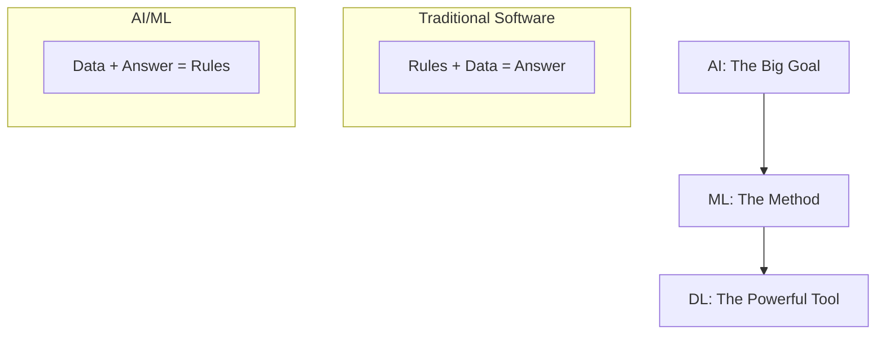

# 01 Introduction to AI

tags:
#ai
#ml
#placements
#interview
#foundations

---

## Why this topic matters
Artificial Intelligence is no longer just a research topic; it's the engine behind almost every modern tech product. In a fresher interview, you aren't expected to build AGI, but you are expected to understand what AI *is*, what it *can do*, and how it differs from traditional software.

## Learning Objectives
- Define Artificial Intelligence (AI).
- Understand the relationship between AI, Machine Learning (ML), and Deep Learning (DL).
- Identify real-world applications of AI.
- Distinguish between Narrow AI and General AI.

## Prerequisites
None. This is the starting point.

---

## Intuition
Imagine you are teaching a child to recognize fruits.
- **Traditional Programming**: You write a rulebook. *"If it's red and round, it's an Apple. If it's yellow and curved, it's a Banana."* This works until the child sees a green apple. Then the rules break.
- **Artificial Intelligence**: Instead of giving rules, you show the child 1,000 pictures of apples and bananas. The child's brain figures out the patterns on its own. *"Oh, round shape + stem = Apple, regardless of color."*

AI is about teaching computers to **learn from experience** (data) rather than following strict instructions (rules).

---

## Detailed Explanation

### What is AI?
Artificial Intelligence (AI) is the science of making machines "smart." It's the ability of a computer system to perform tasks that typically require human intelligence, such as:
- **Perception** (Seeing, Hearing)
- **Reasoning** (Solving puzzles, making decisions)
- **Learning** (Improving from experience)
- **Language** (Understanding and generating text)

### The "Russian Doll" Hierarchy
AI is often confused with ML and DL. Think of them as nested dolls:

1. **Artificial Intelligence (AI)**: The broad umbrella. Any technique that makes a machine intelligent.
2. **Machine Learning (ML)**: A subset of AI. It uses statistical methods to let machines "learn" from data. (e.g., Predicting house prices).
3. **Deep Learning (DL)**: A subset of ML. It uses **Neural Networks** to solve complex problems like image recognition or translation.

### Types of AI
| Type | Description | Existence | Example |
| :--- | :--- | :--- | :--- |
| **ANI (Artificial Narrow Intelligence)** | Good at *one* specific task. | **Exists Today** | Siri, Alexa, Chess Bots, Spam Filters. |
| **AGI (Artificial General Intelligence)** | Can think like a human across *any* task. | **Theoretical** | C-3PO, Wall-E. |
| **ASI (Artificial Super Intelligence)** | Smarter than the best human brain at *everything*. | **Sci-Fi** | The Matrix, Terminator. |

> [!NOTE]
> In interviews, when we talk about "AI Jobs," we are almost exclusively talking about **ANI**. We are building tools that are experts at one thing.

---

## Real-world Example
**Netflix Recommendation System**
Netflix doesn't have a human manually pick movies for you. It uses **AI** to analyze your watch history, compare it with millions of other users, and predict what you might like next.
- **AI Goal**: Keep you watching.
- **ML Method**: Collaborative Filtering.
- **DL Application**: Analyzing video thumbnails to see which ones you click.

---

## Advantages
- **Automation**: Can perform repetitive tasks 24/7 without fatigue.
- **Pattern Recognition**: Can find hidden patterns in data that humans would miss.
- **Scalability**: Once trained, an AI model can serve millions of users instantly.

## Limitations
- **Data Hungry**: Needs massive amounts of data to learn.
- **Black Box**: It's often hard to explain *why* an AI made a specific decision.
- **Bias**: If the training data is biased, the AI will be biased too.

---

## Common Interview Questions
- **What is the difference between AI, ML, and DL?**
- **Explain Narrow AI vs. General AI.**
- **Give an example of AI in daily life.**
- **Can AI "think" like a human?**

### Interview Answer Tips
- Always start with the **Hierarchy** (AI > ML > DL).
- Use the **Child/Fruit analogy** to explain the difference between traditional programming and AI.
- Clarify that current AI is **Narrow**, not General.

---

## Common Mistakes
- Using "AI" and "ML" interchangeably. (All ML is AI, but not all AI is ML).
- Thinking AI is "magic." (It's just math and statistics).
- Believing AGI exists today.

---

## Summary
AI is the broad goal of intelligent machines. ML is the statistical method we use to achieve it, and DL is a powerful technique within ML. Today, we only have "Narrow AI" that excels at specific tasks.

---

## Practice Questions
1. Is a calculator considered AI? Why or why not?
2. If a program plays Chess using a hardcoded list of moves, is it AI?
3. What is the main limitation of "Traditional Programming" compared to ML?
4. Why is Deep Learning considered a subset of Machine Learning?
5. Which type of AI is used in self-driving cars: ANI, AGI, or ASI?

---

## Mini Project Ideas
1. **AI or Not?**: Create a list of 20 tech products and classify them as AI or Traditional Software.
2. **Chat with a Bot**: Interact with a simple rule-based chatbot vs. an AI chatbot (like ChatGPT) and note the differences.

---

## Further Reading
- [[02 Machine Learning vs Deep Learning]]
- [[03 AI Development Lifecycle]]
- [[11 Linear Regression]]