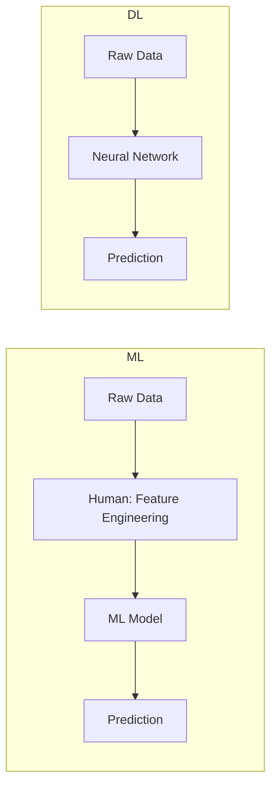

# 02 Machine Learning vs Deep Learning

tags:
#ml
#deep-learning
#ai
#placements
#interview

---

## Why this topic matters
In interviews, you will often be asked: *"Should I use Machine Learning or Deep Learning for this problem?"* Choosing the wrong one can lead to an overly complex system (using a sledgehammer to crack a nut) or a poor-performing one.

## Learning Objectives
- Differentiate between Machine Learning (ML) and Deep Learning (DL).
- Understand when to use ML vs. DL.
- Learn the "Feature Engineering" gap.

## Prerequisites
- [[01 Introduction to AI]]

---

## Intuition
Imagine you are building a system to detect **Spam Emails**.

**Machine Learning (The Assistant)**
You (the human) have to tell the assistant what to look for.
- *"Hey, mark an email as spam if it has the words 'Lottery' or 'Winner'."*
- *"Mark it as spam if the sender is unknown."*
You are doing the hard work of identifying the **Features**. The ML algorithm just learns the *weight* of these features.

**Deep Learning (The Genius Intern)**
You just dump 100,000 spam emails and 100,000 normal emails on the intern's desk and say: *"Figure it out."*
The intern reads them all, notices patterns you never saw (like specific punctuation marks, time of day, header structures), and builds their own rules. They do the **Feature Engineering** for you.

---

## Detailed Explanation

### Machine Learning (ML)
ML uses statistical algorithms to map inputs to outputs.
- **Input**: Raw Data.
- **Human Role**: **Feature Extraction**. You must convert raw data into numbers (e.g., "Count of exclamation marks," "Length of email").
- **Algorithms**: Linear Regression, Decision Trees, Random Forest, SVM, KNN.
- **Data Needs**: Works well with small to medium datasets (1,000 to 100,000 rows).
- **Hardware**: Runs on standard CPUs.

### Deep Learning (DL)
DL uses **Neural Networks** with many layers ("Deep") to learn representations.
- **Input**: Raw Data (Pixels, Text, Audio).
- **Human Role**: Minimal. You design the *architecture* (e.g., CNN for images), but the network learns the features automatically.
- **Algorithms**: CNNs, RNNs, Transformers.
- **Data Needs**: Needs massive data (1 Million+ rows) to avoid overfitting.
- **Hardware**: Requires GPUs/TPUs for training.

### Comparison Table
| Feature | Machine Learning | Deep Learning |
| :--- | :--- | :--- |
| **Data Dependency** | Low to Medium | Very High |
| **Hardware** | CPU | GPU / TPU |
| **Feature Eng.** | Manual & Critical | Automatic |
| **Training Time** | Minutes to Hours | Hours to Weeks |
| **Interpretability** | High (Easy to explain) | Low (Black Box) |
| **Best Use Case** | Structured Data (Tables) | Unstructured Data (Images, Text) |

> [!TIP]
> **The Rule of Thumb**:
> - If you have **structured data** (Excel sheets, SQL tables) and less than 100k rows, start with **ML** (Random Forest/XGBoost).
> - If you have **unstructured data** (Images, Audio, Text) or massive data, go for **DL**.

---

## Real-world Example
**Facial Recognition**
- **ML Approach**: You manually measure the distance between eyes, width of the nose, and jawline. Then you feed these measurements to a classifier. (Hard to scale).
- **DL Approach (Facebook)**: You feed raw pixels into a Convolutional Neural Network (CNN). The network learns that "eye distance" and "nose shape" are important features on its own.

---

## Advantages
- **ML**: Faster to train, easier to debug, works on small data.
- **DL**: State-of-the-are accuracy, automates feature engineering.

## Limitations
- **ML**: Performance plateaus with complex data (images).
- **DL**: Needs massive compute, hard to debug, "Black Box."

---

## Common Interview Questions
- **What is the main difference between ML and DL?**
- **When would you choose ML over DL?**
- **Why does Deep Learning require GPUs?**
- **What is Feature Engineering?**

### Interview Answer Tips
- Emphasize **Data Size** and **Feature Engineering** as the deciding factors.
- Mention that DL is not "better," just different. For a small hotel booking dataset, a Decision Tree (ML) is better than a Transformer (DL).

---

## Common Mistakes
- Using DL for a simple spreadsheet prediction task.
- Assuming DL always gives better results (it doesn't, if data is small).

---

## Summary
Machine Learning relies on humans to identify features, while Deep Learning automates this using Neural Networks. ML is best for structured, small data; DL is best for unstructured, massive data.

---

## Practice Questions
1. You have a dataset of 5,000 customer records in an Excel sheet. Which approach do you choose?
2. Why is a GPU necessary for Deep Learning?
3. What is "Feature Engineering" and why is it critical in ML?
4. Can Deep Learning work on structured tabular data? (Answer: Yes, but often ML is better).
5. Explain why DL is called a "Black Box."

---

## Mini Project Ideas
1. **ML**: Predict house prices using a dataset from Kaggle (Structured Data).
2. **DL**: Classify images of cats vs. dogs using a pre-trained CNN (Unstructured Data).

---

## Further Reading
- [[01 Introduction to AI]]
- [[23 Neural Networks]]
- [[39 Embeddings]]
- [[43 Prompt Engineering]]