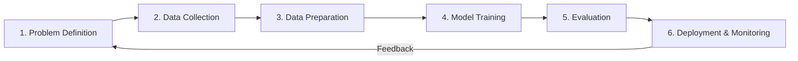

# 03 AI Development Lifecycle

tags:
#ai
#ml
#mlops
#placements
#interview

---

## Why this topic matters
Building an AI model is not just about training code. In a company, an AI project involves data collection, cleaning, training, deploying, and monitoring. Interviewers want to see that you understand the **end-to-end process**, not just the math.

## Learning Objectives
- Understand the 6 stages of the AI Lifecycle.
- Learn why "Data" takes up 80% of the time.
- Understand the difference between a "Jupyter Notebook" and "Production."

## Prerequisites
- [[01 Introduction to AI]]
- [[02 Machine Learning vs Deep Learning]]

---

## Intuition
Imagine you are a **Chef** creating a new dish for a restaurant.
1. **Requirement**: What are we cooking? (Prediction Task).
2. **Data Collection**: Buying ingredients. (Gathering Data).
3. **Preprocessing**: Washing, chopping, marinating. (Cleaning Data).
4. **Cooking**: Putting it in the pan. (Training the Model).
5. **Tasting**: Is it salty enough? (Evaluation).
6. **Serving**: Putting it on the menu. (Deployment).
7. **Feedback**: Asking customers if they liked it. (Monitoring).

If your ingredients (Data) are rotten, even the best cooking (Algorithm) won't save the dish.

---

## Detailed Explanation

### The 6 Stages of AI Development

1. **Problem Definition**:
   - Is this even an AI problem?
   - What is the metric for success? (e.g., "95% Accuracy" or "Latency < 100ms").

2. **Data Collection**:
   - **Internal**: SQL Databases, Logs, CSV files.
   - **External**: APIs, Web Scraping, Open Datasets (Kaggle, HuggingFace).
   - *Challenge*: Data privacy and licensing.

3. **Data Preparation (The 80% Work)**:
   - **Cleaning**: Handling missing values, removing duplicates.
   - **Labeling**: For Supervised Learning, you need "Answers" (Labels).
   - **Splitting**: Train / Validation / Test sets.
   - *Quote*: "Garbage In, Garbage Out."

4. **Model Training**:
   - Choosing the algorithm (e.g., Random Forest vs. Neural Net).
   - Tuning Hyperparameters (Learning Rate, Depth of trees).
   - Using GPUs for acceleration.

5. **Evaluation**:
   - Testing on unseen data (Test Set).
   - Metrics: Accuracy, Precision, Recall, F1-Score, RMSE.
   - *Crucial*: Check for Overfitting.

6. **Deployment & Monitoring**:
   - Wrapping the model in an API (e.g., FastAPI).
   - **Monitoring**: Is the data changing over time? (Data Drift).

> [!WARNING]
> **The "Demo vs. Production" Trap**:
> A model in a Jupyter Notebook is a "Prototype." It becomes a "Product" only after Deployment, Monitoring, and Security are added.

---

## Real-world Example
**Uber ETAs**
1. **Problem**: Predict arrival time within 1 minute.
2. **Data**: Historical GPS trips, traffic data, weather.
3. **Prep**: Remove trips where GPS failed. Normalize speed.
4. **Train**: Gradient Boosting model.
5. **Eval**: Test on last week's trips.
6. **Deploy**: API serves predictions to the rider's app.
7. **Monitor**: If traffic patterns change due to a new road, retrain the model.

---

## Advantages
- Systematic approach reduces project failure.
- Ensures the model actually solves a business problem.
- Promotes maintainability.

## Limitations
- Iterative. You often have to go back to "Step 2" when the model fails.
- Time-consuming.

---

## Common Interview Questions
- **What are the stages of an ML project?**
- **Why do we split data into Train and Test sets?**
- **What happens if you skip Data Preprocessing?**
- **What is "Data Drift"?**

### Interview Answer Tips
- Emphasize that **Data Preparation** is the most time-consuming part (not training).
- Mention **Monitoring** as a critical step often ignored by students.

---

## Common Mistakes
- Training on the Test Data (Data Leakage).
- Ignoring the "Business Problem" and focusing only on "Accuracy."

---

## Summary
The AI Lifecycle is a loop: Define $\rightarrow$ Collect $\rightarrow$ Clean $\rightarrow$ Train $\rightarrow$ Evaluate $\rightarrow$ Deploy $\rightarrow$ Monitor. A successful AI engineer spends the most time on Data Preparation and Deployment.

---

## Practice Questions
1. Why is the "Test Set" never shown to the model during training?
2. What percentage of time is typically spent on Data Cleaning vs. Model Training?
3. If your model has 99% accuracy on training data but 50% on test data, what is the problem?
4. Why is "Problem Definition" important before collecting data?
5. What is the difference between "Validation Data" and "Test Data"?

---

## Mini Project Ideas
1. **End-to-End Pipeline**: Pick a Kaggle dataset. Clean it, Train a model, Evaluate it, and Save the model file (`.pkl`).
2. **Data Audit**: Take a raw dataset. List all the "issues" you find (missing values, outliers, duplicates).

---

## Further Reading
- [[05 Data Cleaning]]
- [[10 Model Evaluation]]
- [[27 Data Drift]]
- [[58 MLOps]]