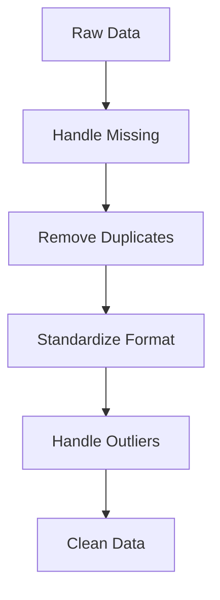

# 05 Data Cleaning

tags:
#ml
#data
#placements
#interview

---

## Why this topic matters
Real-world data is messy. It has missing values, typos, and inconsistencies. In interviews, you might be given a dirty dataset and asked, *"How would you prepare this for a model?"* If you feed garbage data to a model, it will give you garbage results.

## Learning Objectives
- Handle missing data (NaN).
- Remove duplicates.
- Fix inconsistent formatting.
- Detect and handle outliers.

## Prerequisites
- [[04 Python for ML]] (Pandas basics).

---

## Intuition
Imagine you are a **Librarian** organizing books.
- Some books have **missing titles** (Missing Values).
- Some books are **exactly the same** (Duplicates).
- Some titles are written in **ALL CAPS** and others in lowercase (Inconsistency).
- Some books claim to be **1,000 years old** (Outliers/Errors).

You cannot let people search the library until you fix these issues. Similarly, a model cannot learn from dirty data.

---

## Detailed Explanation



### 1. Handling Missing Values
You have three main options:
- **Drop**: Remove the row/column. (Good if only 1% is missing).
- **Impute**: Fill with a placeholder (Mean, Median, Mode, or "Unknown").
- **Predict**: Use another ML model to guess the missing value (Advanced).

```python
import pandas as pd
# Drop rows with any missing value
df.dropna()

# Fill missing 'Age' with the Median age
df['Age'].fillna(df['Age'].median(), inplace=True)
```

### 2. Removing Duplicates
Duplicates can bias the model (making it think certain data is more common than it is).
```python
# Remove exact duplicate rows
df.drop_duplicates(inplace=True)
```

### 3. Standardizing Formats
- **Text**: Lowercase everything. Remove extra spaces.
- **Dates**: Convert all to `YYYY-MM-DD` format.
- **Categories**: Fix typos ("USA", "U.S.A.", "America" $\rightarrow$ "USA").

```python
# Lowercase and strip whitespace
df['Name'] = df['Name'].str.lower().str.strip()
```

### 4. Handling Outliers
Outliers are data points that are extremely different from the rest.
- **Z-Score Method**: If a value is > 3 standard deviations from the mean, it's an outlier.
- **IQR Method**: Values below $Q1 - 1.5 \times IQR$ or above $Q3 + 1.5 \times IQR$.

```python
# Cap outliers at the 95th percentile
upper_limit = df['Salary'].quantile(0.95)
df['Salary'] = df['Salary'].clip(upper=upper_limit)
```

> [!WARNING]
> **Don't delete outliers blindly!**
> In Fraud Detection, the "outlier" IS the fraud. Always ask: *"Is this an error, or is this a rare but real event?"*

---

## Real-world Example
**Zomato/Swiggy**
When aggregating millions of restaurants, they deal with:
- Missing phone numbers (Impute with "Not Available").
- Duplicate listings for the same restaurant (Merge them).
- Cuisine names like "Italian", "italian ", "ITA" (Standardize to "Italian").
- A restaurant with a 500-year average delivery time (Error/Outlier $\rightarrow$ Remove).

---

## Advantages
- Improves model accuracy significantly.
- Prevents models from crashing on unexpected formats.
- Reduces bias.

## Limitations
- Time-consuming (often 80% of the project).
- Imputing data can introduce bias if done incorrectly.

---

## Common Interview Questions
- **How do you handle missing data?**
- **What is the difference between dropping and imputing?**
- **How do you detect outliers?**
- **Why is data cleaning important?**

### Interview Answer Tips
- Mention that the **method depends on the amount of missing data**. (If 50% is missing, drop the column; if 5%, impute).
- Always check for **Duplicates** first.

---

## Common Mistakes
- Filling missing numerical data with `0` instead of Mean/Median.
- Deleting outliers without investigating them.
- Forgetting to clean the Test data in the same way as Training data.

---

## Summary
Data Cleaning is the process of fixing errors, filling gaps, and standardizing formats in your dataset. It is the prerequisite for any successful Machine Learning project.

---

## Practice Questions
1. When would you choose to drop a column instead of imputing it?
2. What is the difference between Mean and Median? Which is better for imputing?
3. How do you find duplicate rows in a Pandas DataFrame?
4. Why is the IQR method better than Z-Score for skewed data?
5. If you clean your training data, do you need to clean the test data?

---

## Mini Project Ideas
1. **Data Doctor**: Download a "dirty" dataset from Kaggle. Write a script to fix all missing values and duplicates.
2. **Outlier Hunter**: Generate random data with 5 extreme outliers. Write code to detect and remove them using Z-Score.

---

## Further Reading
- [[04 Python for ML]]
- [[06 Feature Engineering]]
- [[03 AI Development Lifecycle]]