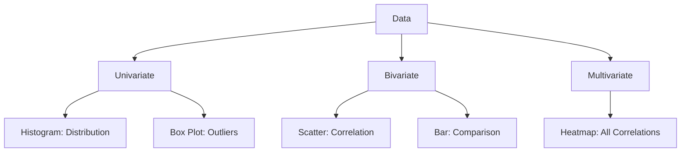

# 07 Data Visualization

tags:
#ml
#data
#viz
#placements
#interview

---

## Why this topic matters
Data Visualization is the art of "seeing" your data. Before you train a model, you need to understand the distribution, correlations, and anomalies. In interviews, you may be asked to interpret a graph or explain which chart you would use for a specific scenario.

## Learning Objectives
- Understand when to use Histograms, Box Plots, Scatter Plots, and Heatmaps.
- Learn to detect patterns and outliers visually.
- Master Correlation Heatmaps.

## Prerequisites
- [[04 Python for ML]] (Matplotlib/Seaborn basics).

---

## Intuition
Imagine you are a **Detective** at a crime scene.
- **Raw Data**: Thousands of witness statements, photos, and evidence bags.
- **Visualization**: A "Detective Board" with strings connecting suspects, maps of locations, and timelines.

You don't read every paper individually; you look at the board to see the *pattern*. Visualization does the same for data—it turns rows of numbers into pictures that reveal the story.

---

## Detailed Explanation

### 1. Univariate Analysis (One Variable)
Understanding a single feature.

#### Histogram
Shows the distribution (frequency) of a continuous variable.
- **Use**: Check if data is Normal (Bell Curve) or Skewed.
```python
plt.hist(df['Age'], bins=20)
```

#### Box Plot (Box-and-Whisker)
Shows the median, quartiles, and **Outliers**.
- **Use**: Detect outliers instantly.
```python
sns.boxplot(x=df['Salary'])
```

### 2. Bivariate Analysis (Two Variables)
Understanding the relationship between two features.

#### Scatter Plot
Plots two continuous variables against each other.
- **Use**: Check for correlations (Linear, Non-linear).
```python
plt.scatter(df['Age'], df['Salary'])
```

#### Bar Plot
Compares a numerical variable across categories.
- **Use**: Compare average sales per region.
```python
sns.barplot(x='Region', y='Sales', data=df)
```

### 3. Multivariate Analysis (Many Variables)

#### Correlation Heatmap
A colored grid showing how strongly every pair of features is related.
- **Range**: -1 (Negative) to +1 (Positive). 0 means no relationship.
- **Use**: Feature Selection (remove highly correlated features).
```python
sns.heatmap(df.corr(), annot=True, cmap='coolwarm')
```



---

## Real-world Example
**Spotify**
Spotify visualizes millions of song features:
- **Histograms**: To see the distribution of "Tempo" (BPM).
- **Scatter Plots**: To see if "Danceability" correlates with "Popularity".
- **Heatmaps**: To find which genres are most similar to each other based on audio features.

---

## Advantages
- **Pattern Recognition**: Humans are better at spotting trends in images than numbers.
- **Communication**: Easier to explain insights to non-technical stakeholders.
- **Quality Check**: Instantly reveals data errors (e.g., Age = 200).

## Limitations
- Can be misleading if axes are manipulated.
- Too many variables can create a cluttered ("Spaghetti") chart.

---

## Common Interview Questions
- **Which plot would you use to find outliers?**
- **How do you visualize the correlation between 10 variables?**
- **What is the difference between a Histogram and a Bar Chart?**
- **If your data is skewed, which plot shows it best?**

### Interview Answer Tips
- Always start with **Univariate** analysis before jumping to relationships.
- Mention **Heatmaps** as the best way to summarize a dataset's correlations.

---

## Common Mistakes
- Using a Pie Chart for too many categories (hard to read).
- Confusing Histogram (continuous) with Bar Chart (categorical).
- Not labeling axes.

---

## Summary
Data Visualization transforms numbers into insights. Use Histograms for distribution, Box Plots for outliers, Scatter Plots for relationships, and Heatmaps for correlations.

---

## Practice Questions
1. Which plot is best for detecting outliers?
2. What does a correlation of 0.9 mean?
3. Why do we use a Histogram instead of a Bar Chart for Age?
4. If you see a "straight line" in a scatter plot, what does it imply?
5. How many variables can a Heatmap compare simultaneously?

---

## Mini Project Ideas
1. **EDA on Iris Dataset**: Create a Histogram for each flower feature and a Heatmap of correlations.
2. **Outlier Hunt**: Generate a dataset with outliers. Use a Box Plot to identify them visually.

---

## Further Reading
- [[05 Data Cleaning]]
- [[06 Feature Engineering]]
- [[10 Model Evaluation]]