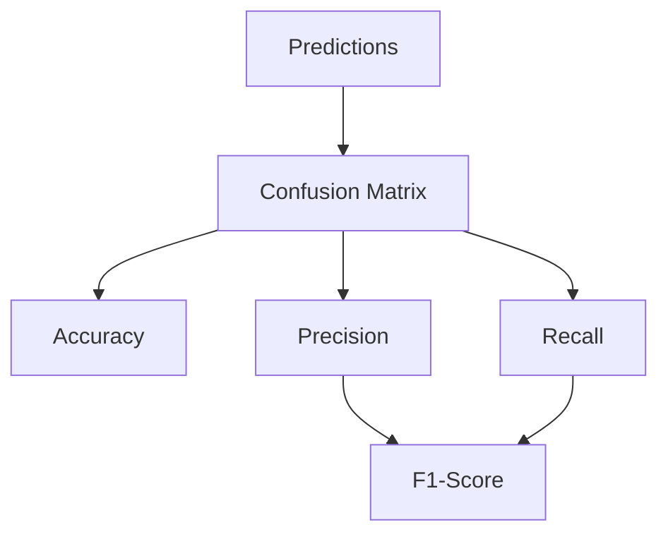

# 08 Model Evaluation

tags:
#ml
#evaluation
#placements
#interview

---

## Why this topic matters
Accuracy is a lie. In a fraud detection system where 99% of transactions are legitimate, a model that predicts "Not Fraud" for everything has 99% accuracy but is useless. In interviews, you must know which metric to trust for which problem.

## Learning Objectives
- Understand the Confusion Matrix.
- Differentiate between Precision, Recall, and F1-Score.
- Learn ROC-AUC for classification.
- Learn RMSE/MAE for regression.

## Prerequisites
- [[11 Linear Regression]]
- [[12 Logistic Regression]]

---

## Intuition
Imagine you are a **Security Guard** at an airport.
- **True Positive (TP)**: You catch a terrorist. (Good).
- **True Negative (TN)**: You let a normal passenger through. (Good).
- **False Positive (FP)**: You arrest an innocent passenger. (Bad! "Type I Error").
- **False Negative (FN)**: You let a terrorist through. (Catastrophic! "Type II Error").

**Accuracy** tells you how often you were right overall.
**Precision** tells you: "When you accused someone, how often were you right?"
**Recall** tells you: "Of all the real terrorists, how many did you catch?"

---

## Detailed Explanation

### 1. The Confusion Matrix
A 2x2 table that summarizes prediction results.

| | Predicted NO | Predicted YES |
| :--- | :---: | :---: |
| **Actual NO** | TN (True Negative) | FP (False Positive) |
| **Actual YES** | FN (False Negative) | TP (True Positive) |

### 2. Classification Metrics

#### Accuracy
$$Accuracy = \frac{TP + TN}{Total}$$
- **Use**: Only when classes are balanced (50/50).

#### Precision
$$Precision = \frac{TP}{TP + FP}$$
- **Meaning**: "How precise are my positive predictions?"
- **Use**: Spam Detection. (Better to miss spam than mark an important email as spam).

#### Recall (Sensitivity)
$$Recall = \frac{TP}{TP + FN}$$
- **Meaning**: "How many actual positives did I find?"
- **Use**: Cancer Detection / Fraud. (Must catch ALL cases; false alarms are okay).

#### F1-Score
$$F1 = 2 \times \frac{Precision \times Recall}{Precision + Recall}$$
- **Meaning**: The harmonic mean of Precision and Recall.
- **Use**: When you need a balance between Precision and Recall.

### 3. Regression Metrics
When predicting numbers (e.g., House Prices).

#### MAE (Mean Absolute Error)
Average of absolute differences.
- **Intuition**: "On average, we are off by $5,000."

#### RMSE (Root Mean Squared Error)
Penalizes large errors more heavily.
- **Intuition**: "One huge mistake makes this score much worse."

### 4. ROC-AUC Curve
- **ROC**: Plots True Positive Rate (Recall) vs. False Positive Rate.
- **AUC**: Area Under the Curve.
  - **1.0**: Perfect model.
  - **0.5**: Random guessing.
  - **< 0.5**: Worse than random (inverted).

> [!WARNING]
> **The Imbalanced Data Trap**:
> If 95% of your data is Class A and 5% is Class B, a model that predicts "Class A" for everything has 95% accuracy but 0% Recall for Class B. Never use Accuracy for imbalanced datasets.

---

## Real-world Example
**YouTube Content Moderation**
- **Goal**: Remove hate speech.
- **Metric**: High **Recall**. (Better to accidentally remove a normal video than to let hate speech stay).
- **Trade-off**: Low Precision (Many normal videos get flagged for review).

---

## Advantages
- Provides a nuanced view of model performance.
- Helps choose the right model for the business goal.

## Limitations
- No single "best" metric; depends on the use case.
- Can be confusing to explain to non-technical stakeholders.

---

## Common Interview Questions
- **What is the difference between Precision and Recall?**
- **Why is Accuracy bad for imbalanced datasets?**
- **What does AUC = 0.5 mean?**
- **When would you prioritize Recall over Precision?**

### Interview Answer Tips
- Always ask: **"What is the cost of a False Positive vs. a False Negative?"**
- Use the **Cancer vs. Spam** analogy.

---

## Common Mistakes
- Using Accuracy for Fraud Detection.
- Thinking a high F1-Score means the model is perfect (check the matrix).
- Ignoring the business context.

---

## Summary
Accuracy is often misleading. Use Precision when false alarms are costly, Recall when missing a case is costly, and F1 for a balance. For regression, use RMSE to penalize large errors.

---

## Practice Questions
1. In a bomb detection system, should you prioritize Precision or Recall?
2. If Precision is 1.0 but Recall is 0.1, what does it mean?
3. What is the range of AUC?
4. Why is RMSE always greater than or equal to MAE?
5. Can a model have high Accuracy but low Recall?

---

## Mini Project Ideas
1. **Confusion Matrix**: Train a simple model on the Titanic dataset. Plot the confusion matrix and calculate Precision/Recall manually.
2. **Metric Comparison**: Train two models. Compare them using Accuracy and F1-Score. See which one is actually better.

---

## Further Reading
- [[12 Logistic Regression]]
- [[16 Random Forest]]
- [[24 Overfitting vs Underfitting]]