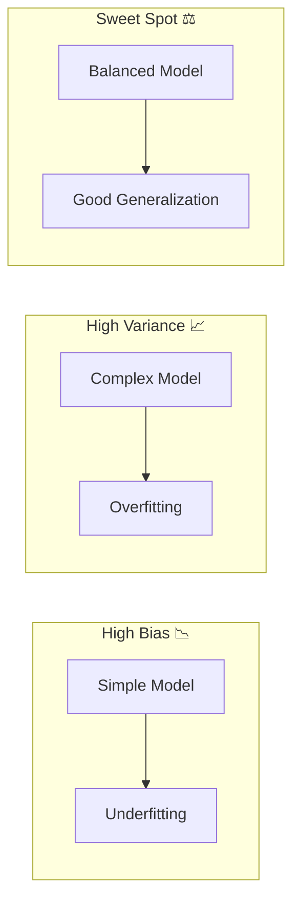

# 09 Bias-Variance Tradeoff

tags:
#ml
#theory
#placements
#interview

---

## Why this topic matters
This is the "Holy Grail" of Machine Learning theory. Every interviewer will eventually ask: *"Is your model overfitting or underfitting?"* Understanding Bias and Variance gives you the vocabulary to diagnose and fix these problems.

## Learning Objectives
- Define Bias and Variance.
- Understand the "Sweet Spot" (Tradeoff).
- Learn how to fix High Bias and High Variance.

## Prerequisites
- [[10 Total Cross Sections]] (Basic ML concepts).

---

## Intuition
Imagine you are **Learning to Shoot Arrows** at a target.

1. **Low Bias, Low Variance (Perfect)**: Your arrows are tight in the Bullseye. 🎯
2. **High Bias, Low Variance (Underfitting)**: Your arrows are tight, but consistently miss to the top-left. You have a "systematic error" (your bow is bent). 🏹↗️
3. **Low Bias, High Variance (Overfitting)**: Your arrows are scattered all around the Bullseye. On average, you are right, but you are inconsistent. 🏹🌀
4. **High Bias, High Variance (Worst)**: Your arrows are scattered wildly AND far from the target. 😵

- **Bias**: Error due to wrong assumptions (Model is too simple).
- **Variance**: Error due to sensitivity to noise (Model is too complex).

---

## Detailed Explanation

### 1. Bias (Underfitting)
The model is too simple to capture the pattern.
- **Symptoms**: High error on Training Data AND Test Data.
- **Example**: Fitting a Straight Line to a curved dataset.
- **Fix**:
  - Increase model complexity (e.g., Polynomial features).
  - Add more features.
  - Reduce regularization.

### 2. Variance (Overfitting)
The model is too complex. It memorizes the noise instead of the pattern.
- **Symptoms**: Low error on Training Data, High error on Test Data.
- **Example**: A Decision Tree with unlimited depth that creates a unique rule for every single data point.
- **Fix**:
  - Simplify the model (Reduce tree depth).
  - Get more data.
  - Add Regularization (L1/L2).
  - Use Ensemble methods (Random Forest).

### 3. The Tradeoff
You cannot minimize both simultaneously.
- As you increase model complexity, **Bias goes down** but **Variance goes up**.
- The goal is to find the **Optimal Point** where Total Error is minimized.

**Total Error = Bias² + Variance + Irreducible Error**

---

## Real-world Example
**Student Exam Prep**
- **High Bias**: A student who only studies the chapter titles. They fail because they know too little (Underfitting).
- **High Variance**: A student who memorizes the exact practice questions by heart. If the exam questions are worded differently, they fail (Overfitting).
- **Sweet Spot**: A student who understands the concepts. They can solve new variations of problems (Generalization).

---

## Advantages
- Provides a diagnostic framework for model errors.
- Guides hyperparameter tuning decisions.

## Limitations
- Hard to quantify exact Bias/Variance in real life (we usually infer from Train/Test gap).

---

## Common Interview Questions
- **What is the Bias-Variance Tradeoff?**
- **How do you detect Overfitting?**
- **What happens to Bias and Variance if you increase model complexity?**
- **How does a Decision Tree relate to Variance?**

### Interview Answer Tips
- Use the **Train vs. Test Error** gap as the diagnostic.
  - High Train Error = Bias.
  - Large Gap (Low Train, High Test) = Variance.

---

## Common Mistakes
- Thinking more data always fixes Bias (it doesn't; you need better features).
- Thinking a complex model is always better (it leads to Variance).

---

## Summary
Bias is error from wrong assumptions (Underfitting). Variance is error from sensitivity to noise (Overfitting). The goal is to balance them to minimize total error.

---

## Practice Questions
1. If Training Accuracy is 99% but Test Accuracy is 60%, is it Bias or Variance?
2. How does adding more features affect Bias?
3. Why does a Deep Neural Network have high Variance risk?
4. What is "Regularization" and how does it help?
5. Can a model have both High Bias and High Variance?

---

## Mini Project Ideas
1. **Polynomial Regression**: Fit a line, a quadratic curve, and a 10th-degree polynomial to the same data. Plot them and identify Bias/Variance.
2. **Decision Tree Depth**: Train a Decision Tree with `max_depth=2` vs `max_depth=None`. Compare Train/Test scores.

---

## Further Reading
- [[24 Overfitting vs Underfitting]]
- [[16 Random Forest]]
- [[26 Regularization]]