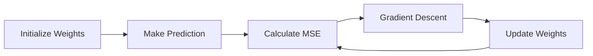

# 10 Linear Regression

tags:
#ml
#regression
#placements
#interview

---

## Why this topic matters
Linear Regression is the "Hello World" of Machine Learning. It's the first algorithm you learn, and interviewers expect you to know it inside-out. It forms the basis for understanding more complex models like Neural Networks.

## Learning Objectives
- Understand the equation of a line ($y = mx + c$).
- Learn how the model "learns" (Cost Function + Gradient Descent).
- Understand assumptions of Linear Regression.

## Prerequisites
- [[04 Python for ML]]
- [[06 Feature Engineering]]

---

## Intuition
Imagine you are a **Real Estate Agent** trying to guess house prices.
You notice that bigger houses cost more. You plot 100 houses on a graph:
- X-axis: Size (sq ft)
- Y-axis: Price ($)

You see a pattern resembling a straight line. You take a ruler and draw the **"Best Fit Line"** through the middle of the dots.
- **Linear Regression** is just the mathematical way to find that perfect ruler position.

The formula is:
$$Price = Slope \times Size + Intercept$$
Or:
$$y = mx + c$$

---

## Detailed Explanation

### 1. The Hypothesis
We assume a linear relationship:
$$y = w_0 + w_1x_1 + w_2x_2 + ...$$
Where:
- $y$: Target (Price)
- $x_i$: Features (Size, Bedrooms, Age)
- $w_i$: Weights (The "slope" for each feature)

### 2. How Does It Learn?
The model needs to find the best $w$ values. It does this in 3 steps:

#### Step A: Make a Prediction
$$\hat{y} = wx + b$$

#### Step B: Calculate Error (Cost Function)
We use **MSE (Mean Squared Error)**. We square the errors to penalize large mistakes.
$$J(w) = \frac{1}{n} \sum_{i=1}^{n} (y_i - \hat{y}_i)^2$$

#### Step C: Gradient Descent
We adjust $w$ slightly to reduce the error. Imagine walking down a hill in a fog; you feel the slope and step downhill.
- **Gradient**: The slope of the error function.
- **Learning Rate**: How big of a step we take.

### 3. Assumptions (Important for Interviews!)
1. **Linearity**: The relationship between X and y is linear.
2. **No Multicollinearity**: Features should not be correlated with each other.
3. **Homoscedasticity**: The variance of errors should be constant.
4. **Normal Distribution**: Errors should be normally distributed.

---

## Real-world Example
**Insurance Premiums**
Insurance companies use Linear Regression to predict premiums based on:
- Age ($x_1$)
- Health Score ($x_2$)
- Smoking Status ($x_3$)
The "slope" for Smoking Status might be high, meaning smokers pay significantly more.

---

## Advantages
- **Simple**: Easy to implement and interpret.
- **Fast**: Trains quickly even on large data.
- **Explainable**: You can say "For every extra bedroom, price increases by $10k."

## Limitations
- **Only Linear**: Cannot capture complex curves.
- **Sensitive to Outliers**: One expensive mansion can skew the whole line.
- **Assumes Independence**: Fails if features are correlated.

---

## Common Interview Questions
- **What is the Cost Function in Linear Regression?**
- **Explain Gradient Descent in simple terms.**
- **What happens if your data has outliers?**
- **Can Linear Regression be used for classification?**

### Interview Answer Tips
- Mention **Squaring the errors** to avoid positive/negative cancellation.
- Explain that **Gradient Descent** is an iterative optimization algorithm.

---

## Common Mistakes
- Not scaling features (Gradient Descent converges slower).
- Using it for non-linear data (e.g., sine waves).
- Ignoring Multicollinearity.

---

## Summary
Linear Regression fits a straight line to data by minimizing the Mean Squared Error using Gradient Descent. It is simple, fast, and interpretable but assumes a linear relationship.

---

## Practice Questions
1. Why do we square the errors in MSE instead of taking absolute value?
2. What is the role of the Learning Rate in Gradient Descent?
3. If the slope ($w_1$) is 0, what does it mean?
4. How does an outlier affect the Best Fit Line?
5. What is the difference between Simple and Multiple Linear Regression?

---

## Mini Project Ideas
1. **House Price Predictor**: Implement Linear Regression from scratch using NumPy.
2. **Calorie Burn**: Predict calories burned based on hours of exercise using Scikit-Learn.

---

## Further Reading
- [[08 Model Evaluation]]
- [[09 Bias-Variance Tradeoff]]
- [[11 Logistic Regression]]