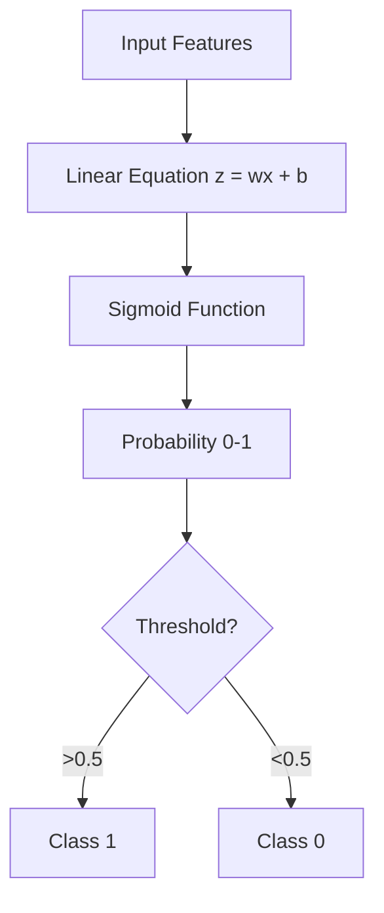

# 11 Logistic Regression

tags:
#ml
#classification
#placements
#interview

---

## Why this topic matters
Despite its name, Logistic Regression is a **Classification** algorithm, not regression. It's the go-to algorithm for Yes/No questions (e.g., "Will this user churn?", "Is this email spam?"). It's a staple in interviews.

## Learning Objectives
- Understand why Linear Regression fails for classification.
- Learn about the Sigmoid Function.
- Understand the Decision Boundary.

## Prerequisites
- [[10 Linear Regression]]

---

## Intuition
Imagine you are a **Bouncer** at a club.
- **Linear Regression** predicts how "old" you are (any number from 0 to 100).
- **Logistic Regression** decides: *"Are you 18 or older?"* (Yes/No).

It takes the output of Linear Regression and squashes it between **0 and 1** using a special "S-curve" called the **Sigmoid Function**.
- If score > 0.5 $\rightarrow$ **Yes (1)**.
- If score < 0.5 $\rightarrow$ **No (0)**.

---

## Detailed Explanation

### 1. The Problem with Linear Regression
If you use a straight line for classification, you can get predictions like "-5" or "3.0". But probabilities must be between 0 and 1. We need a function that forces the output to stay in this range.

### 2. The Sigmoid Function
The magic formula:
$$\sigma(z) = \frac{1}{1 + e^{-z}}$$

This creates an "S" shape:
- If $z$ is very large positive $\rightarrow$ Output is **1**.
- If zero.5 is very large negative $\rightarrow$ Output is **0**.

### 3. Decision Boundary
The line that separates the classes. In 2D, it's a line; in 3D, it's a plane; in higher dimensions, it's a hyperplane.
- By default, the threshold is **0.5**.
- You can adjust it based on Precision/Recall needs ([[08 Model Evaluation]]).

### 4. Cost Function: Log Loss
We cannot use MSE because the Sigmoid curve is non-convex (has many bumps). We use **Log Loss (Binary Cross-Entropy)**:
- If actual is 0 and prediction is 1 $\rightarrow$ HUGE penalty.
- If actual is 1 and prediction is 0 $\rightarrow$ HUGE penalty.

---

## Real-world Example
**Credit Card Approval**
Banks use Logistic Regression to predict: *"Will this applicant default?"*
- Input: Income, Credit Score, Age.
- Output: Probability of Default (0.0 to 1.0).
- Decision: If Prob > 0.7, Reject application.

---

## Advantages
- **Probabilistic**: Gives a probability, not just a label.
- **Efficient**: Fast to train and runs on low-power devices.
- **Interpretable**: Coefficients show which features increase/decrease probability.

## Limitations
- **Linear Boundary**: Cannot solve non-linear problems (like XOR).
- **Sensitive to Outliers**: Like Linear Regression.
- **Struggles with Many Classes** (though can be extended to One-vs-Rest).

---

## Common Interview Questions
- **Why is it called Regression if it's Classification?**
- **What is the Sigmoid Function?**
- **What cost function does Logistic Regression use?**
- **Can Logistic Regression solve the XOR problem?** (Answer: No).

### Interview Answer Tips
- Mention that it outputs a **Probability**, which allows threshold tuning.
- Explain that **Log Loss** penalizes confident wrong predictions heavily.

---

## Common Mistakes
- Thinking it's for predicting numbers.
- Using it when classes are not linearly separable.
- Forgetting to scale features.

---

## Summary
Logistic Regression uses the Sigmoid function to squash a linear equation into a probability between 0 and 1. It is the standard baseline for binary classification problems.

---

## Practice Questions
1. What is the range of outputs from the Sigmoid function?
2. Why can't we use MSE for Logistic Regression?
3. If the probability is 0.8 and threshold is 0.5, what is the class?
4. How does an outlier affect the decision boundary?
5. What is the difference between Linear and Logistic Regression?

---

## Mini Project Ideas
1. **Spam Detector**: Use Logistic Regression to classify emails as Spam or Not Spam.
2. **Diabetes Prediction**: Predict if a patient has diabetes based on BMI, Age, Glucose.

---

## Further Reading
- [[08 Model Evaluation]]
- [[14 Decision Trees]]
- [[26 Regularization]]