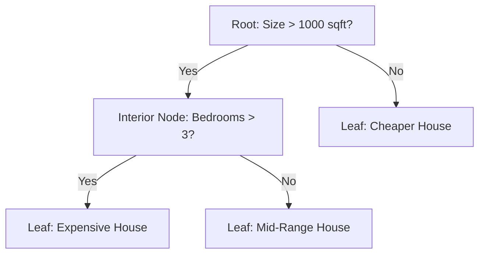

# 12 Decision Trees

tags:
#ml
#classification
#regression
#placements
#interview

---

## Why this topic matters
Decision Trees are the foundation for powerful algorithms like Random Forest and XGBoost. They mimic human decision-making, making them the most interpretable ML algorithm.

## Learning Objectives
- Understand the structure (Root, Leaf, Branch).
- Learn how the tree "splits" data (Gini / Entropy).
- Understand Overfitting risks.

## Prerequisites
- [[09 Bias-Variance Tradeoff]]

---

## Intuition
Imagine you are playing **"20 Questions"**.
You want to guess the animal your friend is thinking of.
1. **Root Question**: "Does it have fur?" (If Yes $\rightarrow$ Go Left, No $\rightarrow$ Go Right).
2. **Next Question**: "Does it bark?"
3. **Final Answer**: "It's a Dog!" (Leaf Node).

A **Decision Tree** is just a flowchart of Yes/No questions that identifies the target.

---

## Detailed Explanation

### 1. Anatomy of a Tree
- **Root Node**: The starting point (entire dataset).
- **Internal Node**: A decision point (split based on a feature).
- **Branch**: The outcome of a decision.
- **Leaf Node**: The final prediction.

### 2. How Does It Choose Questions?
The tree wants to make the groups as "pure" as possible after each split.

#### Gini Impurity (for Classification)
Measures the probability of misclassifying a random element.
- 0 = Perfectly Pure (All "Yes").
- 1 = Totally Mixed (50/50).
- The tree chooses the feature that **reduces Gini the most**.

#### Information Gain (Entropy)
Similar to Gini, but uses logarithms. Popular in ID3/C4.5 algorithms.

#### Variance Reduction (for Regression)
Used when predicting numbers. Picks the split that reduces the variance in child nodes.

### 3. Pruning
Trees have a tendency to memorize data (overfit). **Pruning** cuts off branches that contribute little to accuracy.
- **Pre-Pruning**: Stop early (e.g., "Max Depth = 3").
- **Post-Pruning**: Grow full tree, then cut useless branches.

---

## Real-world Example
**Bank Loan Approval**
1. "Is Credit Score > 700?"
   - Yes: "Approve."
   - No: "Is Income > $50k?"
     - Yes: "Approve with higher interest."
     - No: "Reject."

---

## Advantages
- **Interpretable**: Easy to explain to non-technical stakeholders.
- **No Scaling Needed**: Works with raw numbers and categories.
- **Captures Non-Linearity**: Can solve XOR and complex patterns.

## Limitations
- **Overfitting**: A tree with no limits will memorize the training data.
- **Unstable**: A small change in data can create a completely different tree.
- **Biased**: Favors features with more categories.

---

## Common Interview Questions
- **How does a tree decide where to split?**
- **What is Gini Impurity?**
- **Why are Decision Trees prone to overfitting?**
- **What is Pruning?**

### Interview Answer Tips
- Use the **20 Questions analogy**.
- Explain that **Gini** measures "impurity" (lower is better).

---

## Common Mistakes
- Letting the tree grow without restrictions (`max_depth=None`).
- Thinking it requires scaling (it doesn't).

---

## Summary
Decision Trees split data into smaller groups using features. They are interpretable but prone to overfitting (solved by Random Forest).

---

## Practice Questions
1. What happens if you don't limit the tree depth?
2. What is the difference between Gini and Entropy?
3. Can Decision Trees be used for Regression?
4. Why are trees considered "unstable"?
5. What is a Leaf Node?

---

## Mini Project Ideas
1. **Loan Predictor**: Build a tree to predict loan approval. Visualize the tree using `plot_tree`.
2. **Depth Experiment**: Train trees with `max_depth=1, 5, 10`. Plot the decision boundaries.

---

## Further Reading
- [[09 Bias-Variance Tradeoff]]
- [[13 Random Forest]]
- [[15 Boosting]]