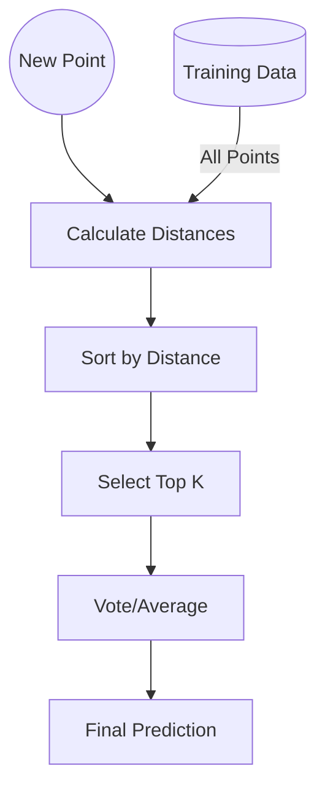

# 14 K-Nearest Neighbors (KNN)

tags:
#ml
#instance-based
#placements
#interview

---

## Why this topic matters
KNN is a lazy algorithm that classifies new data based on what the "most similar" training data points are. It's a great introduction to instance-based learning and distance metrics.

## Learning Objectives
- Understand the distance-based approach.
- Learn hyperparameter K.
- Understand the need for scaling.

## Prerequisites
- [[06 Feature Engineering]] (Scaling).

---

## Intuition
Imagine you move to a new neighborhood. You want to know: *"Which gang/college/sports team do people here support?"*
You look at your **5 nearest neighbors**.
- 4 of them support Team A.
- 1 of them supports Team B.
You conclude: *"I'll support Team A."*

That is **KNN**. You classify based on the company you keep.

---

## Detailed Explanation

### 1. The Algorithm
1. **Store Data**: KNN stores all training data (Lazy Learning).
2. **Distance**: Calculate distance between new point and all training points.
3. **Sort**: Find the K closest points.
4. **Vote**: The majority class among K neighbors wins.

### 2. Distance Metrics
- **Euclidean Distance**: Straight-line distance. (Most common).
- **Manhattan Distance**: Grid-like path (Taxi Cab geometry).
- **Minkowski**: Generalization of both.

$$\text{Euclidean} = \sqrt{(x_2 - x_1)^2 + (y_2 - y_1)^2}$$

### 3. Choosing K
- **Small K (e.g., 1)**: Noisy, high variance. (Susceptible to outliers).
- **Large K (e.g., 100)**: Smoother, high bias. (May overlook patterns).
- **Rule of Thumb**: $K = \sqrt{N}$ (where N is number of samples).

### 4. Why Scaling Matters
KNN uses distance. If one feature is 0-1 (Age) and another is 0-100,000 (Salary), the Salary will dominate the distance calculation. Always scale!

> [!NOTE]
> **Lazy Learning**: KNN does no "training." It just memorizes the data. All computation happens at prediction time.

---

## Real-world Example
**Recommendation System ("People like you bought...")**
Amazon finds K users who have similar purchase history to you. If 4 out of 5 similar users bought a specific camera, Amazon recommends that camera to you.

---

## Advantages
- **Simple**: Easy to understand and implement.
- **No Training**: Instant "training" (just store data).
- **Adaptable**: New data is immediately available for prediction.

## Limitations
- **Slow Prediction**: Must calculate distance to ALL training points for every prediction.
- **Memory Heavy**: Must store the entire dataset.
- **Sensitive to Noise**: Outliers can ruin predictions (if K is small).

---

## Common Interview Questions
- **Why is KNN called "Lazy Learning"?**
- **How do you choose the value of K?**
- **Why does KNN require feature scaling?**
- **What happens if K is too small or too large?**

### Interview Answer Tips
- Mention **Time Complexity**: $O(N \times D)$ for each prediction.
- Explain that **Scaling** is mandatory, not optional.

---

## Common Mistakes
- Forgetting to scale features.
- Using KNN on massive datasets (will be too slow).
- Choosing an even K for binary classification (can lead to ties).

---

## Summary
KNN classifies data based on the majority class of its K nearest neighbors. It's simple and effective for small datasets but slow for large ones due to distance calculations.

---

## Practice Questions
1. Why is KNN slow at prediction time?
2. How does an outlier affect KNN when K=1 vs K=10?
3. Why is an even K problematic for binary classification?
4. What is the difference between Euclidean and Manhattan distance?
5. Can KNN be used for regression?

---

## Mini Project Ideas
1. **Digit Classifier**: Use KNN on the MNIST dataset (downsampled).
2. **K Selection**: Plot Accuracy vs. K value to find the optimal K for a dataset.

---

## Further Reading
- [[06 Feature Engineering]]
- [[09 Bias-Variance Tradeoff]]
- [[16 Clustering]]