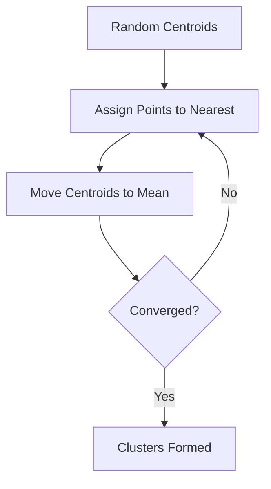

# 16 Clustering (K-Means)

tags:
#ml
#unsupervised
#placements
#interview

---

## Why this topic matters
Most ML is "Supervised" (we have labels). But real-world data often has no labels. **Clustering** helps you find hidden groups in data. K-Means is the most popular algorithm for this.

## Learning Objectives
- Understand Unsupervised Learning.
- Learn the K-Means algorithm.
- Understand how to choose K (Elbow Method).

## Prerequisites
- [[14 K-Nearest Neighbors]] (Distance concepts).

---

## Intuition
Imagine you are a **Teacher** on day one of school. You don't know the students yet (no labels). But you see them grouping naturally:
- Group 1: Kids playing football.
- Group 2: Kids reading books.
- Group 3: Kids chatting.

You didn't tell them where to go. They grouped themselves based on **similarity**. This is **Clustering**.

---

## Detailed Explanation

### 1. Unsupervised vs. Supervised
- **Supervised**: You have answers (e.g., House Prices).
- **Unsupervised**: You have no answers. You just want to find structure.

### 2. K-Means Algorithm
The goal is to partition data into K clusters.

1. **Initialize**: Randomly place K "Centroids" (center points).
2. **Assign**: Assign every point to the nearest Centroid.
3. **Update**: Move the Centroid to the average center of its assigned points.
4. **Repeat**: Keep doing steps 2 & 3 until Centroids stop moving.

### 3. Choosing K (Elbow Method)
How many clusters? We don't know!
- Run K-Means for K = 2, 3, 4, 5...
- Calculate **Inertia** (distance from points to centroid).
- Plot K vs. Inertia.
- The "Elbow" point where the improvement drops off is the best K.

### 4. WCSS (Within-Cluster Sum of Squares)
A measure of compactness. Lower WCSS = tighter clusters.

---

## Real-world Example
**Customer Segmentation**
A marketing team at Amazon has 1M users but no labels. They use K-Means to find:
- **Cluster 1**: Big spenders, buy tech, order daily.
- **Cluster 2**: Bargain hunters, buy only on sale.
- **Cluster 3**: Gift buyers, order only in December.
Amazon now targets each group differently.

---

## Advantages
- **Simple**: Easy to implement and interpret.
- **Fast**: Scales well with large data.
- **Convergence**: Guaranteed to converge.

## Limitations
- **Choose K**: You must manually select K.
- **Sensitive to Initialization**: Bad random starts lead to poor results (Solved by K-Means++).
- **Spherical Clusters Only**: Fails if clusters are shaped like crescents or rings.

---

## Common Interview Questions
- **What is the difference between Classification and Clustering?**
- **How does K-Means work?**
- **How do you find the optimal K?**
- **What is the Elbow Method?**

### Interview Answer Tips
- Mention **K-Means++**, a smarter initialization method.
- Clarify that Clustering is **Unsupervised** (no labels).

---

## Common Mistakes
- Using K-Means on data with different scales (Scale first!).
- Assuming K-Means can find non-spherical clusters.
- Forgetting that K-Means is sensitive to outliers.

---

## Summary
K-Means is an Unsupervised algorithm that finds K groups in data based on distance to centroids. It is widely used for customer segmentation and pattern discovery.

---

## Practice Questions
1. What is the difference between KNN and K-Means?
2. Why is scaling important for K-Means?
3. What happens if K is too large?
4. What is Inertia?
5. Can K-Means handle clusters of different sizes?

---

## Mini Project Ideas
1. **Customer Segmentation**: Cluster Mall Customers dataset based on Income and Spending Score.
2. **Elbow Plot**: Write code to find the optimal K using the Elbow Method.

---

## Further Reading
- [[17 PCA]]
- [[14 K-Nearest Neighbors]]
- [[03 AI Development Lifecycle]]