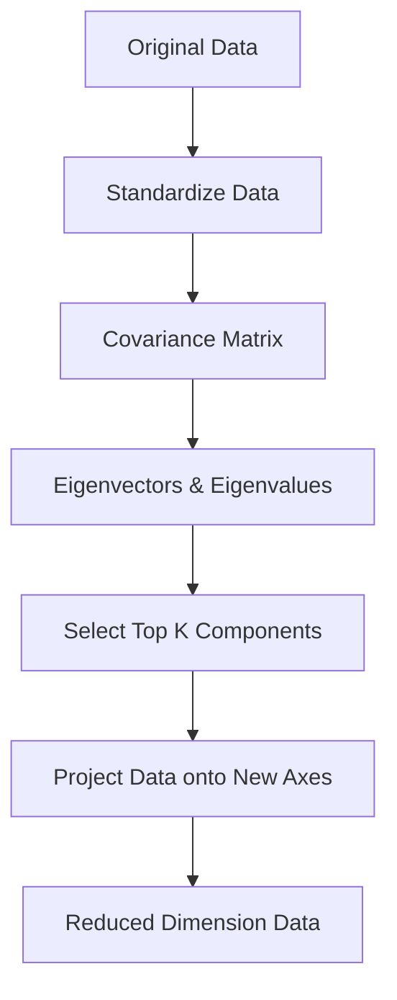

# 17 PCA (Dimensionality Reduction)

tags:
#ml
#pca
#dimensionality-reduction
#placements
#interview

---

## Why this topic matters
Real datasets can have hundreds of features, causing the "Curse of Dimensionality" (models become slow and inaccurate). **PCA (Principal Component Analysis)** helps you reduce the number of features while keeping the important information.

## Learning Objectives
- Understand the Curse of Dimensionality.
- Learn how PCA finds "Principal Components."
- Understand Variance and Information retention.
- Know when to use PCA.

## Prerequisites
- [[06 Feature Engineering]]
- Basic Linear Algebra (vectors, matrices).

---

## Intuition
Imagine you are taking a photo of a **sculpture**.
- **Original Data**: The 3D sculpture (3 dimensions: height, width, depth).
- **PCA**: You want to take a 2D photo that best represents the sculpture.

You don't just take a random photo. You find the **angle** that shows the most detail and captures the most "variation" in the sculpture.
- That perfect angle is a **Principal Component**.

PCA rotates your view to find the "best photo" (highest variance) and lets you ignore the "boring" angles where nothing changes.

---

## Detailed Explanation

### 1. The Curse of Dimensionality
As features increase:
- Data becomes **sparse** (spread too thin).
- Models need **exponentially more data** to generalize.
- Distance metrics (like in KNN) become meaningless.

PCA reduces features to solve this.

### 2. How PCA Works (Step-by-Step)

1. **Standardize**: Scale data to have mean=0, variance=1. (Critical! PCA is scale-sensitive).
2. **Covariance Matrix**: Calculate how features relate to each other.
3. **Eigenvectors**: Find the directions (axes) where data varies the most. These are the **Principal Components**.
4. **Eigenvalues**: Tell you how much variance (information) each component captures.
5. **Project**: Rotate data onto the new axes and drop the low-variance ones.

### 3. Explained Variance Ratio
Tells you how much information each component keeps.

**Example:**
- PC1: 70% variance
- PC2: 20% variance
- PC3: 10% variance

If you keep PC1 & PC2, you retain **90%** of the original data's "shape" but with only 2 features instead of 3.

### 4. How Many Components to Keep?
- **Elbow Method**: Plot variance vs. number of components. Look for the "elbow."
- **Threshold**: Keep enough components to explain 90-95% of variance.

---

## Real-world Example
**Image Compression**
A 1000×1000 pixel image has 1 million features (pixels). PCA can reduce this to ~100 components that capture 95% of the visual information. The image is now 1/10th the size but looks almost the same.

**Genomics**
DNA data can have 20,000+ features (genes). PCA reduces this to 50-100 components for visualization and analysis.

---

## Advantages
- **Speed**: Reduces training time significantly.
- **Visualization**: Lets you plot high-dimensional data in 2D or 3D.
- **Noise Reduction**: Removes low-variance (noisy) features.
- **Multicollinearity**: Removes correlated features (good for Linear Regression).

## Limitations
- **Interpretability**: Principal Components are combinations of original features, hard to explain.
  - Example: PC1 = `0.7×Age + 0.3×Salary - 0.5×Distance`
- **Linear**: Assumes linear relationships between features.
- **Scale-Sensitive**: Must standardize data first.

---

## Common Interview Questions
- **What is PCA and why use it?**
- **Why do we standardize data before PCA?**
- **What are Eigenvectors and Eigenvalues in PCA?**
- **How do you decide how many components to keep?**
- **Can PCA be used for non-linear data?** (Answer: No, use Kernel PCA).

### Interview Answer Tips
- Emphasize that **variance = information**.
- Mention that **standardization is mandatory** (features with large scales would dominate).
- Explain that PCs are **orthogonal** (uncorrelated) to each other.

---

## Common Mistakes
- Forgetting to scale data before PCA.
- Trying to interpret Principal Components literally.
- Using PCA on data with non-linear relationships.
- Keeping too few components and losing important information.

---

## Summary
PCA is a dimensionality reduction technique that finds new axes (Principal Components) that capture maximum variance. It reduces features while preserving information, but sacrifices interpretability.

---

## Practice Questions
1. Why is standardization required before PCA?
2. What does an eigenvalue of 0.5 mean?
3. If PC1 explains 60% and PC2 explains 30%, how much total variance is retained?
4. Can you use PCA for feature selection?
5. What happens if you apply PCA to already uncorrelated features?

---

## Mini Project Ideas
1. **Visualization**: Use PCA to reduce the Iris dataset (4 features) to 2D and plot it.
2. **Face Recognition**: Apply PCA to a faces dataset (Eigenfaces) and see how many components are needed for recognition.
3. **Elbow Plot**: Write code to find the optimal number of components using the elbow method.

---

## Further Reading
- [[06 Feature Engineering]]
- [[14 K-Nearest Neighbors]] (Curse of Dimensionality)
- [[16 Clustering]]
- [[07 Data Visualization]]