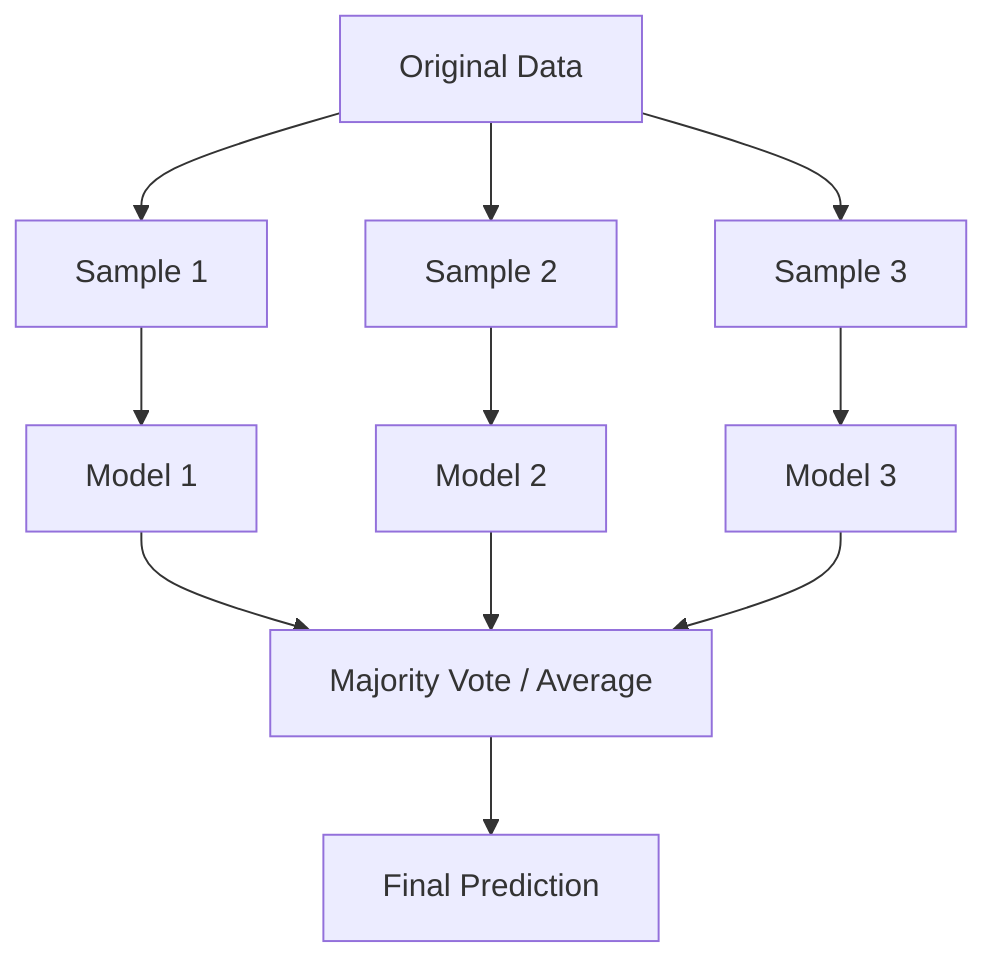

# 19 Ensemble Learning

tags:
#ml
#ensemble
#boosting
#bagging
#placements
#interview

---

## Why this topic matters
Ensemble Learning is the science of combining multiple models to create a stronger one. It's the secret sauce behind winning Kaggle competitions and modern frameworks like **XGBoost**, **LightGBM**, and **Random Forest**. The core idea: **A committee of experts is better than one expert.**

## Learning Objectives
- Understand Bagging vs. Boosting.
- Learn Stacking and Voting classifiers.
- Differentiate between Weak and Strong learners.
- Understand why ensembles work.

## Prerequisites
- [[12 Decision Trees]]
- [[13 Random Forest]]
- [[09 Bias-Variance Tradeoff]]

---

## Intuition
Imagine you are betting on a horse race.

**Single Model**: You trust one expert's prediction. They might be having a bad day.

**Ensemble**: You ask 100 experts and combine their predictions. Even if some are wrong, the majority usually agrees on the right answer.

This is **Ensemble Learning**: Combining multiple "weak" models to form one "strong" model.

### Two Main Strategies:

**Bagging (Parallel)**: All experts work **independently** and vote.
- Goal: Reduce **Variance** (prevent overfitting).
- Example: [[13 Random Forest]].

**Boosting (Sequential)**: Experts work **one after another**. Each new expert studies the mistakes of the previous one and tries to fix them.
- Goal: Reduce **Bias** (make model stronger).
- Example: AdaBoost, Gradient Boosting, XGBoost.

---

## Detailed Explanation

### 1. Bagging (Bootstrap Aggregating)

**Method**:
1. Create multiple random subsets of data (with replacement = **Bootstrap**).
2. Train a model on each subset **in parallel**.
3. Combine predictions:
   - **Classification**: Majority vote.
   - **Regression**: Average.



**Characteristics**:
- Models are independent.
- Reduces **variance**.
- Can be parallelized (fast training).
- Best for high-variance models (deep trees).

### 2. Boosting

**Method**:
1. Train first model on all data.
2. Identify which samples were misclassified.
3. Train next model, giving **more weight** to misclassified samples.
4. Repeat for N models.
5. Combine with **weighted voting** (better models get more say).

```mermaid
flowchart LR
    M1[Model 1] --> Errors[Find Errors]
    Errors --> M2[Model 2 (Focus on Errors)]
    M2 --> Errors2[Find Errors]
    Errors2 --> M3[Model 3 (Focus on New Errors)]
    M3 --> Combine[Weighted Sum]
    Combine --> Final[Final Prediction]
```

**Characteristics**:
- Models are sequential (depend on previous).
- Reduces **bias**.
- Cannot be parallelized easily (slower).
- Risk of overfitting if too many models.

### 3. Popular Boosting Algorithms

| Algorithm | Key Feature |
| :--- | :--- |
| **AdaBoost** | Adjusts sample weights. Short tree stumps. |
| **Gradient Boosting** | Fits residuals (errors) instead of weights. |
| **XGBoost** | Optimized Gradient Boosting. Fast, regularized. |
| **LightGBM** | Extremely fast, uses histogram-based splitting. |
| **CatBoost** | Handles categorical features automatically. |

### 4. Stacking (Stacked Generalization)

Train **different types** of models (e.g., SVM, Tree, Regression), then use their predictions as inputs to a final **meta-model**.

```
Level 0: [Logistic Regression] [Decision Tree] [SVM]
              ↓              ↓           ↓
Level 1:        [Meta-Model (e.g., Linear Regression)]
                        ↓
                 Final Prediction
```

### 5. Voting Classifier

- **Hard Vote**: Most common class wins.
- **Soft Vote**: Average probabilities (usually better).

---

## Real-world Example

**Netflix Prize**
The winning team used an ensemble of **over 100 different models** blended together. The combination outperformed any single model by over 10%.

**Kaggle Competitions**
Almost every winning solution uses ensemble methods, particularly **XGBoost** or **LightGBM** combined with neural networks.

---

## Advantages
- **Better Performance**: Ensembles rarely underperform individual models.
- **Robust**: Less prone to overfitting (especially Bagging).
- **Flexibility**: Can mix different algorithm types.
- **State-of-the-Art**: XGBoost/LightGBM are industry standards for tabular data.

## Limitations
- **Complexity**: Harder to interpret ("Black Box").
- **Computation**: More models = slower training/prediction.
- **Boosting Risks**: Can overfit quickly on noisy data.
- **Debugging**: Hard to trace which model caused an error.

---

## Common Interview Questions
- **What is the difference between Bagging and Boosting?**
- **How does Random Forest differ from Gradient Boosting?**
- **What is Stacking?**
- **Why do ensembles work better than single models?**
- **What is a "Weak Learner"?**

### Interview Answer Tips
- Key distinction: **Bagging reduces Variance**, **Boosting reduces Bias**.
- Boosting trains on **residuals** (errors) or reweighted samples.
- Mention **XGBoost** as the industry standard for tabular data.

---

## Common Mistakes
- Using Boosting on noisy data (can overfit rapidly).
- Stacking without a proper validation set (leads to data leakage).
- Thinking ensembles always work (if all models make same error, ensemble fails too).
- Using too many boosting rounds (overfitting).

---

## Summary
Ensemble Learning combines multiple models. **Bagging** reduces variance by averaging decorrelated trees (Random Forest). **Boosting** reduces bias by sequentially correcting errors (XGBoost, AdaBoost). Ensembles are the go-to for high-performance ML.

---

## Practice Questions
1. Which is better for overfitting: Bagging or Boosting?
2. Can you ensemble different types of models (e.g., SVM + Tree)?
3. Why is Gradient Boosting more powerful than a single Decision Tree?
4. What is a "Weak Learner" in the context of AdaBoost?
5. How does Stacking prevent overfitting?
6. Why can't Bagging be parallelized? (Trick question: it CAN be!)
7. What is the main risk of Boosting?

---

## Mini Project Ideas
1. **Voting Classifier**: Combine Logistic Regression, KNN, and a Decision Tree. Compare accuracy vs. individual models.
2. **XGBoost Implementation**: Use XGBoost on a Kaggle dataset. Compare with Random Forest.
3. **Stacking**: Use predictions of 3 models as input to a Linear Regression meta-model.

---

## Further Reading
- [[13 Random Forest]]
- [[12 Decision Trees]]
- [[09 Bias-Variance Tradeoff]]
- [[20 Hyperparameter Tuning]]