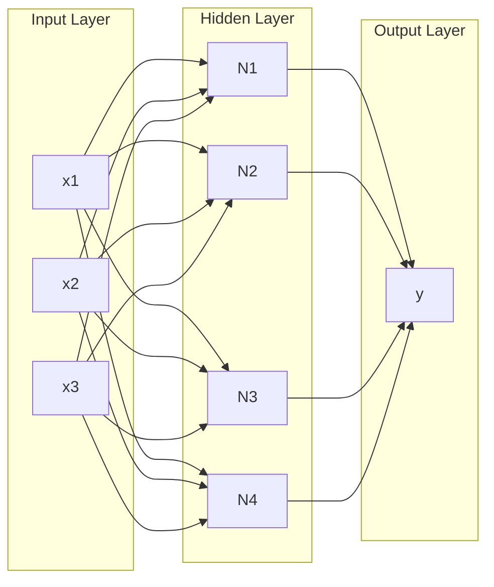

# 21 Neural Networks Basics

tags:
#deep-learning
#neural-networks
#placements
#interview

---

## Why this topic matters
Neural Networks are the foundation of Deep Learning. Every modern AI breakthrough (ChatGPT, Image Generators, Self-Driving Cars) is built on this architecture. Understanding them is non-negotiable for AI roles.

## Learning Objectives
- Understand Perceptrons.
- Learn about Layers, Weights, and Biases.
- Understand Activation Functions.
- Grasp Forward Propagation.

## Prerequisites
- [[10 Linear Regression]]
- [[06 Feature Engineering]]

---

## Intuition
Imagine the **Human Brain**.
- It has billions of **Neurons** connected by **Synapses**.
- When you touch something hot, neurons fire signals through these connections to tell your brain: "PAIN!"

A **Neural Network** is a simplified mathematical version of this:
- **Artificial Neurons**: Math functions that add up inputs.
- **Weights**: How strong the connection is.
- **Activation Function**: Decides if the neuron "fires" or not.

---

## Detailed Explanation

### 1. The Perceptron (Single Neuron)
A perceptron takes inputs, multiplies them by weights, adds a bias, and passes through an activation function.

$$Output = Activation(w_1x_1 + w_2x_2 + ... + b)$$

**Example**: Deciding whether to go to the beach.
- Inputs: Is it sunny? (1/0), Is it weekend? (1/0)
- Weights: Sunny = 3, Weekend = 1
- Bias = -2
- If Sum > 0, go to beach.

### 2. Multi-Layer Perceptron (MLP)
Stack multiple layers of perceptrons:
- **Input Layer**: Features (e.g., pixels, age, salary).
- **Hidden Layers**: Do the computation. (The "magic" happens here).
- **Output Layer**: Prediction (e.g., Cat/Dog, Price).

### 3. Activation Functions
Without these, a Neural Network is just Linear Regression. They add **non-linearity**, allowing the network to learn complex patterns.

| Function | Formula | Use Case |
| :--- | :--- | :--- |
| **Sigmoid** | $1 / (1 + e^{-x})$ | Output layer (Binary classification). |
| **ReLU** | $max(0, x)$ | Hidden layers (Most popular). |
| **Softmax** | $e^{x_i} / \sum e^{x}$ | Output layer (Multi-class classification). |
| **Tanh** | $(e^x - e^{-x}) / (e^x + e^{-x})$ | Hidden layers (Less common now). |

### 4. Forward Propagation
The process of passing inputs through the network to get a prediction.
1. Multiply inputs by weights.
2. Add bias.
3. Apply activation.
4. Pass to next layer.

---

## Real-world Example
**Handwritten Digit Recognition**
- **Input**: 28x28 pixel image (784 inputs).
- **Hidden Layer**: 128 neurons with ReLU.
- **Output**: 10 neurons (one for each digit 0-9) with Softmax.
- The network learns which pixel patterns correspond to which digits.

---

## Advantages
- **Universal Approximator**: Can theoretically approximate any function.
- **Feature Learning**: Learns features automatically (no manual engineering).
- **Versatile**: Works on images, text, audio, tables.

## Limitations
- **Black Box**: Hard to interpret how decisions are made.
- **Data Hungry**: Needs lots of data.
- **Computationally Expensive**: Requires GPUs for large networks.

---

## Common Interview Questions
- **What is a Perceptron?**
- **Why do we need Activation Functions?**
- **What is the difference between ReLU and Sigmoid?**
- **Explain Forward Propagation.**

### Interview Answer Tips
- Emphasize that **ReLU** solves the "Vanishing Gradient" problem better than Sigmoid.
- Mention that **without activation functions**, deep networks collapse into a single linear layer.

---

## Common Mistakes
- Using Sigmoid in hidden layers (causes vanishing gradients).
- Forgetting to normalize/standardize input data.
- Not initializing weights properly.

---

## Summary
Neural Networks are layers of perceptrons connected by weights. Activation functions add non-linearity, enabling the network to learn complex patterns. Forward propagation passes data through to generate predictions.

---

## Practice Questions
1. What happens if you remove activation functions?
2. Why is ReLU preferred over Sigmoid in hidden layers?
3. Can a single perceptron solve the XOR problem?
4. What is the role of the bias term?
5. Why do we use Softmax for multi-class problems?

---

## Mini Project Ideas
1. **Neural Network from Scratch**: Implement a simple perceptron using NumPy.
2. **Digit Classifier**: Build an MLP for MNIST using a framework like PyTorch or TensorFlow.

---

## Further Reading
- [[22 Backpropagation]]
- [[24 CNN Basics]]
- [[10 Linear Regression]]