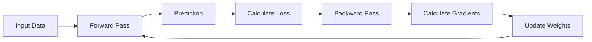

# 22 Backpropagation

tags:
#deep-learning
#neural-networks
#backprop
#placements
#interview

---

## Why this topic matters
Backpropagation is the **learning algorithm** that makes neural networks work. It's how networks "learn" from their mistakes. In interviews, you're expected to understand the intuition even if you don't derive the math.

## Learning Objectives
- Understand the intuition behind backpropagation.
- Learn the role of gradients and chain rule.
- Understand the connection to Gradient Descent.

## Prerequisites
- [[21 Neural Networks Basics]]
- [[10 Linear Regression]] (Gradient Descent)

---

## Intuition
Imagine you are **learning to throw darts**.

1. **Forward Pass**: You throw a dart. It lands 5 inches to the right of the bullseye.
2. **Calculate Error**: "I missed by 5 inches to the right."
3. **Backward Pass**: Your brain figures out: *"To fix this, I need to adjust my wrist angle slightly left and reduce my throw strength."*
4. **Update**: You make those adjustments.
5. **Repeat**: Throw again, get closer.

**Backpropagation** is exactly this process for neural networks:
- It calculates how much each weight contributed to the error.
- It tells each weight: *"You need to increase/decrease by this much."*

---

## Detailed Explanation

### 1. The Problem
A neural network makes a prediction. It's usually wrong initially. How do we adjust the **millions of weights** to reduce the error?

We need to know:
- How much did each weight contribute to the error?
- Should we increase or decrease it?

### 2. The Two Passes

#### Forward Pass
- Input data flows through the network.
- Each layer applies: `Output = Activation(Weights × Input + Bias)`.
- Final output is compared to actual value → **Loss/Error** is calculated.

#### Backward Pass (Backpropagation)
- Error is propagated **backwards** from output to input.
- Using the **Chain Rule** from calculus, we calculate:
  - How much did the output error change with respect to each weight?
  - This is the **gradient** (∂Loss/∂Weight).



### 3. The Chain Rule (Simplified)

To find how much weight `w1` contributed to the error:

```
∂Loss/∂w1 = (∂Loss/∂Output) × (∂Output/∂Hidden) × (∂Hidden/∂w1)
```

This is the **chain rule**: breaking a complex derivative into smaller, manageable pieces.

### 4. Gradient Descent Connection

Once we have gradients:
- **Positive gradient**: Increasing weight increases error → **Decrease weight**.
- **Negative gradient**: Increasing weight decreases error → **Increase weight**.

Update rule:
```
w_new = w_old - Learning_Rate × Gradient
```

### 5. Why "Backward"?

Because we start from the **output** (where we know the error) and work backwards to find which weights in earlier layers caused it. The error signal flows **backward** through the network.

---

## Real-world Example

**Image Recognition Training**
1. Show network a picture of a cat.
2. Network predicts "Dog" (wrong!).
3. Calculate loss: Prediction "Dog" vs. Actual "Cat" = High loss.
4. Backpropagation:
   - Output layer: "You said Dog, should be Cat. Adjust!"
   - Hidden layer 2: "You sent signals that led to Dog. Adjust!"
   - Hidden layer 1: "Your features were misleading. Adjust!"
5. All weights are updated slightly.
6. Repeat with millions of images.

---

## Advantages
- **Efficient**: Calculates gradients for all weights in just 2 passes (forward + backward).
- **Scalable**: Works for networks with millions of parameters.
- **General**: Applicable to any differentiable network architecture.

## Limitations
- **Vanishing Gradient**: Gradients become tiny in deep networks (solved by ReLU, Skip Connections).
- **Exploding Gradient**: Gradients become huge (solved by Gradient Clipping).
- **Differentiable**: Requires all activation functions to be differentiable.
- **Local Minima**: Can get stuck in suboptimal solutions.

---

## Common Interview Questions
- **Explain Backpropagation in simple terms.**
- **What is the Chain Rule and why is it used?**
- **What is the Vanishing Gradient problem?**
- **Why do gradients flow backward?**
- **Can Backpropagation be used for non-differentiable functions?**

### Interview Answer Tips
- Use the **Dart analogy** for intuition.
- Emphasize that backprop calculates **gradients** (direction and magnitude of change).
- Mention that it makes neural networks **trainable** (without it, we couldn't update weights efficiently).

---

## Common Mistakes
- Confusing Backpropagation with Gradient Descent (Backprop **calculates** gradients; Gradient Descent **uses** them).
- Thinking weights are updated during the backward pass (they're updated **after** gradients are calculated).
- Forgetting that Backprop requires differentiable functions.

---

## Summary
Backpropagation is the algorithm that calculates how much each weight contributed to the network's error. It uses the chain rule to propagate error backward from output to input, enabling efficient weight updates via Gradient Descent.

---

## Practice Questions
1. Why is it called "Back"propagation?
2. What is the relationship between Backpropagation and Gradient Descent?
3. What would happen if we used a non-differentiable activation function?
4. Why does the Vanishing Gradient problem occur?
5. How does the chain rule help in calculating gradients?
6. Can Backpropagation update weights in parallel?
7. What happens to gradients as they flow through many layers?

---

## Mini Project Ideas
1. **Manual Backprop**: Implement a simple 2-layer neural network and calculate gradients by hand for one iteration.
2. **Visualization**: Use a library like TensorBoard to visualize gradients flowing through a network during training.
3. **Vanishing Gradient Demo**: Build a deep network with Sigmoid activations and observe how gradients shrink in early layers.

---

## Further Reading
- [[21 Neural Networks Basics]]
- [[23 Activation Functions]]
- [[24 CNN Basics]]
- [[09 Bias-Variance Tradeoff]]