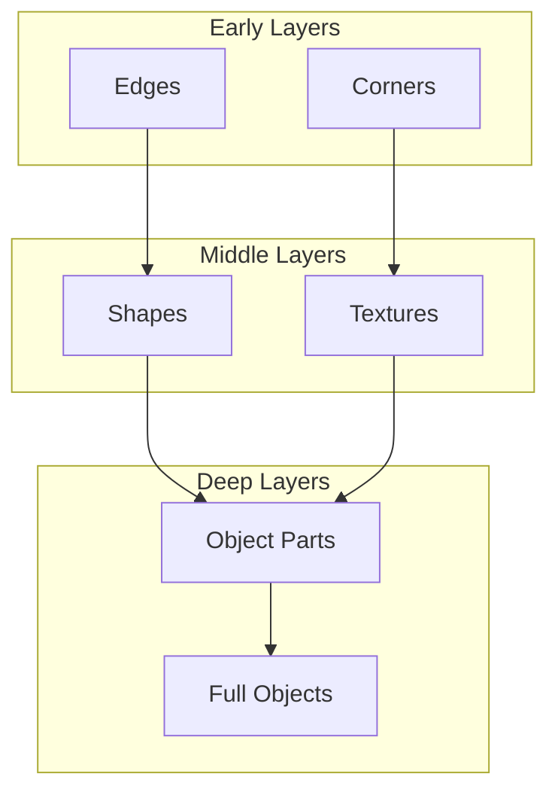

# 24 CNN Basics (Convolutional Neural Networks)

tags:
#deep-learning
#cnn
#computer-vision
#placements
#interview

---

## Why this topic matters
CNNs are the backbone of **computer vision**. Every image recognition system (face detection, self-driving cars, medical imaging) uses CNNs. In interviews, you're expected to understand how CNNs differ from regular neural networks and why they're better for images.

## Learning Objectives
- Understand why CNNs are better for images than regular neural networks.
- Learn about Convolution, Pooling, and Fully Connected layers.
- Understand feature hierarchies in CNNs.

## Prerequisites
- [[21 Neural Networks Basics]]
- [[23 Activation Functions]]

---

## Intuition
Imagine you're looking at a **photo of a cat**.

**Regular Neural Network**: Flattens the image into a long list of pixels. It treats pixels next to each other the same as pixels on opposite corners. **It loses spatial information!**

**CNN**: Uses a "magnifying glass" (filter) that slides across the image, looking for specific patterns:
- First, it finds **edges** (lines, curves).
- Then, it combines edges into **shapes** (circles, triangles).
- Then, shapes into **parts** (eyes, ears, nose).
- Finally, parts into **objects** (CAT!).

CNNs **preserve spatial relationships** and learn **hierarchically**.

---

## Detailed Explanation

### Why Not Use Regular Neural Networks for Images?

A 1000×1000 pixel image has **1 million pixels**.
- A fully connected layer would need: `1,000,000 × 1000 = 1 billion weights`!
- Too many parameters → Overfitting, slow, memory-hungry.

**CNNs solve this with:**
1. **Local Connectivity**: Each neuron only looks at a small region.
2. **Weight Sharing**: Same filter is used across the entire image.

### Key Components of a CNN

#### 1. Convolutional Layer (CONV)

The core building block. A **filter/kernel** slides across the image, detecting features.

**Process**:
- Filter (e.g., 3×3) slides over the image.
- At each position, multiply filter values with pixel values, sum them up.
- Result: A **Feature Map** showing where that pattern exists.

```
Input Image (5×5)     Filter (3×3)        Feature Map (3×3)
[ 1  1  1  0  0 ]                          [  4  4  2 ]
[ 0  1  1  1  0 ]  ⊗   [ 1  0  1 ]    =   [  2  2  2 ]
[ 0  0  1  1  1 ]        [ 0  1  0 ]       [  1  2  3 ]
[ 0  0  0  1  1 ]        [ 1  0  1 ]
[ 0  0  0  0  1 ]
```

**Common Filters**:
- Edge detection (finds vertical/horizontal lines)
- Blur
- Sharpen

#### 2. Activation Layer (ReLU)

Applied after convolution to add non-linearity.
- `ReLU(x) = max(0, x)`
- Removes negative values, keeps important features.

#### 3. Pooling Layer (POOL)

**Downsamples** the feature map to reduce computation and prevent overfitting.

**Max Pooling (most common)**:
- Takes the **maximum value** from each region (e.g., 2×2).
- Reduces size by half.

```
Feature Map (4×4)        Max Pool (2×2)      Pooled (2×2)
[ 1  3  2  1 ]                               [  3  2 ]
[ 2  4  1  0 ]    Pool Size=2, Stride=2  →  [  4  3 ]
[ 1  2  3  1 ]
[ 3  1  2  4 ]
```

**Benefits**:
- Reduces parameters (75% reduction with 2×2 pooling).
- Makes features more robust to small translations.
- Faster computation.

#### 4. Fully Connected Layer (FC)

After several CONV + POOL layers, the final feature maps are flattened and fed to regular neural network layers for **classification**.

### Typical CNN Architecture

```
Input Image → [CONV → ReLU → POOL] × N → Flatten → FC → Output
```

**Example (LeNet-5 for digit recognition)**:
```
Input (32×32) → CONV → POOL → CONV → POOL → FC → Output (0-9)
```

**Modern Architectures**:
- **AlexNet**: 8 layers, breakthrough in 2012.
- **VGG**: Deep network with small 3×3 filters.
- **ResNet**: Skip connections to train very deep networks (100+ layers).

### Feature Hierarchy



- **Early layers**: Simple features (edges, corners).
- **Middle layers**: Shapes, textures.
- **Deep layers**: Complex objects (eyes, wheels, faces).

---

## Real-world Example

**Facial Recognition System**
1. **Input**: Photo of a face.
2. **CONV1**: Detects edges and gradients.
3. **CONV2**: Combines edges into shapes (nose outline, eye circles).
4. **CONV3**: Combines shapes into parts (left eye, right eye, nose, mouth).
5. **FC Layer**: "This is John!"

**Self-Driving Cars**
- CNNs detect: Lane lines, traffic signs, pedestrians, other vehicles.

---

## Advantages
- **Parameter Efficiency**: Weight sharing reduces parameters by 100-1000×.
- **Spatial Awareness**: Preserves 2D structure of images.
- **Translation Invariance**: Recognizes objects regardless of position.
- **Hierarchical Learning**: Learns from simple to complex features.

## Limitations
- **Fixed Input Size**: Images must be resized to fit.
- **Computationally Heavy**: Still requires GPUs for large images.
- **Not Rotation Invariant**: Struggles if objects are rotated (solved by data augmentation).

---

## Common Interview Questions
- **Why use CNNs instead of fully connected networks for images?**
- **What is the purpose of the Convolutional layer?**
- **What does Pooling do and why is it useful?**
- **Explain the concept of weight sharing.**
- **What is the difference between Max Pooling and Average Pooling?**
- **How does a CNN learn hierarchical features?**

### Interview Answer Tips
- Emphasize **spatial preservation** and **parameter efficiency**.
- Mention **weight sharing** as the key innovation.
- Use the **feature hierarchy** analogy (edges → shapes → objects).

---

## Common Mistakes
- Thinking CNNs can only be used for images (they work on any grid-like data).
- Confusing Convolution with Fully Connected layers.
- Forgetting to mention ReLU after convolution.
- Not understanding why pooling is used.

---

## Summary
CNNs are specialized neural networks for grid-like data (images). They use Convolution to detect features, Pooling to reduce size, and learn hierarchically from edges to objects. They are the foundation of modern computer vision.

---

## Practice Questions
1. Why can't we use a regular neural network for image classification?
2. What is a filter/kernel in a CNN?
3. What are the dimensions of a feature map after a 3×3 convolution on a 28×28 image (no padding, stride=1)?
4. What is the difference between Max Pooling and Average Pooling?
5. Why do CNNs have fewer parameters than fully connected networks?
6. What does "stride" mean in convolution?
7. How does weight sharing work?

---

## Mini Project Ideas
1. **MNIST Classifier**: Build a simple CNN to classify handwritten digits.
2. **Filter Visualization**: Apply different convolution filters (edge detection, blur) to an image and visualize results.
3. **Architecture Comparison**: Compare a CNN vs. a fully connected network on the same image dataset. Note the difference in parameters and accuracy.

---

## Further Reading
- [[21 Neural Networks Basics]]
- [[23 Activation Functions]]
- [[25 RNN & LSTM]] (for sequential data)
- [[26 Transformers Overview]] (modern alternative to CNNs)