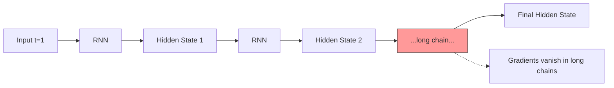

# 25 RNN & LSTM

tags:
#deep-learning
#rnn
#lstm
#sequence
#placements
#interview

---

## Why this topic matters
RNNs and LSTMs are designed for **sequential data** where order matters: text, speech, time series, stock prices. Unlike CNNs (which handle spatial data), RNNs have **memory**—they remember what they've seen before. This is crucial for tasks like translation, sentiment analysis, and prediction.

## Learning Objectives
- Understand why we need RNNs for sequential data.
- Learn how RNNs maintain "memory."
- Understand the Vanishing Gradient problem in RNNs.
- Learn how LSTMs solve this problem.

## Prerequisites
- [[21 Neural Networks Basics]]
- [[22 Backpropagation]]
- [[24 CNN Basics]]

---

## Intuition
Imagine you're reading a **sentence**:

*"I was born in France. I grew up in Paris. I love eating croissants. I speak ___ fluently."*

To fill in the blank, you need to **remember** "France" from earlier in the sentence. You don't just look at the last word.

**Regular Neural Network**: Sees only the current word. No memory. ❌

**RNN**: Has a "memory" that carries information from previous words. ✅

RNNs are like readers who **remember context** as they go through a sequence.

---

## Detailed Explanation

### Why CNNs Don't Work for Sequences

CNNs are great for **spatial data** (images) where:
- Position matters (pixels next to each other are related).
- But the entire input is available at once.

For **sequential data** (text, time series):
- **Order matters** ("dog bites man" ≠ "man bites dog").
- Context from earlier in the sequence is crucial.
- Input length can vary (short sentence vs. long paragraph).

### 1. RNN (Recurrent Neural Network)

**Core Idea**: RNNs have a **hidden state** that acts as "memory."

At each time step `t`:
- Input: `x_t` (current word/data point).
- Hidden State: `h_t` (memory from previous steps).
- Output: `y_t` (prediction).

The hidden state is passed from one step to the next:
```
h_t = tanh(W × x_t + U × h_(t-1) + b)
```

**Visual Flow**:
```
Time:     t=1       t=2       t=3       t=4
Input:   [I]      [love]     [eating]   [croissants]
           ↓         ↓          ↓           ↓
RNN:    [h1]  →   [h2]   →   [h3]   →   [h4]
           ↓         ↓          ↓           ↓
Output:  [o1]      [o2]       [o3]       [o4]
```

**The hidden state `h` carries information forward** like a "chain of thought."

### 2. The Vanishing Gradient Problem

RNNs should remember information from long ago. But during backpropagation:
- Gradients are multiplied at each time step.
- After many steps, gradients become **tiny** (vanish).
- Early layers **stop learning**.

**Result**: RNNs can only remember **short-term dependencies** (5-10 steps). They forget "France" by the time they reach the blank.



### 3. LSTM (Long Short-Term Memory)

LSTMs are a special type of RNN designed to **remember long-term dependencies**.

**Key Innovation**: A **gating mechanism** that controls what to remember, forget, and output.

#### Three Gates in an LSTM:

1. **Forget Gate**: Decides what information to **throw away** from memory.
   - *"Do I still need to remember 'France' or can I forget it?"*

2. **Input Gate**: Decides what **new information** to store.
   - *"Should I remember 'croissants' or is it irrelevant?"*

3. **Output Gate**: Decides what to **output** based on memory.
   - *"Based on everything I remember, what should I predict?"*

**Cell State**: The "main memory" that runs through the entire sequence, protected by gates.

```
Cell State:  [C1]  →   [C2]   →   [C3]   →   [C4]  (Protected highway)
              ↓         ↓          ↓          ↓
Hidden:      [h1]  →   [h2]   →   [h3]   →   [h4]
```

The gates use **sigmoid functions** (0 to 1) to decide:
- **0**: "Forget everything."
- **1**: "Remember everything."

### 4. GRU (Gated Recurrent Unit)

A **simplified LSTM** with only two gates. Almost as good, but faster.
- **Update Gate**: Combines forget and input gates.
- **Reset Gate**: Decides how much past to forget.

---

## Real-world Example

**Sentiment Analysis**
- Input: *"The movie was not good. The acting was terrible and the plot was boring."*
- RNN: Might focus only on "good" (near the end) → Wrong positive prediction.
- LSTM: Remembers "not good", "terrible", "boring" → Correct negative prediction.

**Stock Price Prediction**
- RNN: Sees only last few days.
- LSTM: Remembers trends from weeks ago (e.g., earnings reports, seasonal patterns).

**Machine Translation**
- Input: *"The cat sat on the mat."* (English)
- LSTM reads entire sentence, remembers context, outputs: *"Le chat s'est assis sur le tapis."* (French)

---

## Advantages
- **Sequential Understanding**: Handles variable-length inputs.
- **Memory**: Can learn from context and history.
- **LSTM**: Solves vanishing gradient, remembers long-term dependencies.
- **Versatile**: Works for text, speech, time series, video.

## Limitations
- **RNN**: Can't remember long sequences (vanishing gradient).
- **LSTM**: Computationally slower than CNNs.
- **Sequential Processing**: Can't parallelize (must process one step at a time).
- **Transformers**: Newer architectures (Transformers) often outperform RNNs/LSTMs now.

---

## Common Interview Questions
- **Why use RNNs instead of CNNs for text?**
- **What is the Vanishing Gradient problem?**
- **How do LSTMs solve the vanishing gradient?**
- **What are the three gates in an LSTM?**
- **What is the difference between LSTM and GRU?**
- **Can RNNs handle variable-length sequences?**

### Interview Answer Tips
- Use the **sentence example** to explain why memory matters.
- Emphasize that **LSTMs use gates to control memory flow**.
- Mention that **Transformers** (with Attention) are now often preferred over RNNs.

---

## Common Mistakes
- Thinking RNNs can remember "forever" (they can't without LSTM/GRU).
- Confusing LSTM gates with activation functions.
- Not knowing that RNNs process **sequentially** (not in parallel).
- Forgetting that Transformers have largely replaced RNNs for NLP.

---

## Summary
RNNs are neural networks designed for sequential data with memory. They suffer from vanishing gradients in long sequences. LSTMs solve this with gating mechanisms (forget, input, output gates) that control what to remember. LSTMs can learn long-term dependencies, making them ideal for text, speech, and time series.

---

## Practice Questions
1. Why can't we use CNNs for sequence modeling?
2. What is "hidden state" in an RNN?
3. Why do gradients vanish in RNNs?
4. What does the "forget gate" do in an LSTM?
5. Can LSTMs remember information from 100 steps ago?
6. What is the difference between LSTM and GRU?
7. Why are RNNs slower to train than CNNs?
8. What kind of tasks are RNNs/LSTMs best suited for?

---

## Mini Project Ideas
1. **Sentiment Analysis**: Build an LSTM to classify movie reviews as positive/negative.
2. **Text Generation**: Train an LSTM on Shakespeare text and generate new sentences.
3. **Stock Prediction**: Use LSTM to predict next day's stock price based on past 30 days.
4. **Compare RNN vs. LSTM**: Train both on the same sequence task and compare performance.

---

## Further Reading
- [[21 Neural Networks Basics]]
- [[22 Backpropagation]]
- [[24 CNN Basics]]
- [[26 Transformers Overview]]
- [[33 Text Preprocessing]]