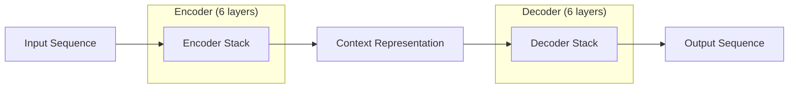

# 26 Transformers Overview

tags:
#deep-learning
#transformers
#attention
#llm
#placements
#interview

---

## Why this topic matters
Transformers are the **most important architecture** in modern AI. They power **ChatGPT**, **BERT**, **DALL-E**, and almost every LLM. Understanding Transformers is essential for any AI/LLM engineer role. They solved the bottleneck of sequential processing in RNNs.

## Learning Objectives
- Understand why Transformers were created.
- Learn the Attention Mechanism.
- Understand Encoder-Decoder architecture.
- Know how Transformers differ from RNNs.

## Prerequisites
- [[21 Neural Networks Basics]]
- [[25 RNN & LSTM]]
- [[35 LLM Fundamentals]]

---

## Intuition
Imagine you're reading a **long sentence**:

*"The animal didn't cross the street because **it** was too tired."*

To understand what **"it"** refers to, you need to look back at the whole sentence and find the most relevant word (in this case, "animal").

**RNN/LSTM**: Reads word by word, slowly. Memory fades over time. ❌

**Transformer**: Reads the **entire sentence at once** and uses "Attention" to focus on relevant words (like "it" → "animal") instantly. ✅

Transformers are like **super-fast readers with perfect focus**.

---

## Detailed Explanation

### The Problem with RNNs

RNNs process sequences **one word at a time**:
- **Sequential**: Can't parallelize (slow training).
- **Bottleneck**: All information must pass through hidden states.
- **Memory Loss**: Even LSTMs struggle with very long sequences.

### The Transformer Solution (2017)

The paper **"Attention Is All You Need"** introduced Transformers. The key insight:
- **Don't process sequentially.**
- **Use Attention to connect all words directly, regardless of distance.**

### Key Components of a Transformer

#### 1. Self-Attention Mechanism ⭐ THE CORE INNOVATION

Self-Attention allows each word to **"look at" all other words** and decide which ones are most relevant.

**Process** (simplified):
1. For each word, create three vectors:
   - **Query (Q)**: "What am I looking for?"
   - **Key (K)**: "What do I contain?"
   - **Value (V)**: "What is my actual content?"

2. Calculate attention scores:
   - Compare Query of word A with Keys of all other words.
   - High score = "Pay attention to this word."

3. Weighted sum of Values based on scores.

**Example**:
```
Sentence: "The animal didn't cross the street because it was tired."

For the word "it":
- Attention to "animal": 0.8 (HIGH - likely the antecedent)
- Attention to "street": 0.15
- Attention to "tired": 0.05
- Attention to other words: ~0
```

This allows the model to understand relationships **regardless of distance**.

#### 2. Multi-Head Attention

Instead of one attention calculation, Transformers do **multiple in parallel** (like multiple "attention heads").

Each head learns different relationships:
- **Head 1**: Grammatical relationships (pronoun → noun).
- **Head 2**: Semantic similarity (synonyms).
- **Head 3**: Long-range dependencies.

Results are concatenated and combined.

#### 3. Position Encoding

Transformers don't process sequentially, so they need a way to know **word order**.

**Solution**: Add a "position vector" to each word embedding.
- Word 1: gets position encoding 1
- Word 2: gets position encoding 2
- etc.

This tells the model: *"This word came first, this word came second."*

#### 4. Encoder-Decoder Architecture

**Original Transformer** had two parts:

**Encoder** (Understands Input):
- Reads entire input sequence.
- Uses Self-Attention to understand relationships.
- Outputs a "contextualized representation."

**Decoder** (Generates Output):
- Takes encoder's output.
- Generates output one word at a time.
- Uses **Masked Attention** to only see previous words (can't cheat by seeing future words).



**Modern LLMs** (like GPT):
- Use **Decoder-only** architecture.
- Simplified, better for text generation.

### 5. Feed-Forward Networks

After attention, each position goes through a small neural network (FFN) to process the information.

### 6. Layer Normalization & Residual Connections

- **Residual Connections**: Skip connections that help gradients flow.
- **Layer Normalization**: Stabilizes training (like batch normalization but per sample).

---

## Real-world Example

**Machine Translation (English → French)**

Input: *"I love machine learning."*

1. **Encoder**:
   - Reads all 5 words at once.
   - Self-Attention learns: "I" → "love", "machine" → "learning".
   - Creates rich representation.

2. **Decoder**:
   - Generates "J'" (first word).
   - Attends to encoder output and its own previous output.
   - Generates "aime", then "l'apprentissage", then "automatique".

**ChatGPT**:
- Uses **Decoder-only Transformer**.
- Self-Attention allows it to understand context from thousands of words ago.
- Generates responses word-by-word.

---

## Advantages
- **Parallelization**: Can train on entire sequences at once (much faster than RNNs).
- **Long-Range Dependencies**: Attention connects any two words directly, regardless of distance.
- **Scalability**: Works well with massive models (billions of parameters).
- **State-of-the-Art**: Dominates NLP, vision (ViT), and multimodal tasks.

## Limitations
- **Computational Cost**: Attention is O(n²) - expensive for very long sequences.
- **Memory Intensive**: Requires significant GPU memory.
- **Position Sensitivity**: Needs careful position encoding.
- **Black Box**: Attention weights are hard to interpret.

---

## Common Interview Questions
- **Why were Transformers created?**
- **What is the Attention Mechanism?**
- **How do Transformers differ from RNNs?**
- **What is Multi-Head Attention?**
- **Why do Transformers need Position Encoding?**
- **What is the difference between Encoder and Decoder?**
- **What architecture does GPT use?** (Answer: Decoder-only).

### Interview Answer Tips
- Emphasize **parallelization** and **long-range dependencies** as key advantages.
- Mention that **"Attention Is All You Need"** paper was the breakthrough.
- Explain that **GPT is Decoder-only**, **BERT is Encoder-only**.

---

## Common Mistakes
- Thinking Transformers process sequentially (they don't!).
- Confusing Self-Attention with regular Attention.
- Not knowing that modern LLMs use **only the Decoder** part.
- Forgetting to mention Position Encoding.

---

## Summary
Transformers use Self-Attention to process entire sequences at once, allowing parallelization and capturing long-range dependencies. Multi-Head Attention learns different types of relationships. Position Encoding provides word order. Transformers (especially Decoder-only) power all modern LLMs like GPT and Claude.

---

## Practice Questions
1. What is the main advantage of Transformers over RNNs?
2. How does Self-Attention work in simple terms?
3. Why do we need Multi-Head Attention instead of single attention?
4. What is the purpose of Position Encoding?
5. Why can't Transformers process sequences sequentially?
6. What architecture does ChatGPT use: Encoder-Decoder, Encoder-only, or Decoder-only?
7. What is the computational complexity of Self-Attention?
8. How does a Transformer know word order?

---

## Mini Project Ideas
1. **Attention Visualization**: Use a tool like bert-viz to visualize attention weights in a Transformer.
2. **Compare RNN vs. Transformer**: Train both on a simple sequence task and compare training time and accuracy.
3. **Mini Transformer**: Implement a simplified Transformer from scratch (without frameworks) for educational purposes.

---

## Further Reading
- [[21 Neural Networks Basics]]
- [[25 RNN & LSTM]]
- [[35 LLM Fundamentals]]
- [[36 Prompt Engineering]]
- [[39 Embeddings]]