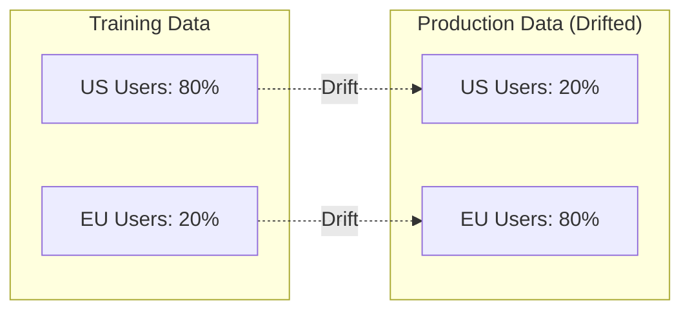
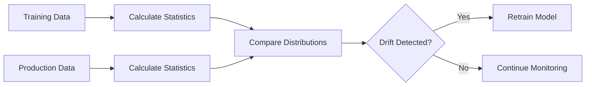

# 27 Data Drift

tags:
#mlops
#data-drift
#monitoring
#placements
#interview

---

## Why this topic matters
Models trained today might fail tomorrow because the real-world data changes. **Data Drift** is when the statistical properties of input data change over time, causing model performance to degrade. In production AI systems, monitoring for drift is critical.

## Learning Objectives
- Understand what Data Drift is.
- Differentiate between Data Drift and Concept Drift.
- Learn how to detect drift.
- Understand strategies to handle drift.

## Prerequisites
- [[03 AI Development Lifecycle]]
- [[08 Model Evaluation]]
- [[58 MLOps]]

---

## Intuition
Imagine you trained a **fashion recommendation model** on 2019 data (before the pandemic).

- **2019 Data**: People bought formal wear, party dresses, suits.
- **2020 Data**: Suddenly, everyone buys pajamas, sweatpants, and masks.

Your model keeps recommending suits and dresses. **Sales drop.**

**What happened?** The data **drifted**. The world changed, but your model didn't.

This is **Data Drift**: The input data in production is different from the training data.

---

## Detailed Explanation

### Types of Drift

#### 1. Data Drift (Covariate Shift)

The **input distribution** changes, but the relationship between input and output stays the same.

**Example**:
- Training: 80% users are from the US, 20% from Europe.
- Production: 80% users are from Europe, 20% from the US.

The model's logic (how it predicts) is still valid, but it's seeing **different inputs** than it was trained on.

#### 2. Concept Drift

The **relationship between input and output** changes.

**Example**:
- Training: "Mask" → Positive sentiment (fashion accessory).
- Production: "Mask" → Negative sentiment (pandemic, fear).

The word "mask" didn't change, but its **meaning** (concept) did. The model's logic is now **wrong**.

#### 3. Label Drift

The **distribution of target labels** changes.

**Example**:
- Training: 50% spam, 50% not spam.
- Production: 90% spam, 10% not spam (e.g., during a spam attack).

### How to Detect Drift

#### Statistical Tests
- **KS Test (Kolmogorov-Smirnov)**: Compares two distributions.
- **Chi-Square Test**: For categorical features.
- **PSI (Population Stability Index)**: Measures how much a distribution has shifted.

**PSI Interpretation**:
- PSI < 0.1: No significant drift.
- PSI 0.1 - 0.2: Moderate drift (monitor closely).
- PSI > 0.2: Significant drift (retrain needed).

#### Monitoring Dashboards
Track metrics over time:
- Mean, median, std dev of key features.
- Distribution histograms (training vs. production).
- Model performance metrics (accuracy, F1) over time.

### Strategies to Handle Drift

#### 1. Periodic Retraining
Retrain the model every N weeks/months with fresh data.
- **Pros**: Simple, predictable.
- **Cons**: Might retrain too early or too late.

#### 2. Trigger-Based Retraining
Retrain only when drift is detected (e.g., PSI > 0.2).
- **Pros**: Efficient, responsive.
- **Cons**: Requires robust drift detection.

#### 3. Online Learning
Update the model continuously with each new data point.
- **Pros**: Always up-to-date.
- **Cons**: Complex, risk of catastrophic forgetting.

#### 4. Ensemble of Old and New
Keep the old model and train a new one. Use both (weighted) for predictions.
- **Pros**: Smooth transition.
- **Cons**: More compute, more complex.

---

## Real-world Example

**Fraud Detection System**

- **Training Data**: Fraud patterns from 2022.
- **Production (2023)**: Fraudsters invent new techniques.

**Symptoms**:
- Model accuracy drops from 95% to 70%.
- False negatives increase (fraud is missed).

**Solution**:
1. Detect drift using PSI on transaction features.
2. Collect new labeled data (including new fraud patterns).
3. Retrain the model.
4. Deploy updated model.

---

## Advantages
- **Early Warning**: Detects issues before they cause major failures.
- **Proactive**: Allows scheduled retraining instead of emergency fixes.
- **Cost Savings**: Prevents loss from wrong predictions.

## Limitations
- **False Alarms**: Natural variation can look like drift.
- **Requires Baseline**: Need good training data statistics.
- **Computation**: Monitoring adds overhead.

---

## Common Interview Questions
- **What is Data Drift?**
- **Difference between Data Drift and Concept Drift?**
-   **How do you detect drift?**
-   **What is PSI and how is it interpreted?**
-   **When should you retrain a model?**
-   **Can drift be prevented?**

### Interview Answer Tips
- Use the **fashion or fraud** example to explain drift.
- Mention that **monitoring is continuous**, not one-time.
- Emphasize that **retraining is the solution**, not fixing the model.

---

## Common Mistakes
- Confusing Data Drift with Concept Drift.
- Ignoring drift until performance crashes.
- Retraining too frequently (wastes resources).
- Not having a baseline (training stats) to compare against.

---

## Summary
Data Drift is when input data distribution changes over time, causing model performance to degrade. Concept Drift is when the input-output relationship changes. Detect drift using statistical tests (PSI, KS Test). Handle drift by retraining periodically or when detected. Monitoring drift is essential for production ML systems.

---

## Practice Questions
1. What is the difference between Data Drift and Concept Drift?
2. How is PSI used to measure drift?
3. What PSI value indicates significant drift?
4. Can drift be prevented or only managed?
5. Why might a model's accuracy drop over time?
6. What is online learning and how does it relate to drift?
7. How often should you check for drift?
8. What features should you monitor for drift?

---

## Mini Project Ideas
1. **Drift Detection**: Simulate drift by shifting a dataset's distribution over time. Plot PSI.
2. **Monitoring Dashboard**: Build a simple dashboard showing training vs. production distributions.
3. **Retraining Pipeline**: Automate retraining when drift exceeds a threshold.

---

## Further Reading
- [[03 AI Development Lifecycle]]
- [[08 Model Evaluation]]
- [[58 MLOps]]
- [[55 AI System Design Basics]]