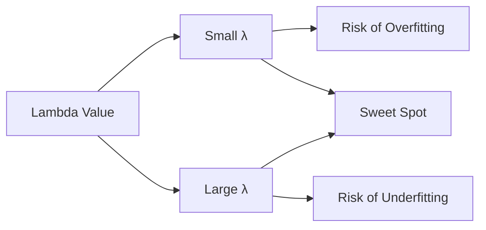

# 28 Regularization (L1/L2)

tags:
#ml
#regularization
#overfitting
#placements
#interview

---

## Why this topic matters
Overfitting is the #1 problem in ML. **Regularization** is the primary technique to prevent it. It adds a "penalty" to complex models, forcing them to stay simple and generalize better. Interviewers frequently ask about L1 vs. L2 regularization.

## Learning Objectives
- Understand what regularization is and why it's needed.
- Learn about L1 (Lasso) and L2 (Ridge) regularization.
- Understand the trade-off between bias and variance.
- Know when to use each type.

## Prerequisites
- [[10 Linear Regression]]
- [[09 Bias-Variance Tradeoff]]
- [[24 Overfitting vs Underfitting]]

---

## Intuition
Imagine you're **packing for a trip**.

**Without Regularization (Overfitting)**:
- You pack everything: 20 shirts, 15 pairs of shoes, a hairdryer, an iron, 10 books.
- Your suitcase is **huge and heavy**.
- You can handle any scenario, but it's impractical.

**With Regularization**:
- You're taxed for each item you pack.
- Heavy items cost more.
- You pack only what's **essential**: 5 shirts, 2 shoes, 1 book.
- Your suitcase is **light and practical**.

**Regularization** is a "tax" on model complexity. It penalizes large weights, keeping the model simple and generalizable.

---

## Detailed Explanation

### The Overfitting Problem

Complex models (high degree polynomials, deep trees) fit training data **too well**:
- They memorize noise.
- They fail on new data.

**Solution**: Add a penalty term to the loss function that discourages complexity.

### Loss Function with Regularization

**Original Loss** (e.g., MSE):
```
Loss = Σ(y_pred - y_actual)²
```

**With Regularization**:
```
Loss = Σ(y_pred - y_actual)² + λ × Penalty
```

Where:
- **λ (lambda)**: Regularization strength (hyperparameter).
- **Penalty**: Based on model weights.

### Types of Regularization

#### 1. L1 Regularization (Lasso)

**Penalty**: Sum of absolute values of weights.
```
Penalty = λ × Σ|w_i|
```

**Effect**:
- Drives some weights to **exactly zero**.
- Performs **feature selection** (removes irrelevant features).
- Creates **sparse models**.

```
Weights before: [0.5, -0.2, 0.8, 0.01, -0.03]
Weights after L1: [0.4, -0.1, 0.7, 0.0, 0.0]  # Some features eliminated!
```

**Use Case**: When you have many features and want to identify the important ones.

#### 2. L2 Regularization (Ridge)

**Penalty**: Sum of squared weights.
```
Penalty = λ × Σ(w_i²)
```

**Effect**:
- Shrinks all weights **towards zero** but not exactly zero.
- Keeps all features but reduces their impact.
- Creates **smooth, stable models**.

```
Weights before: [0.5, -0.2, 0.8, 0.01, -0.03]
Weights after L2: [0.3, -0.1, 0.5, 0.005, -0.01]  # All features kept, but smaller
```

**Use Case**: When all features are relevant and you want to prevent overfitting.

#### 3. Elastic Net

Combines L1 and L2:
```
Penalty = λ1 × Σ|w_i| + λ2 × Σ(w_i²)
```

**Use Case**: Best of both worlds; useful when you have correlated features.

### The Role of Lambda (λ)

- **λ = 0**: No regularization (model might overfit).
- **λ is small**: Slight penalty (good balance).
- **λ is large**: Heavy penalty (model becomes too simple → underfitting).
- **λ is too large**: All weights → 0 (model predicts only the mean).



**Tuning λ**: Use cross-validation to find the optimal value.

---

## Real-world Example

**House Price Prediction**

Features: 100 features (square footage, bedrooms, bathrooms, neighborhood, school rating, etc.).

**Without Regularization**:
- Model gives huge weights to rare features (e.g., "has a pool").
- Overfits to houses with pools in training data.
- Fails on houses without pools.

**With L1 Regularization**:
- Model sets weights of irrelevant features to 0.
- Automatically selects: square footage, bedrooms, location.
- Ignores: has_pool, has_garage_door_opener, etc.
- Generalizes better.

---

## Advantages
- **Prevents Overfitting**: Forces model to stay simple.
- **Feature Selection (L1)**: Automatically removes irrelevant features.
- **Improves Generalization**: Better performance on test data.
- **Stable Solutions (L2)**: Handles multicollinearity well.

## Limitations
- **Hyperparameter Tuning**: Need to find optimal λ (computationally expensive).
- **Underfitting Risk**: Too much regularization hurts performance.
- **Interpretability (L2)**: All features kept, hard to identify important ones.

---

## Common Interview Questions
- **What is regularization and why use it?**
- **Difference between L1 and L2 regularization?**
- **Which one performs feature selection?**
- **What happens if lambda is too large?**
- **How do you choose the value of lambda?**
- **What is Elastic Net?**

### Interview Answer Tips
- Emphasize that **L1 can zero out weights** (feature selection).
- Mention that **L2 shrinks but doesn't eliminate** weights.
- Use the **lambda tuning** analogy (too little = overfit, too much = underfit).

---

## Common Mistakes
- Forgetting to standardize features before regularization (features on different scales get penalized differently).
- Using a fixed lambda without tuning.
- Confusing L1 and L2 effects.
- Applying regularization to tree-based models (they don't use it in the same way).

---

## Summary
Regularization adds a penalty to the loss function to prevent overfitting. L1 (Lasso) drives weights to zero (feature selection). L2 (Ridge) shrinks weights smoothly. Lambda controls the strength: too little causes overfitting, too much causes underfitting. Regularization is essential for linear models to generalize well.

---

## Practice Questions
1. What is the main difference between L1 and L2 regularization?
2. Which regularization would you use for feature selection?
3. What happens to the model if lambda is 0?
4. What happens if lambda is very large?
5. Why do we standardize features before applying regularization?
6. What is Elastic Net and when would you use it?
7. How do you find the optimal lambda value?
8. Can regularization be used with neural networks?

---

## Mini Project Ideas
1. **L1 vs. L2 Comparison**: Train a linear regression with both regularizations. Compare coefficients and feature selection.
2. **Lambda Tuning**: Plot model performance vs. lambda values to find the sweet spot.
3. **Overfitting Demo**: Train models with and without regularization. Show the difference in test performance.

---

## Further Reading
- [[10 Linear Regression]]
- [[09 Bias-Variance Tradeoff]]
- [[24 Overfitting vs Underfitting]]
- [[20 Hyperparameter Tuning]]