# 29 Cross-Validation

tags:
#ml
#cross-validation
#evaluation
#placements
#interview

---

## Why this topic matters
How do you know if your model is **really good** or just **lucky** with the train-test split? **Cross-Validation (CV)** is the gold standard for evaluating model performance. It ensures your model's performance is robust and not dependent on a single split.

## Learning Objectives
- Understand why cross-validation is needed.
- Learn K-Fold Cross-Validation.
- Understand Stratified K-Fold for imbalanced data.
- Learn Leave-One-Out and Time Series CV.

## Prerequisites
- [[08 Model Evaluation]]
- [[20 Hyperparameter Tuning]]
- [[09 Bias-Variance Tradeoff]]

---

## Intuition
Imagine you're preparing for a **final exam**.

**Single Train-Test Split**:
- You study from 80% of the textbook.
- You take the test on the remaining 20%.
- **Problem**: What if the 20% you were tested on was unusually easy or hard? Your score doesn't reflect your true ability.

**Cross-Validation**:
- You take **5 different tests**, each covering a different 20% of the book.
- Your final score is the **average** of all 5 tests.
- **Result**: A much more reliable measure of your knowledge.

**Cross-Validation** is like taking multiple tests to get a true measure of your model's ability.

---

## Detailed Explanation

### The Problem with a Single Split

Standard approach:
```
Data → 80% Train, 20% Test
Model trained on 80%, evaluated on 20%
```

**Issues**:
- **Luck of the draw**: The 20% test set might be unusually easy/hard.
- **Data waste**: 20% of data is never used for training.
- **High variance**: Different splits give different scores.

### K-Fold Cross-Validation

**Process**:
1. Split data into **K equal folds** (typically K=5 or K=10).
2. For each fold:
   - Train on K-1 folds.
   - Test on the held-out fold.
3. Average the K scores.

```mermaid
graph TD
    subgraph "Fold 1"
    T1[Test]
    Tr1[Train]
    Tr2[Train]
    Tr3[Train]
    Tr4[Train]
    end
    
    subgraph "Fold 2"
    Tr1b[Train]
    T2[Test]
    Tr2b[Train]
    Tr3b[Train]
    Tr4b[Train]
    end
    
    subgraph "Fold 3"
    Tr1c[Train]
    Tr2c[Train]
    T3[Test]
    Tr3c[Train]
    Tr4c[Train]
    end
    
    subgraph "Fold 4"
    Tr1d[Train]
    Tr2d[Train]
    Tr3d[Train]
    T4[Test]
    Tr4d[Train]
    end
    
    subgraph "Fold 5"
    Tr1e[Train]
    Tr2e[Train]
    Tr3e[Train]
    Tr4e[Train]
    T5[Test]
    end
    
    T1 & T2 & T3 & T4 & T5 --> Avg[Average Score]
```



**Example (5-Fold CV)**:
- Fold 1: Train on [2,3,4,5], Test on [1] → Score: 0.85
- Fold 2: Train on [1,3,4,5], Test on [2] → Score: 0.82
- Fold 3: Train on [1,2,4,5], Test on [3] → Score: 0.87
- Fold 4: Train on [1,2,3,5], Test on [4] → Score: 0.84
- Fold 5: Train on [1,2,3,4], Test on [5] → Score: 0.86

**Final Score**: (0.85 + 0.82 + 0.87 + 0.84 + 0.86) / 5 = **0.85**

**Standard Deviation**: Also report this to show consistency (e.g., 0.85 ± 0.02).

### Types of Cross-Validation

#### 1. K-Fold (Standard)
- **Best for**: Most datasets.
- **K value**: 5 or 10 (10 is more robust but slower).

#### 2. Stratified K-Fold
- **Best for**: **Imbalanced datasets**.
- Ensures each fold has the same class distribution as the full dataset.

**Example**:
- Dataset: 90% negative, 10% positive.
- Standard K-Fold: Some folds might have 0% positive samples!
- Stratified K-Fold: Every fold has 10% positive samples.

#### 3. Leave-One-Out (LOO)
- **K = N** (number of samples).
- Train on N-1 samples, test on 1.
- Repeat N times.

**Pros**: Uses maximum data for training.
**Cons**: Extremely slow (N models to train).
**Use case**: Very small datasets (<100 samples).

#### 4. Time Series Cross-Validation
- **Best for**: Time-dependent data (stock prices, sales).
- **Rule**: Never use future data to predict the past!

```
Fold 1: Train [Jan-Mar], Test [Apr]
Fold 2: Train [Jan-Apr], Test [May]
Fold 3: Train [Jan-May], Test [Jun]
```

**NOT** random shuffling!

### When NOT to Use Cross-Validation

- **Huge datasets** (>1M samples): Single split is fine (CV is too slow).
- **Time series with strong trends**: Use time-based splits instead.
- **Deployment-ready models**: If you're going to retrain on all data anyway, just do a single holdout.

---

## Real-world Example

**Kaggle Competition**

You're building a model to predict house prices.

**Without CV**:
- Single 80/20 split.
- Score: 0.92 (great!).
- Submit to Kaggle.
- **Leaderboard score**: 0.85 (terrible!).
- **Problem**: Your test set was "easy," but Kaggle's test set was different.

**With 10-Fold CV**:
- Scores: [0.87, 0.85, 0.86, 0.84, 0.88, 0.85, 0.86, 0.84, 0.87, 0.85]
- Average: **0.85 ± 0.01**
- Submit to Kaggle.
- **Leaderboard score**: 0.86 (matches CV!).
- **Result**: Reliable estimate, no surprise.

---

## Advantages
- **Robust Estimate**: Averages out luck of single splits.
- **Uses All Data**: Every sample is used for both training and testing.
- **Detects Overfitting**: High variance in fold scores = model is unstable.
- **Better Hyperparameter Tuning**: More reliable than single-split validation.

## Limitations
- **Computationally Expensive**: K times slower than a single split.
- **Not for Time Series**: Requires special handling.
- **Still Not Perfect**: Can't predict truly unseen future data distributions.

---

## Common Interview Questions
- **What is Cross-Validation and why use it?**
- **Explain K-Fold Cross-Validation.**
- **When would you use Stratified K-Fold?**
- **What is the difference between K-Fold and Leave-One-Out?**
- **How do you handle time series data in CV?**
- **What does a high variance in fold scores indicate?**

### Interview Answer Tips
- Emphasize that CV gives a **more reliable performance estimate**.
- Mention that **Stratified K-Fold** is essential for imbalanced data.
- Note that **time series needs special treatment** (no shuffling).

---

## Common Mistakes
- Using standard K-Fold on imbalanced data (use Stratified).
- Shuffling time series data ( destroys temporal structure).
- Running CV on the test set (data leakage!).
- Forgetting to report standard deviation along with mean score.

---

## Summary
Cross-Validation splits data into K folds, trains K models, and averages scores for a robust performance estimate. K-Fold is standard; Stratified K-Fold handles imbalanced data; Leave-One-Out is for tiny datasets; Time Series CV respects temporal order. CV is essential for reliable model evaluation and hyperparameter tuning.

---

## Practice Questions
1. Why is cross-validation better than a single train-test split?
2. What is a typical value for K in K-Fold CV?
3. When would you use Stratified K-Fold?
4. What is Leave-One-Out CV and when is it useful?
5. How do you handle time series data in cross-validation?
6. What does a high standard deviation in fold scores indicate?
7. Can you use cross-validation for hyperparameter tuning?
8. Is cross-validation necessary for very large datasets?

---

## Mini Project Ideas
1. **CV Comparison**: Compare a single 80/20 split vs. 5-Fold CV on the same model. Note the variance.
2. **Stratified vs. Non-Stratified**: Use an imbalanced dataset. Compare fold scores with and without stratification.
3. **Time Series CV**: Implement a rolling-window CV for stock price prediction.

---

## Further Reading
- [[08 Model Evaluation]]
- [[20 Hyperparameter Tuning]]
- [[09 Bias-Variance Tradeoff]]
- [[28 Regularization]]