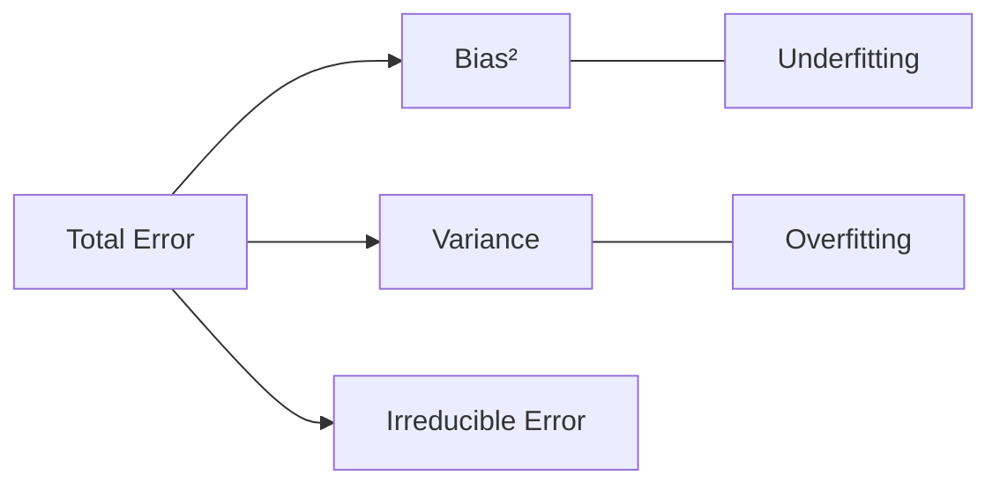

# 30 Overfitting vs Underfitting

tags:
#ml
#overfitting
#underfitting
#bias-variance
#placements
#interview

---

## Why this topic matters
**Overfitting** and **Underfitting** are the two fundamental problems in machine learning. Every model you build will suffer from one or the other unless you balance them correctly. Understanding this trade-off is essential for diagnosing model issues and improving performance.

## Learning Objectives
- Understand what Overfitting and Underfitting are.
- Learn how to detect each problem.
- Know strategies to fix overfitting and underfitting.
- Understand the Bias-Variance Tradeoff connection.

## Prerequisites
- [[09 Bias-Variance Tradeoff]]
- [[08 Model Evaluation]]
- [[28 Regularization]]

---

## Intuition
Imagine you're **studying for a math exam**.

### Underfitting (Too Simple)
- You only study the **chapter titles**.
- Exam question: "Solve 2x + 5 = 15"
- You: "I know this is about algebra... but I don't know how to solve it."
- **Result**: Poor performance on both practice and real exam.

**Underfitting**: The model is too simple to capture the pattern.

### Overfitting (Too Complex)
- You **memorize every practice problem** by heart.
- Practice: "2x + 5 = 15 → x = 5" ✓
- Practice: "3x - 2 = 7 → x = 3" ✓
- Real Exam: "4x + 10 = 30" (similar but different)
- You: "I haven't seen this exact problem before!" ❌
- **Result**: Perfect on practice, terrible on real exam.

**Overfitting**: The model memorizes training data but fails to generalize.

### Good Fit (Just Right)
- You **learn the underlying concepts** (how to isolate x).
- Practice: Solve various equations ✓
- Real Exam: Solve new equations ✓
- **Result**: Good performance on both.

**Good Fit**: The model learns the pattern, not the noise.

---

## Detailed Explanation

### Visual Comparison

```
Training Data:  • • • • • • • • •  (curved pattern)

Underfit:       ———————————————  (straight line, misses pattern)
Good Fit:       ～～～～～～～～～～～  (follows the curve)
Overfit:        〰️〰️〰️〰️〰️〰️〰️〰️  (connects every dot, too wiggly)
```

### Overfitting

**Definition**: Model performs very well on training data but poorly on test/unseen data.

**Symptoms**:
- Training Accuracy: 99%
- Test Accuracy: 60%
- **Gap**: 39% (huge!)

**Causes**:
- Model too complex (too many parameters).
- Trained for too many epochs.
- Training data is too small or noisy.
- No regularization.

**How to Fix**:
1. **Get more data**: Dilutes the noise.
2. **Simplify the model**: Fewer layers, fewer features.
3. **Add Regularization**: L1/L2, Dropout (for neural networks).
4. **Early Stopping**: Stop training when validation error starts increasing.
5. **Reduce Features**: Feature selection, PCA.
6. **Ensemble Methods**: Random Forest (bagging reduces variance).

### Underfitting

**Definition**: Model performs poorly on both training and test data.

**Symptoms**:
- Training Accuracy: 50%
- Test Accuracy: 48%
- **Gap**: 2% (small, but both are bad!)

**Causes**:
- Model too simple (not enough capacity).
- Not enough features.
- Too much regularization.
- Training time too short.

**How to Fix**:
1. **Increase Model Complexity**: More layers, more neurons, higher degree polynomial.
2. **Add Features**: Feature engineering, more relevant inputs.
3. **Reduce Regularization**: Lower lambda.
4. **Train Longer**: More epochs, more iterations.
5. **Try Different Algorithm**: Switch from Linear Regression to Decision Tree, etc.

### The Bias-Variance Tradeoff

This is the **fundamental tension** in ML:

```
Model Complexity →

Bias (Underfit)  |  Good Fit  |  Variance (Overfit)
    High         |   Balanced |      High
    Low Train Acc|  High Acc  |   High Train Acc
    Low Test Acc | High Test Acc |  Low Test Acc
```

- **High Bias** = Underfitting (model is too simple).
- **High Variance** = Overfitting (model is too sensitive to training data).
- **Goal**: Find the **sweet spot** in the middle.



### Diagnostic Table

| Metric | Underfitting | Good Fit | Overfitting |
| :--- | :--- | :--- | :--- |
| **Training Accuracy** | Low | High | Very High |
| **Test Accuracy** | Low | High | Low |
| **Train-Test Gap** | Small | Small | Large |
| **Bias** | High | Balanced | Low |
| **Variance** | Low | Balanced | High |

---

## Real-world Example

### Overfitting: Stock Price Prediction

**Scenario**: You train a deep neural network on 1 year of stock data.

- **Training**: Model memorizes every daily fluctuation. 99% accuracy.
- **Test (next month)**: Market behaves slightly differently. Model fails. 45% accuracy.

**Why?**: The model learned noise (random daily fluctuations), not the underlying trend.

**Fix**: Simplify the model, add regularization, get more historical data.

### Underfitting: House Price Prediction

**Scenario**: You use a simple linear regression with only one feature (square footage).

- **Training**: Model can't capture nonlinear effects (location, age, amenities). 55% accuracy.
- **Test**: Still 52% accuracy.

**Why?**: The model is too simple to capture the complexity of house pricing.

**Fix**: Add more features (location, bedrooms, age), try a more complex model (Random Forest).

---

## Advantages of Understanding This
- **Diagnosis**: Quickly identify why a model is failing.
- **Actionable Fixes**: Know exactly what to change.
- **Better Models**: Achieve higher real-world performance.
- **Interview Ready**: This is a guaranteed interview topic.

## Limitations
- **Trade-off**: Can't eliminate both; must balance.
- **Empirical**: Requires experimentation to find the sweet spot.
- **Data-Dependent**: What works for one dataset may not work for another.

---

## Common Interview Questions
- **What is the difference between overfitting and underfitting?**
- **How do you detect overfitting?**
- **How do you fix underfitting?**
- **Explain the Bias-Variance Tradeoff.**
- **What does a large gap between training and test accuracy indicate?**
- **Is high training accuracy always good?**
- **What is early stopping?**

### Interview Answer Tips
- Use the **student exam analogy** for clarity.
- Mention that **some gap is normal**, but a huge gap = overfitting.
- Emphasize that **more data helps overfitting**, **more complexity helps underfitting**.

---

## Common Mistakes
- Thinking high training accuracy is always good (it's not if test accuracy is low).
- Adding more data to fix underfitting (doesn't help; need more complexity).
- Regularizing an already underfit model (makes it worse).
- Confusing bias (underfit) with variance (overfit).

---

## Summary
Overfitting: Model memorizes training data, fails on test data (high variance). Underfitting: Model is too simple, fails on both (high bias). The goal is to find the sweet spot (good fit) by balancing bias and variance. Fix overfitting with more data, simpler models, regularization. Fix underfitting with more complexity, more features, less regularization.

---

## Practice Questions
1. If training accuracy is 98% and test accuracy is 55%, what's the problem?
2. If training accuracy is 50% and test accuracy is 48%, what's the problem?
3. How does adding more data help with overfitting?
4. Why doesn't more data help with underfitting?
5. What is early stopping and how does it prevent overfitting?
6. Can a model have both high bias and high variance?
7. What's the ideal training-test accuracy gap?
8. How does regularization affect overfitting and underfitting?

---

## Mini Project Ideas
1. **Overfitting Demo**: Train a deep decision tree on a small dataset. Show the train-test gap.
2. **Underfitting Demo**: Fit a linear line to a curved dataset. Show poor performance on both.
3. **Regularization Effect**: Add L2 regularization to an overfit model. Observe the gap shrink.

---

## Further Reading
- [[09 Bias-Variance Tradeoff]]
- [[28 Regularization]]
- [[08 Model Evaluation]]
- [[20 Hyperparameter Tuning]]