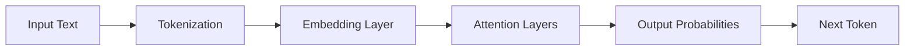

# 35 LLM Fundamentals

tags:
#llm
#genai
#placements
#interview
#transformer

---

## Why this topic matters
Large Language Models (LLMs) like ChatGPT, Claude, and Gemini have revolutionized AI. In interviews, you're expected to understand how they work at a high level, their limitations, and how to use them effectively.

## Learning Objectives
- Understand what an LLM is.
- Learn the Transformer architecture (at a high level).
- Understand Tokenization, Context Window, and Pretraining.

## Prerequisites
- [[21 Neural Networks Basics]]
- [[33 Text Preprocessing]]

---

## Intuition
Imagine you are reading a **Choose Your Own Adventure** book, but instead of choosing, you're predicting the next word.
- You read: "Once upon a time in a..."
- You guess: "kingdom."
- Now you have: "Once upon a time in a kingdom..."
- You guess: "far."
- And so on...

An **LLM** is just a very sophisticated version of this game. It predicts the next word based on all previous words, using patterns learned from reading billions of books and websites.

---

## Detailed Explanation

### 1. What is an LLM?
A Large Language Model is a Deep Learning model trained on massive text data to:
- **Generate** text (complete sentences, write stories).
- **Understand** text (answer questions, summarize).
- **Translate** between languages.

Size matters: "Large" refers to **Parameters** (weights). GPT-3 has 175 Billion parameters.

### 2. The Transformer Architecture
Introduced in the "Attention Is All You Need" paper (2017). Key innovations:

#### Attention Mechanism
The model learns which words to "pay attention to."
- Sentence: "The animal didn't cross the street because **it** was tired."
- The model learns that "it" refers to "animal," not "street."

#### Encoder-Decoder
- **Encoder**: Understands the input.
- **Decoder**: Generates the output.
- LLMs like GPT are **Decoder-only**.

### 3. Tokenization
LLMs don't read words; they read **Tokens** (chunks of characters).
- "ChatGPT" → ["Chat", "G", "PT"]
- 1 Token ≈ 4 characters or 0.75 words.

### 4. Context Window
The maximum number of tokens the model can "remember" at once.
- GPT-3: 2,048 tokens.
- GPT-4: 128,000 tokens.
- If you exceed it, the model "forgets" the beginning.

### 5. Pretraining vs. Fine-tuning
- **Pretraining**: Learn general language patterns from internet data (expensive, done once).
- **Fine-tuning**: Train on specific data (e.g., medical texts) to specialize.

---

## Real-world Example
**GitHub Copilot**
Uses an LLM trained on public GitHub code. When you type a comment like `# Sort array`, Copilot predicts the next tokens: `arr.sort()` or `sorted(arr)`.

---

## Advantages
- **Versatile**: One model for many tasks (translation, Q&A, coding).
- **Scale**: Gets better with more data and compute.
- **Few-Shot Learning**: Can learn from just a few examples in the prompt.

## Limitations
- **Hallucinations**: Confidently makes up facts.
- **Cost**: Running large models is expensive.
- **Latency**: Generating long responses takes time.
- **Static Knowledge**: Doesn't know about events after its training cutoff.

---

## Common Interview Questions
- **What is an LLM?**
- **Explain the Transformer architecture.**
- **What is Tokenization?**
- **What is the difference between Pretraining and Fine-tuning?**
- **What are Hallucinations?**

### Interview Answer Tips
- Mention **Attention Mechanism** as the key innovation.
- Explain that LLMs are **Next Token Predictors**, not "truth machines."

---

## Common Mistakes
- Thinking LLMs "understand" text like humans (they don't; they predict).
- Ignoring the context window limit.
- Expecting 100% accuracy (hallucinations are inherent).

---

## Summary
LLMs are Transformer-based models that predict the next token. They use Attention to understand context and are pretrained on massive text data. Despite their power, they can hallucinate and have limited context windows.

---

## Practice Questions
1. What is a Token in the context of LLMs?
2. Why is Attention important?
3. What happens if input exceeds the context window?
4. What is the difference between an Encoder and Decoder?
5. Why do LLMs hallucinate?

---

## Mini Project Ideas
1. **Token Counter**: Write a script to count tokens in a text using a tokenizer library.
2. **Prompt Experiment**: Test how an LLM responds to different phrasings of the same question.

---

## Further Reading
- [[36 Prompt Engineering]]
- [[39 Embeddings]]
- [[50 RAG]] (See existing [[RAG]] note)
- [[51 Vector Databases]] (See existing [[Vector Databases]] note)