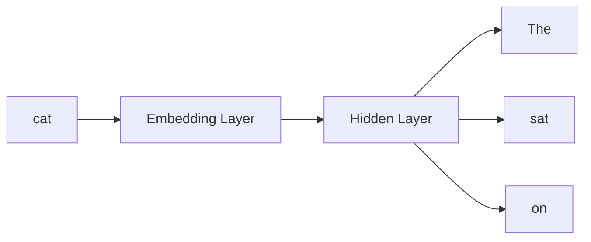
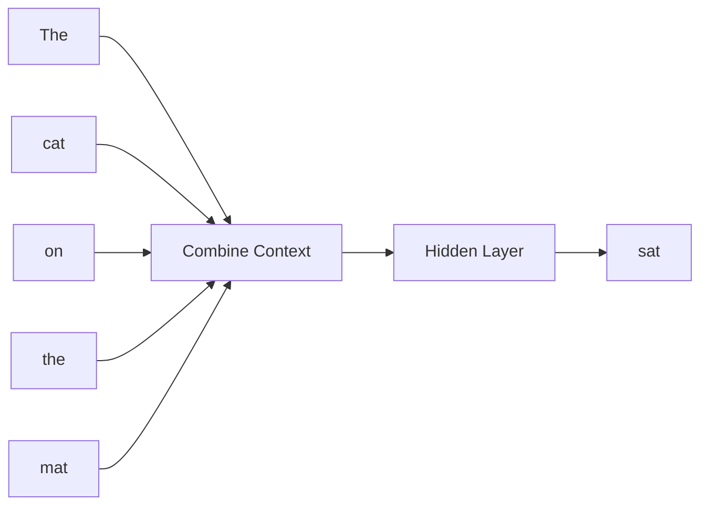

# 38 Word2Vec

tags:
#nlp
#embeddings
#word2vec
#placements
#interview

---

## Why this topic matters
Word2Vec revolutionized NLP by showing that **words can be represented as vectors** where semantic meaning is captured in the vector space. It's the foundation for all modern embedding techniques and is frequently asked in interviews.

## Learning Objectives
- Understand what word embeddings are.
- Learn how Word2Vec works (Skip-gram and CBOW).
- Understand the "King - Man + Woman = Queen" analogy.
- Know limitations of Word2Vec.

## Prerequisites
- [[33 Text Preprocessing]]
- [[34 Tokenization]]
- [[39 Embeddings]]

---

## Intuition
Imagine you're organizing a **library**.

**Old way (One-hot encoding)**:
- Each book gets a random ID number.
- "Cat" = ID 4521, "Dog" = ID 8734
- No relationship between similar books.

**Word2Vec way**:
- Books are placed by **topic**.
- "Cat" and "Dog" are on nearby shelves (both animals).
- "Cat" and "Car" are far apart (different topics).

Word2Vec learns that **words appearing in similar contexts have similar meanings**.

---

## Detailed Explanation

### What are Word Embeddings?

Word embeddings are **dense vector representations** of words.

- **One-hot encoding**: `[0, 0, 1, 0, 0, 0, ...]` (sparse, high-dimensional)
- **Word2Vec**: `[0.2, -0.4, 0.8, 0.1, ...]` (dense, 50-300 dimensions)

**Key insight**: Similar words have **similar vectors**.
- `cosine_similarity("cat", "dog")` ≈ 0.8 (high)
- `cosine_similarity("cat", "car")` ≈ 0.1 (low)

### Word2Vec Architecture

Created by Google (Mikolov et al., 2013). Two main approaches:

#### 1. Skip-gram

**Goal**: Given a word, predict its **context words** (nearby words).

```
Input: "cat"
Context: ["The", "sat", "on", "the", "mat"]

Model learns: "cat" often appears near "sat", "mat", etc.
```

**Use case**: Better for **rare words**.



#### 2. CBOW (Continuous Bag of Words)

**Goal**: Given context words, predict the **center word**.

```
Context: ["The", "cat", "on", "the", "mat"]
Target: "sat"

Model learns: When these words appear together, "sat" is likely in the middle.
```

**Use case**: Faster, better for **common words**.



### Training Process

1. **Input**: Large corpus (e.g., Wikipedia, news articles).
2. **Sliding Window**: Move a window (e.g., 5 words) across text.
3. **Learn**: For each position, try to predict context (Skip-gram) or center word (CBOW).
4. **Update**: Adjust word vectors to make correct predictions.
5. **Result**: Each word has a 300-dimensional vector.

### The Magic: Vector Arithmetic

Word2Vec vectors capture **semantic relationships**!

```
Vector("King") - Vector("Man") + Vector("Woman") ≈ Vector("Queen")
```

**Why?** 
- The vector "difference" between King and Man captures "royalty minus male".
- Adding "female" (Woman) gives "royalty + female" = Queen.

Other examples:
```
"Paris" - "France" + "Germany" ≈ "Berlin"
"walked" - "walk" + "swim" ≈ "swam"
```

This showed that Word2Vec learned **meaning**, not just co-occurrence!

---

## Real-world Example

**Search Engines**

User searches: "affordable smartphone"

Word2Vec knows:
- "affordable" ≈ "cheap", "budget", "inexpensive"
- "smartphone" ≈ "phone", "mobile", "iPhone", "Android"

So it returns results with those related words too, even if they don't contain the exact keywords.

---

## Advantages
- **Semantic Similarity**: Captures word meanings.
- **Efficient**: Dense vectors (300 dimensions vs. 50,000+ for one-hot).
- **Transferable**: Pre-trained vectors can be used in any NLP task.
- **Arithmetic**: Supports meaningful vector operations.

## Limitations
- **Static Embeddings**: One vector per word. "bank" (river) and "bank" (money) have the same vector!
- **No Context**: Doesn't consider word order or sentence context.
- **Out of Vocabulary**: Can't handle unknown words.
- **Superseded**: Modern embeddings (BERT, etc.) are better.

---

## Common Interview Questions
- **What is Word2Vec?**
- **Difference between Skip-gram and CBOW?**
- **Explain the "King - Man + Woman = Queen" analogy.**
- **What are the limitations of Word2Vec?**
- **How is Word2Vec different from one-hot encoding?**
- **Can Word2Vec handle words with multiple meanings?**

### Interview Answer Tips
- Emphasize that Word2Vec was **groundbreaking** (first to show semantic vectors).
- Mention that it's **outdated** now (replaced by BERT, etc.).
- Use the **vector arithmetic example** to demonstrate understanding.

---

## Common Mistakes
- Thinking Word2Vec is still state-of-the-art (it's not).
- Not mentioning that Word2Vec can't handle polysemous words (words with multiple meanings).
- Forgetting to explain the training objective (predict context or center word).
- Confusing Word2Vec with embeddings in general.

---

## Summary
Word2Vec is a neural network-based technique for learning word embeddings. Skip-gram predicts context from a word; CBOW predicts a word from context. It captures semantic relationships (King - Man + Woman = Queen) but has static embeddings that can't handle multiple meanings. Modern models like BERT have superseded it.

---

## Practice Questions
1. What does Word2Vec stand for?
2. What is the difference between Skip-gram and CBOW?
3. Why is "King - Man + Woman = Queen" significant?
4. What is the main limitation of Word2Vec?
5. How does Word2Vec know that "cat" and "dog" are similar?
6. Can Word2Vec handle the word "bank" in both contexts?
7. What replaced Word2Vec as the standard for embeddings?
8. How many dimensions do typical Word2Vec vectors have?

---

## Mini Project Ideas
1. **Word Similarity**: Load pre-trained Word2Vec and find words most similar to "happy".
2. **Vector Arithmetic**: Test "King - Man + Woman" and other analogies.
3. **Visualization**: Use PCA/t-SNE to visualize Word2Vec vectors in 2D.

---

## Further Reading
- [[33 Text Preprocessing]]
- [[34 Tokenization]]
- [[39 Embeddings]]
- [[35 LLM Fundamentals]] (for modern embeddings)