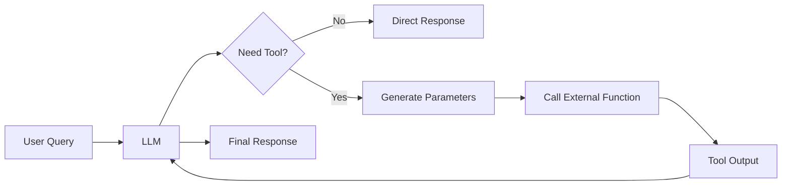

# 42 Function Calling with LLMs

tags:
#llm
#function-calling
#tool-use
#genai
#placements
#interview

---

## Why this topic matters
**Function calling** (also called **tool use**) allows LLMs to interact with external systems (APIs, databases, calculators). This transforms LLMs from chatbots into **agents** that can take actions. Understanding function calling is essential for building AI assistants, chatbots with integrations, and agentic workflows.

## Learning Objectives
- Understand what function calling is and why it's needed.
- Learn how function calling works under the hood.
- Understand the difference between native function calling and manual implementations.
- Know common use cases and best practices.

## Prerequisites
- [[35 LLM Fundamentals]]
- [[36 Prompt Engineering]]
- [[53 AI Agents]]

---

## Intuition
Imagine you have a **brilliant assistant** who knows everything but:
- Can't check your calendar.
- Can't send emails.
- Can't look up real-time data.

They're **trapped in a bubble** of their training knowledge.

**Function calling** gives your assistant a **phone and a computer**:
- "Check my calendar" → Calls Google Calendar API.
- "Send an email" → Calls Gmail API.
- "What's the weather?" → Calls Weather API.

Now your assistant can **take actions**, not just chat.

---

## Detailed Explanation

### What is Function Calling?

**Function calling** is a mechanism where an LLM can:
1. **Decide** to call an external function (API, tool, database).
2. **Generate** the correct parameters for that function.
3. **Receive** the function's output.
4. **Use** the output to generate a final response.



### Why Do We Need Function Calling?

**LLMs Have Limitations**:
- **No real-time data**: Trained on historical data.
- **No access to private data**: Can't access your emails, calendar, database.
- **Can't take actions**: Can't send emails, book appointments, make purchases.
- **Bad at math**: Struggle with complex calculations.

**Function Calling Solves These**:
- **Real-time data**: Call weather, stock, news APIs.
- **Private data**: Query your database, CRM, calendar.
- **Actions**: Send emails, create tickets, book flights.
- **Math**: Offload calculations to a calculator tool.

### How Does It Work?

#### Step 1: Define Functions

You provide the LLM with a **schema** of available functions.

```json
[
  {
    "name": "get_weather",
    "description": "Get current weather for a location",
    "parameters": {
      "type": "object",
      "properties": {
        "location": {"type": "string", "description": "City name"}
      },
      "required": ["location"]
    }
  },
  {
    "name": "send_email",
    "description": "Send an email to a recipient",
    "parameters": {
      "type": "object",
      "properties": {
        "to": {"type": "string", "description": "Recipient email"},
        "subject": {"type": "string", "description": "Email subject"},
        "body": {"type": "string", "description": "Email body"}
      },
      "required": ["to", "subject", "body"]
    }
  }
]
```

#### Step 2: LLM Decides to Call

User: "What's the weather in Paris?"

LLM doesn't answer directly. Instead, it outputs:

```json
{
  "function": "get_weather",
  "arguments": {"location": "Paris"}
}
```

#### Step 3: Execute Function

Your code intercepts this and calls the actual API:

```python
if function == "get_weather":
    result = weather_api.get_weather(arguments["location"])
    # result: "22°C, partly cloudy"
```

#### Step 4: LLM Generates Final Response

The result is sent back to the LLM:

```
System: Function output: "22°C, partly cloudy"
LLM: "The current weather in Paris is 22°C and partly cloudy."
```

### Native vs. Manual Function Calling

#### Native Function Calling (OpenAI, Anthropic)

**Models**: GPT-3.5-Turbo, GPT-4, Claude.

**How it works**:
- You pass function schemas in the API call.
- Model outputs structured function calls.
- API doesn't execute functions; your code does.

```python
response = openai.ChatCompletion.create(
    model="gpt-4",
    messages=[{"role": "user", "content": "What's the weather in Paris?"}],
    functions=[{"name": "get_weather", ...}]
)

# response.choices[0].message.function_call
# → {"name": "get_weather", "arguments": {"location": "Paris"}}
```

#### Manual Function Calling (Any LLM)

For models without native support:

**Method**: Use prompt engineering to simulate function calling.

```
System: You have access to these tools:
- get_weather(location): Get current weather
- send_email(to, subject, body): Send an email

If you need to use a tool, output:
TOOL_CALL: tool_name(arg1=value1, arg2=value2)

User: What's the weather in Paris?
Assistant: TOOL_CALL: get_weather(location="Paris")
```

Then parse the output and execute manually.

### Common Use Cases

| Use Case | Example |
| :--- | :--- |
| **Real-time Data** | Weather, stock prices, sports scores |
| **Database Queries** | "How many orders did customer X place?" |
| **Calendar Integration** | "Schedule a meeting with John next Tuesday" |
| **Email Sending** | "Send a thank-you email to the team" |
| **Calculations** | "What's 23% of $4,500?" (use calculator) |
| **Multi-step Workflows** | "Research competitors and email me a summary" |

---

## Real-world Example

**Customer Support Chatbot**

User: "I want to cancel my order #12345."

**Without Function Calling**:
- Bot: "I understand you want to cancel. Please contact support at..."
- User: Frustrated, has to switch channels.

**With Function Calling**:
1. Bot recognizes intent: "cancel_order".
2. Calls `cancel_order(order_id="12345")` function.
3. Function returns: `{"status": "success", "refund": "$49.99"}`.
4. Bot: "Your order #12345 has been cancelled. A refund of $49.99 will be processed within 3-5 business days."

**Result**: Seamless, automated resolution.

---

## Advantages
- **Extends LLM Capabilities**: Access real-time data, take actions.
- **Structured Output**: Function calls are machine-readable.
- **Safety**: Can validate parameters before execution.
- **Modular**: Easy to add new tools without retraining.

## Limitations
- **Latency**: Function calls add round-trip time.
- **Error Handling**: Functions can fail; need robust error handling.
- **Security**: Don't expose dangerous functions (e.g., "delete_database").
- **Complexity**: Multi-step workflows require orchestration.

---

## Common Interview Questions
- **What is function calling in LLMs?**
- **Why do we need function calling?**
- **How does native function calling differ from manual?**
- **What are some use cases for function calling?**
- **How do you handle errors in function calling?**
- **Can function calling be used for multi-step workflows?**
- **What are the security risks of function calling?**

### Interview Answer Tips
- Emphasize that function calling **extends LLM capabilities** beyond training data.
- Mention that **the LLM doesn't execute functions**; your code does.
- Note that function calling is foundational for **AI Agents** ([[53 AI Agents]]).

---

## Common Mistakes
- Letting the LLM execute functions directly (security risk!).
- Not validating function parameters before execution.
- Forgetting to handle function failures gracefully.
- Exposing sensitive functions (e.g., "delete_user", "transfer_money").

---

## Summary
Function calling allows LLMs to interact with external systems by generating structured function calls. The LLM decides when to call a function and generates parameters; your code executes the function and returns results. This enables real-time data access, database queries, and automated actions. Function calling is foundational for building AI agents and production AI systems.

---

## Practice Questions
1. What is the main benefit of function calling?
2. Does the LLM execute functions directly?
3. How do you define a function for an LLM?
4. What happens if a function call fails?
5. Can you chain multiple function calls together?
6. What are the security risks of function calling?
7. How is native function calling different from manual?
8. Give an example of a multi-step workflow using function calling.

---

## Mini Project Ideas
1. **Weather Bot**: Build a chatbot that uses a weather API to answer questions.
2. **Calendar Assistant**: Create an assistant that can schedule meetings via Google Calendar API.
3. **Calculator Tool**: Give an LLM access to a Python interpreter for math calculations.

---

## Further Reading
- [[35 LLM Fundamentals]]
- [[36 Prompt Engineering]]
- [[53 AI Agents]]
- [[54 LangChain Basics]]