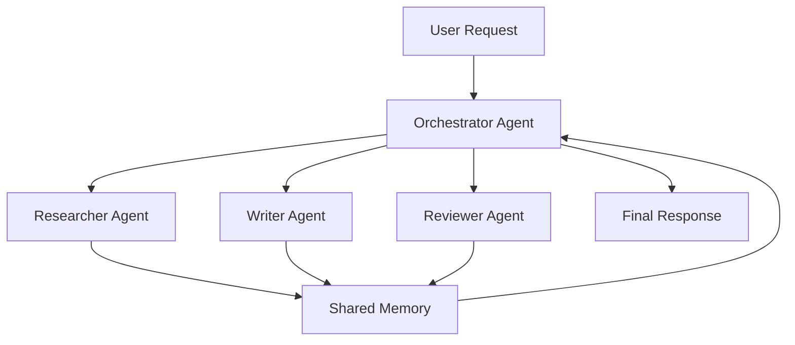

# 46 Multi-Agent Systems

tags:
#ai
#multi-agent
#agents
#llm
#placements
#interview

---

## Why this topic matters
**Multi-Agent Systems** involve multiple AI agents working together to solve complex problems. Instead of one LLM doing everything, different agents specialize in different tasks (research, writing, coding, reviewing). This is the frontier of AI engineering, with frameworks like AutoGen, CrewAI, and LangGraph enabling sophisticated workflows.

## Learning Objectives
- Understand what multi-agent systems are.
- Learn common agent architectures and patterns.
- Understand agent communication and orchestration.
- Know popular multi-agent frameworks.

## Prerequisites
- [[53 AI Agents]]
- [[42 Function Calling with LLMs]]
- [[36 Prompt Engineering]]

---

## Intuition
Imagine you're running a **software company**.

**Single-Agent Approach**:
- One employee does everything: research, design, code, test, document.
- **Result**: Slow, error-prone, overwhelmed.

**Multi-Agent Approach**:
- **Researcher Agent**: Gathers requirements.
- **Architect Agent**: Designs the system.
- **Developer Agent**: Writes code.
- **Tester Agent**: Finds bugs.
- **Technical Writer Agent**: Creates documentation.
- **Result**: Parallel work, specialization, higher quality.

**Multi-Agent Systems** apply this principle to AI: multiple specialized agents collaborating to solve complex tasks.

---

## Detailed Explanation

### What is a Multi-Agent System?

A **Multi-Agent System (MAS)** consists of:
- **Multiple AI Agents**: Each with a specific role/expertise.
- **Communication Protocol**: How agents talk to each other.
- **Orchestration**: How tasks are divided and coordinated.
- **Shared Memory/State**: Common knowledge base.



### Common Agent Roles

| Role | Responsibility | Example Tools |
| :--- | :--- | :--- |
| **Orchestrator** | Coordinates other agents, divides tasks | Task scheduler |
| **Researcher** | Gathers information from web, databases | Search, APIs |
| **Analyst** | Analyzes data, finds patterns | Python, SQL |
| **Writer** | Generates content, reports, emails | LLM |
| **Coder** | Writes and debugs code | Python interpreter, IDE |
| **Reviewer** | Quality checks, fact-checks | Fact-checking APIs |
| **Critic** | Provides feedback, suggests improvements | LLM with critical prompt |
| **Executor** | Takes actions (APIs, emails, etc.) | Function calling |

### Agent Communication Patterns

#### 1. Sequential (Pipeline)

Agents work in a fixed order:

```
User → Researcher → Analyst → Writer → Reviewer → User
```

**Use Case**: Content generation pipelines.

#### 2. Hierarchical (Manager-Worker)

One manager agent delegates to worker agents:

```
         Manager
        /   |   \
    Worker1 Worker2 Worker3
```

**Use Case**: Complex projects with clear分工.

#### 3. Collaborative (Peer-to-Peer)

Agents discuss and collaborate as equals:

```
Agent1 <--> Agent2
   ^         ^
   |         |
   v         v
Agent3 <--> Agent4
```

**Use Case**: Brainstorming, debates, consensus-building.

#### 4. Blackboard (Shared Memory)

All agents read/write to a shared "blackboard":

```
Agent1 → Blackboard ← Agent2
   ↑         ↓         ↑
Agent3 ← Blackboard → Agent4
```

**Use Case**: Complex problems requiring shared context.

### Popular Multi-Agent Frameworks

#### 1. AutoGen (Microsoft)

**Features**:
- Conversational agents.
- Customizable agent roles.
- Code execution, web search integrations.

**Example**:
```python
from autogen import AssistantAgent, UserProxyAgent

researcher = AssistantAgent("Researcher", llm_config={...})
coder = AssistantAgent("Coder", llm_config={...})
user_proxy = UserProxyAgent("User", code_execution_config={...})

user_proxy.initiate_chat(
    researcher, 
    message="Research the latest AI trends",
    max_turns=5
)
```

#### 2. CrewAI

**Features**:
- Role-based agents.
- Task delegation.
- Sequential or hierarchical workflows.

**Example**:
```python
from crewai import Agent, Task, Crew

researcher = Agent(role="Researcher", goal="Find relevant information")
writer = Agent(role="Writer", goal="Write comprehensive report")

task1 = Task(description="Research AI safety", agent=researcher)
task2 = Task(description="Write report", agent=writer)

crew = Crew(agents=[researcher, writer], tasks=[task1, task2])
result = crew.kickoff()
```

#### 3. LangGraph (LangChain)

**Features**:
- Stateful agent workflows.
- Graph-based agent orchestration.
- Conditional routing.

**Use Case**: Complex, stateful multi-agent systems.

#### 4. MetaGPT

**Features**:
- Simulates a software company.
- Agents: CEO, PM, Architect, Engineer, QA.
- End-to-end project generation.

---

## Real-world Example

**Investment Research Platform**

**Goal**: Generate comprehensive stock analysis reports.

**Multi-Agent Setup**:
1. **Data Collector Agent**: Fetches financial data, news, SEC filings.
2. **Analyst Agent**: Analyzes financials, calculates ratios.
3. **Sentiment Agent**: Analyzes news sentiment.
4. **Risk Agent**: Assesses risks, volatility.
5. **Writer Agent**: Synthesizes all analysis into a report.
6. **Reviewer Agent**: Fact-checks, ensures compliance.

**Workflow**:
```
User: "Analyze AAPL stock"

→ Data Collector → Analyst → Sentiment → Risk
                      ↓
                  Writer → Reviewer → Final Report
```

**Benefit**: Each agent specializes in its domain, producing higher-quality analysis than a single LLM.

---

## Advantages
- **Specialization**: Each agent is an expert in its domain.
- **Parallelism**: Agents can work simultaneously.
- **Quality**: Multiple agents review and refine outputs.
- **Scalability**: Easy to add new agent roles.
- **Modularity**: Swap or upgrade individual agents.

## Limitations
- **Complexity**: Orchestrating agents is challenging.
- **Cost**: Multiple agents = more LLM calls = higher cost.
- **Latency**: Sequential workflows are slower.
- **Communication Overhead**: Agents may misunderstand each other.
- **Debugging**: Hard to trace which agent caused an error.

---

## Common Interview Questions
- **What is a multi-agent system?**
- **Explain different agent communication patterns.**
- **What are popular multi-agent frameworks?**
- **When would you use multi-agents vs. a single agent?**
- **What is the role of an orchestrator agent?**
- **How do agents share information?**
- **What are the trade-offs of multi-agent systems?**

### Interview Answer Tips
- Use the **software company analogy** for clarity.
- Emphasize that multi-agents are for **complex, multi-step tasks**.
- Mention that **cost and latency** are key trade-offs.

---

## Common Mistakes
- Using multi-agents for simple tasks (overkill).
- Not defining clear agent roles (agents step on each other's toes).
- Forgetting to implement error handling between agents.
- Allowing infinite loops in agent conversations.

---

## Summary
Multi-Agent Systems use multiple specialized AI agents to solve complex problems collaboratively. Common patterns include sequential, hierarchical, and peer-to-peer communication. Frameworks like AutoGen, CrewAI, and LangGraph simplify implementation. Multi-agents excel at complex, multi-step tasks but add cost, latency, and complexity. They're ideal for research, analysis, and content generation pipelines.

---

## Practice Questions
1. What is the benefit of multi-agent systems over single agents?
2. Describe a hierarchical agent architecture.
3. When would you use sequential vs. collaborative agent patterns?
4. What is the role of shared memory in multi-agent systems?
5. Name three popular multi-agent frameworks.
6. How do you prevent infinite loops in agent conversations?
7. What are the main costs of multi-agent systems?
8. Give an example of a task that benefits from multi-agents.

---

## Mini Project Ideas
1. **Research Assistant**: Build a 2-agent system (Researcher + Writer) to generate reports.
2. **Code Reviewer**: Create a Coder agent and a Reviewer agent that iterate on code.
3. **Debate Club**: Two agents with opposing viewpoints debate a topic; a third judges.

---

## Further Reading
- [[53 AI Agents]]
- [[42 Function Calling with LLMs]]
- [[36 Prompt Engineering]]
- [[50 RAG]]
- [[54 LangChain Basics]]