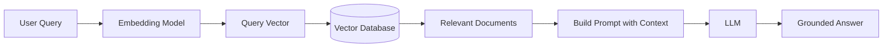

# 50 RAG (Retrieval-Augmented Generation)

tags:
#rag
#llm
#genai
#retrieval
#placements
#interview

---

> [!NOTE]
> This is a condensed interview-focused version. For detailed coverage, see the main [[RAG]] document.

## Why this topic matters
**RAG** is the standard architecture for grounding LLMs in external knowledge. It solves hallucinations by retrieving relevant documents and passing them to the LLM as context. RAG is essential for building chatbots, Q&A systems, and enterprise AI assistants that need to access private or up-to-date information.

## Learning Objectives
- Understand the RAG architecture.
- Know the key components (retrieval, generation).
- Understand when to use RAG vs. fine-tuning.
- Know common RAG challenges and solutions.

## Prerequisites
- [[35 LLM Fundamentals]]
- [[39 Embeddings]]
- [[51 Vector Databases]]

---

## Intuition
Imagine you're taking an **open-book exam**.

**Without RAG (Closed-book)**:
- You rely only on memory (LLM's training data).
- Can't look up new or private information.
- Might hallucinate if unsure.

**With RAG (Open-book)**:
- You have a textbook (knowledge base).
- For each question, you look up relevant pages.
- You answer based on the textbook + your understanding.
- **Result**: More accurate, grounded answers.

**RAG** = **Retrieval** (look up info) + **Generation** (LLM answers).

---

## Detailed Explanation

### RAG Architecture

### Key Components

1. **Knowledge Base**: Documents, databases, wikis, etc.
2. **Ingestion Pipeline**: Chunking → Embedding → Storage.
3. **Vector Database**: Stores embeddings for similarity search.
4. **Retrieval**: Find top-K documents relevant to query.
5. **Generation**: LLM generates answer using retrieved context.

### When to Use RAG

| Use Case | RAG | Fine-tuning |
| :--- | :--- | :--- |
| **Up-to-date info** | ✅ Yes | ❌ No |
| **Private data** | ✅ Yes | ❌ Risky |
| **Reduce hallucinations** | ✅ Yes | ⚠️ Partial |
| **Domain-specific style** | ❌ No | ✅ Yes |
| **Complex reasoning** | ⚠️ Partial | ✅ Yes |

**Rule of Thumb**: Use **RAG** for factual accuracy; use **fine-tuning** for style/behavior customization.

### Common Challenges

| Challenge | Solution |
| :--- | :--- |
| **Poor retrieval** | Better chunking, hybrid search, reranking |
| **Lost in the Middle** | Put important docs at start/end of context |
| **Large documents** | Chunking, hierarchical retrieval |
| **Stale data** | Regular re-indexing, real-time updates |
| **Hallucinations** | Instruct LLM to cite sources, add "I don't know" option |

---

## Real-world Example

**Enterprise HR Chatbot**

**Problem**: Employees ask HR questions ("How many vacation days do I have?"). HR team is overwhelmed.

**RAG Solution**:
1. **Knowledge Base**: Employee handbook, policies, FAQs.
2. **Ingestion**: Chunk documents, embed with sentence-transformers, store in Qdrant.
3. **Query**: Employee asks "How many vacation days?"
4. **Retrieval**: Find relevant policy sections.
5. **Generation**: LLM answers based on retrieved policy.
6. **Citation**: "According to Section 4.2 of the Employee Handbook..."

**Result**: 80% of HR questions answered instantly, accurately.

---

## Advantages
- **Grounded**: Answers based on real documents.
- **Up-to-date**: Update knowledge base without retraining.
- **Private**: Keep sensitive data in your infrastructure.
- **Explainable**: Can cite sources.

## Limitations
- **Retrieval Errors**: Wrong docs → wrong answers.
- **Context Limits**: Can't retrieve too many documents.
- **Latency**: Retrieval + generation adds time.
- **Cost**: Embedding and storage costs.

---

## Common Interview Questions
- **What is RAG?**
- **When would you use RAG vs. fine-tuning?**
- **What are the key components of RAG?**
-   **How do you handle large documents in RAG?**
-   **What is 'Lost in the Middle' in RAG?**
-   **How do you evaluation a RAG system?**

### Interview Answer Tips
- Emphasize that RAG **reduces hallucinations** by grounding in real data.
- Mention **chunking strategy** is critical for retrieval quality.
- Note that **hybrid search** (dense + sparse) is often best.

---

## Summary
RAG combines retrieval (finding relevant documents) with generation (LLM answers). It's used to ground LLMs in external knowledge, reduce hallucinations, and provide up-to-date information. Key components include chunking, embeddings, vector databases, and retrieval. RAG is preferred over fine-tuning for factual accuracy and private data.

---

## Practice Questions
1. What problem does RAG solve?
2. What are the main components of RAG?
3. When is RAG better than fine-tuning?
4. What is chunking and why is it important?
5. What is the 'Lost in the Middle' effect?
6. How do you evaluate RAG quality?
7. What are common retrieval failures?
8. How do you keep RAG data up-to-date?

---

## Further Reading
- [[RAG]] (Full detailed document)
- [[39 Embeddings]]
- [[51 Vector Databases]]
- [[34 Tokenization]]
- [[35 LLM Fundamentals]]