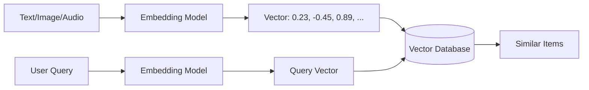
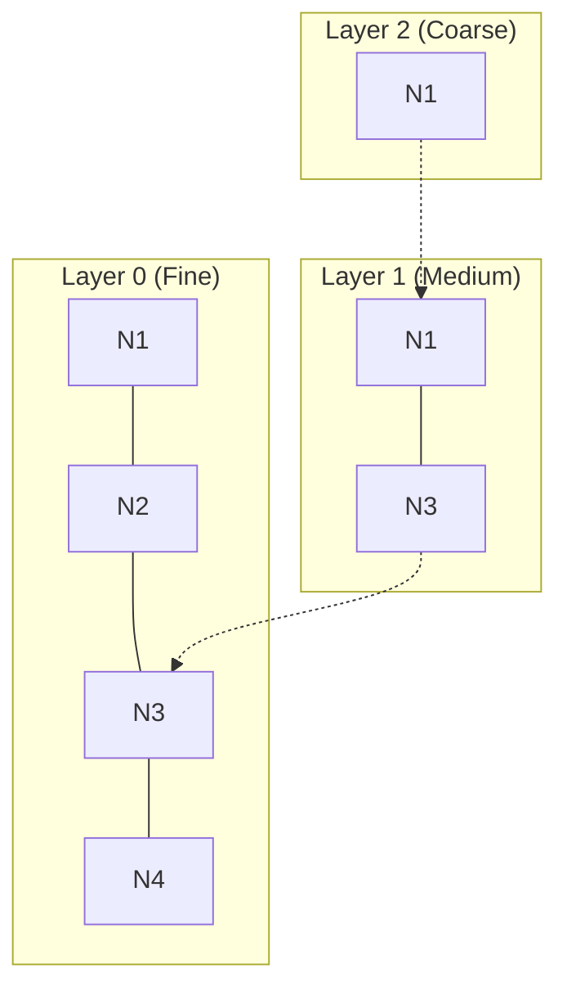

# Vector Databases

tags:
#vector-db
#embeddings
#rag
#llm
#genai
#interview

---

> [!NOTE]
> # 🎯 Interview Quick Reference
> 
> **What is a Vector Database?** A database optimized for storing and querying high-dimensional vectors (embeddings).
> 
> **Key Concepts:**
> - Embeddings as vector representations
> - Similarity search (cosine, dot product, Euclidean)
> - ANN (Approximate Nearest Neighbor) algorithms
> - HNSW index
> - Metadata filtering
> 
> **Common Interview Questions:**
> - "Why not use a regular database for embeddings?"
> - "Explain HNSW in simple terms"
> - "What is the difference between exact and approximate nearest neighbor?"
> - "When would you use FAISS vs. a managed service like Pinecone?"
> - "How does metadata filtering work with vector search?"
> 
> **Popular Tools:**
> - **Qdrant**: Open-source, feature-rich
> - **Pinecone**: Managed, easy to use
> - **FAISS**: Facebook's library (not a full DB)
> - **Weaviate**: With built-in ML
> - **Milvus**: Scalable, open-source
> 
> ---

## What is a Vector Database?

A **Vector Database** is a specialized database designed to store, index, and query high-dimensional vectors. Unlike traditional databases that excel at exact matches (`WHERE id = 5`), vector databases excel at **similarity search** (`SELECT * WHERE embedding IS_SIMILAR_TO query_vector`).

### The Core Use Case



---

## Why Not Use a Regular Database?

### The Problem with Traditional Databases

| Operation | Traditional DB | Vector DB |
| :--- | :--- | :--- |
| **Exact Match** | O(1) with index | Not optimized |
| **Similarity Search** | O(N) - scan all rows | O(log N) with ANN |
| **High-Dim Vectors** | Poor support | Native support |

**Scenario**: You have 1 million product embeddings. Finding the 10 most similar products:
- **PostgreSQL**: Compare against all 1M = **slow**
- **Vector DB**: Use HNSW index = **milliseconds**

---

## Key Concepts

### 1. Embeddings

Vectors that represent data semantically. Similar items have similar vectors.

```
"King" → [0.85, 0.23, -0.12, ...]
"Queen" → [0.82, 0.25, -0.10, ...]  ← Close to King
"Car" → [-0.45, 0.67, 0.89, ...]    ← Far from King
```

### 2. Similarity Metrics

| Metric | Formula | Use Case |
| :--- | :--- | :--- |
| **Cosine Similarity** | cos(θ) = A·B / (||A||·||B||) | Most common, magnitude-independent |
| **Dot Product** | A·B | Faster, used in recommendation |
| **Euclidean Distance** | √(Σ(ai - bi)²) | Actual distance, less common |

### 3. ANN (Approximate Nearest Neighbor)

Exact nearest neighbor is O(N) - too slow for millions of vectors.

**ANN** trades a small amount of accuracy for massive speed improvements:
- **Exact**: 100% accurate, 1 second
- **ANN**: 95-99% accurate, 10 milliseconds

### 4. HNSW (Hierarchical Navigable Small World)

The most popular ANN algorithm.

**Intuition**: Imagine finding a city in a country:
1. First, find the region (coarse search)
2. Then, find the city within the region (fine search)

HNSW builds a **multi-layer graph**:
- **Top layers**: Long-distance connections (coarse)
- **Bottom layers**: Short-distance connections (fine)



**Query Process**:
1. Start at top layer, find approximate region
2. Drill down to finer layers
3. Return nearest neighbors from bottom layer

**Parameters**:
- **M**: Max connections per node (higher = more accurate, more memory)
- **ef_construction**: Size of candidate pool during indexing
- **ef_search**: Size of candidate pool during search (higher = slower but more accurate)

---

## Comparison: Popular Vector Databases

| Feature | Qdrant | Pinecone | FAISS | Weaviate |
| :--- | :--- | :--- | :--- | :--- |
| **Type** | Open-source DB | Managed Service | Library | Open-source DB |
| **Deployment** | Self-hosted or Cloud | Cloud only | Local/In-house | Self-hosted or Cloud |
| **Metadata Filtering** | ✅ Advanced | ✅ Good | ❌ Manual | ✅ With GraphQL |
| **Persistence** | ✅ Built-in | ✅ Managed | ⚠️ Manual | ✅ Built-in |
| **Scaling** | ✅ Clustering | ✅ Auto | ❌ Manual | ✅ Sharding |
| **Best For** | Production, flexibility | Easy setup, no ops | Research, custom | Semantic search |

### When to Use Each

| Scenario | Recommendation |
| :--- | :--- |
| **Startup, no DevOps** | Pinecone (managed) |
| **Production, need control** | Qdrant (self-hosted) |
| **Research/experimentation** | FAISS (local) |
| **Need GraphQL + Vectors** | Weaviate |
| **Massive scale (100M+ vectors)** | Qdrant cluster or Milvus |

---

## Multi-Tenancy Strategies

For SaaS applications, you need to isolate customer data.

### Strategy 1: Single Collection + tenant_id Filter

Store all vectors in one collection with `tenant_id` as metadata.

```
Collection: documents
Vectors: [v1, v2, v3, ...]
Metadata: [{tenant_id: "A"}, {tenant_id: "A"}, {tenant_id: "B"}, ...]

Query: Search with filter tenant_id = "A"
```

| Pros | Cons |
| :--- | :--- |
| Simple management | Need strict filtering |
| Cost-efficient | Risk of data leakage if filter fails |
| Shared indexes | Hard to customize per tenant |

### Strategy 2: Separate Collection per Tenant

```
Collection_A: [v1, v2, v3]
Collection_B: [v4, v5, v6]
```

| Pros | Cons |
| :--- | :--- |
| Better isolation | Many collections to manage |
| Custom settings per tenant | Operational overhead |

### Strategy 3: Separate Instance per Tenant

```
Instance_A: [Collection for Tenant A]
Instance_B: [Collection for Tenant B]
```

| Pros | Cons |
| :--- | :--- |
| Maximum isolation | Very expensive |
| Custom everything | Complex operations |
| Compliance-friendly | Not scalable for many tenants |

> [!TIP]
> **Interview Answer**: For most SaaS applications, use **Strategy 1** (single collection + filters). It's cost-effective and simple. Add strict access controls and audit logging to mitigate risks.

---

## Indexing Strategies

### 1. IVF (Inverted File Index)
- Partitions vectors into clusters
- Search only relevant clusters
- Good for: Medium-sized datasets

### 2. HNSW (Recommended)
- Graph-based, multi-layer
- Best balance of speed and accuracy
- Good for: Most production use cases

### 3. LSH (Locality Sensitive Hashing)
- Hashes similar vectors to same bucket
- Good for: Very large datasets, lower accuracy needs

---

## Production Considerations

### 1. Indexing Time
Building an index takes time:
- 100K vectors: ~1-5 minutes
- 1M vectors: ~10-30 minutes
- 100M vectors: Hours

> Plan for index building during off-peak hours.

### 2. Memory Usage
HNSW indexes are memory-intensive:
- Approximate: 20-40 bytes per vector per dimension
- 1M vectors × 768 dims ≈ 15-30 GB RAM

### 3. Write Performance
Adding vectors to an existing index is slower than bulk indexing:
- **Bulk Load**: 100K vectors/minute
- **Incremental**: 1K vectors/minute

### 4. Consistency vs. Availability
Vector DBs typically prioritize **availability**:
- New vectors may not be immediately searchable
- Eventually consistent (seconds delay)

---

## Common Interview Questions

### 1. "Why use a vector database instead of PostgreSQL with pgvector?"

**Answer**:
- **Specialized Indexes**: HNSW is much faster than pgvector's IVFFlat for large datasets
- **Optimized Operations**: Built-in filtering, ranking, and batch operations
- **Scale**: Vector DBs are designed for millions/billions of vectors
- **pgvector is fine for**: Small datasets (<100K vectors), simple prototypes

### 2. "Explain HNSW to a non-technical person"

**Answer**:
"Imagine you're looking for a specific book in a huge library. Instead of checking every shelf, you first ask: 'Is it fiction or non-fiction?' (coarse search). Then: 'Which genre?' (medium search). Finally, you look at the specific shelf (fine search). HNSW does the same thing with vectors—it quickly narrows down the search from broad to specific."

### 3. "What's the trade-off between speed and accuracy in vector search?"

**Answer**:
"Exact nearest neighbor is 100% accurate but slow (scans all vectors). ANN (Approximate Nearest Neighbor) is 95-99% accurate but 100x faster. For most applications, users can't tell the difference between 98% and 100% accuracy, but they definitely notice 10ms vs. 1000ms latency. So we choose ANN."

### 4. "How do you handle real-time updates in a vector database?"

**Answer**:
"For real-time inserts, most vector DBs support incremental indexing, but it's slower than bulk loads. A common pattern is:
1. Buffer new vectors
2. Batch insert every N minutes or M vectors
3. Rebuild index periodically
4. For critical real-time needs, use a dual-system: immediate search in cache, full search in DB"

---

## Further Reading

- [[39 Embeddings]]
- [[50 RAG]]
- [[35 LLM Fundamentals]]

---

## Practice Questions

1. What is the main advantage of HNSW over a simple linear scan?
2. Why can't we use traditional B-tree indexes for vector search?
3. What is the difference between cosine similarity and dot product?
4. When would you choose FAISS over Pinecone?
5. How does multi-tenancy work in vector databases?
6. What is the "ef_search" parameter in HNSW?
7. Why do vector databases use approximate search instead of exact?
8. How much memory would you need for 1M vectors with 1536 dimensions?
9. What happens if you search a vector DB with a query that has no similar items?
10. How do you combine metadata filtering with vector similarity search?

---

## Mini Project Ideas

1. **Semantic Search**: Build a search engine for your notes using Qdrant.
2. **Recommendation System**: Use vector similarity to recommend similar movies/products.
3. **Duplicate Detector**: Find near-duplicate images using image embeddings.
4. **Cross-Modal Search**: Search images with text (using CLIP embeddings).