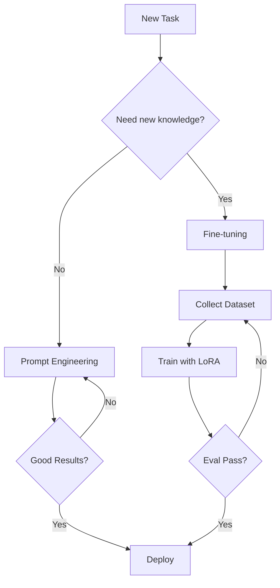

# 51 Fine-tuning vs Prompt Engineering

tags:
#llm
#genai
#placements
#interview

---

## Why this topic matters
When using LLMs, you have two ways to customize behavior: **Prompt Engineering** (changing inputs) or **Fine-tuning** (changing weights). Companies often ask: *"Should we fine-tune or just write better prompts?"* Knowing the trade-off is crucial.

## Learning Objectives
- Differentiate Fine-tuning and Prompt Engineering.
- Understand when to use each approach.
- Learn about PEFT and LoRA (efficient fine-tuning).

## Prerequisites
- [[35 LLM Fundamentals]]
- [[36 Prompt Engineering]]

---

## Intuition
Imagine you are hiring a **Consultant** (the LLM).

**Prompt Engineering**:
You write a detailed brief for the consultant.
- "Here's the task. Here are some examples. Here's the format I want."
- The consultant is the same person, but your instructions are better.
- **Cost**: Cheap. **Effort**: Low. **Flexibility**: High.

**Fine-tuning**:
You send the consultant to a special training course.
- They study your company's documents for weeks. Their brain actually changes.
- Now they "just get it" without needing long briefs.
- **Cost**: Expensive. **Effort**: High. **Flexibility**: Low (they're now specialized).

---

## Detailed Explanation

### 1. Prompt Engineering
Modifying the **input** to guide the model's output.

| Method | Description |
| :--- | :--- |
| **Zero-Shot** | Just ask the question. |
| **Few-Shot** | Provide examples in the prompt. |
| **CoT** | Ask model to "think step by step." |
| **Role Prompting** | "You are an expert lawyer..." |

**Pros:**
- No training required.
- Instant iteration (just change text).
- Works on any LLM.

**Cons:**
- Limited by context window.
- Can't teach new knowledge (only guide existing knowledge).
- Token costs add up for long prompts.

### 2. Fine-tuning
Updating the model's **weights** using your data.

| Method | Description |
| :--- | :--- |
| **Full Fine-tuning** | Update all billions of parameters (expensive). |
| **PEFT** (Parameter-Efficient) | Update only a small subset of parameters. |
| **LoRA** (Low-Rank Adaptation) | Add small "adapter" layers; freeze the main model. |

**Pros:**
- Lower inference costs (shorter prompts).
- Can learn domain-specific jargon/styles.
- Better for complex, nuanced tasks.

**Cons:**
- Requires labeled dataset.
- Expensive to train.
- Risk of "Catastrophic Forgetting" (loses general knowledge).

### 3. Comparison Table

| Feature | Prompt Engineering | Fine-tuning |
| :--- | :--- | :--- |
| **What Changes?** | Input text | Model weights |
| **Data Needed** | None (or few examples) | Thousands of examples |
| **Cost** | Low (API calls) | High (GPU training) |
| **Speed** | Instant | Days/Weeks |
| **Use Case** | General tasks, reasoning | Domain-specific, style |
| **Knowledge** | Can't add new facts | Can learn new facts |

---

## Real-world Example
**Medical AI Assistant**

- **Prompt Engineering**: "You are a medical assistant. Answer questions about diabetes." (Uses model's general knowledge).
- **Fine-tuning**: Train on 10,000 real doctor-patient dialogues from a specific hospital. (Learns hospital-specific protocols and terminology).

---

## Advantages
- **Prompt Engineering**: Fast, cheap, flexible.
- **Fine-tuning**: Specialized, efficient at inference, consistent output.

## Limitations
- **Prompt Engineering**: Limited by model's pretraining.
- **Fine-tuning**: Expensive, requires data, static knowledge.

---

## Common Interview Questions
- **When should you fine-tune vs. use prompt engineering?**
- **What is LoRA?**
- **What is Catastrophic Forgetting?**
- **Can prompt engineering add new knowledge to an LLM?** (Answer: No).

### Interview Answer Tips
- **Rule of Thumb**: Start with Prompt Engineering. Only fine-tune if prompts fail or costs are too high.
- Mention **RAG** as a middle ground (add knowledge via retrieval, not weights).

---

## Common Mistakes
- Fine-tuning for a task that better prompts could solve.
- Expecting fine-tuning to add factual knowledge (use RAG for that).
- Ignoring PEFT methods (full fine-tuning is rarely needed).

---

## Summary
Prompt Engineering changes inputs; Fine-tuning changes weights. Start with prompts. Fine-tune only when you need domain-specific behavior or lower inference costs. Use RAG for new factual knowledge.

---

## Practice Questions
1. You need an LLM to write emails in your company's specific tone. Prompt or Fine-tune?
2. You need an LLM to answer questions about a new product launched yesterday. Prompt, Fine-tune, or RAG?
3. What is LoRA and why is it useful?
4. Why can't fine-tuning reliably add new facts?
5. What is the main cost of prompt engineering at scale?

---

## Mini Project Ideas
1. **Prompt Comparison**: Test zero-shot vs. few-shot on a classification task.
2. **LoRA Fine-tuning**: Use HuggingFace to fine-tune a small model on a custom dataset.

---

## Further Reading
- [[36 Prompt Engineering]]
- [[50 RAG]]
- [[35 LLM Fundamentals]]
- [[51 Vector Databases]]