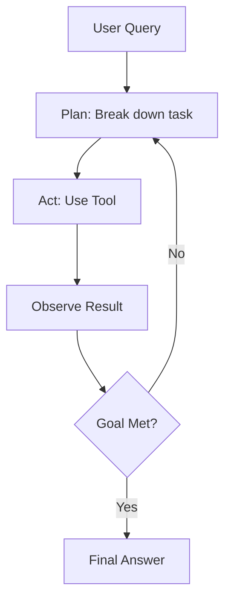

# 53 AI Agents

tags:
#agents
#llm
#genai
#placements
#interview

---

## Why this topic matters
AI Agents are the next evolution beyond simple chatbots. Instead of just returning text, agents can **take actions**: call APIs, search the web, run code, or interact with databases. Companies are increasingly building agent-based workflows, and interviewers want to know if you understand the architecture.

## Learning Objectives
- Understand what an AI Agent is.
- Learn the core components: Memory, Planning, Tool Use.
- Understand ReAct and Reflection patterns.

## Prerequisites
- [[35 LLM Fundamentals]]
- [[36 Prompt Engineering]]

---

## Intuition
Imagine a **Personal Assistant** vs. a **Librarian**.

- **Librarian (Standard LLM)**: You ask a question, they give an answer from their knowledge. They can't *do* anything else.
  - *"What's the weather?"* → "I don't know, I was trained on old data."

- **Personal Assistant (AI Agent)**: You ask a question, they figure out what tools they need, use them, and give you an answer.
  - *"What's the weather?"* → (Checks weather API) → "It's 72°F and sunny."

Agents **act**, not just respond.

---

## Detailed Explanation

### 1. What is an AI Agent?
An AI Agent is an LLM wrapped in a system that allows it to:
1. **Perceive** the environment.
2. **Plan** a sequence of actions.
3. **Act** using tools.
4. **Reflect** on the results.

### 2. Core Components

#### Memory
- **Short-term**: The current conversation context.
- **Long-term**: A vector database of past interactions or knowledge.

#### Planning
- **Decomposition**: Breaking a big task into small steps.
  - *"Book a trip"* → Search flights → Check hotels → Book car.
- **ReAct (Reason + Act)**: The agent thinks, acts, observes, and repeats.

#### Tool Use
- Agents can call external functions:
  - Search the web.
  - Run Python code.
  - Query a database.
  - Send an email.

#### Reflection
- The agent checks its own work: *"Did I answer the user's question? Should I try a different approach?"*



### 3. Agent Patterns

#### ReAct (Reason + Act)
The agent alternates between **Thought** and **Action**.
```
Thought: I need to find the current stock price of AAPL.
Action: Search Google for "AAPL stock price".
Observation: $178.50
Thought: I have the answer.
Final Answer: AAPL is trading at $178.50.
```

#### Reflection / Self-Correction
The agent generates a solution, critiques it, and improves it.
```
Draft: [Writes code]
Critique: This code has a bug in line 5.
Revision: [Fixes the bug]
```

### 4. Frameworks
- **LangChain**: Popular library for building agents.
- **LangGraph**: For stateful, multi-agent workflows.
- **LlamaIndex**: For data-focused agents (RAG + Agents).
- **AutoGen**: Microsoft's multi-agent framework.

---

## Real-world Example
**Customer Support Agent**
Instead of just answering FAQs, an agent can:
1. Look up the user's order in the database.
2. Check the shipping status via API.
3. If delayed, automatically issue a refund.
4. Email the user with the update.

---

## Advantages
- **Autonomous**: Can complete multi-step tasks without human intervention.
- **Flexible**: Can use any tool you give it.
- **Scalable**: One agent can handle thousands of requests.

## Limitations
- **Reliability**: Agents can get stuck in loops or make wrong tool choices.
- **Cost**: Multiple LLM calls per task add up.
- **Security**: Giving an agent access to tools can be risky (e.g., "Delete all files").

---

## Common Interview Questions
- **What is an AI Agent?**
- **Explain the ReAct pattern.**
- **What is the difference between an LLM and an Agent?**
- **What are the challenges of building agents?**

### Interview Answer Tips
- Emphasize that agents **use tools**, not just generate text.
- Mention **ReAct** as the standard reasoning pattern.

---

## Common Mistakes
- Giving agents too much freedom without guardrails.
- Not implementing a "max iterations" limit (can loop forever).
- Expecting 100% reliability (agents are probabilistic).

---

## Summary
AI Agents extend LLMs with memory, planning, and tool use. They follow patterns like ReAct to reason and act autonomously. They are powerful but require careful design to avoid loops and security issues.

---

## Practice Questions
1. What is the key difference between an LLM and an Agent?
2. Explain the ReAct pattern.
3. Why do agents need memory?
4. What is a "tool" in the context of agents?
5. How do you prevent an agent from looping forever?

---

## Mini Project Ideas
1. **Weather Agent**: Build an agent that uses a weather API to answer questions.
2. **Calculator Agent**: Give an LLM access to a Python interpreter to solve math problems.

---

## Further Reading
- [[36 Prompt Engineering]]
- [[35 LLM Fundamentals]]
- [[50 RAG]]
- [[54 LangChain Basics]]