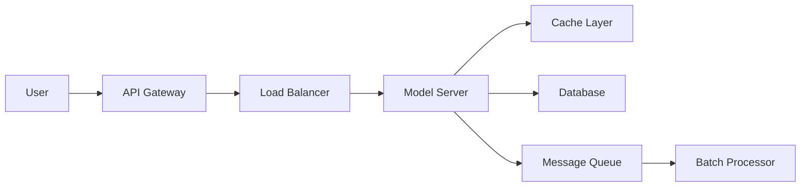

# 55 AI System Design Basics

tags:
#ai-system-design
#ml
#placements
#interview

---

## Why this topic matters
Just like traditional software, AI systems need to be designed for scale, latency, and reliability. In interviews, you may be asked: *"How would you design a recommendation system for millions of users?"* This requires thinking beyond just the model to the entire infrastructure.

## Learning Objectives
- Understand the components of an AI system.
- Learn about Model Serving, Batching, and Caching.
- Understand the trade-offs between Real-time and Batch inference.

## Prerequisites
- [[03 AI Development Lifecycle]]
- [[35 LLM Fundamentals]]

---

## Intuition
Imagine you are running a **Food Delivery Service**.
- **Training the Model**: Like creating the perfect recipe in a test kitchen.
- **Serving the Model**: Like running the actual restaurant during a dinner rush.

You can have the best recipe, but if your kitchen is slow, the waiters are confused, or the ovens are broken, the customers will have a bad experience. **AI System Design** is about building the "restaurant" around the model.

---

## Detailed Explanation

### 1. Key Components of an AI System

### 2. Model Serving
How do you make your trained model accessible to users?

- **Real-time Inference**: User sends request → Model predicts → Response returned immediately.
  - **Use Case**: Chatbots, Fraud Detection.
  - **Challenge**: Low latency (<100ms).

- **Batch Inference**: Collect requests → Run all at once (e.g., nightly) → Store results.
  - **Use Case**: Recommendations, Email Spam Filtering.
  - **Challenge**: Data freshness.

### 3. Optimization Techniques

#### Batching
Process multiple requests together to utilize GPU parallelism.
- **Dynamic Batching**: Wait a few milliseconds to gather more requests before processing.

#### Caching
Store predictions for common requests.
- *"What's the capital of France?"* → Return cached answer, don't call the model.

#### Quantization
Reduce model precision (e.g., FP32 → INT8) to make it faster and smaller.
- **Trade-off**: Slight accuracy drop for 2-4x speedup.

#### Model Distillation
Train a small "student" model to mimic a large "teacher" model.
- **Result**: A tiny model that's almost as good but much faster.

### 4. GPU vs. CPU
| | **CPU** | **GPU** |
| :--- | :--- | :--- |
| **Best For** | Low-throughput, simple models | High-throughput, deep learning |
| **Cost** | Cheap | Expensive |
| **Latency** | Higher for large models | Lower (parallel processing) |

### 5. Cost vs. Latency Trade-off
- **Low Latency**: Use small models, caching, GPUs, and real-time inference. (Expensive).
- **Low Cost**: Use large models, batch inference, CPUs, and no caching. (Slower).

---

## Real-world Example
**Netflix Recommendations**
- **Batch**: Every night, Netflix pre-computes recommendations for all users and stores them in a database. (Fast to serve, but not real-time).
- **Real-time**: When you start watching, Netflix uses a real-time model to suggest "Because you watched X..." based on your current session.

---

## Advantages
- **Scalability**: Can serve millions of users.
- **Cost Control**: Optimization reduces cloud bills.
- **Reliability**: Proper design prevents crashes during traffic spikes.

## Limitations
- **Complexity**: Requires knowledge of distributed systems.
- **Infrastructure Cost**: GPUs and caching layers are expensive.

---

## Common Interview Questions
- **Real-time vs. Batch inference: when to use which?**
- **How do you reduce the latency of an LLM?**
- **What is Model Quantization?**
- **How would you design a system to serve a model to 1M users?**

### Interview Answer Tips
- Always mention **Caching** as the first line of defense for latency.
- Discuss **Batching** for throughput optimization.

---

## Common Mistakes
- Ignoring the cost of serving large models.
- Not planning for traffic spikes.
- Forgetting to monitor model drift in production.

---

## Summary
AI System Design extends beyond training to include serving, scaling, and optimizing models. Key techniques include batching, caching, quantization, and choosing between real-time and batch inference.

---

## Practice Questions
1. When would you choose Batch Inference over Real-time?
2. How does caching help in AI systems?
3. What is Quantization?
4. Why are GPUs preferred for serving large models?
5. How do you handle a sudden 10x spike in traffic?

---

## Mini Project Ideas
1. **Model API**: Wrap a simple ML model in a FastAPI endpoint.
2. **Caching Layer**: Add Redis caching to your model API and measure latency improvement.

---

## Further Reading
- [[03 AI Development Lifecycle]]
- [[35 LLM Fundamentals]]
- [[58 MLOps]]