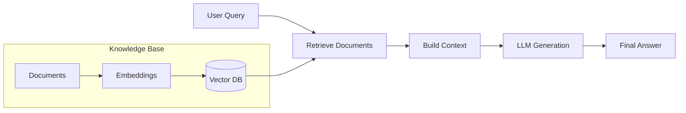

[[Excalidraw/MySystemDesigns.md#^r_Fm1S5w-enCZwuqVs2yP|RAG_ARCHITECTURE]]

tags:
#rag
#llm
#genai
#interview
#vector-search
#embeddings

---

> [!NOTE]
> # 🎯 Interview Quick Reference
> 
> **What is RAG?** Retrieval-Augmented Generation combines retrieval (finding relevant documents) with generation (LLM creating answers).
> 
> **Key Components:**
> - Knowledge Base (Documents)
> - Ingestion Pipeline (Chunking + Embeddings)
> - Vector Database (Storage)
> - Retrieval Layer (Similarity Search)
> - Generator (LLM)
> 
> **Common Interview Questions:**
> - "Explain RAG architecture"
> - "RAG vs Fine-tuning: when to use which?"
> - "What is the Lost in the Middle phenomenon?"
> - "How do you evaluate a RAG system?"
> - "What is the difference between dense and sparse retrieval?"
> 
> **Key Metrics:**
> - **Context Precision**: Are retrieved docs relevant?
> - **Faithfulness**: Does answer stay grounded in context?
> - **Answer Relevance**: Does answer address the query?
> 
> **When to use RAG:**
> - When you need up-to-date information
> - When you need to reduce hallucinations
> - When you have proprietary data
> - When fine-tuning is too expensive
> 
> ---

# Table of Contents

1. [[#1. Introduction| Introduction]]
    
2. [[#2. Why RAG Exists|Why RAG Exists]]
    
    - [[#2.1 The Deeper Reasoning — First Principles|2.1 The Deeper Reasoning — First Principles]]
        
3. [[#3. The Core Principle of RAG|The Core Principle of RAG]]
    
    - [[#3.1 The Systems Thinking Perspective|3.1 The Systems Thinking Perspective]]
        
4. [[#4. The Architectural View|The Architectural View]]
    
    - [[#4.1 Knowledge Source|4.1 Knowledge Source]]
        
    - [[#4.2 Ingestion Pipeline|4.2 Ingestion Pipeline]]
        
    - [[#4.3 Retrieval Layer|4.3 Retrieval Layer]]
        
    - [[#4.4 Ranking and Reranking|4.4 Ranking and Reranking]]
        
    - [[#4.5 Generation Layer|4.5 Generation Layer]]
        
    - [[#4.6 Evaluation and Monitoring|4.6 Evaluation and Monitoring]]
        
5. [[#5. The Retrieval Problem|The Retrieval Problem]]
    
    - [[#5.1 The "Necessary Documents" Problem|5.1 The "Necessary Documents" Problem]]
        
6. [[#6. Chunking as a Structural Decision|Chunking as a Structural Decision]]
    
    - [[#6.1 Fixed-size Chunking|6.1 Fixed-size Chunking]]
        
    - [[#6.2 Semantic Chunking|6.2 Semantic Chunking]]
        
    - [[#6.3 Recursive Chunking|6.3 Recursive Chunking]]
        
    - [[#6.4 Parent-Child Chunking|6.4 Parent-Child Chunking]]
        
    - [[#6.5 Sliding Windows and Overlap|6.5 Sliding Windows and Overlap]]
        
    - [[#6.6 Chunk Size Optimization|6.6 Chunk Size Optimization]]
        
7. [[#7. Embeddings and Representation|Embeddings and Representation]]
    
    - [[#7.1 Similarity Measures|7.1 Similarity Measures]]
        
    - [[#7.2 Embedding Model Selection|7.2 Embedding Model Selection]]
        
8. [[#8. Dense, Sparse, and Hybrid Retrieval | Dense, Sparse, and Hybrid Retrieval]]
    
    - [[#8.1 Sparse Retrieval|8.1 Sparse Retrieval]]
        
    - [[#8.2 Dense Retrieval|8.2 Dense Retrieval]]
        
    - [[#8.3 Hybrid Retrieval|8.3 Hybrid Retrieval]]
        
9. [[#9. Retrieval Quality and Ranking|Retrieval Quality and Ranking]]
    
    - [[#9.1 Reranking Models|9.1 Reranking Models]]
        
10. [[#10. Prompt Construction as an Engineering Discipline|Prompt Construction as an Engineering Discipline]]
    
    - [[#10.1 Token Budgeting|10.1 Token Budgeting]]
        
    - [[#10.2 The "Lost in the Middle" Effect|10.2 The "Lost in the Middle" Effect]]
        
11. [[#11. Hallucination and Grounding|Hallucination and Grounding]]
    
12. [[#12. Evaluation: Measuring Real System Quality|Evaluation: Measuring Real System Quality]]
    
    - [[#12.1 Offline vs. Online Evaluation|12.1 Offline vs. Online Evaluation]]
        
    - [[#12.2 The RAGAS Framework|12.2 The RAGAS Framework]]
        
13. [[#13. Production Engineering Challenges|Production Engineering Challenges]]
    
    - [[#13.1 Latency|13.1 Latency]]
        
    - [[#13.2 Cost|13.2 Cost]]
        
    - [[#13.3 Reliability|13.3 Reliability]]
        
    - [[#13.4 Observability|13.4 Observability]]
        
    - [[#13.5 Security and Governance|13.5 Security and Governance]]
        
    - [[#13.6 Data Freshness|13.6 Data Freshness]]
        
    - [[#13.7 Throughput and Scaling|13.7 Throughput and Scaling]]
        
14. [[#14. Indexing Strategies|Indexing Strategies]]
    
    - [[#14.1 Vector Indexes and ANN Algorithms|14.1 Vector Indexes and ANN Algorithms]]
        
    - [[#14.2 HNSW (Hierarchical Navigable Small World Graphs)|14.2 HNSW (Hierarchical Navigable Small World Graphs)]]
        

---

## 1. Introduction

Retrieval-Augmented Generation (RAG) is an architectural pattern that combines **information retrieval** with **text generation** to create more accurate, grounded, and up-to-date AI systems.

### The Basic Flow

### Why RAG Matters for Interviews

RAG is one of the most commonly asked topics in AI/LLM engineer interviews because it:
- Tests understanding of the full AI stack (embeddings, vectors, LLMs)
- Shows practical engineering thinking
- Demonstrates awareness of LLM limitations

---

## 2. Why RAG Exists

### The LLM Problem

Large Language Models have three fundamental limitations:

1. **Static Knowledge**: Trained on historical data, unaware of recent events
2. **Hallucinations**: Confidently generate false information
3. **No Private Data**: Cannot access your company's internal documents

### 2.1 The Deeper Reasoning — First Principles

**Problem**: How do we give an LLM access to information it wasn't trained on?

**Option 1: Fine-tuning**
- Expensive and slow
- Still prone to hallucinations
- Model might not "remember" the information reliably

**Option 2: Give the information in the prompt**
- This is RAG!
- Cheap and fast
- Model can reason over the provided context
- Grounded responses

---

## 3. The Core Principle of RAG

**Retrieve → Augment → Generate**

1. **Retrieve**: Find relevant documents from a knowledge base
2. **Augment**: Add them to the prompt as context
3. **Generate**: LLM creates an answer based on the context

### 3.1 The Systems Thinking Perspective

RAG is fundamentally a **latency vs. accuracy trade-off**:
- More retrieved documents = better context but slower and more expensive
- Fewer documents = faster but might miss key information

---

## 4. The Architectural View

### 4.1 Knowledge Source

What data will you retrieve from?
- PDFs, wikis, databases
- Structured tables, web content
- Real-time APIs

> [!TIP]
> Interview Question: "How would you handle multiple data sources with different formats?"

### 4.2 Ingestion Pipeline

The process of preparing documents:
1. **Extract**: Pull text from source files
2. **Clean**: Remove noise (headers, footers, special characters)
3. **Chunk**: Split into manageable pieces
4. **Embed**: Convert to vectors
5. **Store**: Save in vector database

### 4.3 Retrieval Layer

Finding relevant documents:
- **Dense Retrieval**: Vector similarity search
- **Sparse Retrieval**: Keyword search (BM25)
- **Hybrid**: Combine both for best results

### 4.4 Ranking and Reranking

After retrieval, you may have too many documents. Reranking uses a more sophisticated model to order them by true relevance.

### 4.5 Generation Layer

The LLM receives:
- System prompt (instructions)
- Retrieved context
- User query

And generates a grounded response.

### 4.6 Evaluation and Monitoring

Key metrics:
- **Retrieval Precision**: Are the right documents retrieved?
- **Answer Faithfulness**: Does the answer stay grounded in context?
- **Answer Relevance**: Does it actually answer the query?

---

## 5. The Retrieval Problem

### 5.1 The "Necessary Documents" Problem

The fundamental challenge: **How do you ensure the retrieval system finds exactly the documents needed to answer the query?**

Failure modes:
- No relevant documents retrieved
- Too many irrelevant documents
- Relevant document exists but wasn't retrieved

---

## 6. Chunking as a Structural Decision

How you split documents dramatically affects retrieval quality.

### 6.1 Fixed-size Chunking
Split every N tokens (e.g., 500 tokens).
- **Pros**: Simple, predictable
- **Cons**: May cut sentences or concepts in half

### 6.2 Semantic Chunking
Split at natural boundaries (paragraphs, sections).
- **Pros**: Preserves meaning
- **Cons**: Variable chunk sizes

### 6.3 Recursive Chunking
Chunk by hierarchy: Sections → Paragraphs → Sentences.

### 6.4 Parent-Child Chunking
- Store large "parent" chunks
- Retrieve small "child" chunks
- Return parent to LLM for context

> [!TIP]
> Interview Question: "What chunk size would you use for a legal document vs. a news article?"

### 6.5 Sliding Windows and Overlap
Add overlap (e.g., 50 tokens) between chunks to prevent losing context at boundaries.

### 6.6 Chunk Size Optimization
- Small chunks (100-200 tokens): Precise retrieval
- Large chunks (500-1000 tokens): More context for LLM
- **Sweet spot**: Often 300-500 tokens

---

## 7. Embeddings and Representation

### 7.1 Similarity Measures
- **Cosine Similarity**: Most common, measures angle between vectors
- **Dot Product**: Faster, used in some databases
- **Euclidean Distance**: Less common for text

### 7.2 Embedding Model Selection
Popular choices:
- **text-embedding-ada-002** (OpenAI)
- **all-MiniLM-L6-v2** (SentenceTransformers, fast)
- **bge-large** (High quality)

Trade-offs:
- Quality vs. Speed
- Dimension size (1536 vs. 384)
- Cost (API vs. self-hosted)

---

## 8. Dense, Sparse, and Hybrid Retrieval

### 8.1 Sparse Retrieval
Traditional keyword search (BM25, TF-IDF).
- **Good for**: Exact matches, technical terms
- **Bad for**: Semantic meaning, synonyms

### 8.2 Dense Retrieval
Vector similarity search.
- **Good for**: Semantic meaning, paraphrases
- **Bad for**: Exact matches, rare terms

### 8.3 Hybrid Retrieval
Combine dense + sparse with reciprocal rank fusion (RRF).
- **Best of both worlds**
- Industry standard for production

---

## 9. Retrieval Quality and Ranking

### 9.1 Reranking Models
After initial retrieval, use a cross-encoder to rerank:
- More accurate but slower
- Use for top 50-100 results
- Models: Cohere Rerank, BGE Reranker

---

## 10. Prompt Construction as an Engineering Discipline

### 10.1 Token Budgeting
Context windows are limited. Strategies:
- Truncate least relevant documents
- Compress context (summary)
- Prioritize recent/high-quality docs

### 10.2 The "Lost in the Middle" Effect

LLMs pay more attention to:
- Beginning of context
- End of context

They often **ignore the middle**.

**Solutions**:
- Put most relevant docs at start/end
- Use smaller, more focused context
- Explicit instructions: "Pay attention to all documents"

---

## 11. Hallucination and Grounding

RAG reduces but doesn't eliminate hallucinations.

**Best Practices**:
- Instruct LLM: "Answer only based on the provided context"
- Include "I don't know" as a valid response
- Add citations/sources to answers

---

## 12. Evaluation: Measuring Real System Quality

### 12.1 Offline vs. Online Evaluation

**Offline**: Test on known Q&A pairs
- Metrics: Precision, Recall, F1
- Fast iteration

**Online**: A/B test with real users
- Metrics: User satisfaction, task completion
- Real-world performance

### 12.2 The RAGAS Framework

Key metrics:
- **Faithfulness**: Does answer come from context?
- **Answer Relevance**: Does it answer the query?
- **Context Precision**: Are relevant docs ranked high?
- **Context Recall**: Did we retrieve all relevant docs?

---

## 13. Production Engineering Challenges

### 13.1 Latency
- Embedding: 50-200ms
- Vector Search: 10-50ms
- Reranking: 100-500ms
- LLM: 500ms-5s

**Total**: Often 1-6 seconds

### 13.2 Cost
- Embedding API calls
- LLM token costs
- Vector database hosting

### 13.3 Reliability
What if:
- Vector DB is down?
- LLM times out?
- No relevant documents found?

### 13.4 Observability
Log everything:
- Query → Retrieved docs → Generated answer
- Track latency, errors, user feedback

### 13.5 Security and Governance
- Access control (who can query what?)
- Data privacy (don't leak sensitive info)
- Audit trails

### 13.6 Data Freshness
How often to re-embed documents?
- Real-time: Every change
- Batch: Nightly/weekly
- Hybrid: Critical docs real-time, others batch

### 13.7 Throughput and Scaling
- Batch embedding for ingestion
- Caching for repeated queries
- Load balancing for LLM calls

---

## 14. Indexing Strategies

### 14.1 Vector Indexes and ANN Algorithms

Exact nearest neighbor is too slow. Use **Approximate Nearest Neighbor (ANN)**:
- HNSW
- IVF (Inverted File Index)
- LSH (Locality Sensitive Hashing)

### 14.2 HNSW (Hierarchical Navigable Small World Graphs)

Most popular ANN algorithm:
- Builds a multi-layer graph
- Fast search: O(log N)
- Trade-off: Speed vs. Accuracy (controlled by parameters)

---

## Further Reading

- [[35 LLM Fundamentals]]
- [[36 Prompt Engineering]]
- [[39 Embeddings]]
- [[51 Vector Databases]]
- [[52 Fine-tuning vs Prompt Engineering]]
- [[58 AI Interview Questions]]

---

## Interview Practice Questions

1. Explain the RAG architecture in 2 minutes.
2. When would you choose RAG over fine-tuning?
3. How do you handle the "Lost in the Middle" problem?
4. What is the difference between dense and hybrid retrieval?
5. How would you evaluate a RAG system?
6. What chunking strategy would you use for a 100-page technical manual?
7. How do you reduce latency in a RAG pipeline?
8. What happens if no relevant documents are retrieved?
9. How do you prevent the LLM from hallucinating in a RAG system?
10. Explain HNSW in simple terms.