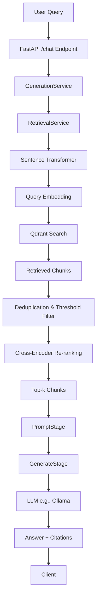

# Enterprise RAG Interview Questions

> **Also check:** [[Questions]]

---

## 🎯 Does RAG Still Matter?

**Yes, Enterprise RAG is absolutely still needed.** Despite massive advancements in LLM context windows (now holding millions of tokens) and open-source agent frameworks like Hermes, **80% of actual production enterprise AI tasks still rely on RAG**.

While a hobbyist can drop a few PDFs into a massive prompt window, a multi-billion dollar corporation cannot operate that way. Enterprise RAG has shifted from being a *"hack to fix small model memory"* to a **core piece of enterprise infrastructure**.

---

## 1. The Financial Reality: "The Rereading Tax"

Models with huge context windows charge per token for everything passed into the prompt.

| Without RAG | With RAG |
|-------------|----------|
| Company has 10,000 corporate policy pages. Employee asks: *"How many casual leaves do I get?"* → All 10,000 pages passed to prompt. 10,000 employees/day = astronomical API bill (rereading tax). | RAG extracts only the 3 relevant pages. **8x–82x cheaper** with significantly lower latency. |

---

## 2. Security & Role-Based Access Control (RBAC)

In enterprise, data visibility is strictly restricted. A support agent should not see executive payroll data.

- **LLMs have no native concept of permissions** — if data enters context, the model uses it.
- **Enterprise RAG = Security/Compliance Gateway**: Pipeline checks Active Directory credentials *before* searching, ensuring vector DB only retrieves data the user is legally allowed to see.

---

## 3. The "Infinite Dataset" Problem

Even with million-token context windows, enterprises manage **terabytes/petabytes** of live data across SharePoint, Google Drive, Slack, SQL, wikis. No context window can hold an entire historical data lake. A retrieval layer is the **only mathematically viable** way to filter massive-scale data down to manageable size.

---

## 4. Legal Compliance & Audit Trails

In regulated industries (finance, healthcare, law), an AI answer without a source is extreme legal liability.

- **Without RAG**: LLM reads 2M tokens → answer. Nearly impossible to audit which sentence triggered the conclusion.
- **With RAG**: Data lineage by design. System fetches explicit, labeled chunks from indexed DB (Pinecone, Qdrant) → UI displays exact citations: *"Source: Document UX-402, Paragraph 3"*.

---

## 🔄 What Has Changed: Evolution to RAG 2.0

RAG isn't dead — **Naive RAG is obsolete**. Enterprise architectures evolved into **Agentic & Hybrid RAG**:

| Feature | Naive RAG (Old/Basic) | Enterprise RAG 2.0 (Modern) |
|---------|------------------------|-----------------------------|
| **Search Method** | Standard Vector Embeddings only | Hybrid: Keyword (BM25) + Vector + Knowledge Graphs |
| **Data Types** | Purely Text Files | Multimodal: Text, tables, complex charts/diagrams |
| **Retrieval Logic** | Grab top 5 chunks and print | Agentic: LLM evaluates if results suffice, reranks, or runs second query |

---

# 📚 Enterprise RAG Interview Preparation Guide

> Deep-dive questions tailored to architecture, design decisions, and implementation details. Use to prepare for technical interviews by reflecting on the **why** and **how** behind the code.

---

## 1. System Architecture & Design

### Q1: Walk me through the end-to-end architecture of your Enterprise RAG system.

**Answer:**

The system follows a **modular, decoupled architecture**:



**Component Responsibilities:**

| Component | Responsibility |
|-----------|----------------|
| **FastAPI** | Exposes HTTP API |
| **GenerationService** | Orchestrates workflow |
| **RetrievalService** | Handles semantic search |
| **Sentence Transformer** | Creates query embeddings |
| **Qdrant** | Retrieves candidate document chunks |
| **Deduplication/Filter** | Removes redundant/low-confidence results |
| **Cross-Encoder** | Reranks chunks for higher precision |
| **PromptStage** | Formats context into prompts |
| **GenerateStage** | Invokes LLM |
| **LLM (Ollama)** | Generates final answer grounded in context |
| **Source Citations** | Provides traceability to original documents |

**Why it matters:** Tests ability to explain complex data flows and component responsibilities clearly.

---

### Q2: Why Pipeline Stage pattern (RetrieveStage → PromptStage → GenerateStage → PostProcessStage) instead of monolithic function?

**Answer:** Adheres to **Open/Closed Principle (SOLID)**.

- Each stage has single responsibility
- Adding `QueryRewriteStage` (multi-turn) or `GuardrailStage` (PII check) = insert new stage into pipeline array without modifying core orchestrator or other stages
- **Unit testing** becomes trivial — each stage mocked and tested in isolation

**Why it matters:** Evaluates understanding of SOLID principles (Single Responsibility, Open/Closed).

---

### Q3: Explain your Dependency Injection (DI) strategy using FastAPI's `Depends` and `functools.lru_cache`.

**Answer:**

- `FastAPI.Depends` → request-scoped DI, clean/testable handlers
- **Problem**: Instantiating DB clients (`QdrantClient`) or loading ML models per request = performance disaster + connection leaks
- **Solution**: Wrap provider functions in `@lru_cache` → guarantees expensive objects created **once per worker process** (Singletons), avoiding memory leaks & redundant connections

**Why it matters:** Demonstrates understanding of app lifecycle, singletons, resource management.

---

## 2. Retrieval Pipeline & Search Mechanics

### Q4: Retrieval pipeline order: Dense Retrieval → Dedupe → Score Filter → Metadata Filter → Sort → Cross-Encoder Rerank. Why this order?

**Answer:** **Optimization funnel**.

1. **Dense retrieval** (cosine similarity) = fast but less accurate → pull broad pool (top 20)
2. **Filter by score** → remove obvious garbage
3. **Cross-Encoder** on reduced pool (top 5) → expensive (O(N) inference), passing 20 chunks = severe latency spikes

**Why it matters:** Shows understanding of ML performance implications and balancing recall vs. latency.

---

### Q5: What is a Cross-Encoder, and why use it over vector DB similarity score?

**Answer:**

| Bi-Encoder (Embedding Model) | Cross-Encoder |
|------------------------------|---------------|
| Embeds query & doc **separately** | Passes query + doc **together** through transformer attention |
| DB calculates cosine similarity | Model understands deep semantic relationship between exact phrasing |
| Fast, scalable | Higher latency, vastly superior relevance ranking |

**Why it matters:** Tests depth of NLP knowledge in modern IR.

---

### Q6: Score threshold `0.55` filtered 6/7 chunks before reranking. How to decide right threshold?

**Answer:**

- **Too high** → false negatives (drop relevant context before reranker sees it)
- **Too low** → passes noise to reranker (wastes compute)
- **Solution**: **Empirical Evaluation Framework** — run sweeps (0.2–0.6), monitor impact on `Recall@k` to find inflection point where noise drops but recall stays high

**Why it matters:** Practical experience tuning search systems; precision/recall trade-offs.

---

## 3. Generation Pipeline & LLM Integration

### Q7: In `OllamaCloudProvider`, you explicitly map `temperature`/`max_tokens`. What happens with `num_predict: None`?

**Answer:** **Bug encountered**: LLM returned exactly 1 token with `finish_reason='length'`.

- SDK serialized `num_predict: None` into JSON payload
- Ollama backend interpreted as "max tokens = 1" / invalid, overriding default
- **Fix**: `exclude_none=True` when dumping Pydantic model → omitted params fall back to engine's safe defaults

**Why it matters:** Hands-on debugging with LLM APIs; understanding silent default parameter breaks.

---

### Q8: Prompt construction strictly separates `ChatMessage` roles (System, User, Assistant). Why?

**Answer:**

- Instruction-tuned LLMs trained on specific templates (e.g., ChatML)
- Strict roles = model clearly distinguishes **system instructions** ("Answer using only context") from **user input** (potentially adversarial)
- Mixing into single string → vulnerable to **prompt injection** (user input overrides system prompt)

**Why it matters:** LLM security & prompt engineering best practices awareness.

---

### Q9: `GenerationOptions` schema decouples internal options from provider API contract. Why?

**Answer:** **Adapter Pattern** implementation.

- Core domain logic shouldn't care: Ollama, OpenAI, Anthropic
- Internal `GenerationOptions` = stable contract
- Switch to OpenAI → write new `OpenAIProvider` mapping `GenerationOptions` → OpenAI kwargs, **zero changes** to generation pipeline

**Why it matters:** Understanding Adapter/Facade patterns; building vendor-agnostic systems.

---

## 4. Data Ingestion & Chunking

### Q10: How are documents processed and chunked before embedding?

**Answer:**

- Load & split via text splitter (e.g., `RecursiveCharacterTextSplitter`)
- `chunk_size` (e.g., 1000 chars) → fits embedding model context limit, retains semantic meaning
- `chunk_overlap` (e.g., 200 chars) → prevents concepts cut in half across chunks

**Why it matters:** Chunking strategy = one of most critical RAG quality factors; must articulate trade-offs.

---

### Q11: How handle document metadata during ingestion, and how used later?

**Answer:**

- **Ingestion**: Metadata (`source`, `page_number`, unique `chunk_id`) attached to vector payload in Qdrant
- **Retrieval**: Metadata passed alongside text to LLM
- **API Response**: Returned to client → frontend renders precise citations: *"According to resume.pdf, page 2"*
- **Critical** for trust & auditability in enterprise

**Why it matters:** Focus on UX (citations/provenance) beyond just ML aspects.

---

## 5. Evaluation & Metrics

### Q12: How do you know if your RAG system is actually good?

**Answer:** Replaced "vibe checks" with **deterministic Evaluation Framework**.

| Evaluation Layer | Metrics |
|------------------|---------|
| **Retrieval** | `Recall@k`, `Precision@k`, `MRR` — right documents found? |
| **Generation** | `Keyword Recall`, `Token F1 Score` — LLM correctly synthesized answer? |

**Process**: Curate golden dataset (questions, expected sources, reference answers).

**Why it matters:** Production vibe checks don't scale; must build objective evaluation framework.

---

### Q13: Explain Mean Reciprocal Rank (MRR) and Hit@k.

**Answer:**

| Metric | Definition |
|--------|------------|
| **Hit@k** | Boolean: correct document *anywhere* in top K? |
| **MRR** | Averages reciprocal of rank of first relevant doc (1/1 for 1st, 1/2 for 2nd, etc.) |

**Interpretation**: `Hit@5 = 1.0` but `MRR = 0.2` → system consistently buries correct answer at rank 5 → LLM processes irrelevant noise → degrades quality & increases cost.

**Why it matters:** Mathematical intuition for ranking metrics.

---

### Q14: How evaluate *faithfulness* (lack of hallucinations) of generated answer?

**Answer:**

- **Token F1 is brittle** — LLMs rephrase correct answers entirely → F1 = 0.0 despite semantic correctness
- **Industry standard**: **LLM-as-a-Judge** (Ragas, DeepEval)
- Prompt capable model (GPT-4o) with retrieved context + generated answer → score 0-1: "Is answer strictly supported by context? Penalize hallucinations."

**Why it matters:** Understanding limitations of traditional metrics for generative text.

---

## 6. Productionization & Scaling

### Q15: How implement streaming for LLM response in FastAPI?

**Answer:**

- Use `StreamingResponse` wrapping async generator
- Call LLM provider (Ollama) with `stream=True`
- Provider yields chunks → generator yields to FastAPI → streams to client via **Server-Sent Events (SSE)**
- **Result**: Drastically reduces **Time-To-First-Token (TTFT)** → improved perceived latency

**Why it matters:** Streaming = standard requirement; must know ASGI handling.

---

### Q16: How handle conversation memory (multi-turn chat) in RAG?

**Answer:** Standard RAG fails follow-ups:

> User: *"Who is Shreyash?"* → Bot: *"A developer."*  
> User: *"What projects did **he** build?"* → Retrieval searches "he" → fails

**Solution: Query Rewriting**

- Add pipeline stage **before retrieval**
- Pass chat history + latest query → fast LLM
- Rewrite to standalone query: *"What projects did Shreyash build?"*
- Use rewritten query for retrieval

**Why it matters:** Transitions from simple Q&A bot → contextual agent.

---

### Q17: Scale to 10,000 RPM — what breaks first?

**Answer:** Bottlenecks in order:

1. **LLM Inference** — slow, compute-heavy  
   → **Mitigation**: Semantic Caching (Redis + vector similarity) for repeated/similar queries
2. **Embedding/Reranker Generation** — compute-bound  
   → **Mitigation**: Horizontal worker queues (Celery/RabbitMQ) on auto-scaling GPU nodes
3. **Vector Database** — Qdrant fast, but 10k RPM needs read replicas for search concurrency

**Why it matters:** Senior-level system design skills.

---

# 👤 Personal Interview Questions

---

## Q1. Walk me through your resume — what's the story connecting your projects?

**Answer:**

My projects follow a progression: **applying AI models → building complete AI products → engineering production-ready AI systems**.

| Phase | Project | Key Learnings |
|-------|---------|---------------|
| **1. ML Application** | **xLogia Technologies** (Internship) — Wildlife detection/counting | Computer vision, dataset prep, YOLOv8 training, ByteTrack, mAP evaluation |
| **2. LLM Integration** | **Cureify** — Healthcare assistant (Gemini API) | Prompt engineering, API integration, conversational workflows, frontend-backend |
| **3. Full-Stack AI** | **FarmVichar** — Agricultural ML + multilingual chat | Structured data, auth, cloud DB, complete app deployment |
| **4. Production AI Engineering** | **Enterprise Multi-Agent RAG Platform** (Current) | Modular RAG pipeline: ingestion, hybrid retrieval, reranking, query rewriting, streaming, agent orchestration. Vector DBs, IR, FastAPI, LangGraph, testing, Docker, scalable backend |

**Common theme**: Building increasingly sophisticated AI systems — from training models → integrating LLMs → engineering production-grade AI infrastructure.

---

## Q2. Why AI/ML and Data Science as a specialization?

**Answer:**

I enjoy solving problems where **software makes intelligent decisions** rather than just executing predefined logic.

- Started with ML: computer vision, predictive models
- Internship: YOLOv8 object detection → real-world ML challenges (data quality, evaluation, inference performance)
- GenAI evolution: Interested in how LLMs become practical applications
- **Realization**: Deploying AI = more than training models → retrieval systems, backend engineering, scalable infra, APIs, databases, evaluation pipelines, software architecture
- **Current focus**: LLM engineering & RAG systems
- **Goal**: Become an **AI Software Engineer** designing production-ready AI applications, not just training models

---

## Q3. What are you looking for in this role, and why this company?

**Answer:**

**Looking for**: Role contributing to real engineering problems while learning from experienced developers.

- Built personal/academic projects → now want **production systems exposure**
- Writing maintainable code, team collaboration, code reviews, deployment pipelines, large-scale software
- **Why this company**: Your work in software engineering & AI aligns with my goal
- **Contribution**: Python, FastAPI, React, LLM apps, backend development + learning industry best practices

---

## Q4. Walk me through the architecture of your RAG pipeline end to end.

**Answer:**

Architecture divided into two major pipelines: **Indexing Pipeline** & **Query Pipeline**.

### 📥 Indexing Pipeline

```mermaid
flowchart LR
    A[Document Upload] --> B[Text Extraction\n(PDF/DOCX + Metadata)]
    B --> C[Text Chunking\n(Overlapping chunks\n+ Metadata)]
    C --> D[Embedding Generation\n(Semantic vectors)]
    D --> E[Vector Storage\n(Qdrant + HNSW Index)]
```

**Details:**

1. **Document Ingestion** — Extract text from PDF/DOCX preserving metadata
2. **Text Chunking** — Overlapping chunks (`chunk_size` ~1000, `overlap` ~200)  
   Metadata per chunk: `document_id`, `page_number`, `chunk_id`, `source_filename`
3. **Embedding Generation** — Dense vectors capturing semantic meaning
4. **Vector Storage** — Qdrant with HNSW for efficient ANN search

---

### 🔍 Query Pipeline

```mermaid
flowchart TD
    A[User Query] --> B[Query Rewriting Agent\n(Conversation History)]
    B --> C[Standalone Query]
    C --> D[Hybrid Retrieval]
    D --> E[Dense Vector Search]
    D --> F[BM25 Keyword Search]
    E --> G[Reciprocal Rank Fusion\n(RRF)]
    F --> G
    G --> H[Cross-Encoder Reranking]
    H --> I[Top-k Chunks]
    I --> J[Prompt Construction\n(Context + History + System)]
    J --> K[Generation\n(Ollama LLM)]
    K --> L[Streaming Response\n(SSE)]
    L --> M[Frontend\nTokens + Citations]
```

**Details:**

| Stage | Purpose |
|-------|---------|
| **Query Rewriting** | Resolve pronouns, recover omitted context, create standalone search query<br>e.g., *"What about its limitations?"* → *"What are the limitations of the Transformer architecture?"* |
| **Hybrid Retrieval** | Dense (semantic) + BM25 (exact keyword) simultaneously |
| **Reciprocal Rank Fusion (RRF)** | Combine both rankings → higher scores for docs ranked highly by either method → improves recall |
| **Reranking** | Cross-encoder jointly analyzes query+doc → accurate relevance scores → only highest-quality chunks to generation |
| **Prompt Construction** | Retrieved context + user question + conversation history + system instructions |
| **Generation** | LLM (Ollama) generates answer using only supplied context |
| **Streaming** | Tokens streamed via SSE → reduces perceived latency |
| **Response** | Frontend renders tokens + citations → answer grounded in evidence, not just LLM internal knowledge |

---

## Q5. Why Qdrant over Pinecone or Weaviate?

**Answer:**

Selected Qdrant for **performance, deployment flexibility, and feature match**:

| Factor | Qdrant | Pinecone | Weaviate |
|--------|--------|----------|----------|
| **Open Source** | ✅ Local via Docker | ❌ Managed cloud only | ✅ |
| **Cost (Dev)** | $0 | Operational cost | Higher footprint |
| **ANN Algorithm** | HNSW (speed/accuracy balance) | Proprietary | HNSW + more |
| **Metadata Filtering** | Rich support | Good | Excellent |
| **LangChain Integration** | Straightforward | Good | Good |
| **Operational Footprint** | Light | Managed (zero ops) | Heavy (built-in modules) |

**Decision rationale:**

- **Local dev**: Qdrant via Docker → zero cloud cost, full environment control
- **HNSW**: Efficient ANN for semantic search
- **Metadata filtering**: Critical for enterprise docs (doc_id, filename, page_number)
- **Simplicity**: Weaviate's extra features unnecessary; Qdrant simpler deployment

**Future consideration**: For globally distributed SaaS requiring auto-scaling & managed infra → evaluate Pinecone/managed services. For self-hosted production RAG platform → Qdrant best tradeoff (simplicity, performance, control).

---

---

# Q6. Explain how your Hybrid Search (Dense + BM25) works. Why combine both instead of just dense embeddings?

### Answer

In my RAG pipeline, I use **hybrid retrieval**, which combines **dense vector search** with **BM25 keyword search** because each method has different strengths and weaknesses.

When a user submits a query, I first rewrite it into a standalone question using the conversation history. The rewritten query is then sent to two retrieval systems simultaneously.

The first is **dense retrieval**. I convert the query into an embedding using the same embedding model that was used during indexing. Qdrant then performs an approximate nearest-neighbor search over the stored document embeddings. This retrieves documents that are semantically similar, even if they don't contain the exact words from the query.

For example:

**Query:**

> "How do large language models remember previous conversations?"

A document discussing **conversation memory** or **context windows** may be retrieved even if it never uses the word *remember*.

The second retrieval method is **BM25**, which is a traditional lexical ranking algorithm. Instead of embeddings, BM25 ranks documents based on keyword frequency, inverse document frequency, and document length normalization.

BM25 is particularly effective when:

* The query contains exact technical terms.
* The user searches for filenames, APIs, functions, error codes, or version numbers.
* Proper nouns and identifiers are important.

For example:

> "FastAPI Depends"

Dense retrieval may treat this as a general backend question.

BM25 immediately finds documents containing the exact phrase **Depends**.

After both searches finish, I merge the ranked lists using **Reciprocal Rank Fusion**, then rerank the results before passing them to the LLM.

Using only dense search risks missing exact keyword matches.

Using only BM25 misses semantically similar content.

Hybrid retrieval provides both **high recall** and **high precision**, making it much more reliable for enterprise document search.

---

### Possible Follow-up

**Interviewer:** Why not just increase `top_k` in dense search?

**Answer:**

Increasing `top_k` only returns more semantically similar documents. If the correct document isn't retrieved because it lacks semantic similarity or contains uncommon keywords, increasing `top_k` won't solve the problem.

Hybrid search expands the candidate set by retrieving documents from a fundamentally different retrieval mechanism.

---

# Q7. How does Reciprocal Rank Fusion (RRF) work mathematically?

### Answer

Reciprocal Rank Fusion is a rank aggregation algorithm used to combine multiple ranked retrieval lists without requiring score normalization.

Instead of comparing raw similarity scores—which aren't directly comparable between dense search and BM25—RRF only uses the ranking positions.

For each document, the RRF score is computed as:

$$
RRF(d)=\sum_{i=1}^{n}\frac{1}{k+r_i(d)}
$$

Where:

* $r_i(d)$ is the rank of document **d** in retrieval list **i**
* **k** is a constant (commonly 60)
* **n** is the number of retrieval methods

The final score is the sum of reciprocal ranks across all retrieval lists.

---

### Example

Suppose:

**Dense Search:**

| Rank | Document |
| ---- | -------- |
| 1    | A        |
| 2    | B        |
| 3    | C        |

**BM25:**

| Rank | Document |
| ---- | -------- |
| 1    | B        |
| 2    | D        |
| 3    | A        |

Using **k = 60**:

**Document A:**

Dense: $\frac{1}{60+1}$ + BM25: $\frac{1}{60+3}$ ≈ 0.0323

**Document B:**

$\frac{1}{60+2} + \frac{1}{60+1}$ ≈ 0.0325

Document B receives the higher score because it ranks highly in both retrieval methods.

---

The important advantage is that RRF doesn't require similarity scores to be on the same scale.

Cosine similarity and BM25 scores have completely different distributions.

RRF ignores those scores and combines only the rankings.

That's why it's widely used in hybrid retrieval systems.

---

### Follow-up

**Why is k usually 60?**

The constant prevents the top-ranked document from dominating the final score.

Using 60 smooths the contribution from different rankings while still rewarding higher-ranked documents.

---

# Q8. What reranking model did you use, and why does reranking improve results after RRF already fuses ranked lists?

### Answer

Hybrid retrieval and RRF generate a strong candidate set, but the retrieved chunks are still ranked using independent retrieval signals rather than a deep understanding of the query-document relationship.

To improve precision, I apply a **cross-encoder reranker** after retrieval.

Unlike embedding models, which encode the query and document independently, a cross-encoder processes the query and document together in a single forward pass. This allows the model to attend to interactions between every query token and every document token.

Because of this joint encoding, the reranker can better capture nuanced relevance.

The retrieval pipeline looks like this:

```text
User Query
    ↓
Dense Search
+
BM25
    ↓
RRF
    ↓
Top 20–50 candidates
    ↓
Cross-Encoder Reranker
    ↓
Top 5–10 chunks
    ↓
LLM
```

Although RRF combines rankings from multiple retrievers, it still relies on retrieval heuristics.

The reranker performs a much deeper semantic comparison and removes false positives before the context reaches the LLM.

This improves answer quality while reducing irrelevant context.

---

### Follow-up

**Why not use the cross-encoder directly for retrieval?**

Because it is computationally expensive.

A cross-encoder must evaluate every query-document pair individually.

With one million document chunks, that would require one million forward passes per query.

Instead, dense retrieval quickly narrows the search space to a few dozen candidates, and the cross-encoder reranks only those candidates.

This gives nearly the same quality at a fraction of the computational cost.

---

# Q9. How did you chunk documents? What chunk size and overlap did you use, and why?

### Answer

I used **recursive text chunking** with overlap because LLMs and embedding models work best on reasonably sized, semantically coherent chunks.

The chunking strategy aims to balance two competing objectives:

* Preserve enough context for accurate retrieval.
* Keep chunks small enough to avoid diluting the embedding representation.

For my project, I used approximately:

* **Chunk size:** 500–800 tokens
* **Overlap:** 100–150 tokens

The overlap ensures that information spanning chunk boundaries isn't lost.

For example, if an important explanation starts near the end of one chunk and continues into the next, overlapping allows both chunks to retain sufficient context.

I also attempted to split on natural document boundaries such as:

* headings
* paragraphs
* lists

rather than cutting purely by character count.

Each chunk stores metadata including:

* document ID
* filename
* page number
* chunk ID

This metadata supports filtering and enables citations in the final response.

---

### Follow-up

**Why not use very large chunks?**

Large chunks reduce retrieval precision because embeddings average over more information.

One embedding representing several unrelated topics makes it harder to retrieve the exact section needed.

---

**Why not use tiny chunks?**

Very small chunks often lose surrounding context.

The retrieved text may no longer contain enough information for the LLM to answer correctly.

---

# Q10. How do you evaluate retrieval quality? What metrics did you use?

### Answer

Retrieval quality should be evaluated independently of the LLM because poor retrieval cannot be fixed by better generation.

I created a set of representative question–answer pairs and checked whether the retrieval system returned the relevant document chunks.

The main metrics I focused on were:

**Recall@k**

This measures whether the correct document appears within the top *k* retrieved results.

For example, Recall@5 asks:

> *"Is the relevant document present in the first five retrieved chunks?"*

For RAG systems, high recall is important because the LLM cannot answer correctly if the evidence is missing.

---

**Precision@k**

Precision measures how many of the retrieved chunks are actually relevant.

Higher precision reduces noise in the LLM context window.

---

**Mean Reciprocal Rank (MRR)**

MRR evaluates how highly the first relevant document is ranked.

If the correct document consistently appears near the top, MRR will be high.

---

Beyond quantitative metrics, I also performed manual evaluation by inspecting retrieved chunks for representative enterprise-style queries.

I compared:

* Dense retrieval only
* BM25 only
* Hybrid retrieval
* Hybrid + reranking

The hybrid pipeline with reranking consistently produced the most relevant context while reducing irrelevant documents.

---

### Follow-up

**Why is retrieval evaluation separate from generation evaluation?**

Because retrieval and generation solve different problems.

A retrieval failure means the correct information never reaches the LLM.

A generation failure occurs when the correct information is retrieved but the LLM still produces an incorrect or hallucinated answer.

Evaluating them separately helps identify which component of the RAG pipeline needs improvement.

---

*Document formatted for Obsidian — includes internal links, mermaid diagrams, tables, and consistent heading hierarchy.*