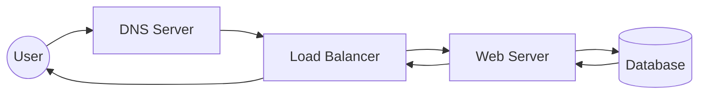

# 01 Introduction to System Design

## Why this topic matters
In a fresher interview, you aren't expected to build the next Netflix, but you are expected to show that you understand how a simple "app" becomes a "system." Understanding the big picture helps you write better code and make smarter decisions about which tools to use.

## Learning Objectives
- Understand what "System Design" actually means.
- Differentiate between Low-Level Design (LLD) and High-Level Design (HLD).
- Learn the basic flow of a request from a user to a server.

## Intuition
Imagine you are building a small lemonade stand. 
- **LLD** is deciding exactly how to squeeze the lemons, what cup to use, and how to take the money.
- **HLD** is deciding where to place the stand should be located, how many people you need to hire if 100 people show up, and how you'll get more lemons if you run out.

System Design is the "HLD" of software. It's about the architecture—the blueprint of how different components (databases, servers, caches) talk to each other to handle users efficiently.

## Detailed Explanation
System Design is the process of defining the architecture, modules, interfaces, and data for a system to satisfy specified requirements.

### HLD vs LLD
| Feature | High-Level Design (HLD) | Low-Level Design (LLD) |
| :--- | :--- | :--- |
| **Focus** | Overall architecture & components | Detailed logic & class structure |
| **Components** | Databases, Load Balancers, Microservices | Classes, Interfaces, Design Patterns |
| **Analogy** | The blueprint of a house | The electrical wiring diagram |
| **Interview Goal** | Scalability and Reliability | Code quality and maintainability |

### The Basic Request-Response Cycle
When you type `google.com` in your browser, a lot happens:

1. **DNS**: Translates the domain name to an IP address.
2. **Load Balancer**: Directs the request to an available server.
3. **Web Server**: Processes the logic.
4. **Database**: Stores and retrieves the data.

## Real-world Example
When you use **WhatsApp**, the system isn't just one giant piece of code. It has:
- A **Chat Service** to handle messages.
- A **Presence Service** to show "Online/Last Seen."
- A **Media Store** to save your photos.
- A **Database** to store your contacts.

## Advantages
- **Efficiency**: The system doesn't crash when users increase.
- **Maintainability**: Easy to update one part without breaking everything.
- **Reliability**: If one server dies, the system keeps running.

## Disadvantages
- **Complexity**: Over-designing a simple app makes it harder to build.
- **Cost**: More components often mean more money for hosting.

## Common Interview Questions
- **What is System Design?**
- **What is the difference between HLD and LLD?**
- **Walk me through what happens when you enter a URL in a browser.**

### Interview Answer Tips
- Keep it simple. Start with a basic "Client $\rightarrow$ Server $\rightarrow$ DB" flow before adding complexity like Load Balancers or Caches.
- Use the terms "Scalability" and "Availability" early to show you know the goals of system design.

## Common Mistakes
- **Over-engineering**: Suggesting a complex distributed system for a simple requirement.
- **Ignoring the basics**: Jumping to "Kafka" or "Kubernetes" without explaining why a simple queue or server isn't enough.

## Summary
System Design is the blueprint of an application. It focuses on how different components interact to ensure the system is scalable, reliable, and efficient.

## Practice Questions
1. If you had to design a simple URL shortener, what are the first three components you would add?
2. Why is a Load Balancer necessary for a website with millions of users?
3. In your own words, explain the difference between a Database and a Cache.
4. What happens if the DNS server is down?
5. How does HLD differ from the coding you do in your DSA practice?

## Further Reading
- [[02 Functional vs Non Functional Requirements]]
- [[03 Scalability]]

#system-design #placements #interview
