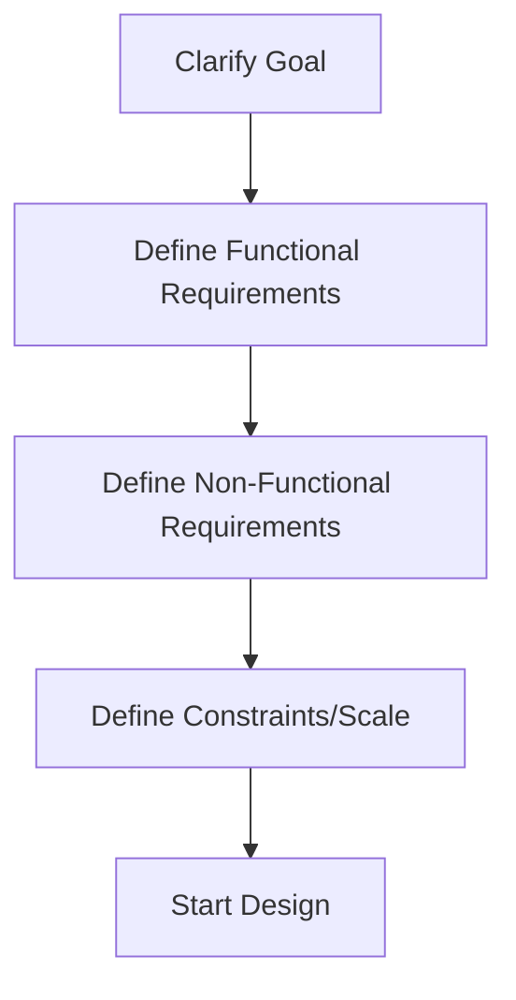

# 02 Functional vs Non Functional Requirements

## Why this topic matters
In any interview, the biggest mistake candidates make is starting to design the system before they know *what* they are building. Understanding requirements prevents you from building a "Ferrari" when the interviewer only asked for a "Bicycle."

## Learning Objectives
- Define Functional Requirements (FR).
- Define Non-Functional Requirements (NFR).
- Learn how to elicit requirements during an interview.

## Intuition
Imagine you are asked to build a "House."
- **Functional Requirement**: "It must have 3 bedrooms, a kitchen, and a front door." (What the house **does**).
- **Non-Functional Requirement**: "It must be earthquake-resistant, energy-efficient, and built within 6 months." (How the house **is**).

If you build a 3-bedroom house (FR) but it collapses in a light breeze (NFR), the house is useless. Both are critical.

## Detailed Explanation

### 1. Functional Requirements (FR)
These are the core features. They define the **behavior** of the system.
- **Example (Uber)**: 
  - A user should be able to book a ride.
  - A driver should be able to accept a request.
  - The system should calculate the fare.

### 2. Non-Functional Requirements (NFR)
These are the quality attributes. They define the **constraints** or **performance** of the system.
- **Example (Uber)**:
  - **Availability**: The app should be available 99.9% of the time.
  - **Latency**: The driver's location should update every 2 seconds (Low latency).
  - **Scalability**: The system should handle 1 million requests during New Year's Eve.
  - **Reliability**: Payments should never be lost or double-charged.

### How to handle this in an interview
When the interviewer says: *"Design a parking lot"* or *"Design WhatsApp,"* do NOT start drawing. Follow this flow:

1. **Clarify Goal**: "Are we building a parking lot for a mall or a private office?"
2. **Functional**: "Should users be able to pay online? Should we support electric vehicle charging?"
3. **Non-Functional**: "Does it need to be highly available? How many cars per hour are we expecting?"
4. **Constraints**: "Are we expecting 100 cars or 10,000 cars?"

## Real-world Example
**Amazon**
- **FR**: Search for products, Add to cart, Checkout.
- **NFR**: During "Prime Day," the site must not crash (Scalability), and the search results must appear in under 200ms (Latency).

## Advantages
- Prevents "Scope Creep" (adding unnecessary features).
- Ensures the system is fit for purpose.
- Shows the interviewer that you are a disciplined engineer.

## Disadvantages
- Spending too much time on requirements can make you run out of time for the actual design.

## Common Interview Questions
- **What are Non-Functional Requirements?**
- **Why are NFRs important in System Design?**
- **If you have to choose between Availability and Consistency, how do you decide?** (Leads to CAP Theorem).

### Interview Answer Tips
- **Be proactive**: Don't wait for the interviewer to give you the requirements. List them out and ask, "Does this cover the main scope, or should I add more?"
- **Prioritize**: Mention "Must-have" vs "Nice-to-have" features.

## Common Mistakes
- **Assuming requirements**: Starting the design based on what you *think* the app does.
- **Ignoring NFRs**: Focusing only on features and forgetting about scale or speed.

## Summary
Functional Requirements are the **"What"** (features), and Non-Functional Requirements are the **"How"** (performance/quality). Always define both before designing.

## Practice Questions
1. Write 3 FRs and 3 NFRs for a "Library Management System."
2. If a system needs to be "Highly Available," what does that mean in simple terms?
3. Which is more important for a Banking App: Availability or Consistency? Why?
4. How do NFRs change if the user base grows from 1,000 to 1 million?
5. Give an example of a "Constraint" that is neither an FR nor an NFR.

## Further Reading
- [[01 Introduction to System Design]]
- [[03 Scalability]]
- [[06 CAP Theorem]]

#system-design #placements #interview
