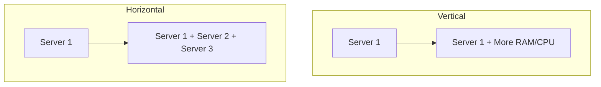

# 03 Scalability

## Why this topic matters
The most common question in any system design interview is: *"What happens if the number of users increases from 1,000 to 1 million?"* Scalability is the answer to that question.

## Learning Objectives
- Understand the concept of Scalability.
- Differentiate between Vertical and Horizontal Scaling.
- Learn when to use which approach.

## Intuition
Imagine you have a small coffee shop with one barista.
- **Vertical Scaling**: You buy the barista a faster espresso machine so they can make coffee quicker. The barista is still one person, but they are more "powerful."
- **Horizontal Scaling**: You hire three more baristas and give them each a standard machine. Now you have more "hands" to handle the crowd.

## Detailed Explanation

### What is Scalability?
Scalability is the ability of a system to handle an increasing amount of work by adding resources to the system.

### 1. Vertical Scaling (Scaling Up)
Adding more power (CPU, RAM, SSD) to an existing server.
- **Analogy**: Upgrading your laptop from 8GB RAM to 32GB RAM.

**Pros:**
- Simple to implement (no code changes).
- No need for complex load balancing.
- Low latency (communication happens within one machine).

**Cons:**
- **Hardware Limit**: You cannot add RAM forever; there is a physical limit.
- **Single Point of Failure**: If that one powerful server crashes, your whole system is down.
- **Expensive**: High-end servers cost exponentially more.

### 2. Horizontal Scaling (Scaling Out)
Adding more servers to the pool.
- **Analogy**: Instead of one supercomputer, you use 100 cheap laptops working together.

**Pros:**
- **No Limit**: You can keep adding servers indefinitely.
- **High Availability**: If one server fails, others can take over.
- **Cost-Effective**: Using several mid-range servers is often cheaper than one high-end beast.

**Cons:**
- **Complexity**: Requires a **Load Balancer** to distribute traffic.
- **Network Latency**: Servers must communicate over a network.
- **Data Consistency**: Keeping data the same across 100 servers is hard.

### Comparison Table
| Feature | Vertical Scaling | Horizontal Scaling |
| :--- | :--- | :--- |
| **Method** | Add RAM/CPU to 1 server | Add more servers |
| **Complexity** | Low | High |
| **Reliability** | Low (Single point of failure) | High (Redundancy) |
| **Limit** | Hard hardware limit | Virtually limitless |
| **Cost** | Becomes very expensive | Linear cost increase |

## Real-world Example
- **Early Stage Startup**: Might start with **Vertical Scaling** because it's fast and easy.
- **Google/Facebook**: Use **Horizontal Scaling** because they have billions of users; no single machine on earth is powerful enough to handle their traffic.

## Advantages
- **Growth**: Your app doesn't crash as you get famous.
- **Cost Control**: You only add servers when you actually need them.

## Disadvantages
- Scaling horizontally introduces the need for **Distributed Systems** knowledge (Caching, Load Balancing, DB Sharding).

## Common Interview Questions
- **What is the difference between Vertical and Horizontal scaling?**
- **Which one would you choose for a small internal company tool? Why?**
- **What is a 'Single Point of Failure' (SPOF) and how does horizontal scaling fix it?**

### Interview Answer Tips
- Always mention that **Horizontal Scaling is the industry standard** for large-scale systems.
- Mention that the choice depends on the **budget** and **expected traffic**.

## Common Mistakes
- Saying Horizontal scaling is "always" better. (It's not; it's overkill for small apps).
- Forgetting to mention the **Load Balancer** when talking about Horizontal scaling.

## Summary
Vertical scaling is "getting a bigger machine," while Horizontal scaling is "getting more machines." While Vertical is simpler, Horizontal is the key to building systems that can serve millions of people.

## Practice Questions
1. You are designing a system for a local bakery that expects 50 visitors a day. Which scaling method do you use?
2. Why is vertical scaling considered to have a "hard ceiling"?
3. If you scale horizontally, how does the user's request know which server to go to?
4. What happens to a vertically scaled system if the motherboard fails?
5. Can you combine both scaling methods? Give an example.

## Further Reading
- [[01 Introduction to System Design]]
- [[04 Availability & Reliability]]
- [[12 Replication & Sharding]]

#system-design #placements #interview #scalability
