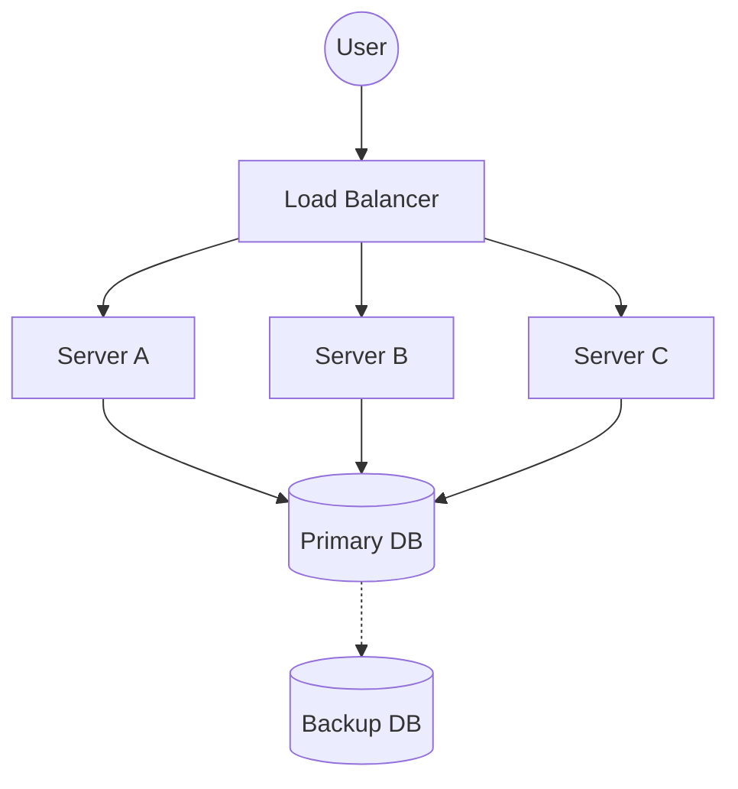

# 04 Availability & Reliability

## Why this topic matters
Users don't care how "cool" your architecture is if the website shows a "500 Internal Server Error" when they click a button. In interviews, "Reliability" and "Availability" are the metrics used to judge if a system is "Production Ready."

## Learning Objectives
- Understand the difference between Availability and Reliability.
- Learn about "The Nines" (99.9% vs 99.99%).
- Understand the concept of Redundancy.

## Intuition
Imagine a **Light Bulb** in your room.
- **Reliability**: If the bulb is high quality and doesn't flicker or burn out for 2 years, it is **Reliable**.
- **Availability**: If you have a backup bulb and a lamp ready, so that even if the first one burns out, you can have light back in 10 seconds, the light in your room is **Highly Available**.

Reliability is about **not failing**. Availability is about **being usable**, even if some parts have failed.

## Detailed Explanation

### 1. Availability
Availability is the percentage of time a system is operational and accessible. 
It is measured in **"Nines."**

| Availability % | Downtime per Year | Common Term |
| :--- | :--- | :--- |
| 99% | 3.65 days | "Two Nines" |
| 99.9% | 8.77 hours | "Three Nines" (Standard) |
| 99.99% | 52.56 minutes | "Four Nines" (High Availability) |
| 99.999% | 5.26 minutes | "Five Nines" (Mission Critical) |

### 2. Reliability
Reliability is the probability that a system will perform its intended function without failure for a specified period of time.
- **High Availability** $\neq$ **High Reliability**.
- A system can be available (you can reach the website) but unreliable (the "Submit" button fails 10% of the time).

### How to achieve High Availability? (Redundancy)
The secret to availability is **Redundancy**: having a backup for everything.

- **Server Redundancy**: Instead of one server, have three. If one crashes, the others handle the load.
- **Database Redundancy**: Use **Replication** (copying data to multiple servers).
- **Network Redundancy**: Having multiple internet service providers (ISPs) so if one cable is cut, the other works.

## Real-world Example
**Netflix**
Netflix uses a concept called "Chaos Monkey." They intentionally shut down their own servers in production to make sure the system is **Reliable** and **Available** enough to survive unexpected crashes without the user noticing.

## Advantages
- **User Trust**: Users stay with apps that "just work."
- **Revenue**: For companies like Amazon, 1 minute of downtime can mean millions of dollars in lost sales.

## Disadvantages
- **Cost**: Redundancy means paying for extra servers that might just sit idle.
- **Complexity**: Keeping data synchronized across backups is difficult.

## Common Interview Questions
- **What is the difference between Availability and Reliability?**
- **What does "Five Nines" availability mean?**
- **How can you eliminate a Single Point of Failure (SPOF)?**

### Interview Answer Tips
- When asked about availability, always mention **SPOF (Single Point of Failure)**.
- Explain that you can increase availability by adding **Redundancy**.

## Common Mistakes
- Confusing the two: Saying "the system is available" when you actually mean "the system doesn't crash often" (reliability).
- Thinking that more servers automatically means more reliability. (If all servers have the same bug, they all crash together).

## Summary
Availability is "is the system up?", and Reliability is "does the system work correctly?". We achieve high availability through **Redundancy**, ensuring no single failure can take down the entire system.

## Practice Questions
1. If a system has 99% availability, how much downtime is acceptable in a month?
2. Give an example of a system where Reliability is more important than Availability.
3. What is a "Failover" mechanism?
4. Why is redundancy expensive?
5. How does a Load Balancer contribute to High Availability?

## Further Reading
- [[01 Introduction to System Design]]
- [[03 Scalability]]
- [[05 Latency vs Throughput]]
- [[12 Replication & Sharding]]

#system-design #placements #interview #reliability #availability
