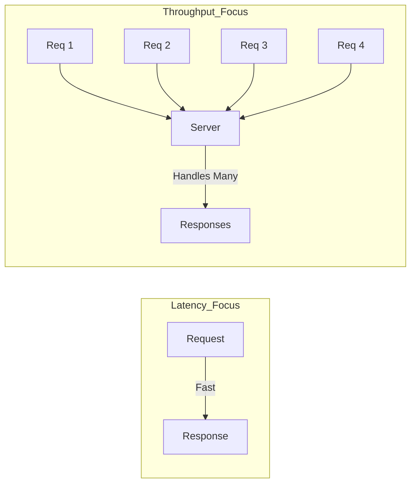

# 05 Latency vs Throughput

## Why this topic matters
Interviewers often ask: *"Your system is slow. How do you fix it?"* To answer this, you must first know if the system is suffering from **high latency** or **low throughput**. These are the two primary ways we measure the "speed" of a system.

## Learning Objectives
- Define Latency and Throughput.
- Understand the relationship (and difference) between them.
- Learn how to optimize both in a real system.

## Intuition
Imagine a **Water Pipe**.
- **Latency** is the time it takes for *one single drop* of water to travel from the start of the pipe to the end. (Time per request).
- **Throughput** is *how many gallons* of water flow through the pipe per minute. (Total requests per second).

If you have a very thin pipe, the water might travel fast (low latency), but you can't send much water (low throughput). If you have a huge pipe, you can send tons of water (high throughput), but it might take longer for the first drop to reach the end (higher latency).

## Detailed Explanation

### 1. Latency
Latency is the time it takes for a single request to be processed. It is the "delay."
- **Measured in**: Milliseconds (ms) or seconds (s).
- **Example**: You click a button on a website, and it takes 200ms for the page to start loading. That 200ms is the latency.

**What causes high latency?**
- **Network Distance**: Sending data from India to a server in USA.
- **Slow DB Queries**: Searching through millions of rows without an index.
- **Heavy Computation**: Complex AI algorithms running on a slow CPU.

### 2. Throughput
Throughput is the number of requests a system can handle in a given time unit.
- **Measured in**: Requests Per Second (RPS) or Queries Per Second (QPS).
- **Example**: A payment gateway that can process 5,000 transactions per second.

**What causes low throughput?**
- **Resource Bottlenecks**: The CPU is at 100%, so new requests have to wait in a queue.
- **Locking**: One request is locking a database row, making all other requests wait.
- **Single Server**: Only one server handling all the traffic.

### The Relationship
Latency and Throughput are related but **different**. 
- You can have **Low Latency** but **Low Throughput** (A fast bike can carry one person very quickly, but it can't move 50 people at once).
- You can have **High Latency** but **High Throughput** (A huge cargo ship takes weeks to cross the ocean, but it carries 20,000 containers at once).

## Real-world Example
**Google Search**
- **Latency**: When you hit "Search," the results must appear in < 0.5 seconds. If it takes 5 seconds, the latency is too high, and users will leave.
- **Throughput**: Google must handle billions of searches per second. If they can only handle 1,000, the throughput is too low, and the site will crash.

## How to Improve Them?
| Goal | Solution | Related Topic |
| :--- | :--- | :--- |
| **$\downarrow$ Latency** | Use Caching, use a CDN, optimize DB queries. | [[09 Caching]] |
| **$\uparrow$ Throughput** | Horizontal Scaling, Load Balancing, Async Processing. | [[03 Scalability]] |

## Common Interview Questions
- **What is the difference between Latency and Throughput?**
- **If your system has high throughput but high latency, is it a "fast" system?**
- **How does adding a cache affect latency and throughput?**

### Interview Answer Tips
- Use the "Water Pipe" or "Vehicle" analogy. Interviewers love analogies because it shows you truly understand the concept.
- Be specific about units (ms for latency, RPS for throughput).

## Common Mistakes
- Using "Latency" to describe how many users a system can handle.
- Thinking that increasing throughput always decreases latency. (Adding more servers increases throughput, but the time for one request to travel is still the same).

## Summary
Latency is about **time** (per single request). Throughput is about **volume** (total requests over time). A great system optimizes both: it handles many requests (High Throughput) and does so quickly (Low Latency).

## Practice Questions
1. In a chat app, is low latency or high throughput more critical for the user experience?
2. Does increasing the RAM of a server primarily improve latency or throughput?
3. Explain a scenario where you would prioritize throughput over latency.
4. How does a CDN (Content Delivery Network) reduce latency?
5. If a server is "bottlenecked" by CPU, which metric will suffer first?

## Further Reading
- [[01 Introduction to System Design]]
- [[03 Scalability]]
- [[08 Caching]]
- [[17 CDN]]

#system-design #placements #interview #performance #latency #throughput
