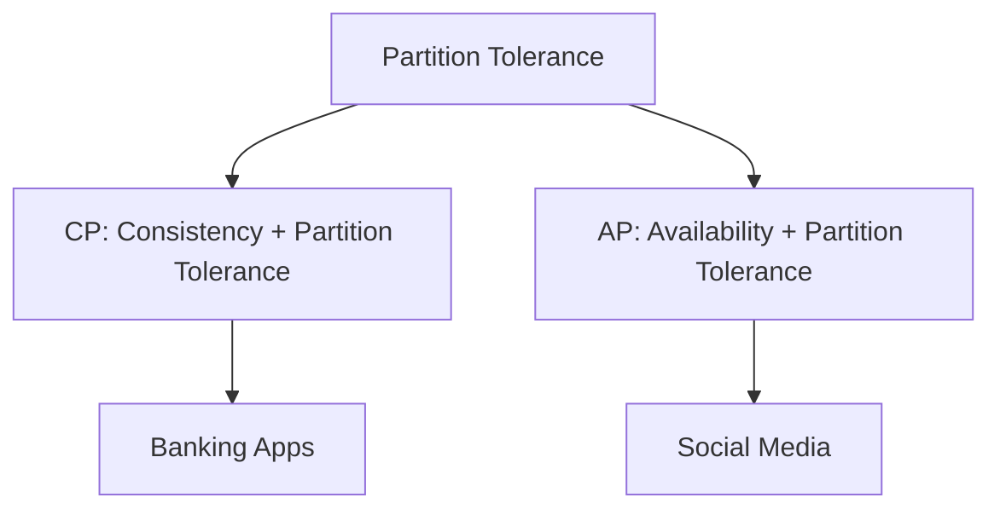

# 06 CAP Theorem

## Why this topic matters
In a distributed system (a system with multiple servers), you cannot have everything. The CAP Theorem is the "Law of Physics" for distributed systems. It tells you exactly what trade-offs you must make when designing a database or a distributed service.

## Learning Objectives
- Understand the three components of CAP: Consistency, Availability, and Partition Tolerance.
- Learn why you can only pick two out of three.
- Identify real-world examples of CP and AP systems.

## Intuition
Imagine you and your friend are both keeping a notebook of a shared shopping list. You live in different houses.
- **Consistency**: If you add "Milk" to your list, your friend's list should immediately show "Milk" too.
- **Availability**: Whenever your friend opens their notebook, they should see *some* list, even if it's slightly outdated.
- **Partition Tolerance**: You can still use your notebooks even if the phone lines are down and you can't talk to each other for an hour.

**The Conflict**: If the phone lines are down (**Partition**), and you add "Milk" to your list, your friend cannot know about it. Now you have a choice:
1. Tell your friend "I can't show you the list right now because I'm not sure it's updated" $\rightarrow$ You chose **Consistency** over **Availability**.
2. Let your friend see the old list without "Milk" $\rightarrow$ You chose **Availability** over **Consistency**.

## Detailed Explanation

### The Three Pillars
1. **Consistency (C)**: Every read receives the most recent write or an error. All nodes see the same data at the same time.
2. **Availability (A)**: Every request receives a (non-error) response, without the guarantee that it contains the most recent write.
3. **Partition Tolerance (P)**: The system continues to operate despite an arbitrary number of messages being dropped or delayed by the network between nodes.

### The Rule: Pick Two
In a distributed system, **network partitions (P) are inevitable**. Cables get cut, routers fail. Therefore, you **must** have Partition Tolerance. This leaves you with two real choices:

#### 1. CP (Consistency + Partition Tolerance)
The system ensures data is the same everywhere. If a network failure happens and nodes can't sync, the system returns an **error** rather than serving old data.
- **Use Case**: Banking systems (you can't show a wrong balance!).
- **Example**: MongoDB, HBase, Redis.

#### 2. AP (Availability + Partition Tolerance)
The system ensures the app is always up. If a network failure happens, nodes will serve whatever data they have, even if it's slightly outdated.
- **Use Case**: Social Media feeds (it's okay if a post takes 2 seconds to appear to everyone).
- **Example**: Cassandra, DynamoDB, CouchDB.

#### What about CA?
A "CA" system (Consistency + Availability) is only possible if there is **no network partition** (i.e., a single-server database). But once you have multiple servers, you must handle partitions, making CA impossible in distributed systems.

## Real-world Example
**ATM Machines**
- When you withdraw money, the ATM must be **Consistent** with your bank account. If the ATM cannot communicate with the main server (Partition), it will refuse to give you money (Loss of Availability) to prevent you from withdrawing the same money twice. This is a **CP** approach.

## Advantages
- Provides a mathematical framework to make design decisions.
- Helps engineers explain *why* they chose a specific database.

## Disadvantages
- It's a simplification. In reality, there is a spectrum between Consistency and Availability (this led to the "PACELC" theorem, which is advanced/FAANG level).

## Common Interview Questions
- **Explain the CAP Theorem in simple terms.**
- **Can we have a CA system in a distributed environment? Why or why not?**
- **If you are designing a system for a stock exchange, would you choose CP or AP?**

### Interview Answer Tips
- Always start by stating that **P (Partition Tolerance) is non-negotiable** in distributed systems.
- Use the "Bank vs. Social Media" example to illustrate CP vs AP.

## Common Mistakes
- Thinking "Consistency" means the same as "ACID consistency" in SQL. (CAP Consistency is about "linearizability"—all nodes seeing the same value at the same time).
- Saying you can choose CA for a multi-server system.

## Summary
CAP Theorem states that in the presence of a network partition, a distributed system must choose between Consistency (all nodes see same data) or Availability (every request gets a response).

## Practice Questions
1. Which is more critical for a "Like" count on a YouTube video: C or A?
2. Why is a single-node MySQL database considered "CA"?
3. If a system is "Eventually Consistent," is it leaning towards CP or AP?
4. Design a scenario where an AP system would be a disaster.
5. How does a Load Balancer help in the context of Availability?

## Further Reading
- [[02 Functional vs Non Functional Requirements]]
- [[04 Availability & Reliability]]
- [[12 Replication & Sharding]]

#system-design #placements #interview #distributed-systems #cap-theorem
