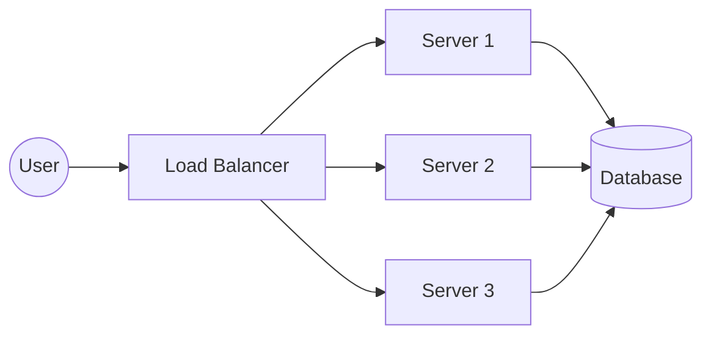

# 07 Load Balancer

## Why this topic matters
When your app grows from 10 users to 10,000, a single server will crash. You need more servers (Horizontal Scaling). But how does the user's request know which server to go to? That's the job of the **Load Balancer (LB)**.

## Learning Objectives
- Understand the purpose of a Load Balancer.
- Learn how Load Balancers distribute traffic.
- Understand different Load Balancing algorithms.

## Intuition
Imagine a very busy **Airport Check-in**.
If there was only one counter, the line would be miles long. To fix this, the airport opens 10 counters. But you can't just let people run to any counter—it would be chaos.
They hire a **Queue Manager** (the Load Balancer) who stands at the front and tells each person: *"You go to Counter 1," "You go to Counter 2,"* and so on. 
The Queue Manager ensures that no single counter is overwhelmed while others are empty.

## Detailed Explanation

### What is a Load Balancer?
A Load Balancer is a device or software that acts as a "traffic cop," sitting in front of your servers and routing client requests across all servers capable of handling the request.

### How it Works

### Load Balancing Algorithms
How does the LB decide which server gets the request?

1. **Round Robin**: Requests are distributed sequentially. (Req 1 $\rightarrow$ S1, Req 2 $\rightarrow$ S2, Req 3 $\rightarrow$ S3, Req 4 $\rightarrow$ S1).
   - *Best for*: Servers of equal power.
2. **Weighted Round Robin**: Similar to round robin, but some servers get more traffic because they are more powerful.
3. **Least Connections**: Sends the request to the server with the fewest active connections.
   - *Best for*: Requests that take varying amounts of time to process.
4. **IP Hashing**: Uses the client's IP address to determine the server. This ensures a specific user always goes to the same server.
   - *Best for*: **Session Persistence** (Sticky Sessions).

### Health Checks
The Load Balancer doesn't just blindly send traffic. It performs **Health Checks**. It "pings" each server every few seconds. If Server 2 doesn't respond, the LB marks it as "Unhealthy" and stops sending traffic there until it recovers.

## Real-world Example
**Amazon.com**
During a "Flash Sale," traffic spikes. Amazon uses Load Balancers to spread millions of users across thousands of servers. If one server catches fire (literally or figuratively), the Load Balancer instantly routes users to another server, so the customer never sees an error page.

## Advantages
- **Scalability**: Allows you to add more servers easily.
- **Reliability**: Prevents the "Single Point of Failure" (if one server dies, the app stays up).
- **Efficiency**: Prevents any single server from becoming a bottleneck.

## Disadvantages
- **Cost**: Another component to pay for and manage.
- **Complexity**: Adds another layer to the network.
- **New SPOF**: If the Load Balancer itself crashes, the whole system goes down (fixed by having a "Backup Load Balancer").

## Common Interview Questions
- **What is a Load Balancer and why is it needed?**
- **Explain Round Robin vs. Least Connections.**
- **What is a "Sticky Session" and how is it implemented?**
- **What happens if the Load Balancer fails?**

### Interview Answer Tips
- Mention **Health Checks**; it shows you understand that servers can fail.
- Mention that LBs can operate at different layers (Layer 4 - Transport, Layer 7 - Application), but for a fresher interview, focusing on the logic is usually enough.

## Common Mistakes
- Thinking the LB is the same as a Web Server.
- Forgetting to mention that the LB needs to be highly available itself.

## Summary
A Load Balancer is the "Traffic Cop" of the internet. It enables Horizontal Scaling by distributing requests across multiple servers, ensuring no single server is overwhelmed and the system remains available.

## Practice Questions
1. If you have 3 servers where one has 2x the RAM of others, which LB algorithm would you use?
2. How does a Load Balancer handle a server that has crashed?
3. Why would you use IP Hashing instead of Round Robin?
4. What is the difference between a Load Balancer and a Reverse Proxy? (Hint: Check [[08 Reverse Proxy]]).
5. Draw a diagram showing how a Load Balancer removes a "dead" server from the pool.

## Further Reading
- [[03 Scalability]]
- [[04 Availability & Reliability]]
- [[08 Reverse Proxy]]

#system-design #placements #interview #networking #load-balancer
