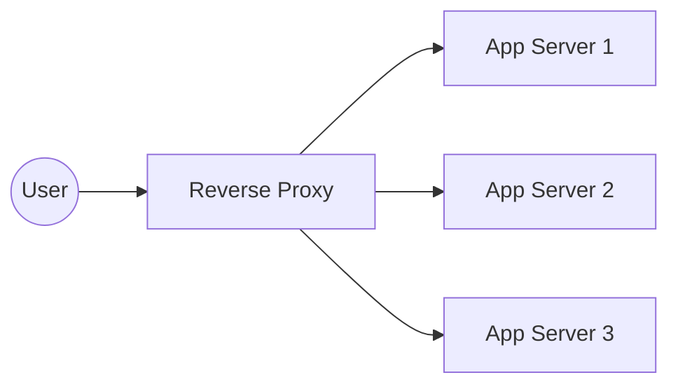

# 08 Reverse Proxy

## Why this topic matters
People often confuse Load Balancers with Reverse Proxies. While they are similar (and often the same piece of software, like Nginx), they serve different primary purposes. Understanding this distinction shows the interviewer you have a professional grasp of networking.

## Learning Objectives
- Define a Reverse Proxy.
- Understand the difference between a Forward Proxy and a Reverse Proxy.
- Learn the key benefits of using a Reverse Proxy.

## Intuition
Imagine a **Government Office**.
- **Forward Proxy**: You are a citizen. You want to access the "Secret Archive," but you aren't allowed to go in directly. You ask a **Representative** (Forward Proxy) to go in for you and bring back the document. The archive doesn't know who *you* are; it only knows the Representative.
- **Reverse Proxy**: You want to talk to the "Minister." You can't just walk into the Minister's office. You go to the **Receptionist** (Reverse Proxy). The Receptionist takes your request, decides which assistant should handle it, or simply gives you a pre-printed answer. You never actually see the Minister; you only talk to the Receptionist.

In a Reverse Proxy, the "Receptionist" protects the "Minister" (the Backend Server).

## Detailed Explanation

### What is a Reverse Proxy?
A Reverse Proxy is a server that sits in front of one or more web servers and intercepts requests from clients. It then forwards those requests to the appropriate backend server and returns the server's response to the client.

### Forward Proxy vs. Reverse Proxy
| Feature | Forward Proxy | Reverse Proxy |
| :--- | :--- | :--- |
| **Who it protects** | The Client (User) | The Server |
| **Purpose** | Hide client identity, bypass filters | Protect server, optimize traffic, security |
| **Example** | Company VPN, School firewall | Nginx, Cloudflare, HAProxy |
| **Visibility** | Client knows they are using it | Client thinks they are talking to the final server |

### Key Benefits of a Reverse Proxy
1. **Security**: The backend servers' IP addresses are hidden. Attackers only see the Proxy's IP.
2. **SSL Termination**: The Proxy handles the expensive work of decrypting HTTPS requests, so the backend servers can focus on business logic.
3. **Caching**: The Proxy can save a copy of common responses (e.g., the homepage) and serve them immediately without asking the backend server.
4. **Compression**: It can compress the response (e.g., using Gzip) before sending it to the user to save bandwidth.

## Real-world Example
**Cloudflare**
When you visit a site protected by Cloudflare, you aren't connecting to the website's own server. You are connecting to Cloudflare's **Reverse Proxy**. Cloudflare checks if you are a bot, caches the images to make them load faster, and then forwards your request to the actual server.

## Advantages
- Simplifies the backend architecture.
- Increases security by creating a "buffer" zone.
- Improves performance through caching.

## Disadvantages
- Adds a "hop" to the network, which could slightly increase latency.
- If the Reverse Proxy is not configured for high availability, it becomes a Single Point of Failure.

## Common Interview Questions
- **What is a Reverse Proxy?**
- **What is the difference between a Forward Proxy and a Reverse Proxy?**
- **How does a Reverse Proxy improve security?**
- **Can a Load Balancer also be a Reverse Proxy?** (Answer: Yes, Nginx does both).

### Interview Answer Tips
- Mention **SSL Termination**—it's a "pro" keyword that interviewers love.
- Clearly distinguish between protecting the user (Forward) and protecting the server (Reverse).

## Common Mistakes
- Thinking a Reverse Proxy is only for Load Balancing. (Load balancing is just one *feature* of a reverse proxy).
- Forgetting that a Reverse Proxy is a server itself and can be scaled.

## Summary
A Reverse Proxy is a "Receptionist" for your servers. It manages incoming requests, provides security, handles HTTPS encryption, and can cache data, ensuring that the backend servers are protected and efficient.

## Practice Questions
1. If you want to hide your server's IP address from the public, what would you use?
2. How does a Reverse Proxy help in reducing the load on a backend server?
3. Draw a diagram showing the flow of a request through a Reverse Proxy with SSL Termination.
4. Why would a company use a Forward Proxy for its employees?
5. Which is more common in modern web architecture: Forward or Reverse Proxy?

## Further Reading
- [[07 Load Balancer]]
- [[09 Caching]]
- [[17 API Design & REST]]

#system-design #placements #interview #networking #proxy
