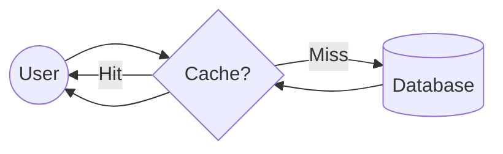

# 09 Caching

## Why this topic matters
The fastest request is the one that never has to go to the database. Caching is the single most effective way to reduce latency and increase throughput in almost every system.

## Learning Objectives
- Understand the concept of Caching.
- Identify where caching can happen in a system.
- Learn common Caching Strategies and Eviction Policies.

## Intuition
Imagine you are a **Student** studying for an exam.
- Your **Textbook** is the **Database**. It has all the information, but it's heavy and takes time to flip through the pages to find a specific answer.
- Your **Small Notebook** (where you wrote the most important formulas) is the **Cache**. It doesn't have everything, but the things it *does* have can be found in 1 second.

Whenever you need an answer, you check your notebook first. If it's there (**Cache Hit**), you're done! If not (**Cache Miss**), you go to the textbook, find the answer, and then write it in your notebook for next time.

## Detailed Explanation

### What is Caching?
Caching is the process of storing copies of frequently accessed data in a temporary, high-speed storage layer (usually RAM) so that future requests for that data can be served faster.

### Where does Caching happen?
Caching isn't just one thing; it happens at every layer of the system:

1. **Client Side (Browser Cache)**: Your browser stores images and CSS files so it doesn't have to download them every time you refresh.
2. **CDN (Content Delivery Network)**: Static files (images, videos) are cached on servers physically close to the user.
3. **Application Cache (Distributed Cache)**: Using tools like **Redis** or **Memcached** to store database query results or session data.
4. **Database Cache**: Databases have their own internal buffers to store frequently accessed disk blocks.

### Caching Strategies
How do we keep the cache and database in sync?

- **Cache-Aside (Lazy Loading)**: The app checks the cache. If miss $\rightarrow$ read from DB $\rightarrow$ write to cache. (Most common).
- **Write-Through**: Data is written to the cache and the DB at the same time. (High consistency, slower writes).
- **Write-Behind (Write-Back)**: Data is written to the cache first, and then updated in the DB after a delay. (Fastest writes, risk of data loss).

### Cache Eviction Policies
Caches have limited space. When the cache is full, what do we delete?
- **LRU (Least Recently Used)**: Discard the item that hasn't been accessed for the longest time. (Industry standard).
- **FIFO (First In First Out)**: Discard the oldest item added.
- **LFU (Least Frequently Used)**: Discard the item requested the fewest times.

## Real-world Example
**Instagram Feed**
Your profile information (name, bio) doesn't change every second. Instead of querying the database every time someone views your profile, Instagram caches your profile in **Redis**. The database is only hit when you actually edit your bio.

## Advantages
- **$\downarrow$ Latency**: RAM is thousands of times faster than Disk.
- **$\uparrow$ Throughput**: The database is freed from repetitive queries.
- **Cost**: Reduces the need for massive, expensive database clusters.

## Disadvantages
- **Data Stale-ness**: The cache might show old data if the DB was updated but the cache wasn't.
- **Complexity**: You have to manage "Cache Invalidation" (deciding when to delete the cache).

## Common Interview Questions
- **What is a Cache Hit and a Cache Miss?**
- **What is the difference between Redis and a traditional database?**
- **Explain the LRU eviction policy.**
- **How do you handle the "Cache Invalidation" problem?**

### Interview Answer Tips
- Mention that **RAM is faster than Disk**. This is the fundamental reason why caching works.
- If asked about "Invalidating" cache, mention **TTL (Time To Live)**—setting an expiration date on the cached data.

## Common Mistakes
- Suggesting we "cache everything." (You can't; RAM is expensive and some data changes too fast).
- Forgetting to discuss what happens when the cache is full (Eviction).

## Summary
Caching is like a "shortcut" for data. By storing frequent data in fast RAM, we avoid slow database trips, making the system feel instantaneous to the user.

## Practice Questions
1. Why is Redis usually stored in RAM and not on a Hard Drive?
2. In a news app, would you use a Write-Through or Write-Behind strategy for "View Counts"?
3. What happens to a system if the cache suddenly crashes? (Hint: Cache Stampede).
4. Describe a scenario where LRU would be a bad eviction policy.
5. How does a CDN act as a global cache?

## Further Reading
- [[05 Latency vs Throughput]]
- [[08 Reverse Proxy]]
- [[17 CDN]]

#system-design #placements #interview #performance #caching #redis
