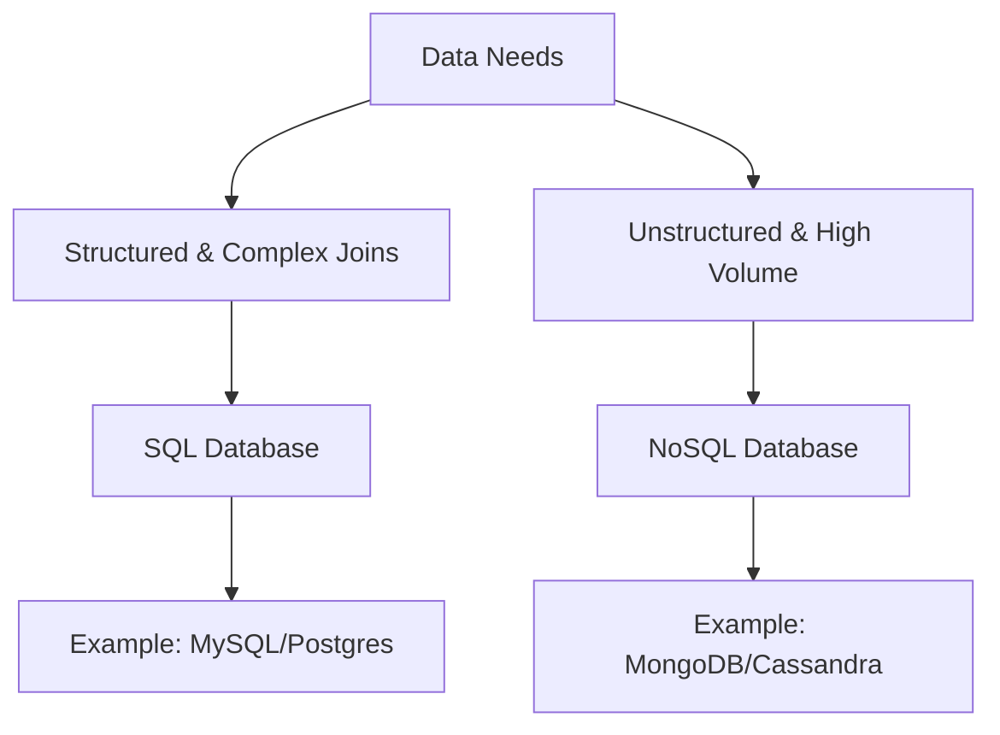

# 10 Database Basics

## Why this topic matters
The database is the "Source of Truth" for any application. In fresher interviews, you aren't expected to be a DBA (Database Administrator), but you must know *which* type of database to use for a specific problem. Choosing the wrong one can make your system slow or impossible to scale.

## Learning Objectives
- Understand the core purpose of a Database.
- Differentiate between Relational (SQL) and Non-Relational (NoSQL) databases.
- Learn when to use each based on data structure and requirements.

## Intuition
Imagine you are organizing data for a **School**.
- **SQL (The Spreadsheet)**: You have a table for "Students," a table for "Courses," and a table for "Grades." Every student has a fixed set of info (Name, ID, Age). You can easily join these tables to find *"Which students in Grade 10 are taking Math?"* $\rightarrow$ Very structured and rigid.
- **NoSQL (The Folder of Documents)**: Each student has a "Folder." Some students have "Sports Achievements" in their folder, others have "Music Awards," and some have nothing. You don't need a fixed format for every folder. $\rightarrow$ Very flexible and fluid.

## Detailed Explanation

### 1. Relational Databases (SQL)
Data is stored in **Tables** with fixed rows and columns. They use **Structured Query Language (SQL)**.
- **Key Feature**: ACID Properties (Atomicity, Consistency, Isolation, Durability). This guarantees that transactions are processed reliably.
- **Schema**: Rigid. You must define the columns before inserting data.
- **Scaling**: Primarily **Vertical Scaling** (bigger machine).
- **Examples**: MySQL, PostgreSQL, Oracle, Microsoft SQL Server.

### 2. Non-Relational Databases (NoSQL)
Data is stored in various formats: Documents, Key-Value pairs, Graphs, or Wide-columns.
- **Key Feature**: High Scalability and Flexibility.
- **Schema**: Dynamic/Schemaless. You can add a new field to one record without affecting others.
- **Scaling**: Primarily **Horizontal Scaling** (more machines).
- **Examples**: MongoDB (Document), Redis (Key-Value), Cassandra (Wide-column), Neo4j (Graph).

### Comparison Table
| Feature | SQL (Relational) | NoSQL (Non-Relational) |
| :--- | :--- | :--- |
| **Structure** | Tables / Fixed Schema | Documents, Key-Value / Dynamic |
| **Scaling** | Vertical $\uparrow$ | Horizontal $\rightarrow$ |
| **Consistency** | Strong Consistency (ACID) | Eventual Consistency (BASE) |
| **Queries** | Powerful Joins | Fast simple lookups, no complex joins |
| **Best for** | Complex queries, Financial data | Big Data, Real-time feeds, Content Mgmt |

## Real-world Example
**An E-commerce App (like Flipkart)**
- **SQL**: Used for **Orders and Payments**. You cannot afford a mistake in payment. You need ACID properties to ensure that if money is deducted, the order is definitely created.
- **NoSQL**: Used for the **Product Catalog**. Different products have different attributes (a T-shirt has 'Size' and 'Color', but a Laptop has 'RAM' and 'Processor'). A flexible document store (MongoDB) is perfect here.

## Advantages
- **SQL**: Data integrity, powerful querying, industry standard.
- **NoSQL**: Handles massive traffic, flexible data models, easy to scale.

## Disadvantages
- **SQL**: Hard to scale horizontally, rigid schema.
- **NoSQL**: Less consistent, no complex joins (you have to do the "join" in your code).

## Common Interview Questions
- **What is the difference between SQL and NoSQL?**
- **When would you choose MongoDB over MySQL?**
- **What are ACID properties?**
- **Can a system use both SQL and NoSQL?** (Answer: Yes, it's called Polyglot Persistence).

### Interview Answer Tips
- Don't just say "SQL is for small data and NoSQL is for big data." That's a common mistake.
- Say: *"SQL is for structured data where consistency is critical, and NoSQL is for unstructured data where scalability and flexibility are priorities."*

## Common Mistakes
- Thinking NoSQL is "better" because it's newer.
- Forgetting that SQL databases *can* be scaled, but it's much harder.

## Summary
SQL is a structured spreadsheet perfect for reliability and complex relationships. NoSQL is a flexible folder system perfect for scale and varying data types. Most modern apps use a mix of both.

## Practice Questions
1. You are designing a Banking System. Which database do you choose and why?
2. You are designing a Real-time Chat app. Which database is better for storing messages?
3. What does "Schemaless" mean in the context of NoSQL?
4. Explain why ACID is important for a ticket booking system (like IRCTC).
5. If you have a massive amount of data but only need simple Key-Value lookups, which DB type is best?

## Further Reading
- [[11 Database Indexing]]
- [[12 Replication & Sharding]]
- [[06 CAP Theorem]]

#system-design #placements #interview #database #sql #nosql
